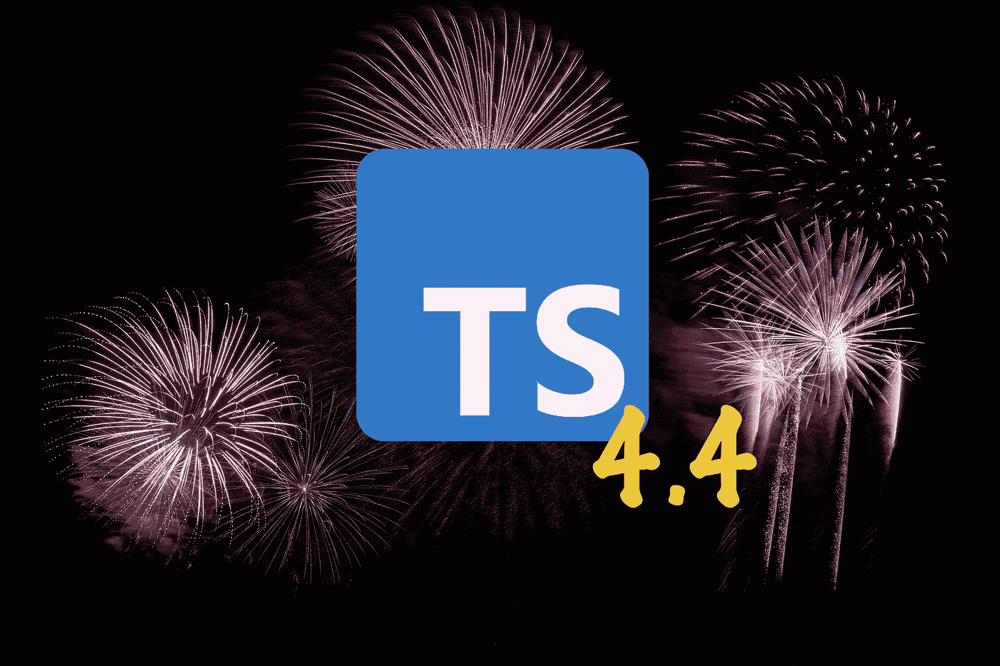
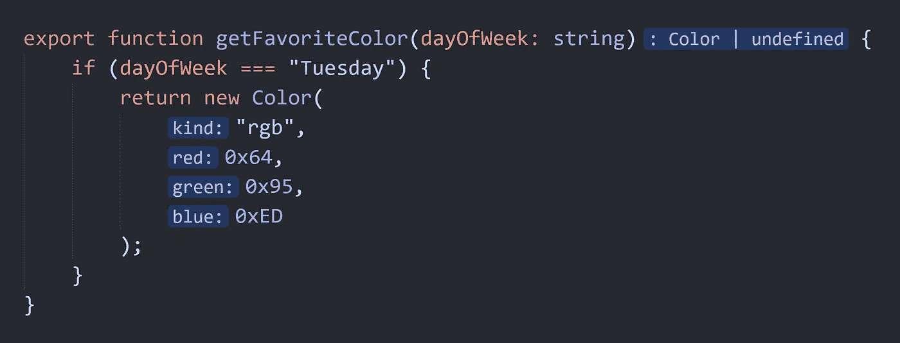
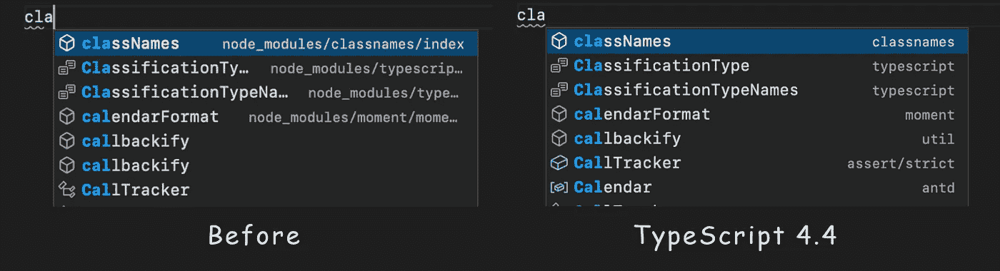

# TypeScript 4.4 中的新功能和突破性变化

> 原文：<https://levelup.gitconnected.com/features-in-the-new-typescript-release-e5ef6ebba750>

## [网页开发](https://rakiabensassi.medium.com/list/software-engineering-7a179a23ebfd)

## 控制流分析、作为索引签名的符号、拼写建议等等



来自 [Pixabay](https://pixabay.com/?utm_source=link-attribution&utm_medium=referral&utm_campaign=image&utm_content=879461) 的 [Heiko Stein](https://pixabay.com/users/nidan-455298/?utm_source=link-attribution&utm_medium=referral&utm_campaign=image&utm_content=879461) 的原始图片(由作者编辑)

2021 年 8 月 24 日，是微软新发布的类型化 JavaScript 的日期。这个版本中有一些令人兴奋的特性，比如扩展了对索引签名的访问，改进了对类型分配的控制流分析。

如果您还没有接触过 TypeScript 4.4，那么您来对地方了。

在这篇文章中，我将介绍新的特性和突破性的变化，并展示它们将如何影响我们的开发体验。

```
**Table of Contents**[Control Flow Analysis & Type Guard Detection](#3d60)
[Versatile Index Signatures](#816f)
[New Flags](#a6ee)
[Static Blocks Inside Classes](#f89d)
[Better Intellisense](#854b)
[Performance Boost](#bbce)
[Breaking Changes](#10e5)
```

# 控制流分析和类型保护检测

使用所谓的类型保护概念，TypeScript [编译器](https://betterprogramming.pub/compiler-vs-interpreter-d0a12ca1c1b6)在下面的例子中确定`if`块中的变量`arg`必须具有类型`string`:

TypeScript 4.4 中的未知类型

但是通过常量进行的类型检查会返回错误消息`*Property 'toUpperCase' does not exist on type 'string* | number*'*`，因为 TypeScript 4.3 不记得，在以下示例的第 5 行中，`argIsString`表示从`string | number`到`string`的`arg`类型收缩:

检查 TypeScript 中的常量

出于同样的原因，我们面对第 8 行中的错误`Operator '+=' cannot be applied to types 'number' and 'string | number'`。这很糟糕，因为它阻止我们编写更具表达力的代码。

随着对类型 Guard 的控制流分析的改进，TS 4.4 现在对`const`和`readonly`属性以及未更改的参数执行正确的分析。

除了使用`typeof`进行检查之外，新版本在处理被区分的联合以及对单个联合元素的成员测试时，还会检测正确的类型:

打字稿区别联合

对于[社区](/learning-velocity-and-coding-standards-10952f6c9640)来说，这是一个惊人的新特性，因为它增强了代码的可读性，并允许我们注释复杂的条件，而不需要使用直接的类型断言或将所有内容都放在`if`语句中。

# 多功能索引签名

第二个重要特性是通过索引签名访问元素。下面是一个通过界面显示类似`Map`的结构的例子:

TypeScript 4.4:字符串作为索引

到目前为止，通过索引签名访问的密钥类型只能是`number`或`string`。但是在新版本中，我们可以使用`symbol`:

Typescript 4.4:符号作为索引

以及[模板字符串模式](https://betterprogramming.pub/typescript-new-release-19f1238c6a68#5ab8)，如`type-${string}`，这非常有趣，因为它允许复杂的类型定义，如下例所示:

TypeScript 4.4:使用字符串模式作为索引

# `New Flags`

当使用标志`--useUnknownInCatchVariables`时，`try-catch`块中的默认变量类型将从`any`变为`unknown`。

当标志`--exactOptionalPropertyTypes`打开时，您不能再用`undefined`初始化可选属性，直到您在联合类型`age?: number | undefined`中显式包含`undefined`:

TypeScript 4.4 赋值

为了避免不兼容或在您的项目或第三方定义中引起问题(例如，来自 DefinitelyTyped)，`--exactOptionalPropertyTypes`是可选的，不包含在`--strict`中。

# 类内部的静态块

对于以前的 TypeScript 版本，我们已经在类定义之外初始化了静态块，这使它看起来是独立的:

TypeScript 4.3:静态块启动

TS 4.4 使这种逻辑更简单，因为它允许初始化过程直接在类定义中进行:

TypeScript 4.4:类内部的静态块初始化

# 更好的智能感知

我们喜欢 TypeScript 的自动完成和编辑器支持——也称为**智能感知**。在 4.4 版本中，该功能有了一些改进，为我们提供了更有信心的建议:

*   如果您在没有打开`checkJs`或`@ts-check`的情况下处理*纯*[*JavaScript*](https://betterprogramming.pub/javascript-history-and-future-71b0ceb737aa)文件，您会自动得到通知。
*   您还会看到**内联提示**——一种友好的“幽灵文本”——显示关于参数名称、推断的返回类型和代码其他区域的有用信息:



*用 TypeScript 4.4 支持镶嵌提示(* [*)图片来源*](https://devblogs.microsoft.com/typescript/announcing-typescript-4-4-rc/) *)*

*   TS 4.4 附带了改进的**建议导入路径**，它将显示类似`@angular`的路径，而不是类似`node_modules/@angular/..`的相对路径:



自动导入在完成列表中显示真实路径([来源](https://devblogs.microsoft.com/typescript/announcing-typescript-4-4-rc/#perf-improvements))

# 性能提升

*   在新版本中，有一个内部符号在不同上下文中是否可访问的缓存，以及如何打印特定类型。这使得**更快地发出声明，**尤其是在具有复杂类型的源代码中。
*   还有条件路径规范化，它减少了编译器规范化它正在处理的路径所需的时间。这意味着我们现在有了更快装载的[](https://betterprogramming.pub/web-vitals-guide-b56e28798e7f)**。**
*   **额外的缓存为我们在`tsconfig.json`中`paths`提供了**更快的路径映射**。**
*   **在修复了一个导致每次后续构建都进行不必要的类型检查的错误后，TS 4.4 有了**更快的增量构建**和`--strict`。**
*   ****源映射生成**已经进行了优化，减少了大输出文件所需的时间。**
*   **减少不必要的检查现在提供了更快的**`**--force**`**构建**。****

# ****重大变化****

****即使他们不是专业人员，这个版本也有一些突破性的变化，可能会破坏您的代码:****

*   ****如果您有`abstract`类，您不能再初始化它们内部的`abstract`属性，但是您可以定义它们的类型。****
*   ****为了防止总是真实的检查，当您在一个`if`子句中检查一个`Promise`结果时，TypeScript 会提醒您包含`await`。****
*   ****新的 TS 版本在调用导入的函数时丢弃了`this`值，以便在所有可用的模块系统(ESM、CommonJS、AMD、...).****
*   ****`lib.d.ts`更改为最新的当前 TypeScript 规范(您可以在此处找到`[lib.dom.d.ts](https://github.com/microsoft/TypeScript-DOM-lib-generator/issues/1029#issuecomment-869224737)`[更改列表](https://github.com/microsoft/TypeScript-DOM-lib-generator/issues/1029#issuecomment-869224737))****

****如果您现在想尝试 TypeScript 4.4 发布候选版本，您可以从 [npm](http://npmjs.com/package/typescript) 获得它:****

```
**npm install -g typescript**
```

****感谢阅读！我希望这些见解是有帮助的。****

# ****想要更多吗？****

****🧠💡我为一群聪明、好奇的人写关于工程、技术和领导力的文章。 [**加入我的免费电子邮件简讯，独家获取**](https://rakiabensassi.substack.com/) 或在此注册媒体[。](https://rakiabensassi.medium.com/membership)****

*****你可以在 Udemy 上查看我的* ***视频课程****:*[*如何识别、诊断、修复 Web Apps 中的内存泄漏*](https://www.udemy.com/course/identify-and-fix-javascript-memory-leaks/) *。*****

****[](/how-to-become-a-legitimate-system-architect-3ccf686e9712) [## 如何从一个代码猴子变成一个合法的系统架构师

### 如何进入软件工程师的下一阶段的 6 个技巧

levelup.gitconnected.com](/how-to-become-a-legitimate-system-architect-3ccf686e9712) [](https://betterprogramming.pub/compiler-vs-interpreter-d0a12ca1c1b6) [## 编译器与解释器:了解它们的区别以及何时使用它们

### 编译器和解释器的类型和用例

better 编程. pub](https://betterprogramming.pub/compiler-vs-interpreter-d0a12ca1c1b6) 

## 参考

[微软 TypeScript 开发博客](https://devblogs.microsoft.com/typescript/announcing-typescript-4-4-rc/)****