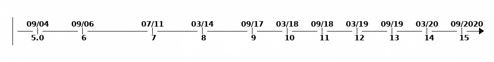

# Java 16 带给开发者的特性

> 原文：<https://levelup.gitconnected.com/features-java-16-brings-to-developers-b0edd1a1ed28>

## 了解模式匹配、密封类和更多新的 Java 特性。


照片由[克里斯蒂娜·莫里洛](https://www.pexels.com/@divinetechygirl?utm_content=attributionCopyText&utm_medium=referral&utm_source=pexels)从 [Pexels](https://www.pexels.com/photo/person-using-macbook-pro-on-person-s-lap-1181298/?utm_content=attributionCopyText&utm_medium=referral&utm_source=pexels) 拍摄

Java 无需介绍。这是一种已经有多年历史的编程语言。最近的更新为该语言带来了几个新特性:密封类、模式匹配和附加的安全措施。

# 密封类

[JEP-397](https://openjdk.java.net/jeps/397)

`sealed`背后的动机是限制具体的类。限制具体的类，将控制实现，并为模式匹配提供支持。

```
// keyword here is sealed which enables permits 
// permits lists classes that can extend sealed classpublic abstract sealed class Shape
    permits Circle, Rectangle, Square { ... }
```

有了基本的接口，你就得不到反射。你不知道具体实现的有限集合。

有了密封类，你就有了这种反射行为。你知道类型的*种类*，你可以在你的领域中拥有。

枚举告诉我们有限的一组值。密封类告诉我们有限数量的值类型。

```
sealed interface Celestial 
    permits Planet, Star, Comet { ... }

final class Planet implements Celestial { ... }
final class Star   implements Celestial { ... }
final class Comet  implements Celestial { ... }
```

> 然而，这种层次结构并没有反映出重要的领域知识，即在我们的模型中只有三种天体。在这些情况下，限制子类或子接口的集合可以简化建模。JEP-397

# 基于值的类的警告

[JEP-390](https://openjdk.java.net/jeps/390)

原始包装类是基于值的类。基于值的类的例子有:`Byte`、`Short`、`Integer`、`Long`、`Float`、`Double`、`Boolean`和`Character`。更多基于价值的课程可以在找到。

因为它们是不可变的对象，所以使用构造函数是没有意义的。

为了防止误用，有了新的注释。这将在每次编译器找到基于值的类构造函数时发出警告。

`@jdk.internal.ValueBased`

# 默认情况下，JDK 内部构件的封装被移除

[JEP-396](https://openjdk.java.net/jeps/396)

这是为了鼓励用户使用标准的 Java API。不过，您可以选择宽松的封装。如果需要，但尽量避免。

您需要将道具添加到 JVM 的启动器中。下面你可以看到可能的参数，你可以传入。更多关于争论的信息可以在[这里](https://openjdk.java.net/jeps/396#Description)找到。

```
--illegal-access= permit | deny | debug | warn
```

虽然这在 JDK 16 中被接受，但你可能会面临早期[版本](https://stackoverflow.com/questions/53790182/get-the-current-value-of-illegal-access-setting-in-java)的问题。这一改变是在 JDK 9 [发布](https://jaxenter.com/jdk-9-replace-permit-illegal-access-134180.html)后提出的。

> 即使在今天，例如 Java >=9，某些构建工具在构建 Java 项目时会打印出[“反射访问”——警告](https://issues.apache.org/jira/browse/GROOVY-8339)，这只是“感觉还没有准备好”，即使构建很好。— [来源](https://www.marcobehler.com/guides/a-guide-to-java-versions-and-features)

# 模式匹配

[JEP-394](https://openjdk.java.net/jeps/394)

模式匹配存在很长时间了。你可以在灵药中找到它。

在 Java 中，有很多`instanceof`条件。减少操作的动机导致模式匹配。

> 模式匹配允许一个对象的期望“形状”被简洁地表达出来(模式*模式*)，并允许各种语句和表达式根据它们的输入来测试该“形状”(*匹配*)。JEP-394

```
// a lot of boiler plate codeif (obj instanceof String) {
    String s = (String) obj;    // grr...
    ...
}
```

通过模式匹配，我们可以得到这个代码。减少样板文件，进行转换，并声明变量。

```
if (obj instanceof String s) {
    // Let pattern matching do the work!
    ...
}
```

模式变量在其匹配的范围内。因此，这样的代码是有效的。

```
if (a instanceof Point p) {
    // p is in scope
    ...
}
// p not in scope here
if (b instanceof Point p) {     // Sure!
        ... 
}
```

你现在再也不用担心名字了。如果作用域不同，重用现有名称是可能的。

*模式匹配有什么改善？*

减少显式强制转换。这在等式方法中给出了更可读的代码。

```
return (o instanceof CaseInsensitiveString) &&
        ((CaseInsensitiveString) o).s.equalsIgnoreCase(s);// to this return (o instanceof CaseInsensitiveString cis) &&
        cis.s.equalsIgnoreCase(s);
```

看下一个例子。如果这个条件`o instanceof String s`评估为真，`s`被赋值。相反，如果模式匹配失败，`s`没有任何值。

这样这段代码就可以正常完成了。你没有[一个无法到达的代码](https://docs.oracle.com/javase/specs/jls/se15/html/jls-14.html#jls-14.22)。如果条件通过，则`s`获得赋值，否则`s`被安全丢弃。

```
public void onlyForStrings(Object o) throws MyException {
    if (!(o instanceof String s))
        throw new MyException(); // s has value at this point
    System.out.println(s);
    ...
}
```

# 结论

Java 正在发展。导致了很多突破性的变化。导致很多[问题](https://medium.com/dev-genius/8-problems-every-java-developer-knows-4f65339e0c00)。



【Java 不断更新

即便如此，我们确实需要调整。使用新功能，让我们创造更好的软件。

这是几个特征，我会拿走。你可以在下面的部分了解更多。

# 资源

 [## JEP 草案:开关的模式匹配(预览)

### 用 switch 表达式和语句的模式匹配增强 Java 编程语言，以及…

openjdk.java.net](https://openjdk.java.net/jeps/8213076) [](https://www.infoworld.com/article/3569150/jdk-16-the-new-features-in-java-16.html) [## JDK 16:Java 16 的新特性

### 自 3 月 16 日起，Oracle Java 开发套件(JDK) 16 现已推出量产版。中的新功能…

www.infoworld.com](https://www.infoworld.com/article/3569150/jdk-16-the-new-features-in-java-16.html)