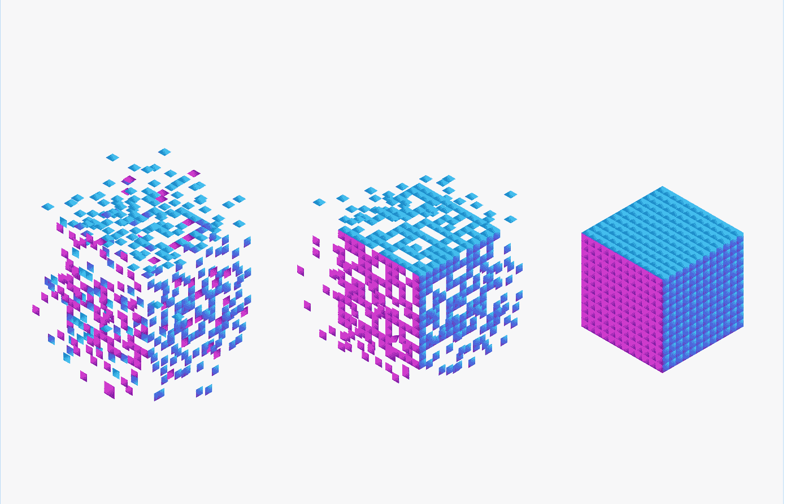

# 有效地联合普罗米修斯

> 原文：<https://levelup.gitconnected.com/federating-prometheus-effectively-4ccd51b2767b>

## 效率和专注是成功的关键



图片由: [AIexVector](https://www.shutterstock.com/g/AlekseiBezrodniy)

联合允许一个 Prometheus 服务器从另一个 Prometheus 服务器抓取选定的时间序列。Prometheus federation 可用于扩展到数百个集群，或将相关指标从一个服务的 Prometheus 拉入另一个服务。它支持*分层*和*跨服务*联盟，在[官方文档](https://prometheus.io/docs/prometheus/latest/federation/#federation)中有更详细的解释。

## 用简单的方法配置联盟

`/federate`端点允许在任何给定的 Prometheus 服务器上检索该服务器中一组选定时间序列的当前值。假设您需要编写一个联邦作业来收集其他 Prometheus 服务器的时间序列。在互联网上查找“普罗米修斯联邦配置示例”时，您经常会遇到如下配置示例。

普罗米修斯为联邦工作的简单例子

这个配置示例很糟糕，如果您的`child-prometheus1:31090`实例中有大约 100K 或更多的时间序列，您可能会遇到联合问题。为什么这个配置不好，你很快就知道了。

## 你会有什么问题？

如果您曾经在 Prometheus 服务器的日志中收到过以下错误信息，那么这个主题肯定会让您感兴趣。

```
level=error ts=2021-09-21T11:30:33.163676493Z caller=federate.go:163 component=web msg="federation failed" err="write tcp 192.168.22.145:9090->10.0.0.12:31090: write: broken pipe"
```

正如在[中所讨论的，prometheus-users 邮件列表联盟中的这个](https://groups.google.com/g/prometheus-users/c/xlKc_fp4r3k/m/o-k7ErdYBAAJ)对话线程并不打算拉无限数量的时间序列或数据复制。当大量数据被联合时，就会出现上面提到的错误消息，然后调用方的`scrape_timeout`被超过，导致调用方挂起。当连接关闭时，客户端遇到一个写错误——管道断开——因为另一端断开了连接。

一些工程师说，当收集超过 10K 时间序列时，联合不是一个好主意，但我想以我们的实践为例，我们在生产中有一个具有许多端点的分层联合，其中我们平均从每个端点收集多达 40 万个时间序列。需要注意的是，时间序列的数量也取决于`scrape_interval`和`scrape_timeout`的值。根据它们的不同，摄取的数据量可能会有所不同。也许你会问，我们是如何实现的？

## 使用高级方式配置联盟

正如我们上面所说的关于*简单联合*作业的短语*糟糕的配置*，让我们一步一步地理解它为什么如此糟糕。

主要原因是`match[]`部分下的`{__name__=~".+"}`表达式，这意味着 Prometheus 服务器将从`child-prometheus1:31090`实例收集**所有**时间序列。你必须确定，你需要你的孩子普罗米修斯实例的所有时间序列吗？也许收集所有的时间序列没有意义。这是联邦的另一个例子，它的配置比前一个更先进。

普罗米修斯为联邦工作的先进范例

这里需要重点关注两点。第一个是`match[]`参数。正如您已经猜到的那样，您的 Prometheus 将只收集指标名称带有`kube_`、`node_`或`container_`前缀的时间序列。它假设您避免收集不必要的时间序列，而是只保留您需要的时间序列。`match[]` param 下的查询表达式选择器可以接受您拥有的任何标签，如`job`、`id`等。

第二个重点是`[metric_relabel_configs](https://prometheus.io/docs/prometheus/latest/configuration/configuration/#metric_relabel_configs)`。总的来说，这是工作配置中很好的一部分。根据这个例子，您将删除具有`id="static-agent"`键值对的时间序列。有时，它可以解决重复数据删除等问题(例如，如果您的时间序列具有相同的指标名称)。

> ***知道重要。*** `metric_relabel_configs`的用法并不保证时间序列注射量少。您应该记得 Prometheus 服务器收集所有与`match[]`查询参数匹配的时间序列。这意味着 Prometheus 仅在 Prometheus 服务器收集了与 regex 关键字相匹配的时间序列后，才丢弃它们，之后，序列的其余部分存储在 TSDB 持久性存储中。

## 一些最佳实践。

为了避免通过联合注入大量数据，有一些解决方案可以用你在这个故事中学到的技巧来应用。解决方案是关于数据分离的。数据分离可以按作业级别或数据库级别进行。让我们看看什么是数据分离？

**作业级数据分离。** 当我们谈到作业级数据分离时，这意味着您可以为同一个端点编写多个联合作业，这将确保从每个端点注入唯一的数据。最好使`scrape_interval`和`scrape_timeout`具有相同的值。请参见下面的示例。

作业级别分离的 Prometheus federation 作业示例

这里我们只是将`advanced-federation`任务分成两个独立的任务，分别命名为`advanced-federation1`和`advanced-federation2`。

**数据库级分离。**

假设您的`child-prometheus1`实例正在 Kubernetes 集群上运行，那么您可以轻松地添加一个新的部署对象，例如名称为`child-prometheus2`、*、*的对象，它们的不同之处仅在于其配置图。在这种情况下，您需要将一些作业从`child-prometheus1`实例转移到`child-prometheus2`。这样，Prometheus 服务器将从两个端点收集数据，如下所示。

数据库级分离的 Prometheus federation 作业示例

## 结论。

最后两个例子工作得很好，但是我的建议是使用 ***作业级数据分离*** 而不是 ***数据库级数据分离*** ，因为你避免了在你的基础设施中有一个额外的端点。显然，第一种方法更容易、更实用、也更专业。

感谢阅读。我希望这个故事是有帮助的。如果你有兴趣，可以看看[我的其他媒体文章](https://hayk96.medium.com)。