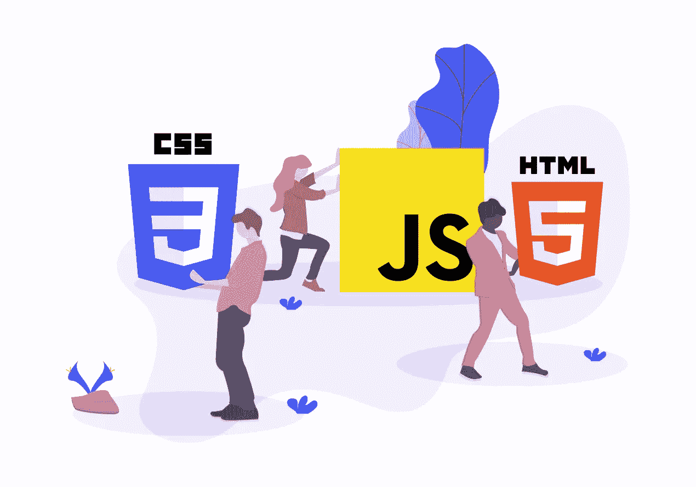
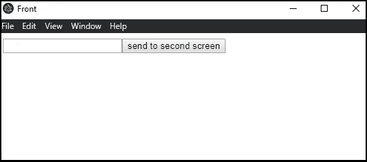
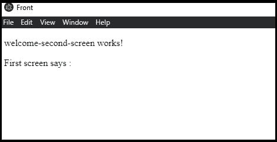
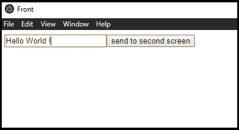
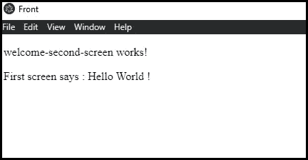

# 对电子 JS 的反馈

> 原文：<https://levelup.gitconnected.com/feedback-on-electron-js-d8812c25f003>

## IT 建议

## 两年前，我有机会发现了电子框架，允许我在使用 web 语言创建界面的同时开发桌面应用程序。



未画插图

举个例子，在我上学的最后一年，在一个六人团队中，我们为校外的一个客户开发了一个票务应用程序。该应用程序的标准之一是它必须是一个桌面应用程序(必须在 Windows 上运行)。从历史上看，他们想要取代的应用程序是用 C++开发的，并且使用了 Qt 库。然而，我们这个项目只有四周的开发时间，而且我们都不习惯这种语言。然后，我们寻找一种解决方案，允许我们使用我们更了解的技术。

我们发现了电子！

然后，我们能够用 Angular 开发桌面应用程序的界面，用 Java 开发后端。由于电子只封装正面，背面的选择没有影响。注意，在这里，由于项目的需要，我们在本地有我们的后端，但是很可能调用外部 API。我们选择使用 Angular，但是 Electron 允许使用其他 JS 框架，比如 React 或 Vue。

# 初始化项目

先决条件安装:
如果您还没有安装 Node.js，那么您必须安装它。

```
npm install -g @angular/cli
npm install electron-packager --save-dev
```

第一个命令用于安装 Angular CLI，用于创建和构建 Angular 应用程序。
第二个用于安装一个电子打包程序，它允许您将电子应用程序的源代码打包成一个可执行文件。

要初始化项目，请执行以下操作:

```
ng new projet-angular
cd projet-angular
npm install electron --save-dev
```

这些命令用于创建 Angular 项目并在开发环境中安装 electronic。

要用 Electron 配置 Angular 项目，您必须向项目的根目录添加一个这样的文件`main.js`(文件的内容将在下面详述):

```
const { app, BrowserWindow, screen, ipcRenderer, ipcMain } = require('electron');let primary;
let secondary;app.on('ready', () => {
  let displays = screen.getAllDisplays();
  let externalDisplay = displays.find((display) => {
    return display.bounds.x !== 0 || display.bounds.y !== 0
  }); if (externalDisplay) {
    secondary = new BrowserWindow({
      fullscreen : true,
      x: externalDisplay.bounds.x,
      y: externalDisplay.bounds.y,
      webPreferences: {
        nodeIntegration: true,
        nodeIntegrationInWorker: true
      }
    }); ipcMain.on('fromOne', (event, arg)  => {
      secondary.webContents.send('toTwo', arg);
    }); secondary.setMenuBarVisibility(false);
    secondary.loadURL(`file://${__dirname}/dist/frontend/index.html#/welcome-second-screen`);
    secondary.on('closed', function () {
      secondary = null
    })
  } primary = new BrowserWindow({
    fullscreen : true,
    webPreferences: {
      nodeIntegration: true,
      nodeIntegrationInWorker: true
    }
  });
  primary.setMenuBarVisibility(false); primary.loadURL(`file://${__dirname}/dist/frontend/index.html#/auth`); primary.on('closed', function () {
    primary = null
  });
});
```

这个文件是 Electron 的入口点，定义了桌面应用程序如何对各种窗口事件做出反应。您还必须修改项目根目录下的文件`package.json`添加以下几行:

```
[...]
"main": "main.js",
"description": "description de l'application",
"scripts": {
  [...]
  "electron": "electron .",
  "electron-build": "ng build && electron .",
  "electron-build-prod": "ng build --prod && electron .",
  "create-win-installer": "ng build --prod && electron-packager . --platform=win32 --overwrite --asar=true && node build.js"
}
[...]
```

注意，如果没有描述，应用程序的打包将不起作用。

添加的不同脚本是示例。第一个用于运行包装在 Electron 中的应用程序，而不构建它。接下来的两个用于编译应用程序(使用 dev 环境的属性(默认情况下)或 prod 环境的属性)。第四个用于打包应用程序并为 Windows 创建安装介质。

您还可以在 web 浏览器中运行应用程序(无需电子设备)，这允许热重新加载(修改后无需重新构建甚至刷新页面):

```
npm run start
```

# 管理第二个屏幕

电子允许管理多个窗口和多个屏幕。为此，通过模块`screen`, Electron 允许以如下方式恢复连接到计算机的屏幕:

```
let displays = screen.getAllDisplays();
let externalDisplay = displays.find((display) => {
  return display.bounds.x !== 0 || display.bounds.y !== 0
});if (externalDisplay) {
... }
```

从那里，我们可以检索第二个连接的屏幕并加载应用程序。

如上面的文件所示，为了创建一个窗口，我们使用了`BrowserWindow`。您可以指定与大小、位置和全屏模式相关的属性。

```
secondary = new BrowserWindow({
  width :800,
  height : 480,
  x: externalDisplay.bounds.x ,
  y: externalDisplay.bounds.y ,
  fullscreen : true
});
```

我们还使用对象`BrowserWindow` 上的函数`loadUrl`指定窗口必须加载的资源:

```
secondary.loadURL(`file://${__dirname}/dist/angular-electron/index.html#/second-route`)
```

有可能我们需要让两个屏幕进行通信。为此，您可以通过此命令`npm install ngx-electron --save`使用模块`ngx-electron`。

我们首先向由`BrowserWindow` 实例化的窗口添加属性`webPreferences`:

```
secondary = new BrowserWindow({
  width :800,
  height : 480,
  x: externalDisplay.bounds.x ,
  y: externalDisplay.bounds.y ,
  fullscreen : true,
  webPreferences: {
    nodeIntegration: true,
    nodeIntegrationInWorker: true
  }
});
```

我们通过电子模块`ipcMain` 和`ipcRenderer`实现信息的交换。我们考虑屏幕`primary`和`secondary`。我们在文件`main.js`中添加了以下函数:

```
ipcMain.on('fromOne', (event, arg)  => {
  secondary.webContents.send('toTwo', arg);
});
```

假设我们有一个如下所示的应用程序:
这个窗口出现在第一个屏幕上:



这个出现在第二个屏幕上:



请注意，在这里我保留了应用程序的窗口，并保留了菜单栏的可见性，但是可以使用`main.js`中`BrowserWindow`的属性`fullscreen`和`setMenuBarVisibility` 来初始化全屏窗口。

此时，配置已经设置好，但是窗口之间还没有交互。为此，在屏幕使用的组件`primary` *，*中，我们添加了我们在构造函数中初始化的服务`ngx-electron`的导入:

```
import {ElectronService} from 'ngx-electron';
...
constructor(private _electronService: ElectronService) { }
```

为了从主窗口发送消息，我们定义了以下函数，当点击*发送到第二个屏幕*按钮时将调用该函数:

```
toSend(){
  this._electronService.ipcRenderer.send("fromOne",this.data);
}
```

在屏幕`secondary`使用的组件中，我们为屏幕`primary`添加了使用服务`ngx-electron`的导入和构造器:

```
import {ElectronService} from 'ngx-electron';
...
constructor(private _electronService: ElectronService) { }
```

我们定义以下函数来接收消息:

```
ngOnInit() {
  this._electronService.ipcRenderer.on("toTwo", (event, args) => {
    this.zone.run(() => {
      this.message = args;
    });
  });
}
```

在添加这些内容之后，当单击按钮时，消息被发送到另一个屏幕，并显示出来。



从安全角度来看，通过电子进行开发需要更加小心，因为电子不是网络浏览器。在这里，用户可以访问文件系统、用户外壳等。因此，确保您的应用程序不运行来自不受信任的外部来源的代码非常重要。有关电子安全的更多信息和建议，请参考电子文档:[https://www.electronjs.org/docs/latest/tutorial/security](https://www.electronjs.org/docs/latest/tutorial/security)

对电子的一个普遍批评是它很重。事实上，它装载了大量的铬，所以没有办法让一个电子应用程序真正轻量级。因此，如果你的问题之一是使用很少的内存，电子可能不是最好的解决方案。

# 最后

如果您还不熟悉 Electron，您很可能知道一个或多个使用该框架的桌面应用程序，比如 Discord、Atom、Visual Studio Code 或 Twitch。

在本文中，我们看到了如何初始化一个电子包裹的角度项目。这个框架允许你做各种各样的事情，就像我们看到的第二个屏幕的管理一样。在继续使用 web 语言的同时开发桌面应用是一个非常好的解决方案。然而，像任何技术一样，在选择它之前，有必要考虑所面临的问题(例如，内存的使用)。

***附言*** *在过去的 3 个月里，我已经挣了 1000 多美元。如果你也想在媒体上写作赚钱，我们建议你注册成为一名会员。* *每月只需 5 美元。这样，你不仅有机会写作和赚钱，还可以无限制地接触像这样的故事。*

# 分级编码

感谢您成为我们社区的一员！在你离开之前:

*   👏为故事鼓掌，跟着作者走👉
*   📰查看[升级编码出版物](https://levelup.gitconnected.com/?utm_source=pub&utm_medium=post)中的更多内容
*   🔔关注我们:[Twitter](https://twitter.com/gitconnected)|[LinkedIn](https://www.linkedin.com/company/gitconnected)|[时事通讯](https://newsletter.levelup.dev)

🚀👉 [**加入升级人才集体，找到一份惊艳的工作**](https://jobs.levelup.dev/talent/welcome?referral=true)