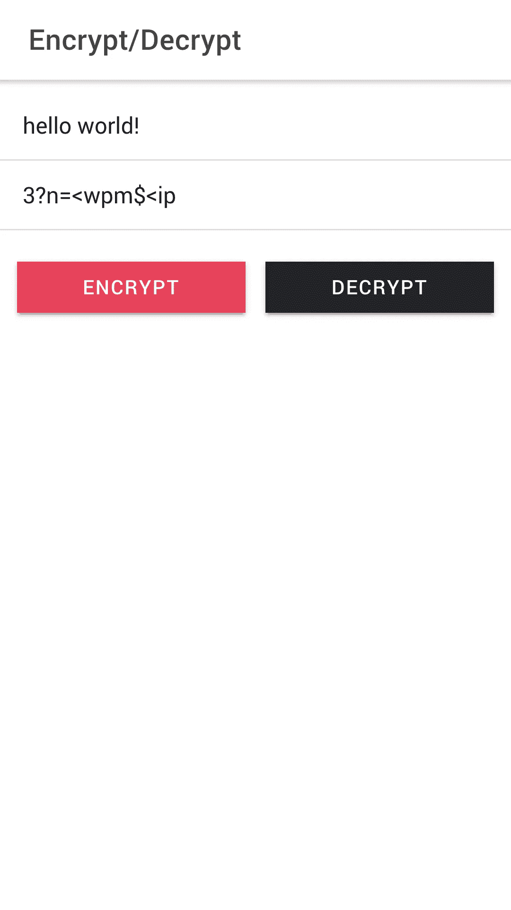

# Feistel Cypher 为金钱抢劫团伙(网飞)在爱奥尼亚实施

> 原文：<https://levelup.gitconnected.com/feistel-cypher-for-the-money-heist-gang-netflix-implementation-in-ionic-8b91747523db>

在这段不确定的全球隔离期间，我花了很多时间在网飞。有一个系列引起了我的注意——一个非常棒的系列，叫做《金钱大劫案》,最初它的西班牙名字是: *Le Casa de Papel* (纸之屋)。在第三季的中间，有一句台词，其中一个角色，巴勒莫(顺便说一下，所有的小偷都是以城市命名的)，拿出一个旧的 1941 年的 timey 短波无线电通信器和一个计算机编码器。


由 [Samuele Giglio](https://unsplash.com/@samuelegiglio?utm_source=unsplash&utm_medium=referral&utm_content=creditCopyText) 在 [Unsplash](https://unsplash.com/s/photos/money-heist?utm_source=unsplash&utm_medium=referral&utm_content=creditCopyText) 上拍摄

Palermo 继续解释说，通信将使用 2300 层加密进行加密，并将继续添加 2300 层加密，等等。这将是几乎不可能破解的“…即使有超过 1 亿的程序员在工作…”。

考虑一种高效完成“2300 层加密”的方法，在我看来，最合适、最高效的方法是使用 Feistel cypher 方法，而不是普通的 AES 256。这是因为机器，计算机编码器看起来过时了，可能是从 20 世纪 70 年代开始的，当然，因为这是最容易开发的方法，在我假设的很短的时间内。

# **为什么？**

Feistel 密码是一种非常有趣的加密方法，它形成了许多其他加密技术的基础并为其进行了修改。Feistel cypher 本身在 20 世纪 70 年代到 21 世纪初是一种加密标准。Feistel 的修改版本仍然存在，并一直使用到 21 世纪初，直到后来在 2001 年被现在著名的高级加密标准(AES)取代。

但是我跑题了。如果你想一想巴勒莫想要什么，我们这里想要什么，我们打算做什么，基本上就是一种加密 2300 层深的数据块的方法，Feistel 方法就是为此而建立的，因为在 Feistel 方法中，你需要定义层数，以将你想要的消息“洗”成混乱的乱码，然后发送出去。

Feistel cypher 最酷的一点是，该方法可以根据定义的层数进行反转，也就是说，根据您定义的层数，当然还有用于将模糊消息转换回原始预期消息的源/令牌，您可以恢复原始消息。

简单。

# Feistel 方法是谁想出来的？

Feistel 密码或 Feistel 网络是以德国出生的物理学家和密码学家 Horst Feistel 的名字命名的，他在 IBM 工作时进行了开创性的研究。该方法是最早使用块加密的方法之一，这在 20 世纪 70 年代并不常见。Feistel 的酷之处在于，您可以根据已定义的层数反转密钥计划，从而以非常相似的方法进行加密和解密。

要了解更多关于 Feistel 的信息，这里有一个关于它的 wiki 页面:

[](https://en.wikipedia.org/wiki/Feistel_cipher) [## 费斯特尔密码

### 在密码学中，Feistel 密码是一种用于构造分组密码的对称结构，以…

en.wikipedia.org](https://en.wikipedia.org/wiki/Feistel_cipher) 

这里有一个来自 Computerphile 的视频，我觉得它是由 Mike Pound 博士对 Feistel 的一个非常容易理解的解释。

**推特:@_mikepound**

[](https://twitter.com/_mikepound) [## 迈克·庞德

### 迈克庞德的最新推文(@_mikepound)。诺丁汉大学计算机科学讲师和研究员…

twitter.com](https://twitter.com/_mikepound) 

# **按照帕勒莫的建议和爱奥尼亚一起做加密应用 ala Money Heist】**

虽然有可能将这款应用程序变成一款发送语音和文本的合适的通信应用程序，也有可能开始实现巴勒莫的原始想法，即每次发送语音时都添加一层又一层的加密，但这里有几个注意事项会让这款应用程序有点不同:

1.  该应用程序将只加密和解密的基础上，原来的 2300 层的想法使用 Feistel。就是这样。我不是在构建一个通信应用程序，虽然它可以被修改来这样做。
2.  这个应用程序不会在额外的加密层上添加额外的层，但如果需要的话，可以在以后完成。我可以在这里做，但我不想编写复杂的代码。我只想说明一个想法。
3.  这个应用程序不是用来作为一个通讯应用程序，只是为了好玩来说明一个想法。我不是在建一个通讯 app。还是那句话，这只是为了说明一个想法。
4.  最后，我不是达利帮的成员，是吗？

# **第一步:构建 Ionic 应用**

首先，我们启动一个 Ionic 应用程序。如果你对 Ionic 不熟悉，我建议在我们开始之前先阅读一下关于 Ionic 的内容。Ionic 是一个在多个平台上开发移动应用程序的框架，使用 HTML、TypeScript 和 CSS 中已经掌握的技能很容易。要了解如何启动 Ionic 项目的更多信息，请点击此处进一步探索:

[](https://www.ionicframework.com) [## Ionic -跨平台移动应用开发

### Ionic 是面向 web 开发者的应用开发平台。构建令人惊叹的跨平台移动、web 和桌面应用程序…

www.ionicframework.com](https://www.ionicframework.com) 

在撰写本文时，Ionic 版本是 Ionic 5，带有@ionic/cli 版本 6.5.0。我将使用的离子方法是角方法，而不是反应方法，因为我非常熟悉角方法。

我已经包含了电容器版本 2.0，所以如果我决定把这个离子项目变成一个应用程序，我可能会使用电容器。

# **第二步:安装 Feistel**

要将 Feistel Cipher 安装到您的应用程序中，您可以使用已经可用的 NPM 库:

[](https://www.npmjs.com/package/feistel-cipher) [## 费斯特尔密码

### 这是一个实现 Feistel 密码的类型脚本库，用于“几乎”保留格式的加密。“几乎”…

www.npmjs.com](https://www.npmjs.com/package/feistel-cipher) 

您需要做的只是在命令行中键入以下内容:

```
npm install feistel-cipher --save
```

这将把`feistel-cipher`库安装到您的应用程序中，然后您就可以在您的应用程序中使用 Feistel 密码方法了。

但是，实际上，我确实遇到了一些问题…

# **第三步:修复全局和缓冲区问题**

有三个问题:

1.  `globals is not defined ....blablabla`
2.  `buffer is not defined ....blablabla`

3.`process is not defined ….blablabla`

要解决这些问题，您需要在命令行中键入以下内容:

`npm install ts-polyfill --save`

这应该会将您的 TypeScript 的 polyfill 安装到应用程序中。在我继续之前，如果您想了解更多关于 polyfill 的信息，我不打算在这里解释，但我建议您在这里了解更多信息:

 [## Polyfill.io

### Polyfill.io

聚合填充](https://polyfill.io/v3/) 

安装 polyfill 后。你需要在你的应用程序中安装`process` NPM 库。您可以通过执行以下操作来实现这一点:

```
npm install process --save
```

这将把过程库安装到您的 Ionic 应用程序中。然后，您需要修改以下文件:

A.添加到`index.html`的头部，固定`global is not defined...bla bla bla`

```
<script>
  if (global === undefined) {
    var global = window;
  }</script>
```

B.添加到`app.component.ts`内的导入行，修复`buffer is not defined…bla bla bla`

```
import('buffer').then(({Buffer}) => {global.Buffer = Buffer;})
```

C.添加到`polyfills.ts`中，以固定`process id not defined …bla bla bla`

```
import * as process from 'process';
 window['process'] = process;
```

在我们开始写任何东西之前，你应该能够没有任何错误地运行`ionic serve` 。

# **第四步:编写加密和解密的函数**

接下来的步骤是编写函数。我将在我的`home.page.html`和`home.page.ts`中构建它，但是当然，你可以在服务或组件中的其他地方处理它，这可能取决于你的需求。

所以要编写`encrypt`和`decrypt`函数:

```
import * as feistel from 'feistel-cipher'; ...encryptedData:any;
messageData:anyasync encryptData()
 {
    const cipher= await new feistel.Cipher('ciao bella',2300);
    const obfuscated=await cipher.encrypt(this.messageData); this.encryptedData=await obfuscated;
 }async decryptData()
  {
    const cipher= await new feistel.Cipher('ciao bella',2300);
    const deciphered=await cipher.decrypt(this.encryptedData); this.messageData=await deciphered;
  }
```

不要忘记导入上面第一行所示的`feistel-cipher` NPM 库。如果您注意到，单词`ciao bella`并不是实际的消息，而是将用作加密种子的令牌。你可以把它变成你想要的任何东西。实际消息在`this.messageData`里。

上面的函数将加密和解密 2300 层，如巴勒莫所要求的。

接下来就是用`home.page.html` *搭建一个简单的接口。*更改和添加用下面的**粗体**标记:

```
<ion-header [translucent]="true">
  <ion-toolbar>
    <ion-title>
      **Encrypt/Decrypt**
    </ion-title>
  </ion-toolbar>
</ion-header><ion-content [fullscreen]="true"> **<ion-list>
    <ion-item>
      <ion-input
      [(ngModel)]="messageData"
      type="text"
      placeholder="MESSAGE TEXT">
      </ion-input>
    </ion-item>
    <ion-item>
      <ion-input
      [(ngModel)]="encryptedData"
      type="text"
      placeholder="ENCRYPTED">
      </ion-input>
    </ion-item>
  </ion-list>
  <ion-grid>
  <ion-row>
    <ion-col size="6">
      <ion-button expand="full" color="danger" (click)="encryptData()">
        ENCRYPT
      </ion-button>
    </ion-col>
    <ion-col size="6">
      <ion-button expand="full" color="dark" (click)="decryptData()">
        DECRYPT
      </ion-button>
    </ion-col>
  </ion-row>
  </ion-grid>**</ion-content>
```

这将创建一个如下所示的应用程序:



加密/解密应用程序

# **就是这样！**

看完这篇文章，你现在是大理帮的一员了…如果你能构建上述应用程序，请查看以下秘密消息:

`2u+pz:s(+”pq!g”/yj`~300/2t5h2yk| TTL Z2`

再见，再见，再见！再见。再见。