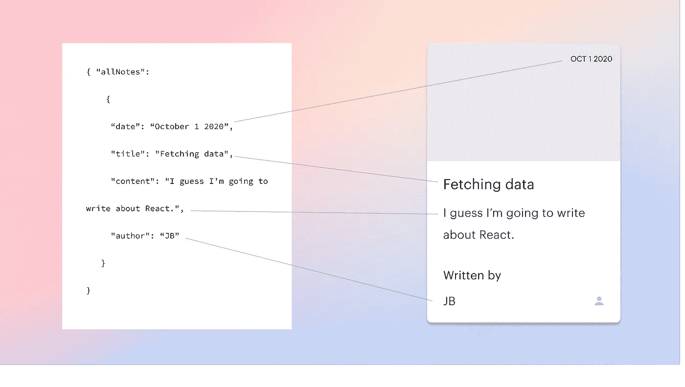
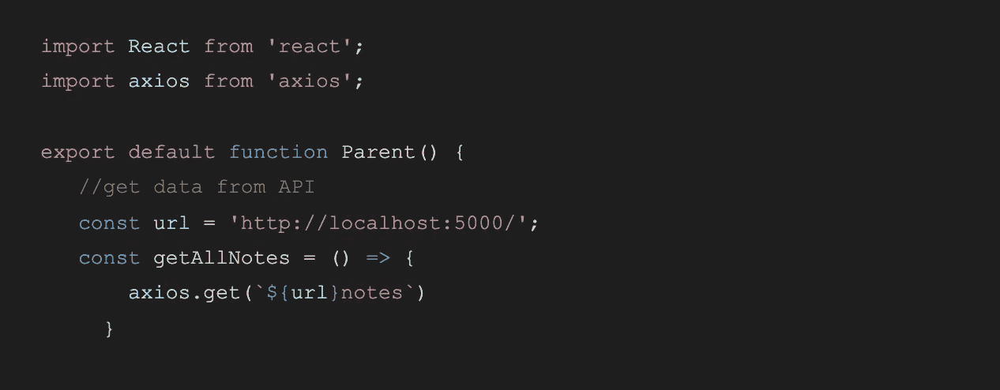
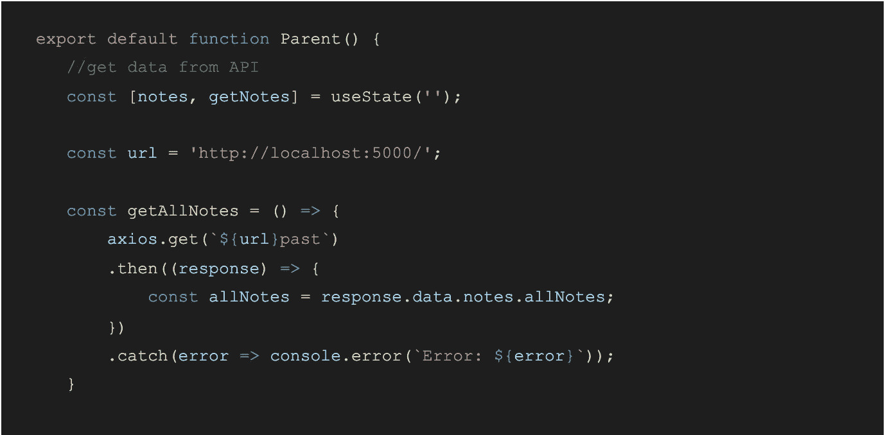
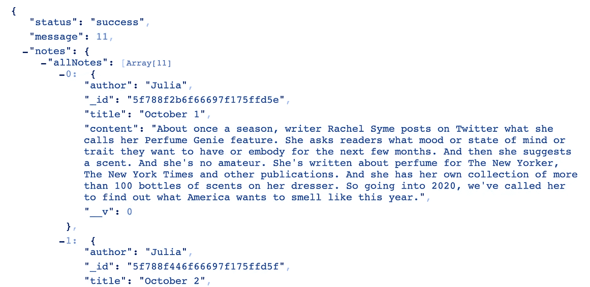
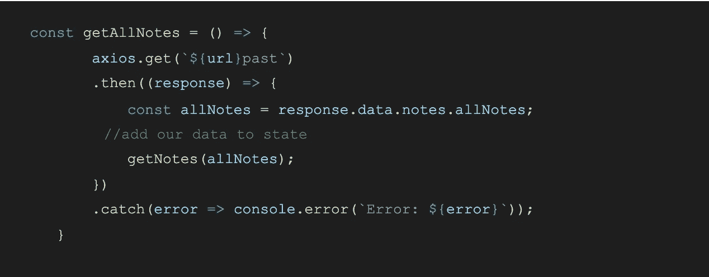
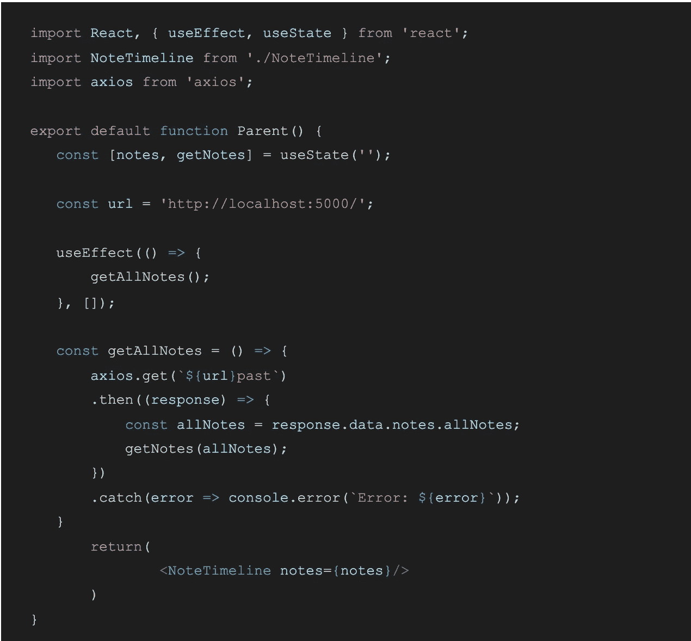
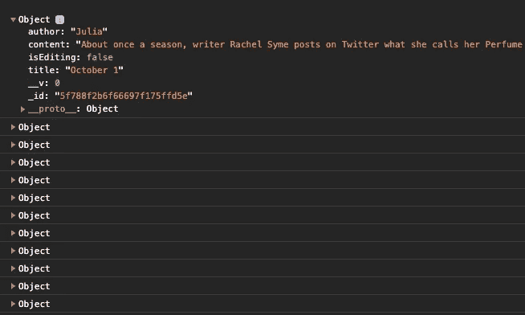
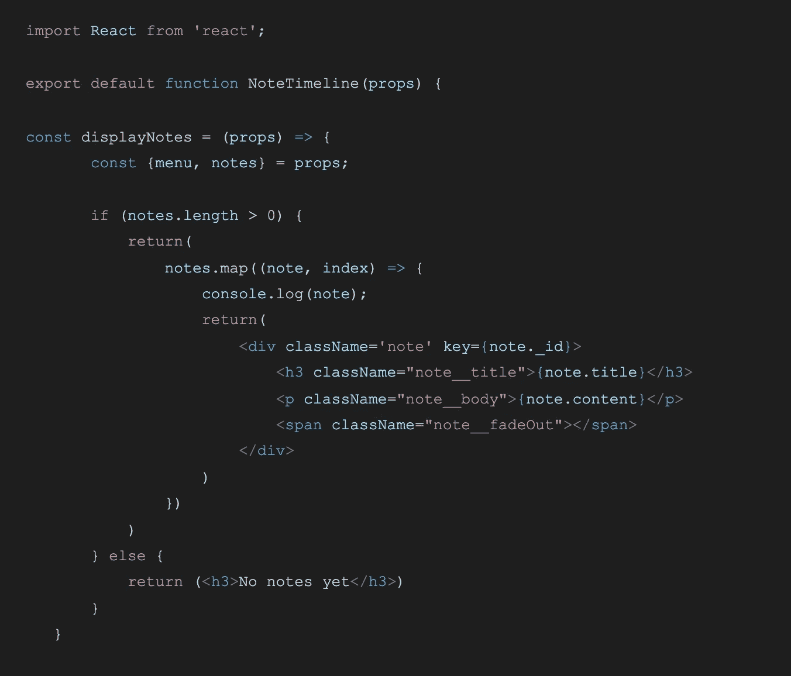
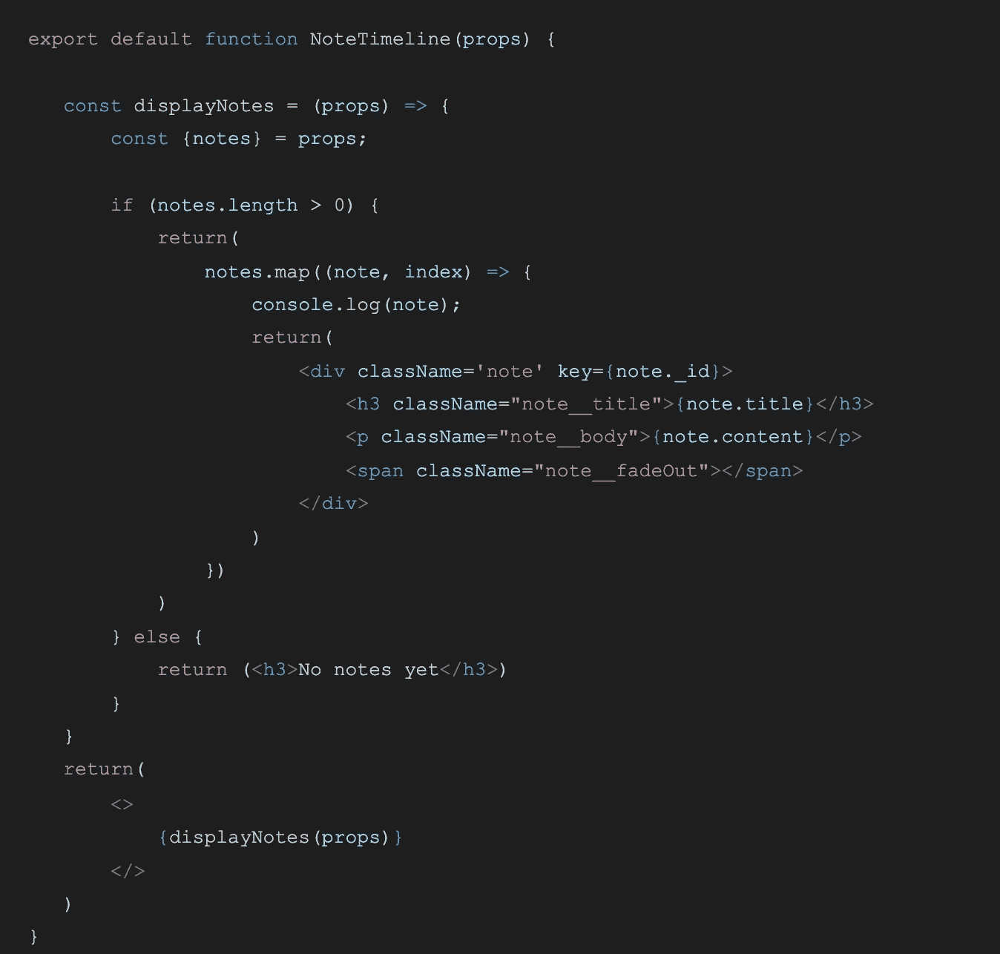
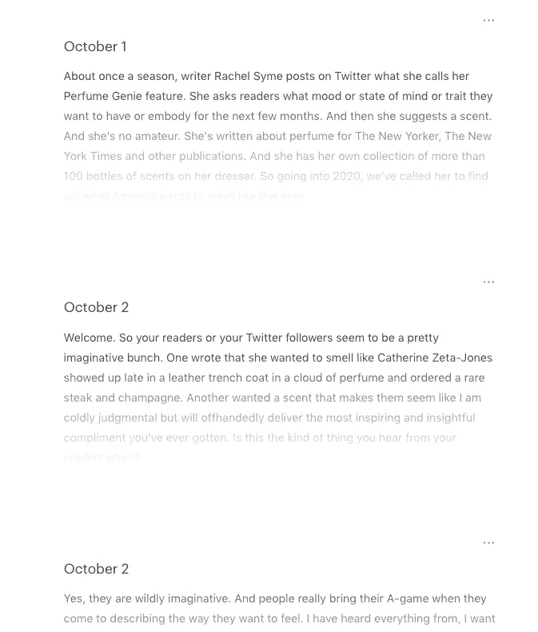

# 用 Axios 获取 API 数据，并用钩子在 React 应用程序中显示

> 原文：<https://levelup.gitconnected.com/fetch-api-data-with-axios-and-display-it-in-a-react-app-with-hooks-3f9c8fa89e7b>



本文将介绍如何在 React 中使用 Axios 获取数据，将其保存到 state，然后在 React 组件中显示它。

我使用 Express 后端路由我的数据，并将其存储在 MongoDB 中，但本文不会讨论这个问题。它假设您有一个已知的端点和一个数据源。所描述的方法可以用任何 API 来完成，但是我使用的是我在 Express 中创建的端点，所以我的 url 将是我的本地主机。

这里我们将使用两个组件:一个父组件获取数据，然后一个子组件显示数据。这一页将是我存储在数据库中的笔记的概述页。笔记将在我的 React 应用程序中动态呈现，并带有包含标题和内容的卡片。

## **导入 axios 并发出 GET 请求**

使用`npm i axios`安装 axios，然后将其作为导入添加到父组件。我将使用 axios 来获取我所有的笔记，这些笔记存储在一个数据库中。

现在已经安装了 axios，我们可以用它来发出 GET 请求，以检索数据库中的所有笔记。我们希望将这个请求存储在一个函数中。

基本的 axios 是 Axios 对象、使用的 HTTP 方法和作为参数的 URL。我将 URL 主体保存为一个变量，并在请求中添加了端点“notes ”(这是一个可选步骤，但是创建了更可读的代码)。我们的请求将存储在一个名为 **getAllNotes()** 的函数中。对于该请求，父组件代码如下所示:



Axios 是一个基于承诺的库，因此必须处理承诺。如果承诺实现了，我将使用‘then’来处理，如果拒绝了，我将使用‘catch’来处理(也就是说，我得到了一个错误)。然后是一个回调函数，它自动将响应对象作为参数。这对我们来说太好了，因为我们检索的数据将在响应对象中。这是基于您正在检索的数据的不同之处。我的整个 GET 请求如下所示:



我把我的数据保存在一个我称之为“allNotes”的变量中。我从 response 对象中获得‘response’和‘data ’,然后钻取到我自己的数据对象以获得‘notes ’,最后是‘all notes’。作为参考，我的数据对象如下所示:



我笔记的内容来自[这篇](https://www.npr.org/2020/01/05/793722669/rachel-syme-on-perfume-genie)关于瑞秋·赛姆的精彩 NPR 文章。

` notes '键包含值` allNotes ',它是 11 个注释的数组，每个注释具有` author `、` title '和` content '属性。(MongoDB 添加了` _id '和` __v '属性)。稍后我们将使用 React 在前端显示这些内容。但是首先！

## **在页面呈现时发出 GET 请求**

我们的概览页面应该显示我们所有的笔记，只要它加载。但是现在 GET 请求被包装在一个函数中。当父组件挂载时，我们将使用 useEffect 钩子来调用这个函数。(我用 React 路由器展示这个组件)。

将“useEffect”添加到 React 导入中，并简单地调用 useEffect 挂钩中的函数:

```
useEffect(() => { getAllNotes();}, []);
```

useEffect 在组件呈现后运行。添加空括号[ ]作为参数是必要的，这样代码就不会无限循环运行。第二个参数告诉 useEffect 仅在某些值发生变化时才进行渲染。我们实际上是告诉 useEffect 只让*在 render 上运行，因为我们给它传递了一个空值。(猜猜是谁在调用它，因为她最初忘记添加它，并且调用了数百个 API🙃).*

## **将检索到的数据添加到 state 中，并将其传递给子组件。**

我们现在真的很投入。将 useState 添加到您的导入中，并初始化我们的状态。这很简单:

```
const [notes, getNotes] = useState('');
```

现在，我们所要做的就是将从 GET 请求中获取的数据添加到状态中的“notes”中。这也很快:



在短短两行代码中，我们的数据安全地保存在状态对象中，并准备好传递给子组件，在那里显示数据。因为我们是守法的好公民，所以我们当然会将逻辑组件与 UI 组件分开。我的子组件叫做<notestimeline>，我将把它作为道具传递给状态。</notestimeline>

这是我们的父组件的所有代码:



父组件

很好。现在我们准备好显示数据了。

## **遍历子组件中的数据并显示出来。**

最后一步。我希望我的每个笔记都显示在我已经制作好的 notecard 组件中，所以我将 API 数据作为道具传递。我将控制台. log 我的数据，以确保它已通过。

```
export default function NoteTimeline(props) {
console.log(props.note)return(
     <>
     </>)
}
```

在控制台中，我看到了我的笔记对象！



我可以直接做 props.allNotes.map()并开始动态填充我的笔记，对吗？

差不多了。从父组件中表达和更新状态的 API 调用是一个**异步操作**。如果我试图在渲染时映射道具，我会得到一个错误，因为我的道具在加载时将是未定义的。

我没有立即映射 notes 数组，而是检查 notes.length > 0，这样我就知道在我映射它之前，数据已经在状态**中更新了。下面是我的子组件 NoteTimeline 的初始代码:**



这是子组件的全部代码，其中我还调用了函数 **displayNotes()。**



子组件

我们的笔记在前端看起来像这样:



我添加了“编辑”手柄和淡入淡出。

仅此而已。本文是在 React 应用程序中检索和显示 API 数据的整个过程。我写它是因为我在网上找不到一个好的操作指南。

## 参考

这篇文章预先假定了一些关于 React 钩子、API 路由、异步/同步调用的知识，但是我不想深入研究这些知识，因为我想为那些已经过了这一关，只想知道如何显示数据的人写一篇文章(就像我一样)

尽管如此，我还是找到了一些对上述主题有帮助的资源。

使用的反应挂钩:

*   [useEffect](https://reactjs.org/docs/hooks-effect.html) ，[避免 useEffect 中的死循环](https://www.andreasreiterer.at/react-useeffect-hook-loop/)
*   [使用状态](https://reactjs.org/docs/hooks-state.html)

在 React 中使用 Axios:

*   [React 基础知识中的 Axios](https://www.digitalocean.com/community/tutorials/react-axios-react)
*   [等待](https://stackoverflow.com/questions/48491539/accessing-json-object-within-object-using-react-axios/48491680)异步返回
*   [使用 Axios 和 MongoDB](https://www.youtube.com/watch?v=Mfp94RjugWQ)

# 分级编码

感谢您成为我们社区的一员！升级正在改变技术招聘。 [**在最好的公司找到你的完美工作**](https://jobs.levelup.dev/talent)**。**

**[](https://jobs.levelup.dev/talent) [## 提升——改变招聘流程

### 🔥让软件工程师找到他们热爱的完美角色🧠寻找人才是最痛苦的部分…

作业. levelup.dev](https://jobs.levelup.dev/talent)**