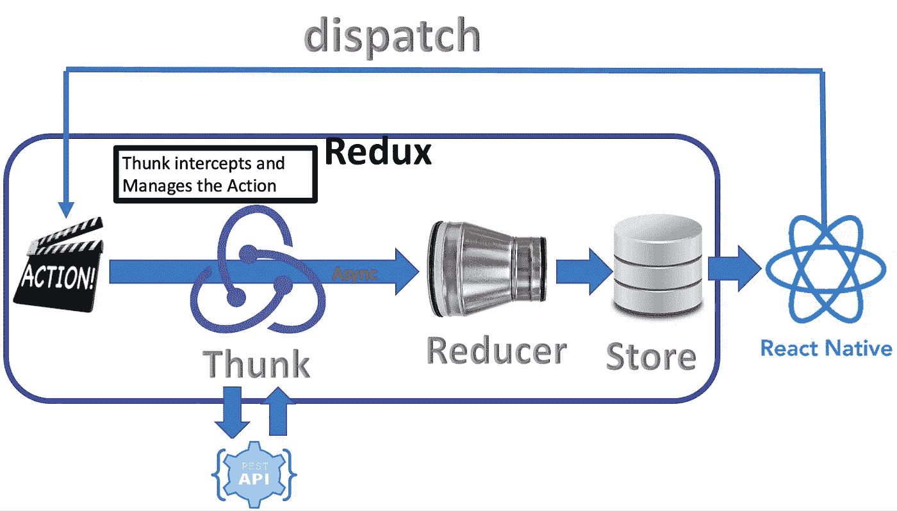
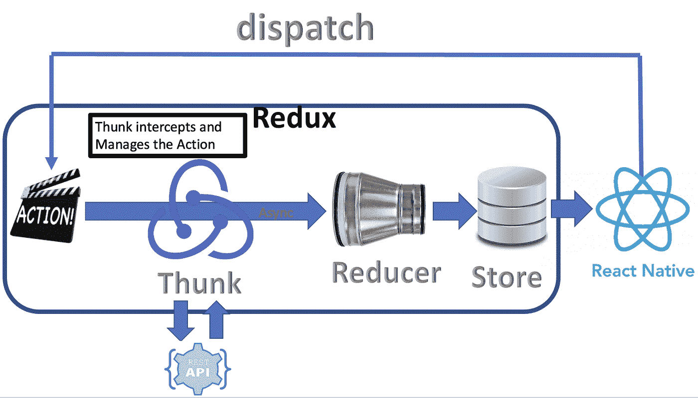
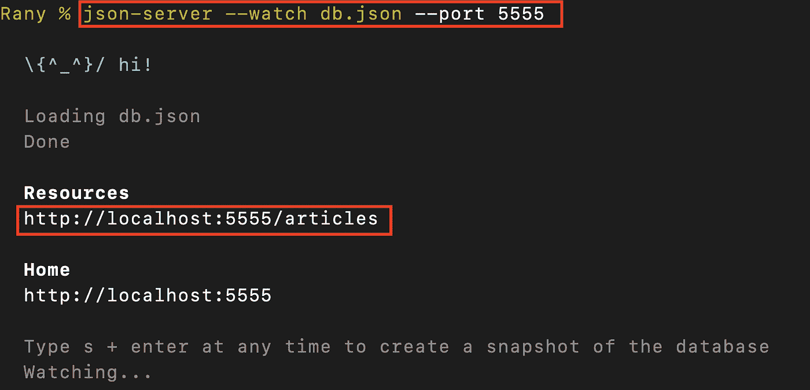
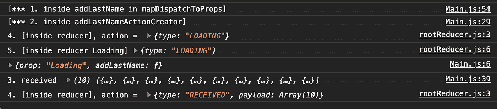
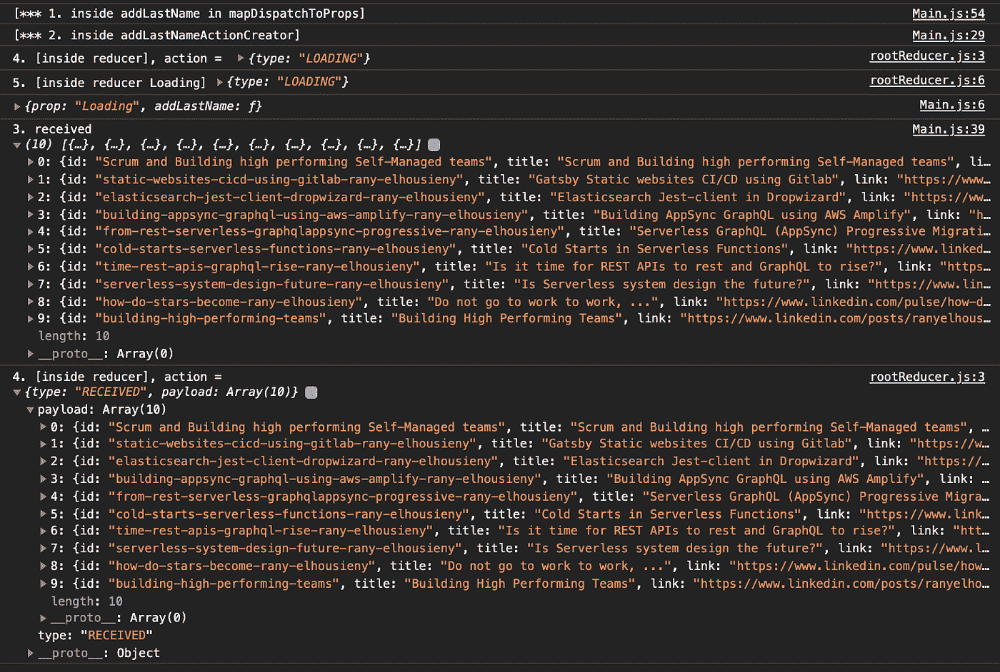
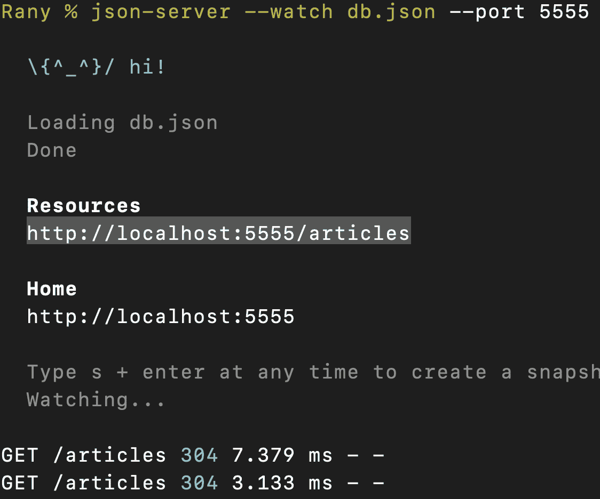
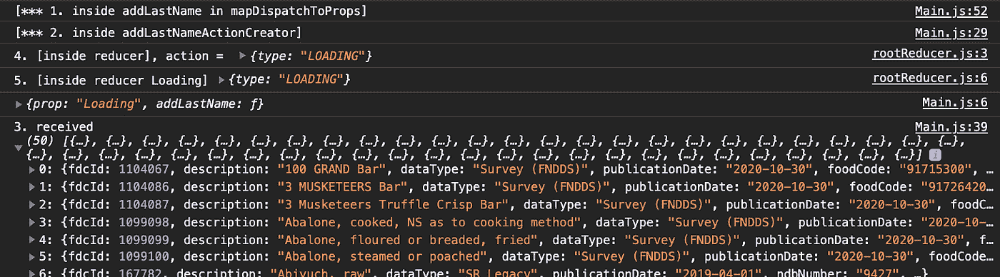
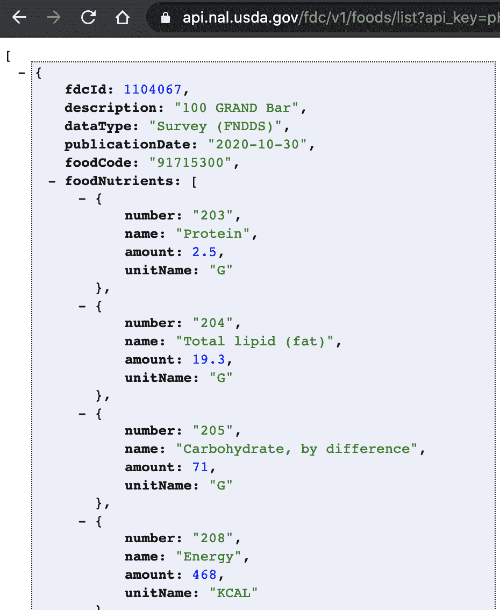

# 在 React 本地应用程序中使用 Redux-Thunk 获取数据

> 原文：<https://levelup.gitconnected.com/fetch-data-with-redux-thunk-in-react-native-app-ee914438c92f>



在本文中，我们将开始使用一个名为 Thunk 的中间件来帮助我们从服务器异步获取数据。

# Redux 是什么？

[](https://ranyel.medium.com/what-is-redux-b16b42b33820) [## Redux 是什么？

### 你可能多次听到 Redux 这个词，你想知道 Redux 是什么？在下面的短片中，我将…

ranyel.medium.com](https://ranyel.medium.com/what-is-redux-b16b42b33820) 

1.  [https://lnkd.in/guBuBVP](https://www.linkedin.com/pulse/create-redux-hello-world-rany-elhousieny-phd%E1%B4%AC%E1%B4%AE%E1%B4%B0/):[𝑪𝒓𝒆𝒂𝒕𝒆𝒂𝑹𝒆𝒅𝒖𝒙](https://lnkd.in/guBuBVP)

[](https://lnkd.in/guBuBVP) [## 创建一个 Redux (Hello World)

### 在本文中，我将展示如何创建一个 Redux Hello World，并在添加 Redux 以作出反应之前解释它是如何工作。在…

lnkd.in](https://lnkd.in/guBuBVP) 

2.【https://lnkd.in/gDWG7AC】创建 React 原生 App [此处](https://www.linkedin.com/pulse/create-react-native-base-project-run-rany-elhousieny-phd%25E1%25B4%25AC%25E1%25B4%25AE%25E1%25B4%25B0/?trackingId=fVq%2FbGEzug0okFdN6aGbPQ%3D%3D)

[](https://lnkd.in/gDWG7AC) [## 创建一个 react 本机基础项目并运行

### 本文是 https://lnkd.in/guBuBVP𝑪𝒓𝒆𝒂𝒕𝒆𝒂𝑹𝒆𝒅𝒖𝒙(𝑯𝒆𝒍𝒍𝒐𝑾𝒐𝒓𝒍𝒅): 2。

lnkd.in](https://lnkd.in/gDWG7AC) 

3.redux with React Native:1-读取状态:

[](https://www.linkedin.com/pulse/redux-react-native-rany-elhousieny-phd%E1%B4%AC%E1%B4%AE%E1%B4%B0/) [## redux with React Native:1-读取状态

### 这篇文章是 https://lnkd.in/guBuBVP𝑪𝒓𝒆𝒂𝒕𝒆𝒂𝑹𝒆𝒅𝒖𝒙(𝑯𝒆𝒍𝒍𝒐𝑾𝒐𝒓𝒍𝒅): 2。

www.linkedin.com](https://www.linkedin.com/pulse/redux-react-native-rany-elhousieny-phd%E1%B4%AC%E1%B4%AE%E1%B4%B0/) 

4.[Redux with React Native:2-更新状态](https://www.linkedin.com/pulse/redux-react-native-2-updating-state-rany-elhousieny-phd%E1%B4%AC%E1%B4%AE%E1%B4%B0/?published=t)[https://lnkd.in/gPcUcMx](https://lnkd.in/gPcUcMx)

[](https://lnkd.in/gPcUcMx) [## redux with React Native:2-更新状态

### 本文是 https://lnkd.in/guBuBVP𝑪𝒓𝒆𝒂𝒕𝒆𝒂𝑹𝒆𝒅𝒖𝒙(𝑯𝒆𝒍𝒍𝒐𝑾𝒐𝒓𝒍𝒅): 2。

lnkd.in](https://lnkd.in/gPcUcMx) 

5.[了解 Redux 中的中间件:](https://lnkd.in/g5tVFn8)[https://lnkd.in/g5tVFn8](https://lnkd.in/g5tVFn8)

[](https://lnkd.in/g5tVFn8) [## 了解 Redux 中的中间件

### 在这篇文章中，我将解释“中间件”的概念

lnkd.in](https://lnkd.in/g5tVFn8) 

6.了解 REST[可选]

[6。使用 Json-Server 创建一个模拟 REST 端点，用于测试 https://www . LinkedIn . com/pulse/creating-Mock-REST-Server-testing-using-Json-Server-rany/](http://creating%20a%20mock%20rest%20endpoint%20using%20json-server%2C%20for%20testing/)

[](https://lnkd.in/g_Riw2h) [## 使用 Json-Server 创建一个模拟 REST 端点，用于测试

### 当我们开发前端时，我们有时想尝试一些概念，而不是构建一个完整的后端。JSON-服务器…

lnkd.in](https://lnkd.in/g_Riw2h) 

# 7.[本文:在 React 原生 App 中使用 Redux-Thunk 获取数据](https://www.linkedin.com/pulse/fetch-data-redux-thunk-react-native-app-rany-elhousieny-phd%25E1%25B4%25AC%25E1%25B4%25AE%25E1%25B4%25B0/?trackingId=IByiw0No1y9DS%2BlGk9KdTw%3D%3D)

[](https://lnkd.in/gVJspwG) [## 在 React 本地应用程序中使用 Redux-Thunk 获取数据

### 在本文中，我们将开始使用一个名为 Thunk 的中间件来帮助我们从服务器异步获取数据。这篇文章是…

lnkd.in](https://lnkd.in/gVJspwG) 

该应用的最终代码可以在[Github https://Github . com/ranyelhousieny/ReactNativeFoodApplication](https://github.com/ranyelhousieny/ReactNativeFoodApplication)中找到

您可以克隆并使用

```
git clone [https://github.com/ranyelhousieny/ReactNativeFoodApplication.git](https://github.com/ranyelhousieny/ReactNativeFoodApplication.git)
```

================================================================

1.安装 redux-thunk

```
npm install --save redux-thunk
```

# 2.将其作为中间件添加到商店中

在 Redux/store.js 中，从 Redux 导入 applyMiddleware，从 redux-thunk 导入 thunk

```
import { createStore, applyMiddleware } from 'redux';
import thunk from 'redux-thunk';
```

添加到商店

```
export const store = createStore( reducer, applyMiddleware(thunk) );
```

Thunk 是一个位于动作和缩减器之间的中间件。它有助于与服务器进行异步通信，以接收承诺并返回多个结果，直到从服务器收到最终结果。(如前一篇文章[中所解释，理解 Redux 中的中间件:](https://lnkd.in/g5tVFn8)[https://lnkd.in/g5tVFn8](https://lnkd.in/g5tVFn8))

添加替代文本



在本文中，我们将从我们在下面的文章[https://www . LinkedIn . com/pulse/creating-mock-REST-server-testing-using-JSON-server-rany/](https://www.linkedin.com/pulse/creating-mock-rest-server-testing-using-json-server-rany/)中构建的模拟 REST 服务器获取数据。确保遵循这些步骤，并让您的服务器在端口 5555 上运行

添加替代文本



# 让我们为动作创建者添加 fetch 命令

```
// Action Creator
const addLastNameActionCreator = () => ( dispatch ) => {
    console.log( "[*** 2\. inside addLastNameActionCreator]" );
 // Case1: Think returns Loading until receives response
    dispatch( { type: "LOADING" } ); // Calling the server
    fetch( "http://localhost:5555/articles")
        // Case2 Thunk received response
        .then( response => response.json() )
        .then( responseJson => {
            console.log( "3\. received ", responseJson );
            dispatch( {
                type: "RECEIVED",
                payload: responseJson
            } );
        });
}
```

# 按照以下步骤更新减速器:

```
// 1\. Create Base Reducer
export const reducer = ( state = "Rany", action ) => {
    console.log( '4\. [inside reducer], action = ', action );
    switch ( action.type ) {
        case 'LOADING':
            console.log( '5\. [inside reducer Loading]', action);
            return "Loading";
        case 'RECEIVING':
            console.log( '5\. [inside reducer RECEIVING]', action);
            return "Received";
        default:
            return state;
    }
}
```

最终运行将显示以下日志:

添加替代文本



添加替代文本



请注意服务器日志:

添加替代文本



=============================================================

在下一篇文章中，我们将从[https://fdc.nal.usda.gov/api-guide.html](https://fdc.nal.usda.gov/api-guide.html)API 获取数据。您需要注册以获得 API 密钥，以便能够在本练习中使用

网址将会是[https://api.nal.usda.gov/fdc/v1/foods/list?api_key=xxxx](https://api.nal.usda.gov/fdc/v1/foods/list?api_key=xxxx)

您需要做的就是在 fetch 命令中用这个 url 替换本地 url(确保添加您的 API 键

以下是控制台输出

添加替代文本



```
// Calling the server
    fetch( "https://api.nal.usda.gov/fdc/v1/foods/list?api_key=xxxx
```

添加替代文本

[](https://www.linkedin.com/in/ranyelhousieny/) [## 兰尼·埃尔豪斯尼，PhDᴬᴮᴰ -软件工程高级经理- Zulily | LinkedIn

### 𝙈𝙞𝙘𝙧𝙤𝙨𝙚𝙧𝙫𝙞𝙘𝙚𝙨解决方案架构师𝘼𝙒𝙎𝙎𝙤𝙡𝙪𝙩𝙞𝙤𝙣𝙨𝘼𝙧𝙘𝙝𝙞𝙩𝙚𝙘𝙩𝘾𝙚𝙧𝙩𝙞𝙛𝙞𝙚𝙙…

www.linkedin.com](https://www.linkedin.com/in/ranyelhousieny/) [](https://rany.elhousieny.com) [## 兰尼·埃尔豪斯尼简历

### 使用 MongoDB，Elastic Search，AWS，React，CSS3，html 5……

rany.elhousieny.com](https://rany.elhousieny.com) [](https://rany.tk) [## 兰尼·埃尔豪斯尼简历

### 使用 MongoDB，Elastic Search，AWS，React，CSS3，html 5……

rany.tk](https://rany.tk) 

ranyel.medium.com