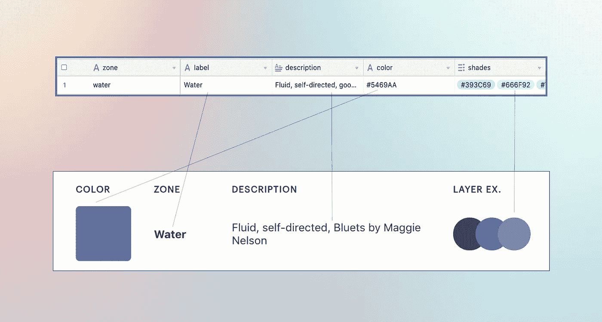
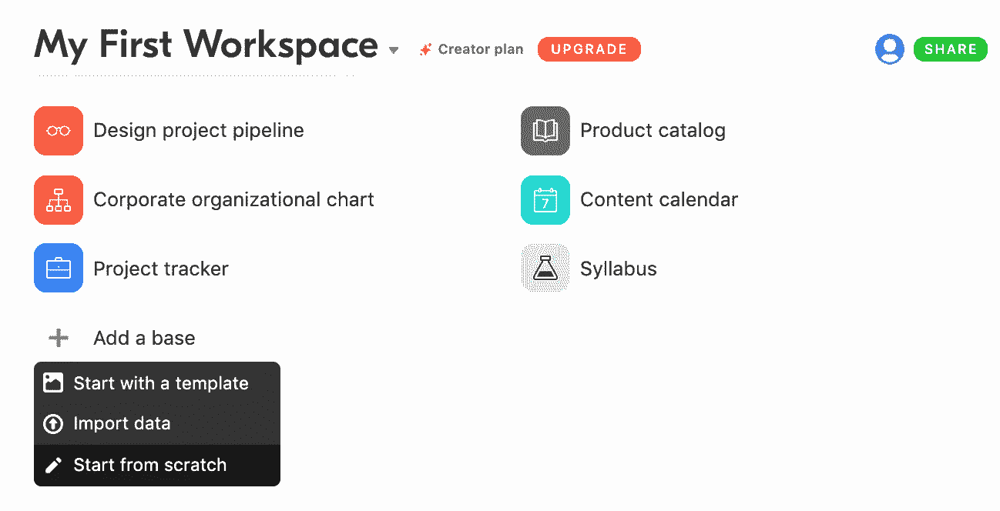
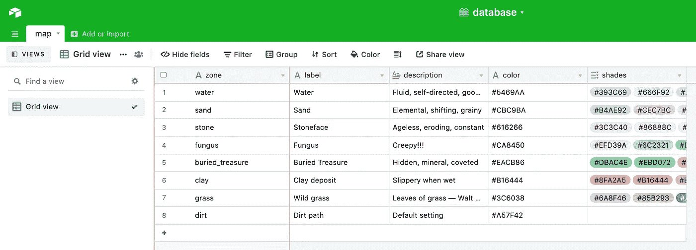
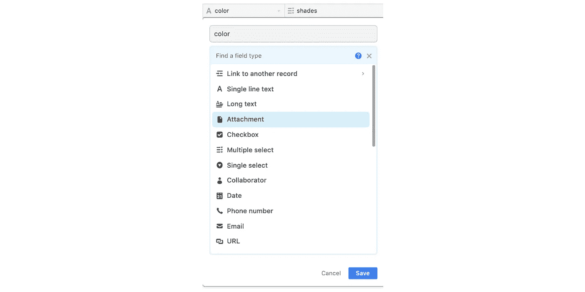
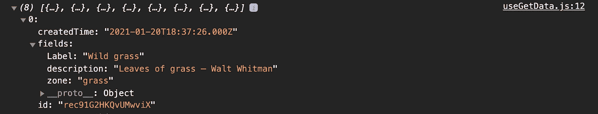
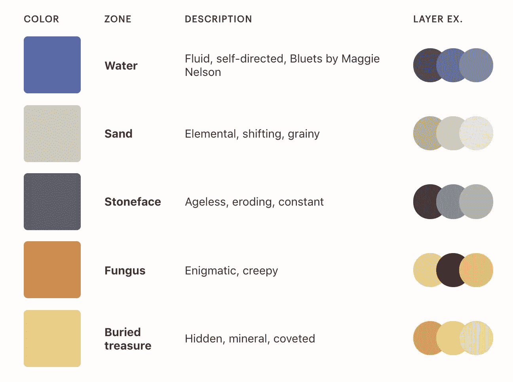

# 使用 Airtable API 获取数据，并使用钩子在 React 应用程序中显示数据

> 原文：<https://levelup.gitconnected.com/fetch-data-with-the-airtable-api-and-display-it-in-a-react-app-with-hooks-5f0851b1fe22>



Airtable 是一个电子表格应用程序，有一个免费的公共 API。这使得它的电子表格可以从浏览器中读取和写入，使它可以作为一个简单的数据库使用。本文将展示如何从 Airtable 中获取、创建、更新和删除数据。API 调用将由 Axios 处理，Axios 是处理 HTTP 请求的流行库。

**属地:**

`npm i axios` —用于从浏览器调用 Airtable 的 Axios 库

`npm i airtable` —用于在 React 中配置一个 Airtable 基础的包

**涵盖的步骤:**

1.  建立一个空军基地。
2.  在 React 中验证碱基。
3.  使用 GET 请求从 React 自定义钩子获取数据。
4.  在 React 组件中显示它。
5.  保护您的 Airtable 凭据。

本指南将描述特定于 Airtable 的约定。如果你只是对使用 Axios 在 React 中显示数据感兴趣，而不是使用 Airtable，这篇[文章](/fetch-api-data-with-axios-and-display-it-in-a-react-app-with-hooks-3f9c8fa89e7b)将详细描述它。

# 1.建立一个空中平台基地

Airtable 将每个实例称为一个**基**。一个**基础**可能包含多个**表格，**是单个电子表格。在默认的工作区，我选择 **+添加一个基础**，**从头开始。**



我把我的新基地命名为**“数据库”**。在电子表格中，表格默认命名为**表 1** 。我们将不得不查询这个表，所以为了简化查询字符串，我将其名称改为 **map。我要添加一些测试数据来设计一张地图。每一行代表一个可以在地图上分类的不同区域。这些数据并不重要。**



关于 Airtable 字段中的数据类型:它们非常重要。如果数据库列的数据类型与其内容不匹配，数据将无法在浏览器中正确显示，或者根本无法显示。

要更改字段的数据类型，点击字段标题和**自定义数据类型**项。将会打开一个数据类型菜单。选择相关的一个。



注意:这些数据类型中的许多都可以很好地映射到它们的 JavaScript 对应物上，例如字符串的“单行文本”和“长文本”，布尔值的“复选框”，日期对象的日期，等等。数组数据类型不太明显:要创建数组，请使用“多重选择”数据类型。我上面的“阴影”列是一个多选列表，因为我将把这些值呈现为一个数组。

来自 Airtable 的凭证必须输入到 React 中，才能成功地调用 Airtable，而不会返回一个`401: Unauthorized`错误。

Airtable 为您提供了两条主要信息来验证您的帐户:

*   **API key** :当你通过请求调用 Airtable 时，用来向 Airtable 认证你的账户账号的字符串——这条信息和你的账户密码一样敏感。
*   **Base ID** :用于标识您在请求中查询的 Base 的字符串。(一个帐户可能有多个 base，每个 base 都有一个唯一的 base ID。)

要获得 React 所需的凭证，请前往[https://airtable.com/api](https://airtable.com/api)，并选择您的基地。在这里，您可以找到您的 API 密钥和基本 ID。

# 2.在 React 中验证碱基

所有的认证都发生在一个地方:React 中的 index.js 文件。这可能发生在任何组件中，但是最好将其放在一个中心区域。

通过使用 axios 默认值，我们可以将 Airtable 端点设置为要调用的默认端点。Airtable 端点由三部分组成:

```
https://api.airtable.com/v0/BASE_ID/table/
```

*   Airtable URL，它必须是 HTTPS，而不是 HTTP。
*   基本 ID
*   您正在调用的基础中的表格—它是电子表格的选项卡


为了初始化 Airtable，我们创建一个新的 Airtable 对象，并确认我们的 API 键和基——这是 Airtable 包所允许的。

**> index.js**

```
//create a new Airtable object in React 
new Airtable({apiKey:'API_KEY'}).base('BASE_ID');//base endpoint to call with each request
axios.defaults.baseURL =   'https://api.airtable.com/v0/BASE_ID/map/';//content type to send with all POST requests 
axios.defaults.headers.post['Content-Type'] = 'application/json';//authenticate to the base with the API key 
axios.defaults.headers['Authorization'] = 'Bearer API_KEY';
```

# 3.从 Airtable 获取数据

我们想在页面加载时调用我们的数据。GET 请求本身将发生在一个自定义钩子中，但是我们将在组件内部调用该函数。

**> Landing.js**

```
import React, { useEffect } from 'react';
import useData from '../hooks/useData';
import Table from '../sections/Table';export default function Landing() { const { data, getData } = useData(); useEffect(() => {
      async function onPageLoad () {
          await getData();
       }
     onPageLoad();
   }, []);return(
  <div className="page">
     <h3>Airtable data</h3>
       {data && <Table data={data}/>}
     </div>
    )
}
```

我们在 useEffect 钩子内部有一个异步函数，它在每次页面加载时被调用。稍后，我们将检查 return 语句中的 Table 组件，它将显示数据。

注意:表格组件是有条件调用的。因为数据取数是异步的，所以会有一段时间数据是`null`。我们只希望在数据不是`null`时呈现表格。

**> useData.js**

```
import { useState } from 'react';
import axios from 'axios';export default function useData() {
    const [data, setData] = useState(null);

   const getData = async () => {
        return axios.get('/').then(res => 
            setData(res.data.records);
      });
   }return {
   getData,
   data
  }
};
```

记录数据为我们提供了一个包含八个项目的数组。如果我们打开第一个项目，我们会看到它是一个带有 createdTime、字段(来自我们的数据库)和 id 字符串的对象。



Airtable 添加了 createdTime 和 id 字段。

请注意，在我们的数据库中，我们不为项目提供 createdTime 时间戳或唯一的 ID 字符串。Airtable 将这些添加到它返回的每一行中。它们对于为每个项目分配一个唯一的 id 或按创建时间排序很有用，但我们将在下一步中删除它们。

# 4.在 React 组件中显示表格数据

现在我们可以使用表格组件来显示数据。为了显示它，我将删除 Airtable 添加的`id`和`createdOn`属性，这样我只剩下 fields 对象。这完全是可选的，但是它使得处理数据更加容易。

然后，我将拥有一个 fields 对象数组，我可以映射这些对象并将其分布到我的数据表中:

**> Table.js**

```
import React from 'react';
import TableHeader from '../components/TableHeader';const Table = ({data}) => { const **fields** = data.map(el => {
      return el.fields;
   })return (
<table className="key">
   <TableHeader 
          headings={['Zone', 'Name', 'Description', 'Shades']}/><tbody className="fullWidth">
    {**fields**.map(el => {
         return <tr key={el.zone} className="key__row">
          <td className="key__cell">
             <div className="key__color"
                  style={{background:el.color}}>
             </div>
         </td>
         <td className="key__cell"
                style={{fontWeight:'bold'}}>
            {el.label}
         </td>
        <td className="key__cell">
             {el.description}
        </td>
        <td className="key__cell colorKey__layers">
            {**el.shades && el.shades.map**(el => {
                return <div className="colorKey__ex"
                            key={el}
                            style={{backgroundColor:el}}>
                       </div>
               })}
          </td>
    </tr>
   })}
</tbody>
</table>
);
}export default Table;
```

我对这段代码的笨拙有点失望…但这不是一场选美比赛。

注意:要在 Airtable 上显示数组，您必须等待数组，就像等待异步响应一样。我不确定为什么——这可能是他们返回数据的一种怪癖。看我是怎么等`el.shades`再映射的。

映射表如下所示:



# 5.保护您的凭证

如果您部署了一个从前端直接调用 Airtable API 的公共站点，您可以公开您的 Airtable API 密钥。这将危及您数据的安全性。这方面的一些解决方案从最容易实现到最难实现依次列出:

1.  Airtable 建议创建一个只读用户，并使用该 API 密钥，这样，如果任何人可以访问它，他们就不能修改您的数据。
2.  API 键可以在环境变量中隐藏。
3.  创建一个后端服务器，并通过它调用 Airtable(注意:如果代码是开源的，那么这个键仍然是不可见的)。

仅此而已！

如果有兴趣的话，我会发布一个更新来发布、放置和删除 Airtable 中的数据。

**推荐人:**

[](https://css-tricks.com/getting-to-grips-with-the-airtable-api/) [## 掌握 Airtable API | CSS-Tricks

### Airtable web 应用程序非常简洁。你可以像使用电子表格一样使用它，但它对其他各种事情都很有用…

css-tricks.com](https://css-tricks.com/getting-to-grips-with-the-airtable-api/)  [## 使用 JS 时保护 API 密钥的最佳方法？

### 大家好，我一直在用 javascript 开发一个使用 Airtable 官方 API 客户端的网站，我想知道是否…

community.airtable.com](https://community.airtable.com/t/best-way-to-protect-api-key-while-using-js/18000) [](https://medium.com/row-and-table/an-basic-intro-to-the-airtable-api-9ef978bb0729) [## Airtable API 的基本介绍

### 一些人让我做一个教程，告诉你如何在你的网站上获得 Airtable 数据。Airtable 提供了一个…

medium.com](https://medium.com/row-and-table/an-basic-intro-to-the-airtable-api-9ef978bb0729) [](https://chinarajames.com/how-to-upload-images-to-airtable-using-their-api/) [## 如何使用 API 将图像上传到 Airtable

### Airtable 是一个很棒的服务，开发者可以轻松地创建数据库原型、小型项目、预算…

chinarajames.com](https://chinarajames.com/how-to-upload-images-to-airtable-using-their-api/) [](https://nocodeapi.com/docs/airtable-api/) [## Airtable API 文档| NoCodeAPI

### Airtable 是将数据组织成表格形式的最佳工具。所以，如果你想用 API 访问 Airtable 数据，那么你…

nocodeapi.com](https://nocodeapi.com/docs/airtable-api/) [](https://blog.postman.com/airtable-to-surveymonkey/) [## 懒惰开发者的 API 自动化指南:Airtable to survey monkey uploader-Postman 博客

### 第一届邮差大会马上就要到了，要做的事情太多了！我们将举办一场会前研讨会…

blog.postman.com](https://blog.postman.com/airtable-to-surveymonkey/) [](https://morioh.com/p/85afa79f38a1) [## 如何使用 Airtable 作为 React 应用程序的基于云的数据库？

### 了解如何使用 Airtable API 在云中存储、访问和呈现 React 应用程序的数据。Airtable 是一个在线…

morioh.com](https://morioh.com/p/85afa79f38a1)