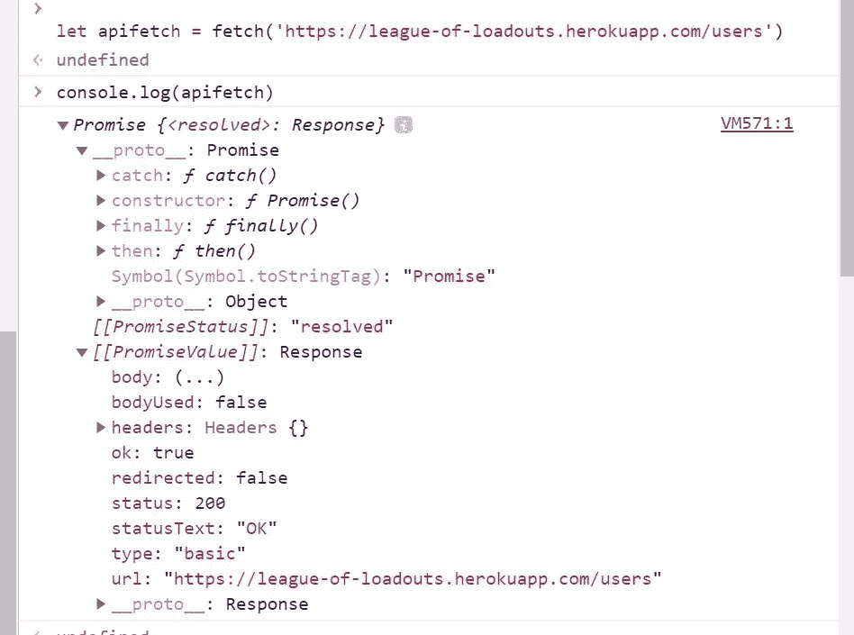
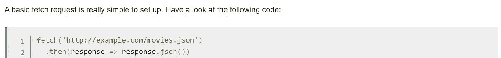
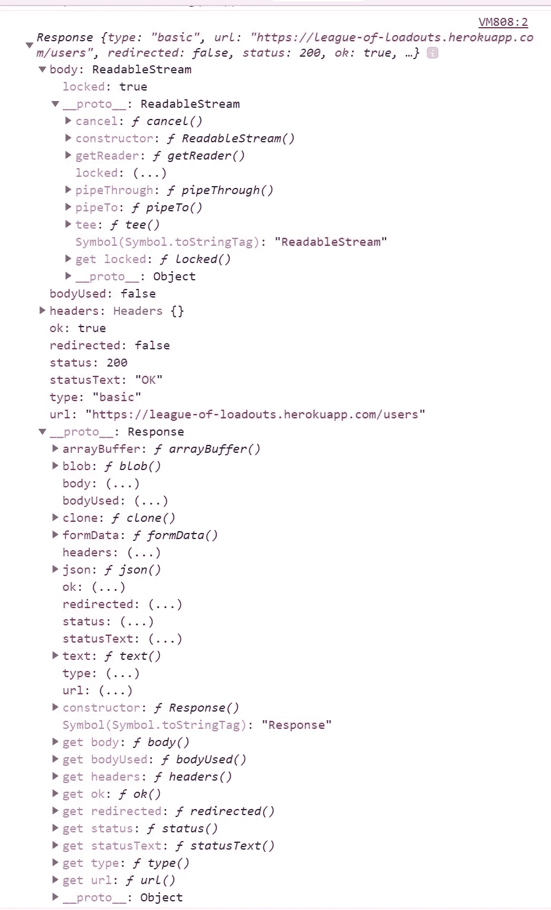
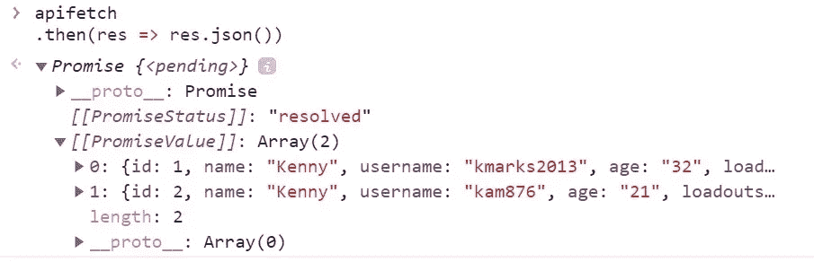
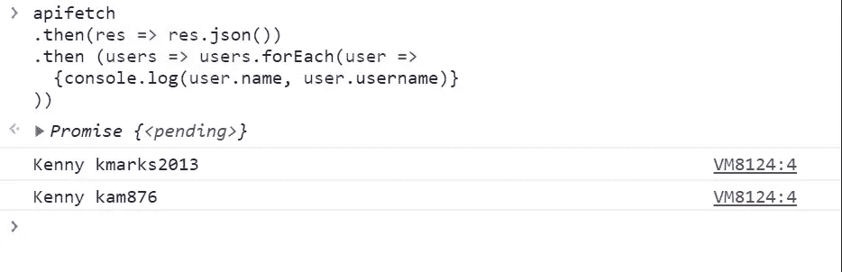

# 获取 JavaScript

> 原文：<https://levelup.gitconnected.com/fetching-in-javascript-99ec06efb3a>

## 用 JavaScript 制作一个获取请求

几乎在任何 web 开发项目中，您都可能需要向外部资源请求向项目添加信息。如果您正在构建一个后端，您将需要从您的 API 中提取信息，其他时候您可能会调用外部 API 来显示没有存储在项目本身中的信息。不管这些信息来自哪里，您都需要使用`fetch`函数发出一个获取请求。在这篇博文中，我将介绍发出获取请求的基础知识。

> 一些警告:
> 
> 首先，对于 initail 示例，我将从我不久前用于一个项目的 API 中调用这些信息，因为这样我就确切地知道我在寻找什么信息。在这种情况下是用户和用户名。
> 
> 第二，许多外部 API 将为您提供关于如何向它们的数据库发出获取请求的文档。我强烈建议你通读你使用的任何外部 API，以确保你得到你所期待的响应。
> 
> 最后，我将使用 ES6 的箭头函数语法，因为它允许我们编写更短的函数语法。然而，需要注意的是，在箭头函数中“this”的工作方式不同于 JavaScript 中的传统函数。请务必访问 [w3schools](https://www.w3schools.com/js/js_arrow_function.asp) 了解这些差异的解释。

## 获取功能

fetch 是一个 JavaScript 函数，最多接受两个参数，URL 和一组带有键值对的选项:

```
fetch('https://example.com/profile', {
  method: 'POST', // or 'PUT'
  headers: {
    'Content-Type': 'application/json',
  },
  body: JSON.stringify(data),
})
```

我们的“方法”指明了我们发出的 HTTP 请求的类型。在任何获取中，我们可以使用以下方法之一:GET、POST、PUT、PATCH 或 DELETE。“报头”特指一组请求/响应 HTTP 报头。请求的主体表示正在发送的信息字符串。

然而，在我们试图检索一些信息的基本获取获取请求中，我们通常不需要包括这些选项中的任何一个，因为获取请求的默认设置是针对获取请求的。

# 精心制作一个取物

从 API 获取数据的第一步是获取 URI。在这种情况下，我将使用我不久前构建的英雄联盟项目中的 API。我想调用的端点将是获取他们的名字和用户名的用户。一旦有了 URI 和适当的端点，就可以开始获取，将 URI 作为字符串传递:

```
let fetchAPI = fetch("https://league-of-loadouts.herokuapp.com/users")
```

如果我们在控制台和控制台日志中尝试这个获取，我们会看到这样的响应:



在这里，我们看到我们有一个带有“响应对象”PromiseValue 的承诺，在该响应下，我们可以看到正文、标题和 URL 等内容。快速浏览一下 MDN 文档中关于获取的内容，我们可以看到我们可以添加一个名为'的函数。然后'到我们的获取请求。该功能将在该承诺值中利用对回应的回叫:



如果我们添加一个. then 到获取控制台记录我们的响应，它应该看起来像:

```
let fetchAPI = fetch("https://league-of-loadouts.herokuapp.com/users")fetchAPI
.then(res => console.log(res)) 
```

现在，如果我们在控制台中再次运行，我们将看到:



在这里，我们看到我们响应的“主体”是一个叫做 ReadableStream 的东西。这将我们响应的 JSON 更改为对我们的 web 应用程序来说更容易完成，但对我们来说不一定容易阅读和操作的东西。为了做到这一点，我们可以通过调用上面所示的 _proto_ 下面列出的 JSON 函数，将我们的 body 转换成 JSON。

```
let fetchAPI = fetch("https://league-of-loadouts.herokuapp.com/users")fetchAPI
 .then(res => res.json())
```

在我们的控制台上运行它，我们再次看到我们收到了一个承诺:



然而，在这个有希望的信息中，工作变得容易得多。在 PromisedValue 下，我们看到有一个对象数组，在这种情况下，每个对象代表一个用户。现在我们可以看到我们想要的数据，我们现在可以将调用传递回第二个。“then ”,它将对数据做一些事情(在这种情况下，控制台记录名称和用户名)。

```
let fetchAPI = fetch("https://league-of-loadouts.herokuapp.com/users")fetchAPI
 .then(res => res.json())
 .then(users => users.forEach(user => {
    console.log(user.name, user.username)
 ))
```

有了这个我们现在可以看到:



# 提取获取请求

现在我们已经发出了获取请求，我们可以抽象出一些特定的逻辑，这样当我们发出请求时，我们可以看到我们正在接收的数据，这些数据可以用于大多数基本的获取请求:

```
let url = yourFetchURLHereWithCorrectEndpointlet fetchAPI = fetch(url)
  .then(res => res.json())
  .then(data => console.log(data))
```

使用这种格式，我们现在可以用不同的地址替换 URL，并获得不同的数据集。我们总是需要确保我们正在寻找正确的端点，否则请求可能会出错。

# 结论

这是大多数“获取”获取请求的基本格式。我希望这有助于您开始下一次编码之旅。编码快乐！

[](https://skilled.dev) [## 编写面试问题

### 一个完整的平台，在这里我会教你找到下一份工作所需的一切，以及…

技术开发](https://skilled.dev)