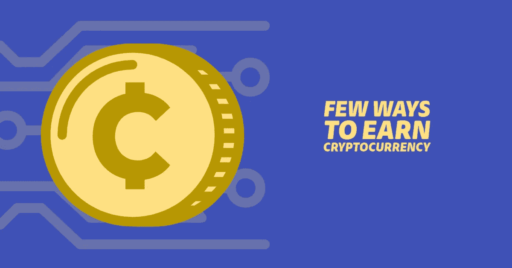
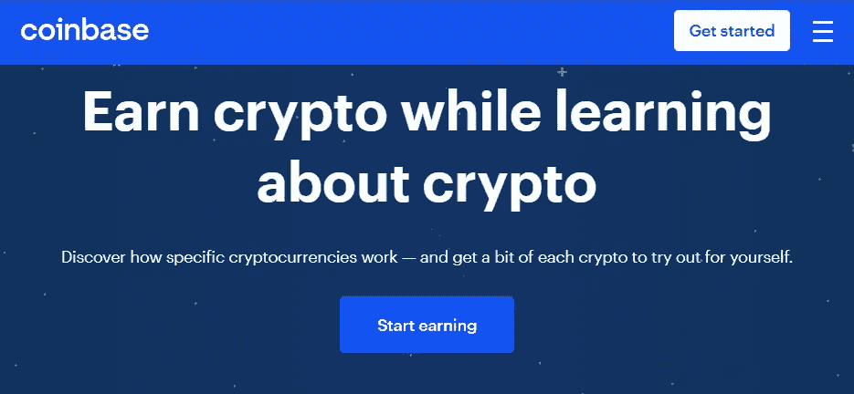
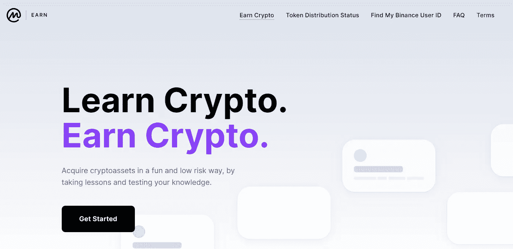
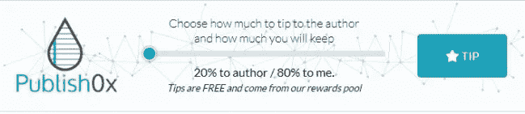

# 免费获得加密货币的几种方法

> 原文：<https://levelup.gitconnected.com/few-ways-to-earn-crypto-currency-at-no-cost-4199b6eac917>

很多加密货币项目都不为人知。这意味着即使是有用的和正常运行的项目也没有得到充分利用。为了提高意识，在您完成测验或任务后，会发放或奖励免费硬币。这样每个人都会了解加密硬币和这个项目。

# **1。比特币基地**

[比特币基地](https://www.coinbase.com/join/shrest_851)是最大的比特币钱包提供商之一，也是最容易买卖加密货币的地方。你可以通过比特币基地学习&赚取优惠赚取密码。

你必须观看长度为 1-2 分钟的少量视频(类似于 Instagram 故事)。然后你需要完成一个小测验或任务来测试你的知识。如果你回答正确，你将立即得到奖励。如果你的答案是错的，不要担心，你可以再试一次。

资格:

*   比特币基地账户— [在此注册](https://www.coinbase.com/join/shrest_851)
*   了解您的客户(KYC)验证— [身份&照片验证](https://help.coinbase.com/en/coinbase/getting-started/crypto-education/coinbase-earn-faq-and-terms)

# 2. **CoinMarketCap**

CoinMarketCap 是加密货币的价格跟踪平台。这是世界上最值得信赖和最准确的加密市场资本化，定价和信息来源。CoinMarketCap Earn 使用户能够在了解加密货币项目的同时接收代币。

你必须观看一系列关于加密项目的教育视频，并以 100%正确的答案完成测验。完成测验后，请务必查看您的电子邮件进行确认。

此外，不要忘记每天收集 CoinMarketCap 钻石，并兑换专属奖励(如 NFTs)和特别优惠。

合格

*   CoinMarketCap 账户— [在此注册](https://coinmarketcap.com/invite?ref=HASD0HQJ)
*   币安账户— [在此注册](https://accounts.binance.com/en/register?ref=R570QE1W)
*   KYC 验证(币安)——身份和照片验证
*   你需要一个钱包来支付免费硬币，比如[信任钱包](https://trustwallet.com/)和[元掩码](https://metamask.io/)

# 3.**勇敢的浏览器**

如果你喜欢浏览并且想要支持你最喜欢的内容创作者，那么你需要使用 [Brave Browser](https://brave.com/) 。你将获得[蝙蝠(基本注意力令牌)](https://coinmarketcap.com/currencies/basic-attention-token/)。

用你的旧浏览器，你付费浏览网页，用你宝贵的注意力浏览广告。但是有了勇敢，你也可以得到同样的回报。你可以通过观看尊重隐私的广告来赚钱，然后把钱转交给你喜欢的内容创作者。你可以点击[这里](https://brave.com/brave-rewards/)了解更多关于勇敢奖励的信息。

如果你是播客、乐队、博客、YouTuber，你可以加入**勇敢的创作者奖励计划**并开始将你的内容货币化。

合格

*   使用勇敢浏览器浏览(确保启用勇敢广告)
*   要获得奖励，您需要维护帐户— [在此注册](https://uphold.com/)
*   维护帐户所需的 KYC

# 4.**发布 0x**

[Publish0x](https://www.publish0x.com/?a=8mepQm26aM&tid=medium) 是一个加密博客平台，任何人都可以加入赚取加密货币。它类似于中号。你可以简单地阅读文章或撰写自己的内容，赚取加密货币。

如果你是一个读者，你可以简单地滚动到任何文章的底部，并使用 tipper。你和作者都会得到加密货币。

如果你是作者，当用户提示你的文章时，你将获得收入。你需要写出好的原创内容，建立一个追随者，很快你就会得到大量的观点和建议。

合格

*   发布 0x 账户— [在此注册](https://www.publish0x.com/?a=8mepQm26aM&tid=medium)

# 5.空投

大量加密硬币免费分发，以增加项目的知名度和流通供应。有很多活跃的空投，但其中许多是假的或不值得参与。

一些空投需要执行小任务，例如在社交媒体上发布他们的项目，在社交媒体上联系/关注他们。

大多数密码爱好者，特别是那些很少或没有密码的人，喜欢空投，因为他们认为这是免费的。在某些情况下，这些闲钱可能会随着时间的推移而升值或突然飙升，从而在零资本的情况下提供巨大的利润。

合格

*   你需要一个钱包来支付免费硬币，比如[信任钱包](https://trustwallet.com/)和[元掩码](https://metamask.io/)

# 6.比赛

你可以通过玩加密游戏来赚取加密货币，因为你把时间都花在玩游戏上了。这些游戏大多连接到 web 3.0 应用程序(像 [Metamask](https://metamask.io/) 、 [Mobox](https://www.mobox.io/#/cmcairdrop#/cmcairdrop?source=10369440) —使用聊天工具每小时申请一次免费空投

*   [我的 DeFi 宠物](https://mydefipet.com/)*   [高地](https://play.upland.me/)*   我的邻居爱丽丝*   [密码刀片](https://www.cryptoblades.io/)

> ***报名参加***[***Crypto.com***](https://crypto.com/app/b99xwhhbnv)***使用推荐代码***[b 99 xwhhbnv](https://crypto.com/app/b99xwhhbnv)***并获得 25 美元***