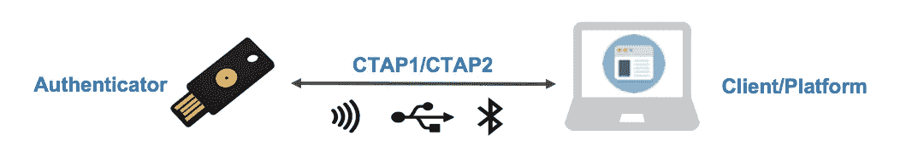

# FIDO WebAuthn Passwordless:让我们疯狂吧！

> 原文：<https://levelup.gitconnected.com/fido-webauthn-passwordless-lets-go-bananas-b58106a762f0>

长期以来，密码一直是一种显而易见的身份验证方法。在本文中，让我们看看密码有什么问题，探索 FIDO 如何让我们摆脱记忆密码，发现 FIDO 的组成部分，并回答问题，FIDO 或 WebAuthn 是生物认证吗？

图片由 Yubico 提供

# 密码(或共享机密)被破解

如今，每当你登录一个应用程序或网站时，你可能都在输入密码。很长一段时间，用户被教导输入用户名和密码，每个人都非常熟悉它，并立即知道该做什么。然而，这种便利和快速登录的能力带来了巨大的安全成本。

*   保护机密很难
    每次共享机密时，都存在意外接收者获取密码的风险。
*   网络钓鱼很常见
    假邮件、假电话或假网站是窃取秘密最常见的方式。
*   这个秘密很容易被猜到
    像`password` `qwerty` `iloveyou`这样简单的密码……仍然是 2021 年最常用的密码，可以在 1 秒钟内被破解。
*   重复使用密码
    大多数用户在多个网站使用同一个密码，从个人服务(社交网络、购物……)到工作、银行、金融服务。一旦秘密泄露，攻击者可以尝试其他服务并获得未经授权的访问。
*   难以记忆
    因为简单的密码很容易被猜到，所以向用户推荐大写字母、符号和字符的长组合。然而，这使得它很难记住，他们中的大多数人会把它写在纸上或存储在他们的电脑或云上。

摘自《威瑞森数据泄露调查报告(2020)》:

> 超过 81%的黑客入侵是由于密码薄弱或被盗

2021 年最常见的密码— [NordPass](https://nordpass.com/most-common-passwords-list/)

# 安全性和用户体验之间的平衡

面对所有这些安全问题、越来越多的数据泄露事件，以及保护个人和公司帐户的意识不断增强，身份认证技术不断发展以解决这一问题。

一个好的身份验证模型需要:

*   使用方便
*   无处不在
*   设计安全(防网络钓鱼，MFA)
*   全球/开放标准

让我们比较一下目前存在的认证方法:

密码管理器可以生成比记忆密码更强的密码。OTP 密码提供了多一层安全保护。两者都比仅仅记忆密码更强大。但是它们仍然是可打字的，易受攻击的，并且是一个共享的秘密。用户仍然可能被诱骗手动输入机密到看起来合法的钓鱼网站。

密码的替换应该通过设计来保证安全，但是我们不想牺牲用户体验。当今最强大的安全选项之一是安全密钥，这是我们通常用作第二因素身份认证方法(2FA)的硬件。如今，由于 FIDO 标准，它们已成为一种可用的认证方法。安全钥匙好用，安全级别和抗钓鱼能力都很棒！这样做的缺点是，你总是不得不随身携带至少一个硬件设备，这仍然很难恢复帐户，我们需要另一种帐户恢复备份方法。

在本文的后面，我们来看看为什么安全密钥的安全性和防钓鱼能力比密码好。

# 带密码的认证流程

让我们了解密码的工作原理及其问题。当显示登录表单时，用户在表单中填写他们的用户名和密码。然后，密码被发送到服务，服务对原始密码进行哈希/加密，并将其存储在其服务中。

可能阻止用户使用该服务的问题可能是:

1.  从输入密码的第一步开始，用户可能会忘记密码。
2.  他们可能会发现很难在他们的设备上输入(在小屏幕的移动电话上，在电话上输入时犯太多错误，等等)。
3.  他们使用的服务可能是看起来合法的假服务(网络钓鱼)。
4.  在服务端，密码可能会被窃取。

# FIDO 简介

FIDO 代表[快速身份在线](https://fidoalliance.org/)，由平台提供商、设备制造商、安全、生物识别、身份和消费者服务提供商等全球领先企业提供支持。

FIDO 联盟已经为认证机制开发了几个规范。基本思想是使用公钥加密。

这里有一些演示网站可供使用:

*   [二人组:网络认证演示](https://github.com/duo-labs/webauthn.io)
*   [Auth0: WebAuthn 演示](https://webauthn.me/)
*   [Yubico: WebAuthn 演示](https://demo.yubico.com/webauthn)

## 帐户创建

在帐户创建过程中，会生成一对专用于该帐户的公钥和私钥，而不是密码。这对密钥是由一个叫做认证器的硬件设备生成的。这可能是你的笔记本电脑，你的手机，或一个安全密钥，我们稍后会谈到这一点。所以公钥可以和任何人共享，就像你的用户名一样，它不是秘密。服务器将存储您的公钥。私钥保存在您的设备上(验证器),不会与任何人共享。保护它是设备的责任。

## 帐户登录

以后当你想签到的时候，你不要发送任何秘密。相反，您可以通过提供您的设备知道与您帐户的公钥相关联的私钥来证明这是您的帐户。

首先，服务向认证者发送一个挑战，并要求“签名”。身份验证者使用私钥对其进行签名，并将其发送回服务。服务器已经有了公钥，可以很容易地检查签名是否与该密钥匹配。然后假设签名匹配，用户在没有共享任何秘密的情况下登录！！！

这种身份验证模式的优点在于:

1.  没有秘密是共享的！！存储在认证器中的私钥绝不会与任何人共享。它不可猜测，不可重用，也不脆弱。即使服务器有数据泄露，他们也只能得到你的公钥，而这个公钥是对所有人公开的。
2.  验证器不会被网络钓鱼
    所“欺骗”。在帐户创建期间，验证器会将密钥与您注册的服务的域绑定在一起。通过使用不同的域名，但看起来与合法域名相同的网络钓鱼是行不通的。认证者将不会识别这些假域名，并且不允许进行认证。
3.  出色的用户体验
    认证器只需要用户一个简单的手势，可能是指纹扫描，面部或语音识别…它很快，用户不必记住任何复杂的密码。

因此，FIDO 是一种简单、快速、方便且安全的身份认证解决方案！

# 了解 FIDO 规格

让我们来探索一下 FIDO 规范的构建模块。因此，FIDO 联盟已经开发了[几个规范](https://fidoalliance.org/specifications/)，其中一些相互依赖，所以一开始看到所有的术语时会很混乱。让我们一个一个来看看。

## TL；速度三角形定位法(dead reckoning)

FIDO 1.0

*   U2F/CTAP1:物理双因素认证(2FA)的标准规范。
*   UAF:无密码认证的标准规范。

**FIDO 2.0 = WebAuthn + CTAP (CTAP1 和 CTAP2)**

*   WebAuthn:一组标准的 web APIs，允许在浏览器中进行无密码认证。
*   CTAP2:用于 2FA 或无密码身份验证的外部身份验证器的使用规范。

TL；DR 图片由[阿克曼塞维多夫](https://herrjemand.medium.com/)在[上整理 FIDO/CTAP/WebAuthn 术语](https://medium.com/webauthnworks/sorting-fido-ctap-webauthn-terminology-7d32067c0b01)

## UAF -通用认证框架

*   FIDO UAF 支持无密码体验。
*   您可以选择本地身份验证，如指纹、人脸识别、PIN 等。，在在线服务中注册您的设备。
*   设备注册后，每当用户需要向服务进行身份验证时，您只需重复本地身份验证操作。

## U2F —通用第二因子

*   FIDO U2F 支持二次元体验，为用户登录增加了更强的二次元(2FA)。
*   在注册和认证过程中，用户只需按下 USB 设备上的按钮，或者点击 NFC 或 BLE，就可以输入第二个因素。
*   随着 FIDO2 的发布，U2F 被重新标记为 CTAP1。

## CTAP1 -客户端到验证者协议 1

FIDO U2F 的新名称 CTAP1 **允许使用现有 FIDO U2F 设备(如 FIDO 安全密钥)** **通过 USB、NFC 或 BLE 在支持 FIDO2 的浏览器和操作系统上进行身份验证**，以获得第二要素体验。

## CTAP2 -客户端到验证者协议 2

CTAP2 **允许使用外部身份验证器(FIDO 安全密钥、移动设备)通过 USB、NFC 或 BLE 在支持 FIDO2 的浏览器和操作系统上进行身份验证**，实现无密码、二元或多元身份验证体验。

图片由 [Okta](https://www.okta.com/blog/2019/04/the-ultimate-guide-to-fido2-and-webauthn-terminology/)

# FIDO2

FIDO2 包括:

*   来自 W3C 的 Web 身份验证规范
*   FIDO 联盟的客户端到认证者协议(CTAP)

FIDO2 通过平台(或绑定或嵌入式)身份验证器(如生物识别或 pin)或漫游(或外部)身份验证器(如 FIDO 安全密钥、移动设备、可穿戴设备等)支持无密码、二因素和多因素用户体验。).

## WebAuthn

W3C 的标准 JavaScript API 正在浏览器和平台中构建，用于创建和管理公钥证书。

## FIDO 或者 WebAuthn 是生物认证吗？

不，FIDO 和生物认证的层次是不同的。生物识别、PIN、模式、面部、声音识别...是特定的身份验证方法；而 FIDO 是一种实现无密码认证的机制。

# 关闭思想

有了 FIDO，简单、快速、方便和安全的身份验证梦想从未如此接近，在这种身份验证中，不共享记忆的密码或秘密。FIDO 是一种兼具可用性和安全性的认证模式的答案。虽然有几个问题需要考虑，如降低采用壁垒或恢复方法，但我们希望在未来 FIDO 越来越受欢迎，并成为标准。

在下一篇文章中，我们将深入实现 WebAuthn，构建一个无密码认证演示站点，敬请关注！

# 参考

*   [超越密码](https://developer.apple.com/videos/play/wwdc2021/10106/)(developer.apple.com)
*   [FIDO 联盟更新—更简单&更强大的认证](https://www.pkiconference.com/2021/06/28/fido-alliance-update-simpler-stronger-authentication-video/)(pkiconference.com)
*   [FIDO、FIDO2 和 WebAuthn 的完整指南](https://doubleoctopus.com/blog/biometrics/your-complete-guide-to-fido-fast-identity-online/)(doubleoctopus.com)
*   【medium.com 整理 FIDO/CTAP/WebAuthn 术语

*感谢你阅读这篇文章！如果你有任何问题，请留言。如果你觉得这篇文章有帮助，请按住鼓掌按钮，让其他人也能发现。请务必在下面注册我的时事通讯，或者在 Medium 上关注我，以获得更多类似的文章。* ☝️👏 😄