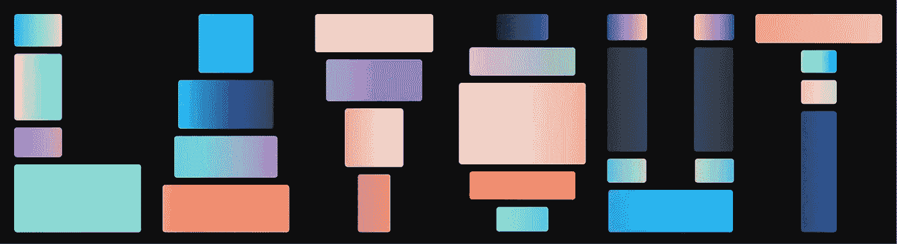
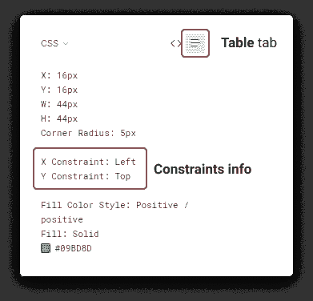
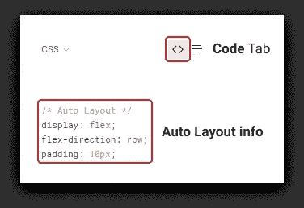
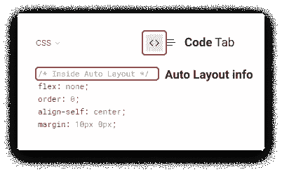
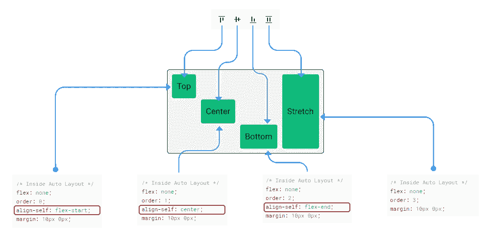

# Figma 约束 web 开发人员的自动布局

> 原文：<https://levelup.gitconnected.com/figma-constraints-auto-layout-for-web-developers-5625d8a7d65c>

**TL；**博士[所有约束和自动布局代码示例](https://codepen.io/collection/XMOdvv)

约束和自动布局是 Figma 的功能，设计师使用它来确保我们的模型的结构和可重用性。

本指南面向使用 Figma 开发人员移交功能的开发人员，旨在解释在哪里找到、如何解码以及如何理解设计人员已经做出并编码到 Figma 工具集中的决策。

解释将被翻译成 CSS 等效词汇。这里的目标不是规定实现，而是描述行为。你如何达到效果，可能取决于你自己的实现。

# 限制

将约束添加到子对象，以指定当调整其父对象大小时它的行为。有 4 种类型的约束:
1。**上、右、下、左**
2。**居中**
3。**左&右&上**下
4。**Stretch**每个 Figma 层可以有 2 个约束；每个轴一个(X 和 Y)。

## 在哪里可以找到开发人员移交中的约束信息

约束是在 Figma 界面的右边，代码属性检查器的**表**选项卡下指定的。

## 将约束翻译成 CSS

# **1。顶部**、**右侧**、**底部**和**左侧**

**顶部**、**右侧**、**底部**和**左侧**约束意味着子对象被“粘合”到其在父对象受约束边上的位置。

## 位置

左上&左:这是 HTML 默认的 DOM 布局。CSS 中不需要任何操作。

顶部和左侧约束**的代码示例**

**底部**:将父设置为`display: flex;`，子设置为`align-self: flex-end;`。
**右**:将父设置为`display: flex; justify-content: flex-end;`，子设置为`align-self: flex-end;`。

**底部**和**右侧**约束的代码示例

## 大小

在处理**顶部**、**右侧**、**底部**或**左侧**约束时，子对象的宽度和高度独立于其父对象。

# 2.中心

**中心**约束锁定子对象的大小，并保持其相对于中心的距离不变。这是最常用的垂直和水平居中儿童。任何其他用例都有点怪异和笨拙。

## 位置

**居中** (x 轴):为了完美地居中，将父对象设置为`display: flex; justify-content: center;`。如果你需要偏移子节点，添加一个`transform: translateX([distance from center])`。

**中心** (y 轴):重复上述指令，但轴翻转。

**中心**约束的代码示例

# 3.左侧和右侧以及顶部和底部

与顶部、左侧、底部、右侧**、左侧&右侧**和**顶部&底部**约束不同，这意味着子对象的边距固定到父对象的边缘(每轴)，并且将占据所有剩余空间。

**左&右**:将父设置为`display: flex;`，子设置为`width: 100%; margin: #px;`。其中#是子对象到其父对象边缘的距离。

**上&下:**将父设置为`display: flex; flex-direction: column;`，子设置为`height: 100%; margin: #px;`。其中#是子对象到其父对象边缘的距离。

一个**左&右**和**顶&底**约束的代码示例

# 4.规模

**缩放**约束将子对象的位置和大小设置为其父对象的百分比。

**缩放(x 轴)**:将子设置为`position: relative; left: n%; width: n%;`。

**缩放(y 轴)**:将子设置为`position: relative; top: n%; height: n%;`。

**比例**约束的代码示例

# 自动布局

自动布局有两个主要工作:调整父对象的大小以适应其子对象的大小，以及创建列表。它做了`flexbox`的工作，也暴露了一些只有 CSS `grid`才有的好特性，比如`grid-gap`。出于本文的目的，示例将在`flexbox`中表示，因为 Figma 的 handoff 将自动布局组合转换为`flexbox`。

## 在开发人员移交中从哪里找到自动布局信息

## 父框架

在**代码**标签下，一个自动布局的框架会显示注释
`/* Auto Layout */`。

## 子框架

自动布局父级的子框架只能在**代码**选项卡中用注释`/* Inside Auto Layout */`标识。

自动布局框架的子框架还有另一个需要跟踪的属性:父框架内的对齐。
可能的对准有:**顶部**、**中心**、**底部**和**拉伸**。这些对应于`flexbox`子节点的`align-self`。

*为了实现 CSS 中的**拉伸**，将横轴尺寸设置为`auto`。

自动布局的代码示例

# 所有的例子！

您可以在一个 Codepen 集合中找到本文中的所有示例:

 [## Figma 约束和自动布局-由 Alexis Morin 在 CodePen 上收集

### 编辑描述

codepen.io](https://codepen.io/collection/XMOdvv) 

**关于作者:** Alexis Morin 是一名交互设计师，毕业于[于默奥设计学院](http://dh.umu.se/en/)。他是 [Interaction 21](https://interaction21.ixda.org) 会议的联合主席，IxDA Montreal 的当地负责人，目前是育碧的高级 UX 设计师。
你可以通过 [Twitter](https://twitter.com/thealexismorin) 、 [LinkedIn](https://ca.linkedin.com/in/morinalexis) 或者 [Github](http://github.com/alexismo) 与他联系。