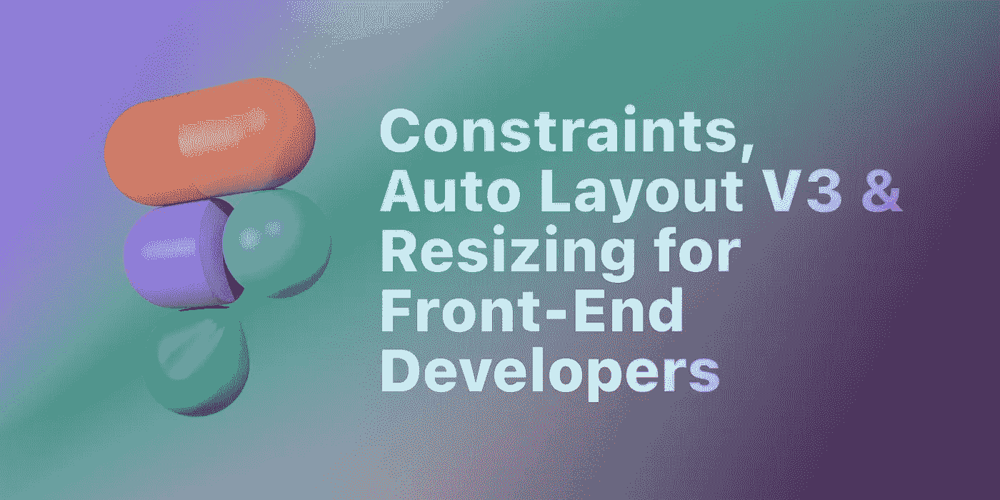
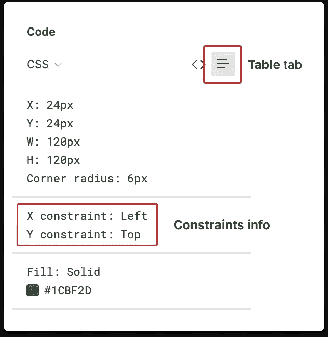
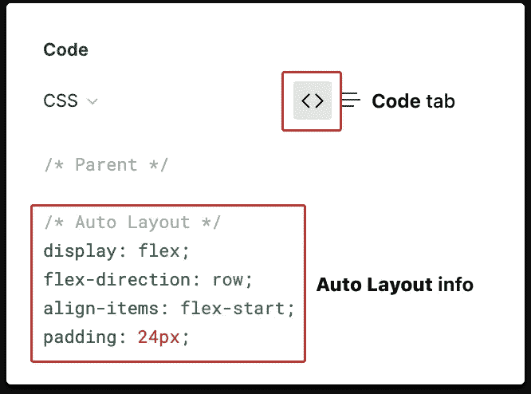
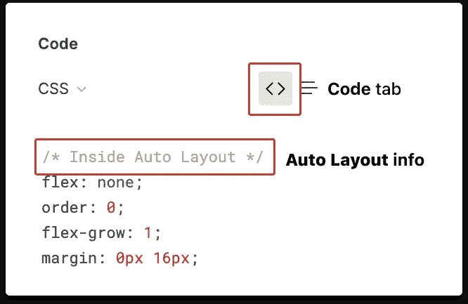
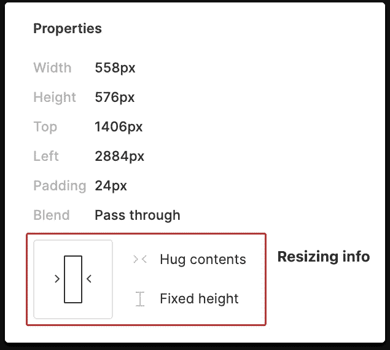

# Figma 约束、自动布局 V3 和为前端开发人员调整大小

> 原文：<https://levelup.gitconnected.com/figma-constraints-auto-layout-v3-resizing-for-front-end-developers-6af4880a6162>

约束，自动布局 V3 和为前端开发人员调整大小

**更新** : Figma 在 2020 年 11 月全面改进了其自动布局&调整大小功能。本文的内容反映了这些变化。本指南是从我的上一篇同名文章的[中为自动布局 V3 更新的。](/figma-constraints-auto-layout-for-web-developers-5625d8a7d65c)

约束，自动布局和调整大小是 Figma 的特点，设计师使用它来确保我们的模型的结构和可重用性。

本指南面向使用 Figma 开发人员移交功能的开发人员，旨在解释在哪里可以找到、如何解码以及如何理解设计人员已经做出并编码到 Figma 工具集中的决策。

Figma 可用于 Android、iOS、Web 甚至嵌入式系统的设计。这些解释将被翻译成 CSS 等效词汇。这里的目标不是规定实现，而是描述行为。你如何达到效果可能取决于你自己的实现，语言或者框架。

# 限制

将约束添加到子对象，以指定当调整其父对象大小时它的行为。有 4 种类型的约束:
1。**上、右、下、左**
2。**居中**
3。**左右，上下**
4。**Scale**每个 Figma 层可以有 2 个约束；每个轴一个(X 和 Y)。

## 在哪里可以找到开发人员移交中的约束信息

约束是在 Figma 界面的右边，代码属性检查器的**表**选项卡下指定的。

Figma 检查面板中的约束信息

# 将约束翻译成 CSS

# 1.顶部、右侧、底部和左侧

**顶部**、**右侧**、**底部**和**左侧**约束意味着子对象被“粘合”到其在父对象受约束边上的位置。

## 位置

顶部**左侧&左侧**:这是 HTML 默认布局 DOM 的方式。CSS 中不需要任何操作。

**底部**:将父设置为`display: flex;`，子设置为`align-self: flex-end;`。
**右**:将父设置为`display: flex; justify-content: flex-end;`，子设置为`align-self: flex-end;`。

## 大小

当处理**顶部**、**右侧**、**底部**或**左侧**约束时，子对象的宽度和高度独立于其父对象。

# 2.中心

**中心**约束锁定子对象的大小，并保持其相对于中心的距离不变。这是最常用的垂直和水平居中儿童。任何其他用例都有点怪异和笨拙。

## 位置

**居中** (x 轴):为了完美地居中，将父对象设置为`display: flex; justify-content: center;`。如果你需要偏移子节点，添加一个`transform: translateX([distance from center])`。

**中心** (y 轴):重复上述指令，但轴翻转。

# 3.左侧和右侧以及顶部和底部

与顶部、左侧、底部、右侧**、左侧&右侧**和**顶部&底部**约束不同，这意味着子对象的边距固定在父对象的边缘(每轴)，并且将占据所有剩余空间。

**左&右**:将父设置为`display: flex;`，子设置为`width: 100%; margin: #px;`。其中#是子对象到其父对象边缘的距离。

**上&下:**将父设置为`display: flex; flex-direction: column;`，子设置为`height: 100%; margin: #px;`。其中#是子对象到其父对象边缘的距离。

# 4.规模

**缩放**约束将子对象的位置和大小设置为其父对象的百分比。

**标尺(x 轴)**:将子设置为`position: relative; left: n%; width: n%;`。

**刻度(y 轴)**:将子设置为`position: relative; top: n%; height: n%;`。

# 自动布局

自动布局有两大工作:
1。使父母的尺寸适应孩子的尺寸。创建列表。

它完成了`flexbox`的工作，也为 flex `[gap](https://developer.mozilla.org/en-US/docs/Web/CSS/gap)`公开了一些好的值。出于本文的目的，示例将在`flexbox`中表示，因为 Figma 的 handoff 将自动布局组合转换为`flexbox`。

## 在开发人员移交中从哪里找到自动布局信息

## 父框架

在**代码**标签下，一个自动布局的框架会显示注释
`/* Auto Layout */`。

Figma 检查面板中父框架的自动布局信息

自动布局 V3 父帧的一个变化是增加了为所有 4 个边设置单独的`padding`值、`justify-content`值(`space-around`不可用)和`align-items`值的控件。

## 子框架

就像在 HTML 节点中一样，Figma 框架是嵌套的。子框架也可以是父框架。自动布局父级的子框架只能在**代码**选项卡中用注释`/* Inside Auto Layout */`标识。

Figma 检查面板中子框架的自动布局信息

注意:不再可能在自动布局父级中设置单个框架的`align-self`。

# 自动调整布局大小

调整大小是 V3 的一个新概念。它进一步帮助设计者创建响应模型。调整大小可以独立应用于框架的宽度和高度。它仅适用于自动布局框架。不幸的是，调整大小的概念并不统一，在 Figma 的 Inspect 面板中表现为一个 UI 小部件。

检查面板中的调整大小信息

## 固定宽度/固定高度

这个听起来很简单。固定宽度或固定高度意味着框架不会调整大小，无论其子框架或父框架如何。

## 拥抱内容(仅顶层父框架)

拥抱的内容和盒子上说的一样。它拥抱它的内容；它将父级的大小(在该维度中)调整为其子级的大小，加上自动布局指定的任何填充。因此，它不需要在 CSS 中实现。这是任何`inline` HTML 节点的默认行为。

## 填充容器(仅限子帧)

填充容器也做它在盒子上所说的。除了它还可以很好地与其他兄弟帧一起播放。

在`flex`主轴中，**填充容器**设置了一个`flex-grow: 1;`，使得任何剩余空间都被子帧占据，并且任何空间也与兄弟帧平均共享。

在`flex`横轴上，**填充容器**设置一个`align-self: stretch`，以便任何剩余空间都被孩子占据。

# 所有的例子！

您可以在一个 Codepen 集合中找到本文中的所有示例:

 [## Figma 约束和自动布局-由 Alexis Morin 在 CodePen 上收集

### 编辑描述

codepen.io](https://codepen.io/collection/XMOdvv) 

**关于作者:** Alexis Morin 是 [Compass](https://www.compass.com/) 的产品设计师， [Interaction 21](https://interaction21.ixda.org/) 会议的联合主席，IxDA Montreal 的当地负责人。他们毕业于[于默奥设计学院](http://dh.umu.se/en/)并获得交互设计硕士学位。
你可以通过 [Twitter](https://twitter.com/thealexismorin) 、 [LinkedIn](https://ca.linkedin.com/in/morinalexis) 或 [Github](http://github.com/alexismo) 与他们联系。