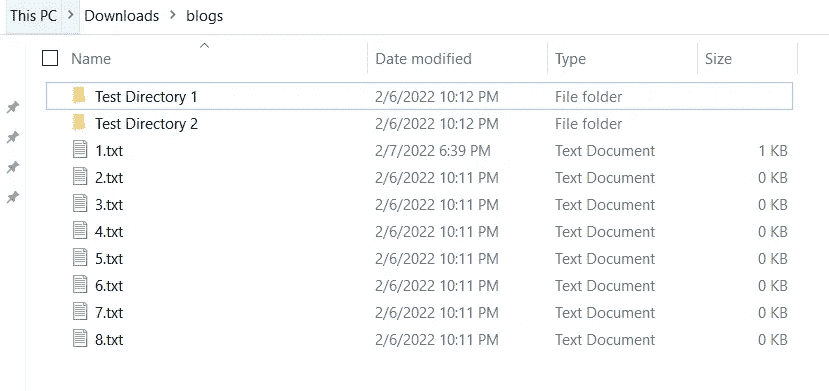
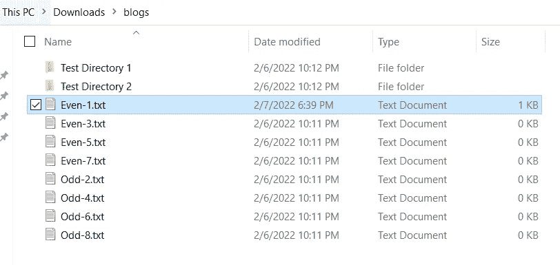
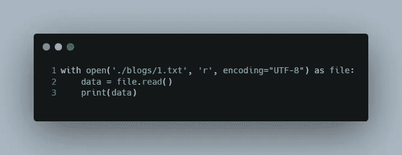
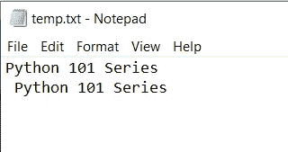
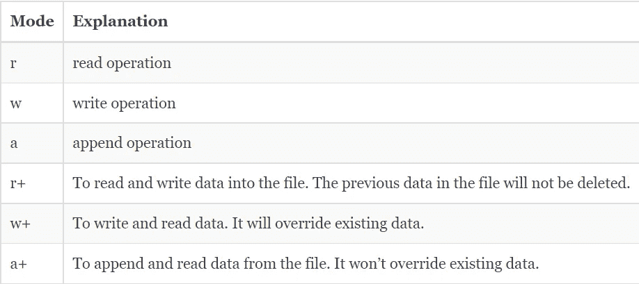

# Python 中的文件处理

> 原文：<https://levelup.gitconnected.com/file-handling-in-python-6ffc23cc92c>


Python 中的文件处理

所以，只是为了刷新我们的记忆，到目前为止，我们已经看到了 python 的所有基础知识，包括变量、数据类型、函数、条件语句和循环。你可以在我的 [Python 101 系列](https://sahilfruitwala.com/series/python-101)页面查看它们。

在每一个软件开发中，我们都要对文件进行某种操作。我们可以使用 python 进行 n 次操作。我们可以:

1.  所有文件的列表
2.  移动和重命名文件
3.  删除文件
4.  读取文件
5.  写文件
6.  附加文件

我确信，我们可以做更多我可能忘记提及的事情。但是，这些是我们可以使用 Python 完成的基本操作。所以，让我们开始吧！！！！

为了节省时间和更好地理解，我合并了一些主题。别担心，你会知道我在说什么。😁

# 列出并重命名文件

在这一节中，我将向您展示我们可以用 python 的`os`模块做什么。如果你和我一样是个极客，想要按照相同的惯例重命名文件，那么你可以用 python 来实现。

> *那么，要做到这一点，我们需要什么？🤔*

首先，我们需要一份所有文件的清单。之后，我们需要选择每个文件并重命名。

> 那么，我们如何获得所有文件的列表呢？



据我所知，`os`模块中没有直接的只返回文件名的方法。因此，一旦我们获得了所有文件和目录的列表，我们需要取出目录或者只保留文件。为此，我们可以使用 **os** 模块的`os.path.isfile()`方法。如果给定的参数是文件，此方法将返回 true。同样，如果给定的参数是一个目录，那么`os.path.isdir()`将返回 true。

```
import os# returns name of all files & directory exist in current location
files_dir = os.listdir('./blogs') 
print(files_dir)only_files = []
for i in files_dir:
    if os.path.isfile('./blogs/'+i):
        only_files.append(i)only_dir = []
for i in files_dir:
    if os.path.isdir('./blogs/'+i):
        only_dir.append(i)print('-'*15)
print(only_files) # prints all files
print('-'*15)
print(only_dir) # prints all directories"""
OUTPUT: 
['1.txt', '2.txt', '3.txt', '4.txt', '5.txt', '6.txt', '7.txt', '8.txt', 'Test Directory 1', 'Test Directory 2']
---------------
['1.txt', '2.txt', '3.txt', '4.txt', '5.txt', '6.txt', '7.txt', '8.txt']
---------------
['Test Directory 1', 'Test Directory 2']
"""
```

我们拿到了所有文件的清单。

> 现在，我们如何重命名所有这些文件？🤔

要重命名文件，我们可以使用`rename()`方法，并将其应用于每个文件。让我们假设，我们想要根据文件索引用奇数和偶数前缀重命名文件。

```
# only_files is a list of all files in the blogs directoryfor index, file_name in enumerate(only_files):
    if index % 2 == 0:
        os.rename('./blogs/'+file_name, './blogs/'+'Even-'+file_name)
    else:
        os.rename('./blogs/'+file_name, './blogs/'+'Odd-'+file_name)
```

这里，`enumerate()`方法从迭代器(only_files)返回计数器(从 0 开始)和值。因此，我们正在检查索引/计数器是否为偶数，然后代码将在文件名前添加前缀“偶数-”，否则将添加“奇数-”。在 [Programiz](https://www.programiz.com/python-programming/methods/built-in/enumerate) 上找到更多关于 enumerate()的信息。

你可能已经猜到了`os.rename()`方法的语法，但以防万一:**语法:** `os.rename(source, destination)`或`os.rename(current_name, new_name)`

这里需要记住的一点是，我们需要给出一个完整的或者适当的相对路径来使用这个方法。在我们的例子中，我给出了。/blog '和“/”进入博客目录。所以文件的路径会变成。/blogs/1.txt。



# 移动和删除文件

要移动文件，我们可以使用`os`或`shutil`模块。在这篇博客中，我将向你展示如何使用`os`模块的`rename()`方法来移动文件。 **rename()** 的语法是相同的，但是唯一的问题是，作为第二个参数，我们必须使用带有文件名的目标路径。这可能会令人困惑，所以让我给你看看。

```
import osos.rename('./blogs/1.txt', './blogs/Test Directory 1/1.txt')os.rename('./blogs/2.txt', './blogs/Test Directory 2/1.txt')
```

因此，在第一个重命名方法中，我们从**博客**目录中取出 ***1.txt*** 并将其移动到**测试目录 1** 中，这是博客的一个子目录。在第二个场景中，我们将 **2.txt** 移动到**测试目录 1** 目录，名称为 ***1.txt*** 。是的，我们只是同时移动和重命名了文件。如果你对 Linux 命令有一点了解，那么你可能已经观察到`os.rename()`类似于`mv` Linux 命令。

现在，我们如何删除这些文件？🤔

别担心！`OS`模块也为您提供了支持。通过使用`remove()`方法，我们可以删除文件。例如，如果我们想从**博客**目录中删除 **3.txt** 文件。为此，我们可以编写以下代码:

```
import osos.remove('./blogs/3.txt')
```

# 对文件的读、写和追加操作

要做任何种类的手术，我们必须遵循 3 个基本步骤:

1.  开文件
2.  进行操作
3.  关闭文件

我们可以使用两种模式来遵循这些步骤。很难用语言来解释这些模式，所以我将用代码来解释。

```
# Open the file
file = open('./blogs/1.txt', 'r', encoding="UTF-8")# Do operation
data = file.read()
print(data)# Close the file
file.close()"""
OUTPUT:Python 101 Series
"""
```

因此，在第一个模式中，我们需要打开一个文件，执行操作并手动关闭文件。这里，`open()`是 Python 提供的。语法:`open(file, access_mode, encoding)`在这里，**文件**表示文件的位置或类似位置的对象。 **access_mode** 表示我们希望以哪种模式打开文件。我们可以同时完成多项任务，稍后我会列出来。编码代表我们想要操作文件的编码格式，但是*它是可选的*。在大多数情况下，我们使用 *UTF-8* 。

```
with open('./blogs/1.txt', 'r', encoding="UTF-8") as file:
    data = file.read()
    print(data)
```

在第二种模式中，我们使用上下文管理器模式。简而言之，我会说我们使用这个上下文管理器模式来有意识地使用我们的资源。第一种方法的问题是，有时我们可能会忘记关闭文件。在这种情况下，它不会影响太大，但当我们处理成千上万的文件时，它会影响我们的系统。一旦我们完成了更高效的任务，上下文管理器模式就会释放资源。如果你想了解更多，你可以看看这个 [geeksforgeeks](https://www.geeksforgeeks.org/context-manager-in-python/) 博客。



因此，在第一行，我们使用`with open()`语法打开一个文件，并将它赋给 file 变量。和`file = open()`一样。但是使用这种语法的主要好处是，python 会在第 3 行之后自动清除这个资源。由于我们不在`with open()`的上下文中，所有与第 3 行之后的**文件**变量相关的资源都将被释放。在行业中，在处理文件时，大多数时候你会看到上下文管理器模式。

当我们读取文件时，我们可以用类似的方式向文件写入和追加数据。因此，要将数据写入文件，我们可以使用下面的代码片段:

```
with open('./blogs/temp.txt', 'w', encoding="UTF-8") as file:
    data = "Python 101 Series"
    file.write(data)
```

在写操作的情况下，如果文件不存在，它将创建一个新文件并将数据写入其中。如果一个文件已经有了相同的名字，它将用新的数据覆盖它。这只会创建一个新文件，这个 **open()** 方法不会创建一个目录来使用。因此，如果我写`open("./blogs/temp/temp.txt", "w")`，它将抛出一个错误，因为不存在名为 **temp** 的目录。

现在，要解决重写 write 的问题，我们可以使用 append 方法。append 方法将在我们打开的文件末尾追加新数据。

```
with open('./blogs/temp.txt', 'a') as file:
    data = "\n New Python 101 Series"
    file.write(data)
```

因此，从上面的代码中，我们可以说 python 将检查名为 **temp.txt** 的文件是否存在，然后它将打开并在其末尾追加 ***\n 新的 Python 101 系列*** 。否则，它将创建一个新文件并写入数据。您可以在下图中看到输出。



# 文件访问模式

在下表中，我展示了基本的访问模式。但是有些模式允许您对二进制数据和二进制格式进行操作。你可以在这个[博客](https://scanftree.com/python/python-access-mode-of-files)帖子中查看完整列表。



Python 中的文件访问模式

# 结论

终于！我希望你在阅读 8 分钟后学到了一些东西😁。

在这篇博客中，我们了解了如何用一些基本程序处理 python 中的文件。我知道，一次接受太多了。但是，你不需要记住我在这里提到的一切。

就这样。感谢您的阅读。

如果你需要任何帮助或者想讨论什么，请告诉我。在推特或 LinkedIn 上联系我。请务必在下面的评论中留下你的想法、问题或担忧。我很想看看他们。

> *想了解更多？*
> 
> *注册我的* [*简讯*](https://bit.ly/3Menk8Q) *，把最好的文章放进你的收件箱。*

直到下一次👋

> *探索我在 Python 101 系列中的其他博客*

[](/modules-and-packages-in-python-63df7d952bb8) [## Python 中的模块和包

### 了解模块和包的基础知识以及如何在 python 中使用它们

levelup.gitconnected.com](/modules-and-packages-in-python-63df7d952bb8) [](/create-and-use-functions-in-python-19b093f3ba9) [## 在 Python 中创建和使用函数

### 了解如何通过 Python 中的几个简单步骤来使用函数

levelup.gitconnected.com](/create-and-use-functions-in-python-19b093f3ba9) [](/dive-into-daunting-lists-and-dictionaries-in-python-2d22daf2c897) [## 深入 Python 中令人生畏的列表和字典

### 理解 Python 中的内置列表和字典方法

levelup.gitconnected.com](/dive-into-daunting-lists-and-dictionaries-in-python-2d22daf2c897)