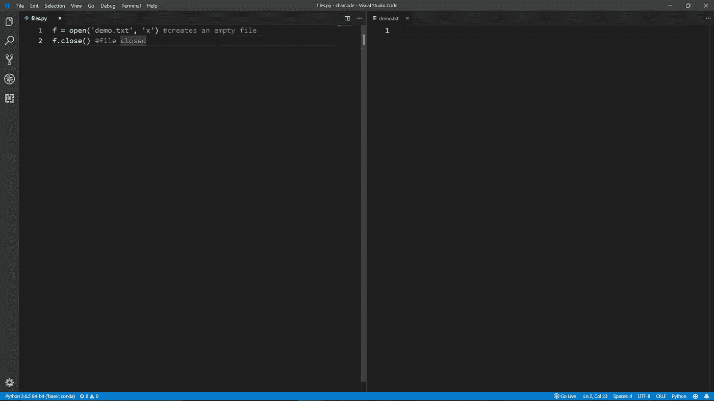
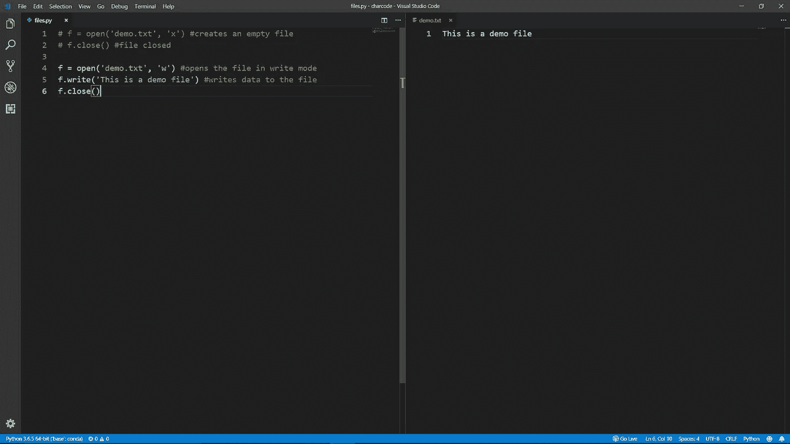
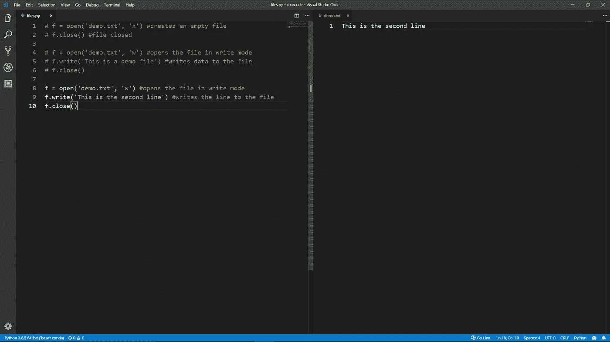
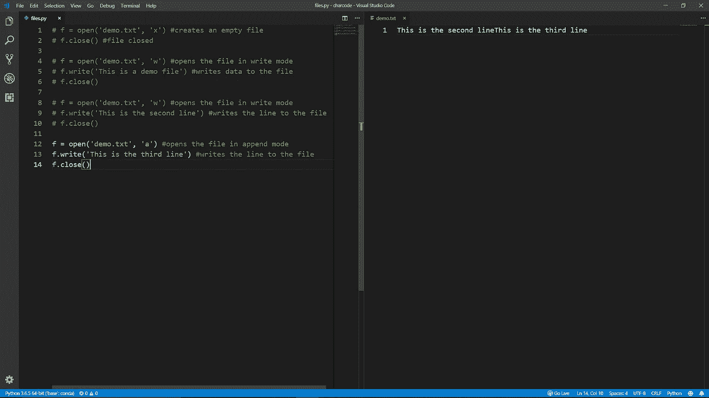
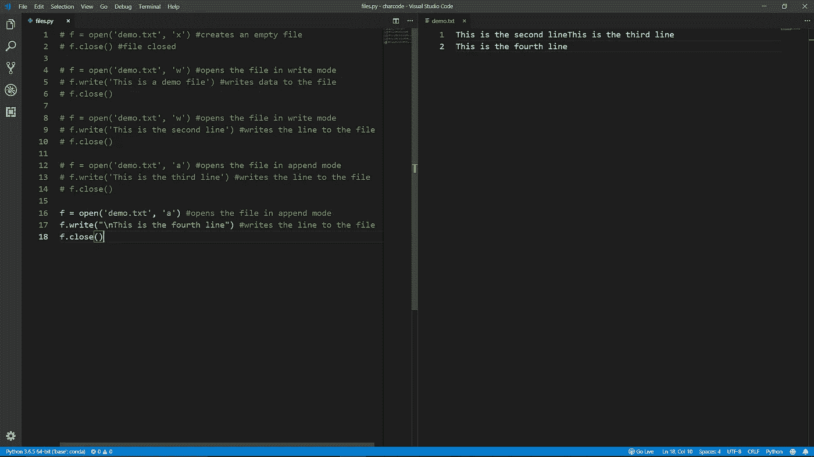
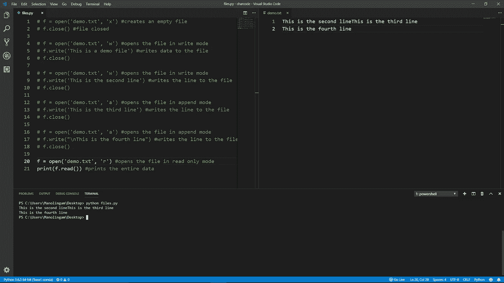
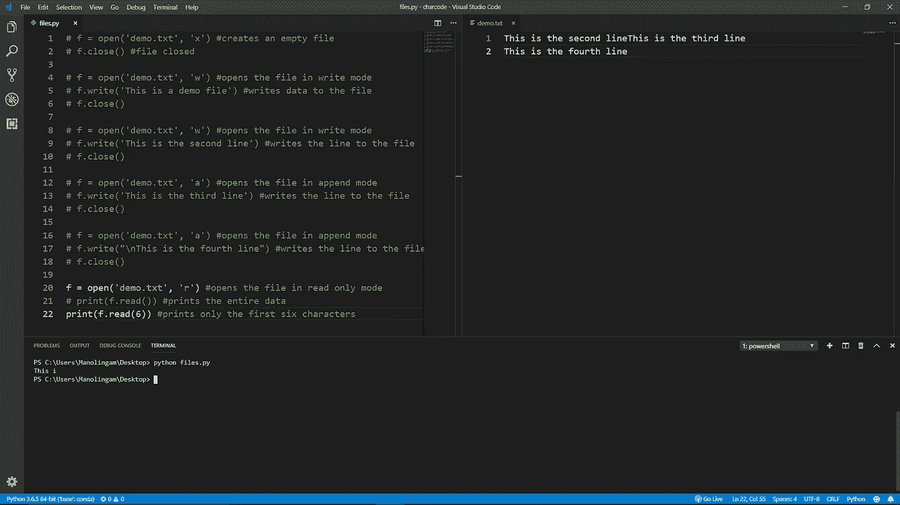
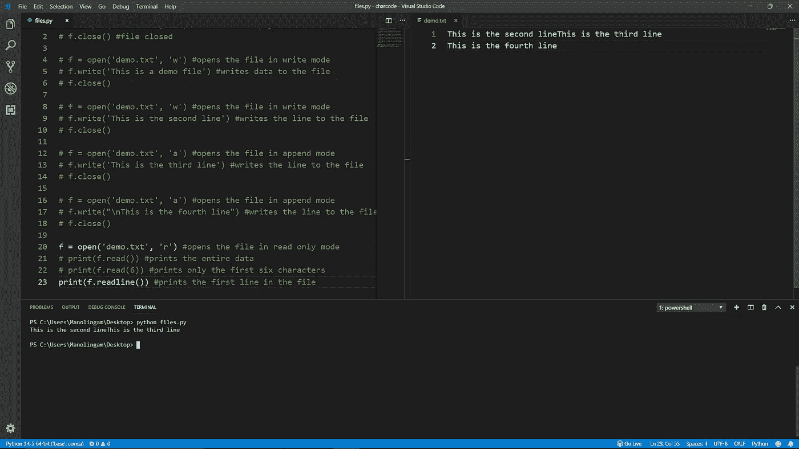
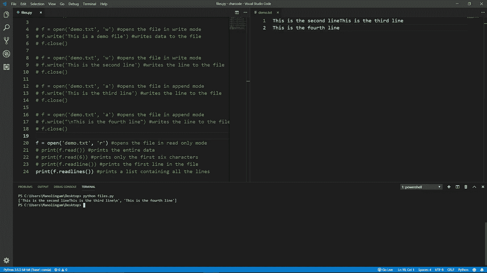
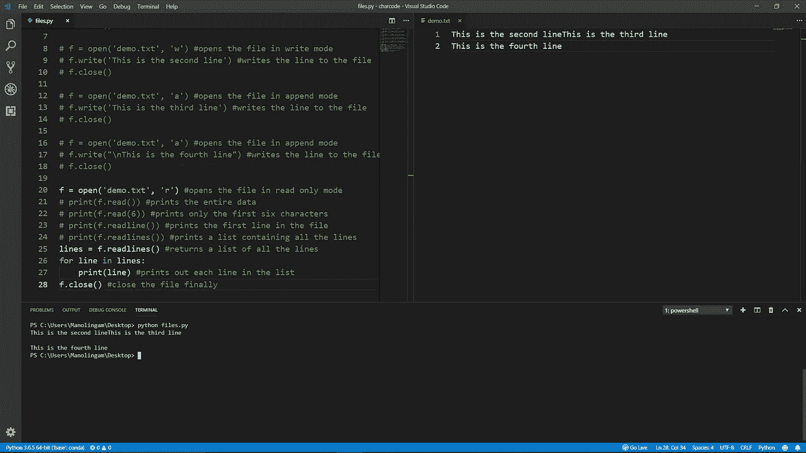

# Python 中的文件处理解释。

> 原文：<https://levelup.gitconnected.com/file-handling-in-python-explained-5db3cda13d23>


作为一名 python 程序员，理解文件处理是非常重要的，因为它是 Python 中最常用的特性之一。

python 中的文件处理有**四个**主要功能，

1.  创建文件。
2.  写入文件。
3.  追加到文件。
4.  读取文件。

Python 内置了处理上述功能的模块。然而，**删除一个文件需要导入一个 python 模块**，所以我们不会在本教程中涉及。

## open()函数

负责创建、写入、追加和读取的一个神奇函数是`open()`函数。这个函数接受两个参数，

1.  文件名
2.  方式

***文件名*** 是我们将要处理的文件的名称。

***模式*** 是指我们要打开文件的方法&有 **4** 基本模式。

1.  **【r】**为读书。
2.  **【w】**为写作。
3.  **【a】**用于追加。
4.  **【x】**进行创作。

对于复杂的文件处理，还有其他的模式，如*“r+”，“w+”*等，但是上面列出的模式足够简单，可以完成大多数文件处理活动。

# 创建文件

用 python 创建一个文件只需要一行代码。

```
f = open('demo.txt', 'x') #creates a file named 'demo.txt'f.close() #close the file
```

如您所见，上面的代码片段创建了一个名为*'****demo . txt****'*的文件，如果它还不存在的话。每当你打开一个文件，你也应该通过调用`f.close()`来关闭它。

> 想象`f.open()`在记事本中打开一个文本文件，而`f.close()`在记事本中关闭该文件。

# **写入文件**

这与上面的方法类似，除了你指定**【w】**为模式，而不是**【x】**。

```
f = open('demo.txt', 'w') #opens the file in write modef.write("This is a line") #writes data to the filef.close()
```

根据文件是否已经存在，此模式有两个功能。

1.  如果**文件已经存在，以写模式打开文件“ ***demo.txt*** ”。**
2.  否则创建一个新文件' ***demo.txt*** '，如果**不存在的话**并以写模式打开它。

而`f.write("This is a line")`在里面写出了台词**“这是一句台词”**。然后`f.close()`关闭文件。

> `f.write()`是一个类似于`f.open()`的函数，它将一些数据作为参数。

# 附加到文件

将模式更改为**“a”，**以追加模式打开文件。

```
f = open('demo.txt', 'a') #opens the file in append modef.write("This is a new line") #writes data to the filef.close()
```

这种模式也有两个功能，取决于文件的存在，类似于写模式。

1.  如果**文件已经存在**，则在追加模式下打开文件“ ***demo.txt*** ”。
2.  如果**不存在**，否则创建一个新文件“ ***demo.txt*** ”，并在追加模式下打开。

并且`f.write("This is a new line")`将行**“这是新行”**附加到任何现有数据。`f.close()`然后关闭它。

> **写入和追加模式有什么区别？**
> 
> 每当文件以写模式打开时，由于文件指针的位置在文件的开头，文件中先前存在的所有内容都将被覆盖。而在追加模式下，文件指针将位于文件的末尾，任何现有的数据都不会被覆盖。

# 读取文件

同样，让我们从`open()`函数开始，

```
f = open('demo.txt', 'r') #opens the file in read modef.read() #reads the entire dataf.readline() #reads the first linef.readlines() #returns a list containing all the linesf.close()
```

与写入和追加不同， ***读取模式不会创建不存在的文件*** *。*

如果文件不存在，Python 返回一个“*文件未找到错误“*”。另外，您 ***无法写入以“读取”模式*** 打开的文件。

有三种读取文件的方式，

*   `read()`读取文件中的全部数据。
*   `readline()`读取文件的第一行。
*   `readlines()`返回文件中包含的所有行的列表。

## 基础知识讲够了，让我们用一个真实的例子来更好地理解文件处理。



文件“demo.txt”现在为空。



文件“demo.txt”包含一行“`**This is a demo file**`”。



文件“demo.txt”被“**覆盖，这是第二行**

*   并且所有那些先前的数据都丢失了，因为 ***写模式*** ***覆盖了其中所有的旧数据。***



*   该文件现在包含新添加的数据以及旧数据，因为它是在**追加模式**下打开的。
*   您还可以看到，我们输入的新数据并没有出现在新的一行中。这是因为文件指针在最后一行的末尾，而不是在新的一行。

> `f.write()`默认情况下，文件指针位于最后一行的最后一个字符之后。



*   现在我们的数据在一个新的行中，这是因为我们在`write()`函数中使用了`\n`。因此，在向文件中写入任何新数据之前，文件指针移动到新的一行。

让我们继续讨论**读取功能**接下来，



打印出文件中的所有数据



打印出第一个**六个**字符，包括**空格**。



打印出文件中**的第一行**。



打印出包含文件中所有行的**列表**。



你可以通过**循环**来打印列表中的每一行。

## **需要记住的一些要点**

*   只有**写入模式**会覆盖文件&中的数据，其他模式不会。
*   `f.write()`写给它的数据。
*   在**写**和**追加模式**下不能读取数据。
*   同样，您不能在**读取模式**下写入数据。
*   追加时，文件指针总是停留在最后一行的最后一个字符的末尾，而不是在新的一行。

暂时就这样了。编码快乐！

[](https://levelup.gitconnected.com)[](https://gitconnected.com/learn/python) [## 学习 Python -最佳 Python 教程(2019) | gitconnected

### 77 大 Python 教程-免费学习 Python。课程由开发人员提交并投票，使您能够…

gitconnected.com](https://gitconnected.com/learn/python)