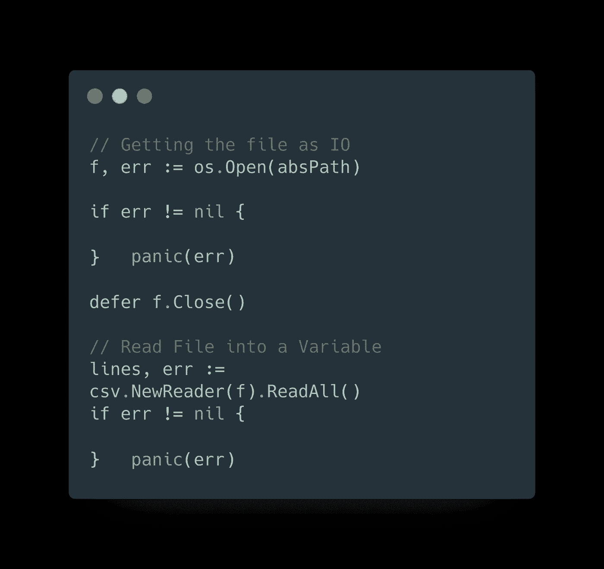
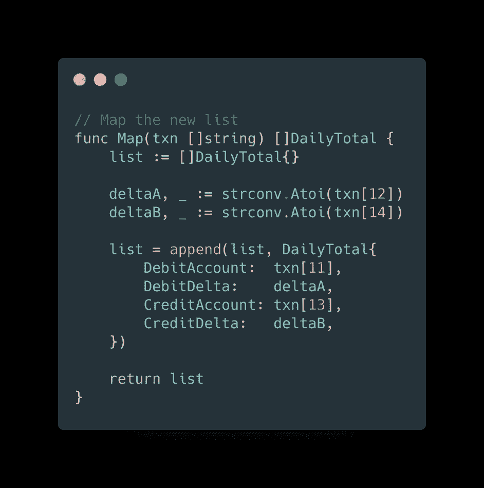
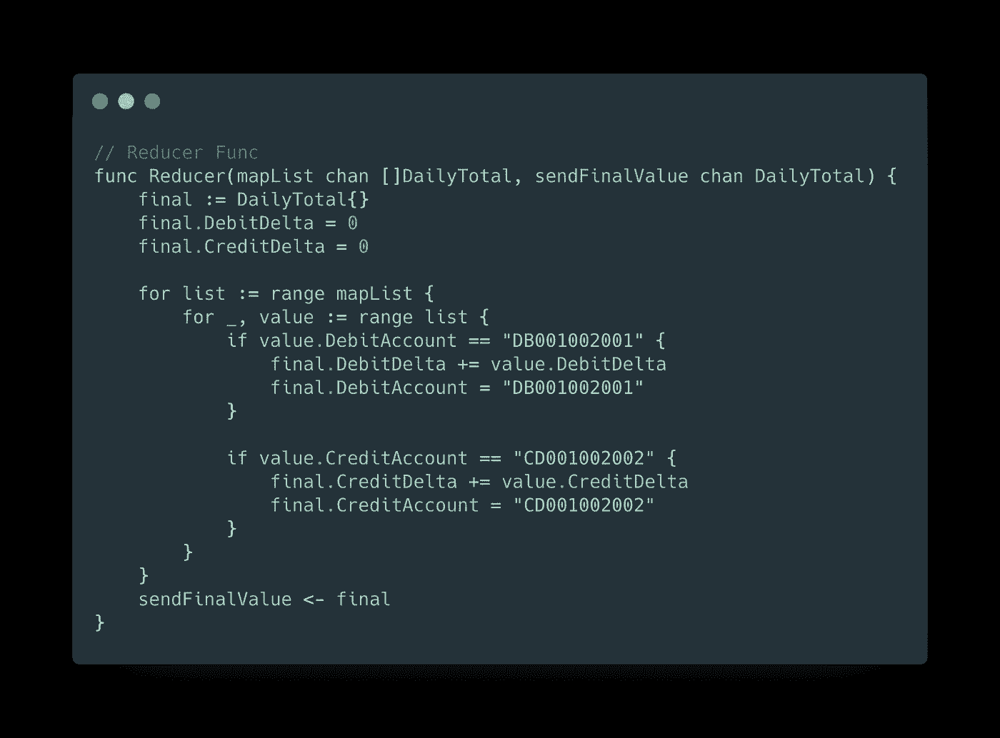
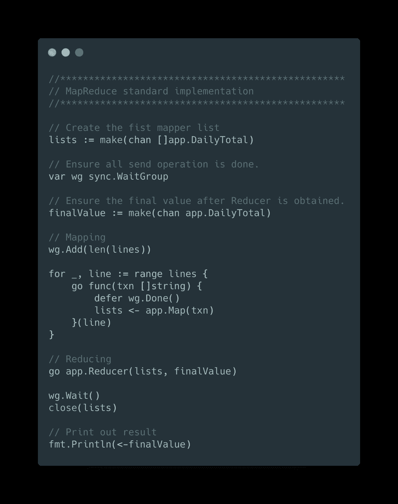
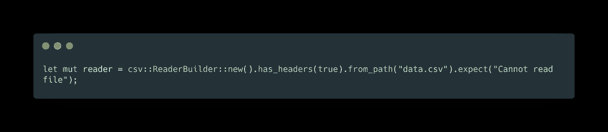
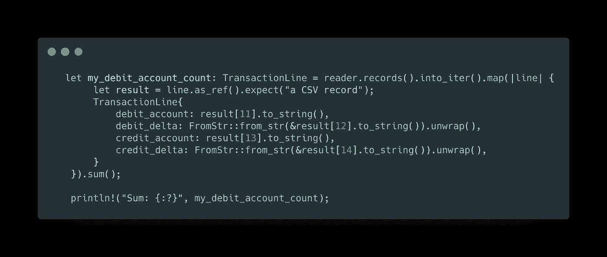
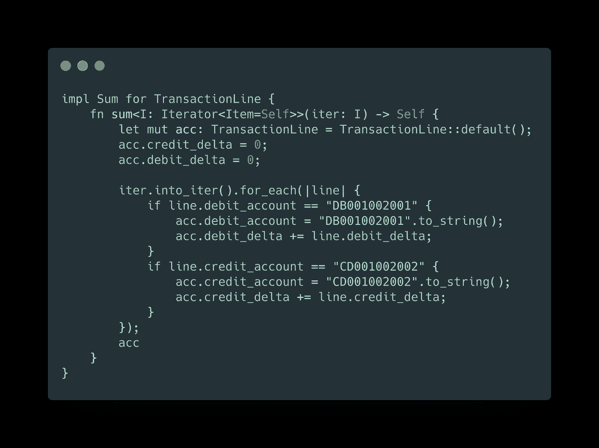

# 文件处理 Go vs. Rust

> 原文：<https://levelup.gitconnected.com/file-processing-go-vs-rust-6e210a3168fd>

## 周末学习和建设

作为我 2020 年新年决心的一部分: ***“走”够了 2019，再来点“锈”，2020。*** 我开始重温一些现实世界的例子来比较 Go 和 Rust。

请不要在这里误解我，我不喜欢谁是最好的谈话或辩论。对我来说，我的一个编程或解决原则是:

> 在现实生活中，没有最好的编程语言/解决方案，最好的，只是基于特定的上下文&时间戳。

Go 和 Rust 都是很棒的编程语言；当你开始工作时，你会发现如此多的乐趣和生产力；然而，在这里我不喜欢做任何理论解释或比较。相反，我将在 Go 和 Rust 中构建两次真实世界的 csv 处理管道。

# 用例

让我们从数据库中提取一个 csv 文件。csv 文件中的内联文本如下所示:

## 这是交易数据，包括每一行

1.  第 11 栏中的借方账号(如 BD001002001)。
2.  第 12 列中的借方增量(如 100)。
3.  第 13 栏中的贷记账号(如 CD001002002)。
4.  第 14 列是贷记的增量(例如-100)。

## 这些要求是:

1.  阅读文件。
2.  统计借方账户合计增量
3.  计算贷方帐户的总增量。

## 常见的解决方案是:并发处理文件。

> 让我们编码

# Go 版本

Go 最好的特性之一是并发性，它基于绿色线程处理并行性。这就是我们将要处理的并发需求。

## 步骤 1-读取文件。

打开文件并在完成处理后关闭它

## 步骤 2 —映射

映射到返回格式。

## 第三步——还原剂

用总和减少输出。

## 第四步——一起

创建通道，初始化等待组，读取行，用 goroutine 处理，一旦所有处理完成，打印结果

1000 行文件需要**3.742808 毫秒**

# 铁锈版本

铁锈打开 CSV

我们将使用 Rust 原生迭代器来处理用例。

Sum 实现。

同样的 1000 行，只用了~ 1.09ms。

# 结论

当我们谈论文件处理、原创时，我无疑会加入进去；然而，一旦我开始围绕 Rust 工作和测试。为了速度和安全，我肯定会用 Rust。