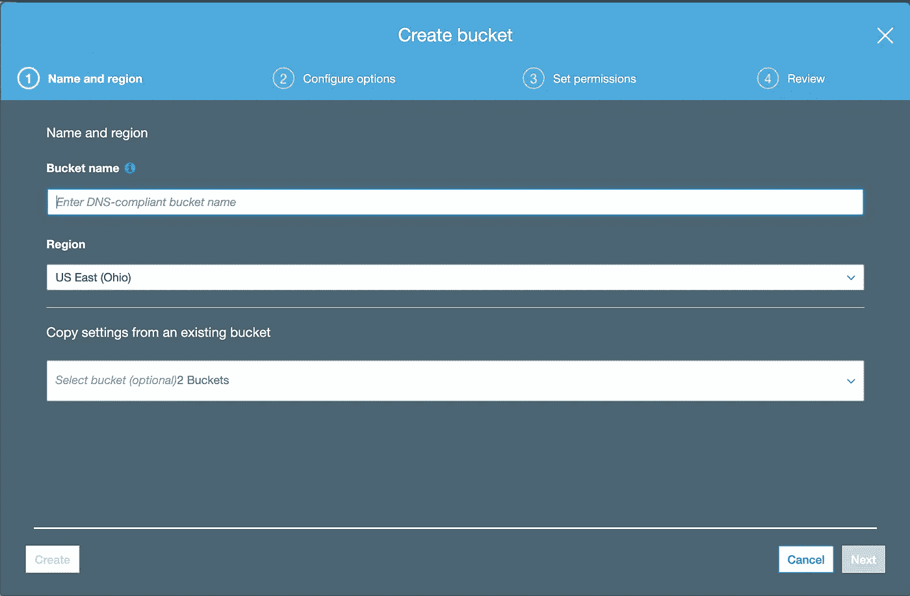
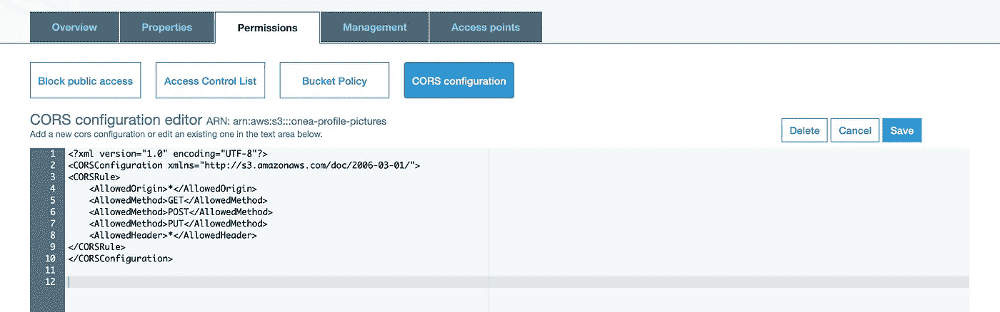
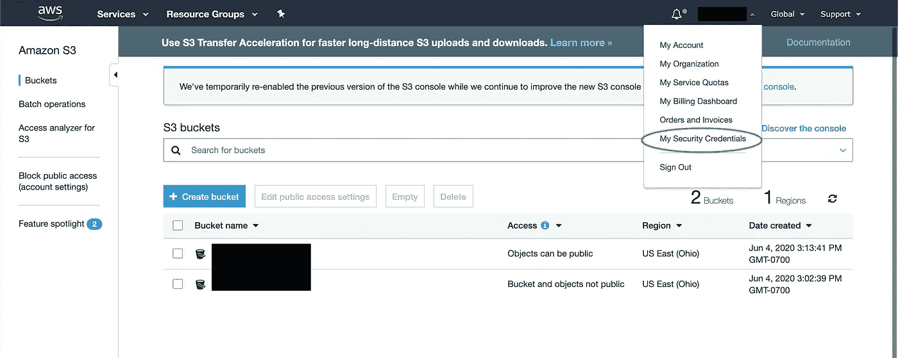
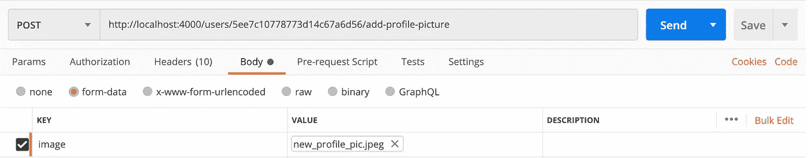

# 文件上传— Express、MongoDB、Multer 和 S3

> 原文：<https://levelup.gitconnected.com/file-upload-express-mongodb-multer-s3-7fad4dfb3789>


亚马逊 S3

> 这篇文章假设您有一个后端服务器，运行 Express + MongoDB Atlas，并希望通过添加上传文件的能力来扩展功能，或者在本例中，添加图像。

我最近犯了一个错误，试图直接上传图片到 MongoDB。沮丧了几个小时后，我联系了一个朋友，他给我指出了正确的方向:亚马逊 S3。

*依附关系:*

`dotenv` : Dotenv 是一个零依赖模块，将环境变量从`.env`文件加载到`[process.env](https://nodejs.org/docs/latest/api/process.html#process_process_env)`

`aws-sdk`:官方 AWS SDK for JavaScript，可用于浏览器和移动设备，或 Node.js 后端

`multer` : Multer 是处理`multipart/form-data`的 node.js 中间件，主要用于上传文件。它写在[勤杂工](https://github.com/mscdex/busboy)的顶部，以获得最大效率。

`multer-s3`:AWS S3 流媒体存储引擎。

```
npm i --save dotenv aws-sdk multer multer-s3
```

## 开始使用:

首先，前往[https://aws.amazon.com/s3/](https://aws.amazon.com/s3/)创建一个账户。设置帐户后，导航至 S3 服务仪表板，以便创建新的存储桶。当您创建新的存储桶时，该名称必须是唯一的，并且采用符合 DNS 的格式。例如:“{ app-name }-个人资料-图片”，您无需进行任何特定设置，只需在设置过程中单击“下一步”即可。



设置 S3 存储桶

创建好 bucket 后，单击 bucket，然后选择 permissions > CORS 配置，并输入以下代码以允许 HTTP 请求。



```
<?xml version="1.0" encoding="UTF-8"?>
<CORSConfiguration ae lh" href="http://s3.amazonaws.com/doc/2006-03-01/" rel="noopener ugc nofollow" target="_blank">http://s3.amazonaws.com/doc/2006-03-01/">
<CORSRule>
    <AllowedOrigin>*</AllowedOrigin>
    <AllowedMethod>GET</AllowedMethod>
    <AllowedMethod>POST</AllowedMethod>
    <AllowedMethod>PUT</AllowedMethod>
    <AllowedHeader>*</AllowedHeader>
</CORSRule>
</CORSConfiguration>
```

太好了。现在我们需要获得访问密钥+秘密。为此，请打开您的帐户下拉菜单并选择“我的安全凭证”



在哪里可以找到访问密钥+机密

在安全凭据控制面板中，打开“访问密钥”部分。在那里，选择“创建新的访问密钥”这将为您的应用程序生成和访问密钥和机密。将密钥+秘密存储在您的计算机本地的 notes 应用程序中。

## **在应用程序中放置密钥+密码时要非常小心。有网络爬虫扫描 GITHUB REPO 的访问密钥+秘密。他们将使用你的帐户，并运行一个标签。**

## 让我们进入您的节点/快速项目。

首先也是最重要的，我想确保你有你的`.env`文件设置，这样你的信用卡和 S3 账户是安全的。在您的`server`或`app`文件中，放置以下代码:

*/服务器*

```
**const cors = require("cors");
app.use(cors());**
```

太好了。设置好之后，在项目目录的根目录下创建一个`.gitignore`文件，并将`.env`放入其中。

现在，创建一个`.env`文件，并将您的访问密钥+密码放入其中:

*。环境*

```
S3_ACCESS_KEY=accesskeyprovided
S3_ACCESS_SECRET=accesssecretprovided
```

现在我们可以开始有趣的事情了。让我们创建一个`services`目录，在这里我们可以放置大部分上传逻辑。在服务中，创建一个名为`ImageUpload.js`的文件

```
mkdir services
cd services
touch ImageUpload.js
cd ..
```

首先让我们加载依赖项并初始化 S3 连接:

*/services/image upload . js*

```
const aws = require("aws-sdk");
const multer = require("multer");
const multerS3 = require("multer-s3");const s3 = new aws.S3();
```

接下来，我们需要通过我们的`.env`变量插入我们的访问凭证:

*/services/image upload . js*

```
aws.config.update({
  secretAccessKey: process.env.S3_ACCESS_SECRET,
  accessKeyId: process.env.S3_ACCESS_KEY,
  region: "us-east-2",
});
```

太好了。现在让我们创建一个验证文件类型的函数:

*/services/imageupload . js*

```
const fileFilter = (req, file, cb) => {
  if (file.mimetype === "image/jpeg" || file.mimetype === "image/png") {
    cb(null, true);
  } else {
    cb(new Error("Invalid file type, only JPEG and PNG is allowed!"), false);
  }
};
```

现在，我们将设置 Multer 来处理图像，并将其发送到 S3 桶。

*/services/image upload . js*

```
const upload = multer({
  fileFilter,
  storage: multerS3({
    acl: "public-read",
    s3,
    bucket: **{your-bucket-name}**,
    metadata: function (req, file, cb) {
      cb(null, { fieldName: "TESTING_METADATA" });
    },
    key: function (req, file, cb) {
      cb(null, Date.now().toString());
    },
  }),
});
```

在设置路线之前，确保您导出了`upload`功能。下面是完整的代码。

*/services/image upload . js*

```
const aws = require("aws-sdk");
const multer = require("multer");
const multerS3 = require("multer-s3");

const s3 = new aws.S3();

aws.config.update({
  secretAccessKey: process.env.S3_SECRET,
  accessKeyId: process.env.S3_ACCESS_KEY,
  region: "us-east-2",
});

const fileFilter = (req, file, cb) => {
  if (file.mimetype === "image/jpeg" || file.mimetype === "image/png") {
    cb(null, true);
  } else {
    cb(new Error("Invalid file type, only JPEG and PNG is allowed!"), false);
  }
};

const upload = multer({
  fileFilter,
  storage: multerS3({
    acl: "public-read",
    s3,
    bucket: **{your-bucket-name}**,
    metadata: function (req, file, cb) {
      cb(null, { fieldName: "TESTING_METADATA" });
    },
    key: function (req, file, cb) {
      cb(null, Date.now().toString());
    },
  }),
});

**module.exports = upload;**
```

对于我的应用程序，我想通过允许用户上传个人资料图片来扩展功能。因此，用户将向路由`/users/{id}/add-profile-picture`发送一个请求。首先，图像被上传到 S3，S3 发送一个包含照片 URL 的响应，然后我们使用[:id]参数找到使用 Mongo 的用户，然后将文件位置存储在用户的文档中。

*/路线/用户*

```
const upload = require("../services/ImageUpload");
const singleUpload = upload.single("image");

router.post("/:id/add-profile-picture", function (req, res) {
  const uid = req.params.id;

  singleUpload(req, res, function (err) {
    if (err) {
      return res.json({
        success: false,
        errors: {
          title: "Image Upload Error",
          detail: err.message,
          error: err,
        },
      });
    }

    let update = { profilePicture: req.file.location };

    User.findByIdAndUpdate(uid, update, { new: true })
      .then((user) => res.status(200).json({ success: true, user: user }))
      .catch((err) => res.status(400).json({ success: false, error: err }));
  });
});
```

有了路由设置，您可以使用 Postman 来测试它。启动您的服务器，前往邮递员，输入相应的路线，选择表单数据，并从您的计算机中选择一个图像。确保将键设置为`image`并点击发送。



如果你有兴趣学习如何从 React 前端上传图片，请查看我的另一篇文章:

[https://level up . git connected . com/react-uploading-images-a 224 E0 FB 4561](/react-uploading-images-a224e0fb4561)