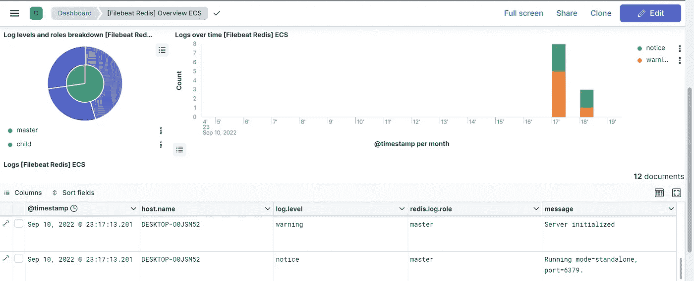

# Filebeat:使用 Redis 模块将日志发送到本地 Elasticsearch

> 原文：<https://levelup.gitconnected.com/filebeat-ship-logs-to-local-elasticsearch-using-the-redis-module-1cd67b357dc0>


由[法尔扎德](https://unsplash.com/@euwars?utm_source=unsplash&utm_medium=referral&utm_content=creditCopyText)在 [Unsplash](https://unsplash.com/s/photos/monitor-data?utm_source=unsplash&utm_medium=referral&utm_content=creditCopyText) 上拍摄的照片

大家好吗😁，欢迎回到这个弹性堆栈学习系列。今天，我们继续 Filebeat 和模块的冒险。

正如前面所看到的，Beats 家族的主要特点是简单，其背后的想法是减少用户的实现和编码时间，同时尽可能最简单和最有效地将数据传输到 Elasticsearch 或任何其他输出。

弹性堆栈通过引入模块来满足这一需求。**模块**是可供用户使用的可重用扩展，用于管理日志(如 MySQL 数据库日志)的解析，然后将它们发送到配置好的目的地。

模块的根本好处是它们可以处理几乎所有众所周知的技术，包括虚拟化、网络、消息传递和数据库。此外，还有社区定制的扩展，进一步扩展了可用模块库。

现在让我们通过一个例子来看看如何实现所有这些胡言乱语。
在本例中，我们将解析 Redis 数据库中的日志，并将它们发送到 Elasticsearch。

我们必须做到以下几点:

*   激活一个知道如何管理 Redis 日志的模块
*   更新我们的 Filebeat 配置
*   重启我们的代理

一旦关于日志的所有信息都在 Elasticsearch 上，我们也应该可以在 Kibana 上使用其他仪表板。

在实现了本文中[所解释的配置之后，如果你还没有完成，我强烈建议你参考一下，我们将首先激活 Redis 模块。](https://medium.com/@mhdabdel151/ship-logs-to-local-elasticsearch-using-filebeat-36e7fe1bff83)

通过启动以下命令，您将能够看到可供您使用的模块列表:

```
./filebeat modules list
```

如果您看一下 Filebeat 文件夹结构，您会注意到一个名为`modules.d`的文件夹，其中有许多预构建的模块可供您使用。我们要使用的模块在最底部。找到并打开`redis.yml.disabled`文件，您会看到没有太多关于如何解析日志的信息，更多的是关于在哪里寻找日志文件。这里有两种方法可供我们使用， *Main logs* 用于写入磁盘的日志，S *low logs* 用于通过 Redis API 检索日志。

我们不会干预解析数据的方式，模块会处理它，这里要做的只是配置我们的*浏览者*，也就是说，通知*变量路径*字段中的日志的访问路径(*取决于您的操作系统，这里我们在 Windows* 上工作)，并通过将*启用*设置为*真*来启用模块。

```
- module: redis # Main logs
  log:
    enabled: true
    var.paths: ['C:\Users\elastic\demo\redis-server-1.log']
```

注意:包含 Redis 数据库返回的日志的文件已经放在上述位置。您可以根据本文将 Redis 作为 docker 容器运行，并从生成的日志中创建该文件。

完成后，我们现在需要在 Filebeat 上激活那个模块。您始终可以手动执行此操作，但最简单、最安全的方法无疑是运行以下命令:

```
./filebeat module enable redis
```

该模块将被激活，并知道在哪里可以找到日志。您会注意到上面修改过的文件已经将其名称改为`redis.yml` ,让我们再次运行命令来创建所有的资源和工件:

```
./filebeat setup
```

一旦设置完成，让我们运行 Filebeat:

```
./filebeat -e
```

在日志中，我们可以看到采集器被实例化，这并不奇怪，我们需要的是一行代码，告诉我们已经为 Redis 日志实例化了一个新的采集器。我们来看看这是不是基巴纳的严重病例。在*仪表板选项卡*中，转到*搜索栏*，键入 *Redis* 并打开生成的仪表板。在表格的最底部，显示了我们的日志。



今天到此为止，感谢阅读，请随时查看关于此主题的[官方文档](https://www.elastic.co/guide/en/beats/filebeat/current/filebeat-installation-configuration.html#enable-modules)以了解更多详细信息。如果您对本文有任何问题或评论，请在下面留下您的评论。

我们下次再见，看更多的帖子🚀。

阿卜杜尔-巴吉