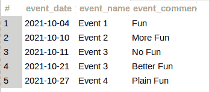
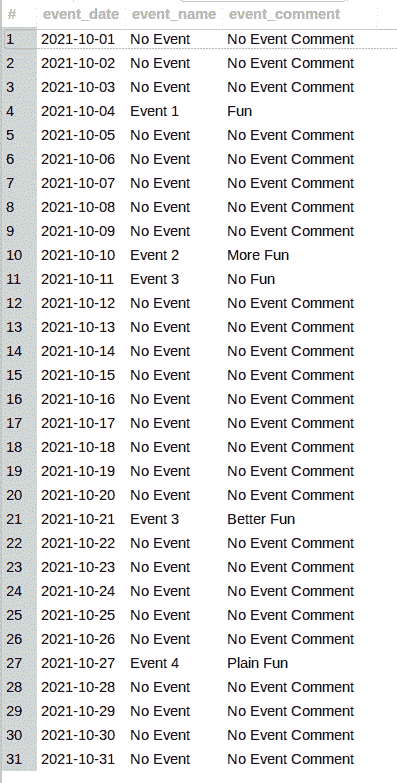
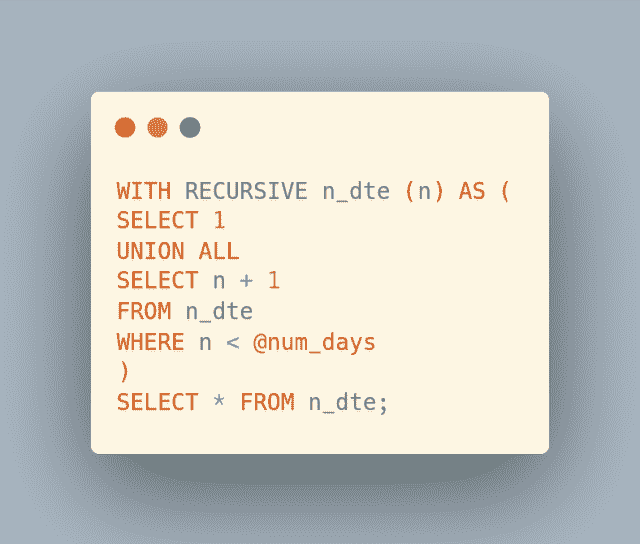
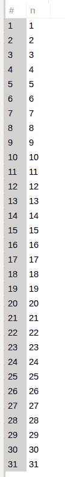
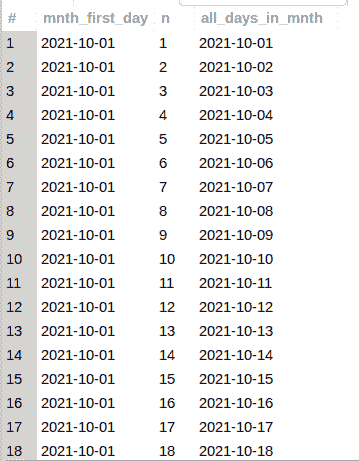

# 使用 MySQL 填充缺失的日期范围

> 原文：<https://levelup.gitconnected.com/fill-in-missing-date-ranges-using-mysql-128978ffed06>

作为一名开发人员，我总是在尝试不同的编程练习，以便学习和成长。我最喜欢的学习练习之一是从一种 SQL 方言到另一种 SQL 方言的*移植*，因为它们都有各自的*特性*。不得不*拼凑*或*镜像*不存在的功能确实挑战了我的思维，因此促进了我的查询技能的增长和提高。在这篇文章中，我分享了使用 MySQL 为我第一次了解/发现的使用 Oracle SQL 和特定实现特性的查询复制相同的查询结果…


图片来自 [Pixabay](https://pixabay.com/?utm_source=link-attribution&utm_medium=referral&utm_campaign=image&utm_content=1847346) 的 [José Augusto Camargo](https://pixabay.com/users/jcamargo-2826093/?utm_source=link-attribution&utm_medium=referral&utm_campaign=image&utm_content=1847346)

自我推销:

如果你喜欢这里写的内容，尽一切办法，把这个博客和你最喜欢的帖子分享给其他可能从中受益或喜欢它的人。因为咖啡是我最喜欢的饮料，如果你愿意，你甚至可以给我买一杯！

***OpenLampTech*** 是面向 PHP 和 MySQL 开发者的简讯。[今天就订阅](http://openlamptech.substack.com)你策划和原创的 PHP/MySQL 内容。

## 信用和来源

我从这个 YouTube 视频中找到了很大的灵感、学习、理解和这篇博文的想法

## 抽样资料

我们想要的最终查询结果基于一个表中的当前数据，“important_events”包含以下虚构数据:

```
SELECT * FROM important_events;
```



请注意，同一个月份和年份中有 5 个随机日期，带有事件名称和事件注释。目标是提供整个月中每天的结果，包括在表“important_events”中没有行的那些天。

你是[中](http://medium.com/)成员吗？如果是这样的话，[每次我发表一篇博客文章时都会收到一封电子邮件通知](https://parabollus.medium.com/subscribe)如果你更喜欢中型平台的话。不是会员？别担心！使用[我的注册链接](https://parabollus.medium.com/membership)(我会向你收取佣金，无需额外费用)并加入。我真的很喜欢阅读所有伟大的内容，我知道你也会！！！

最终结果应该如下所示:



## 所需信息

为了检索查询结果，我们需要以下信息:

*   基于“事件日期”列中的月份值的月份的第一天
*   基于“事件日期”列中的月份值的月份的最后一天
*   该月的总天数基于“事件日期”列中的月份值

在确定相应月份的第一天和最后一天时，我们应该使用当前存储在“重要事件”表中的最小和最大“事件日期”值。我们可以使用针对“event_date”列的`MIN()`和`MAX()`聚合函数轻松获得这些值:


使用最小和最大日期值，我们使用特定的 MySQL 日期函数计算该月的第一天和最后一天以及目标月份的总天数。该查询可能如下例所示:


MySQL 确实有一个本地的`LAST_DAY()`日期函数，我们用它来获取一个月的最后一天。然而，MySQL 中没有 FIRST_DAY() date 函数(在编写本文时),所以我们必须做一点额外的工作*并使用下面的表达式计算它:*

如果你愿意支持我的博客和内容，请考虑在我的 [**小费罐**](https://digitalowlsprose.ck.page/products/appreciation-support) 里扔点零钱。非常感谢！

## 递归公用表表达式

Oracle SQL 有一个 **CONNECT BY** 子句，但是在 MySQL 中没有类似的本机子句。为了*复制*这个功能，对于这个特定的查询，我们可以使用一个递归公共表表达式(CTE)。

为了更容易处理，我将使用关键字`SET`将一个月中的天数存储在一个会话变量中:


然后我可以在递归 CTE 中使用`‘@num_days’`变量，如下所示:



“n _ DTE”CTE 返回一组递增的`INTEGER`值，等于目标月份的总天数(基本上每天一行):



我们现在可以将每个单独的递增值`INTEGER`添加到月日期值的第一天，并返回该月每一天的日历日。生成此信息的查询可能如下例所示:

***OpenLampTech*** 是面向 PHP 和 MySQL 开发者的简讯。[今天就订阅](http://openlamptech.substack.com)你策划和原创的 PHP/MySQL 内容。

为了提高可读性，我限制了输出行，如下图所示:



## 多个公共表表达式

通过用逗号分隔，我们可以在同一个`WITH`子句中有多个 CTE，所以除了已经建立的‘n _ DTE’之外，我将把这个查询作为它自己的 CTE:

合在一起，我们的两个 CTE 看起来像这样:


## 左连接-最终结果集

现在，我们只需将“所有 _ 月 _ 日”CTE 添加到“重要 _ 事件”表的两个日期列中:

我们得到了想要的最终查询结果:


我不会声称这是解决 MySQL 中这个特殊查询的最好的，或者唯一的，或者最*高效的*方法。只知道这是我如何找到这些数据的。我很想知道您的想法、建议和反馈。如果你想使用不同的方法或其他 MySQL 功能，请在下面的评论中分享，这样我和其他读者就可以学习和扩展我们自己的*查询能力*。

如果您有任何问题或看到代码中的任何错误，请通过评论让我知道。建设性的意见有助于我提供准确的博客帖子，我非常感激。感谢您的阅读！

喜欢你读过的？看到什么不正确的吗？请在下面评论，感谢阅读！！！

# 行动的号召！

感谢你花时间阅读这篇文章。我真心希望你发现了一些有趣和有启发性的东西。请在这里与你认识的其他人分享你的发现，他们也会从中获得同样的价值。

访问 [Portfolio-Projects 页面](https://wp.me/P28ctb-3KD)查看我为客户完成的博客帖子/技术写作。

我真的很喜欢喝咖啡。帮我弄一个！！！

要在最新的博客文章发表时收到来自本博客(“数字猫头鹰散文”)的电子邮件通知(绝不是垃圾邮件)，请点击“点击订阅！”按钮在首页的侧边栏！(如有任何问题，请随时查看 [Digital Owl 的散文隐私政策页面](https://wp.me/P28ctb-3gI):电子邮件更新、选择加入、选择退出、联系表格等……)

请务必访问[“最佳”](https://joshuaotwell.com/where-blog_post-in-digital-owls-prose-best-of/)页面，收集我的最佳博文。

作为一名 SQL 开发人员和博客作者，Josh Otwell 热衷于学习和成长。其他最喜欢的活动是让他埋头于一本好书、一篇文章或 Linux 命令行。其中，他喜欢桌面 RPG 游戏，阅读奇幻小说，并与妻子和两个女儿共度时光。

免责声明:本文中的例子是关于如何实现类似结果的假设。它们不是最好的解决方案。所提供的大多数(如果不是全部)示例都是在个人发展/学习工作站环境中执行的，不应被视为生产质量或就绪。您的特定目标和需求可能会有所不同。使用那些最有利于你的需求和目标的实践。观点是我自己的。

***OpenLampTech*** 是面向 PHP 和 MySQL 开发者的简讯。[今天就订阅](http://openlamptech.substack.com)你策划和原创的 PHP/MySQL 内容。

*有何贵干？*

*   *你想开一个博客吗？我用 WordPress 写博客。让我们都在提供的计划上省钱。💸*
*   *从[我的 Etsy 商店](https://www.etsy.com/shop/digitalowlsprose/)获取一个 Gmail HTML 电子邮件签名模板，让您的电子邮件显得与众不同。✉️*
*   *需要托管你的下一个网络应用程序或 WordPress 网站吗？我使用并强烈推荐 [Hostinger](https://www.hostg.xyz/aff_c?offer_id=6&aff_id=94641) 。他们有很好的价格和服务。*
*   *我喜欢每天早上在你的收件箱里阅读 Refind: *网络的精髓。免费订阅*。通过我的推荐链接为你自己[注册，帮助我获得高级订阅。](https://refind.com/joshua-otwell?invite=5440c95e39)*
*   *抓住一个[免费的手机*创作者*壁纸](https://click.convertkit-mail4.com/d0uvkov9k4s0h22640am/p8hehqu9xxnm2zbr/aHR0cHM6Ly9zcGFya2xwLmNvL2pvc2h1YWMwM2U2Mw==)包。*

****披露*** :本帖部分服务和产品链接为附属链接。在没有额外费用给你，你应该通过点击其中一个购买，我会收到佣金。*

**原载于 2022 年 1 月 19 日*[*【https://joshuaotwell.com】*](https://joshuaotwell.com/fill-in-missing-date-ranges-using-mysql/)*。**