# 为 AdMob 用户填写 App Store Connect 中的应用隐私部分

> 原文：<https://levelup.gitconnected.com/filling-out-the-app-privacy-section-in-app-store-connect-for-admob-users-bca0768ad86e>

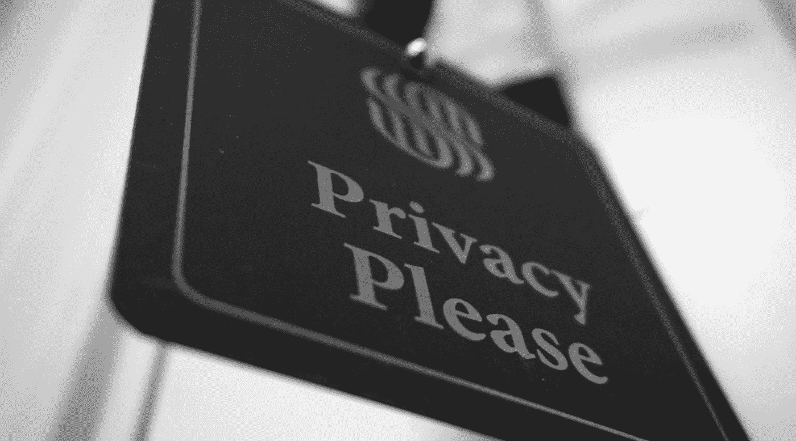

杰森·登特在 [Unsplash](https://unsplash.com?utm_source=medium&utm_medium=referral) 上拍摄的照片

## 针对使用 AdMob SDK 的开发人员的新应用隐私调查问卷的逐步演练

如果你最近访问了 App Store Connect，无论是发布新应用还是推送更新，你可能已经注意到应用部分导航选项的新增加…

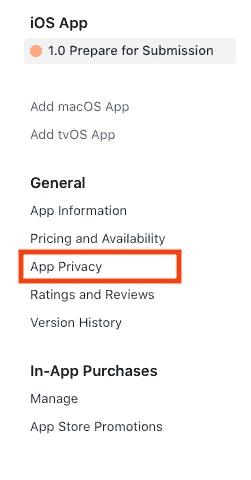

截至 12 月 8 日，开发人员将被要求完成这一新的应用程序隐私部分，该部分为用户提供了关于应用程序收集的特定数据类型以及这些数据的用途的更详细信息。和许多开发者一样，我在自己的一些应用中使用 Google AdMob 来获得广告收入。这意味着我需要将 AdMob 执行的数据收集包括在我在应用程序隐私部分提供的信息中，即使我自己没有从应用程序中收集任何数据。

AdMob 文档向[提供了此](https://developers.google.com/admob/ios/data-disclosure)通知，告知用户需要填写应用隐私调查问卷以反映其数据收集情况，包括对 SDK 收集的数据及其使用方式的以下描述:

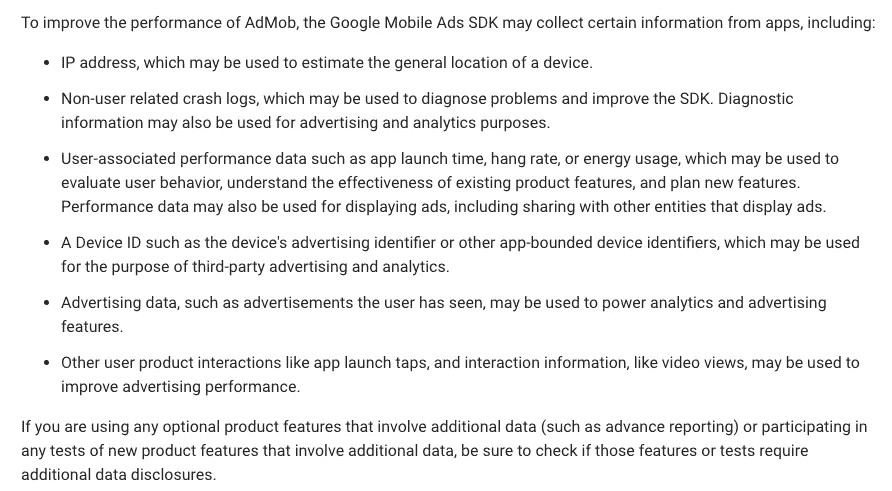

现在，我们的任务是将这一问题转化为 App Store Connect 调查问卷的正确答案——让我们开始吧！

当您首次点击左侧导航菜单中的 App Privacy 时，您会看到以下消息:

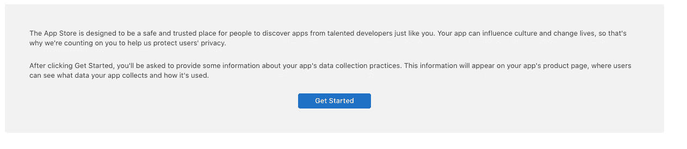

点击“开始”将启动调查问卷，让我们继续我们的旅程，让用户了解最新信息。第一个问题询问您是否正在从应用程序收集数据。如果您使用的是 AdMob SDK，则需要回答“是”，因为它确实会收集有关用户的数据。AdMob 是第二点中提到的“第三方合作伙伴”之一:

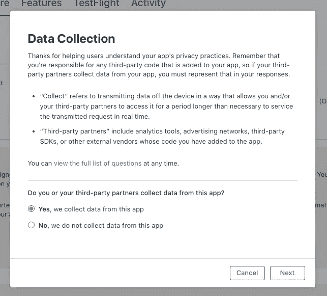

接下来，您将看到一个可能的数据类型列表，以便更具体地指出您正在收集的数据。如果您或 AdMob 正在收集列出的任何数据类型，您需要选中它旁边的框，除非它符合以下可选公开的任何标准:

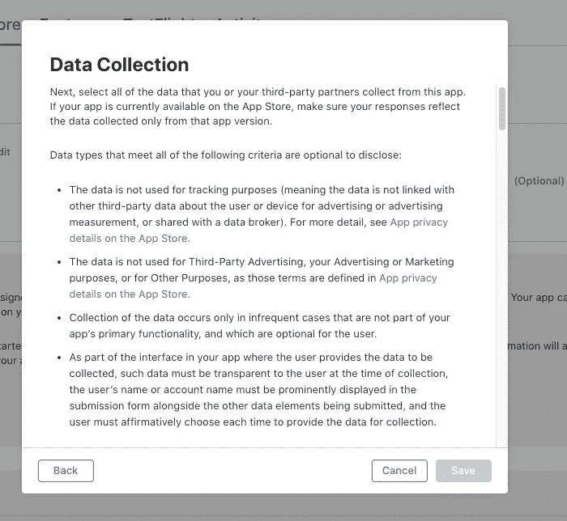

由于 AdMob 将收集的数据用于第三方广告和跟踪，因此它是非可选的。现在，通过 AdMob 提供的数据收集信息并填写数据类型列表！下面显示了需要公开的每种收集的数据类型，以及 AdMob 文档中描述它的相应行。

## 地点:课程地点

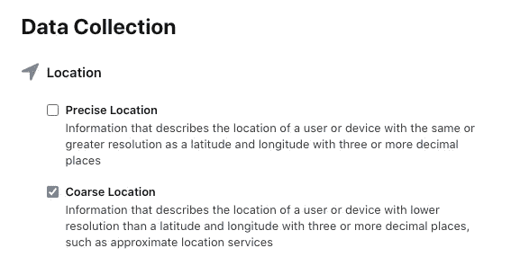

调查问题

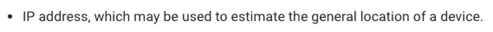

AdMob 文档

## 标识符:设备 ID

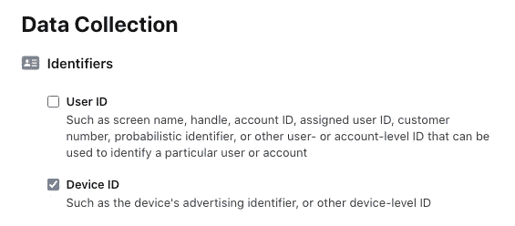

调查问题

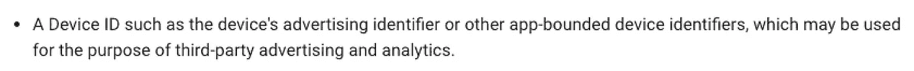

AdMob 文档

## 使用数据:产品互动和广告数据

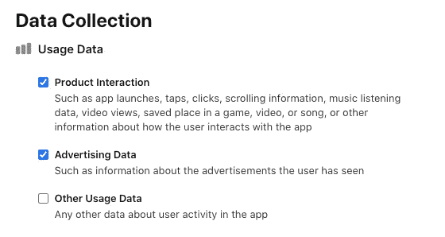

调查问题

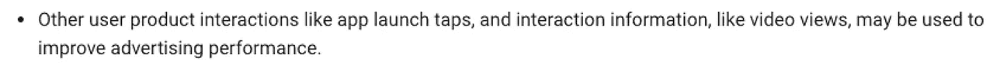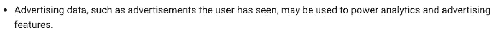

AdMob 文档

## 诊断:崩溃数据和性能数据

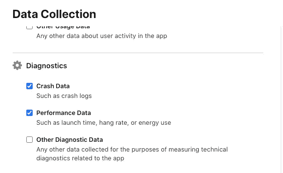

调查问题

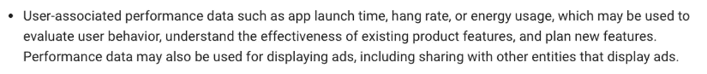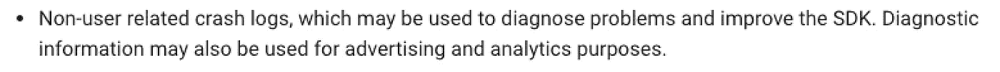

AdMob 文档

上面没有包括的数据类型可以不检查(假设您不是自己或通过不同的第三方收集它们)。完成本次调查后，应用隐私页面将向您显示您表示收集的数据类型的摘要，以及“设置”每种数据类型的选项，您需要进一步指定数据是否用于识别或跟踪用户。

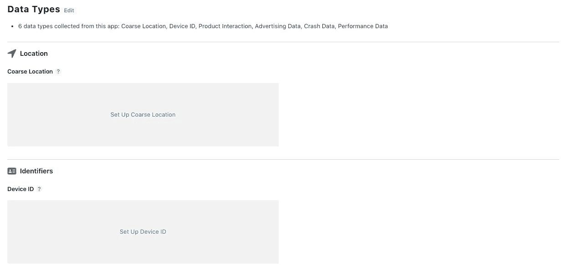

完成初始数据收集调查后，App Store Connect 中的应用隐私页面

针对每种数据类型的设置将包括三个问题，涉及:

1.您或您的第三方合作伙伴如何使用这些数据(如广告、分析等)
2。所收集的数据是否与用户相关联
3。数据是否用于跟踪

AdMob 文档指出，它收集的所有数据类型都可以用于第三方广告和分析目的，从而引导我们回答第一个问题。AdMob 文档指出的唯一“与用户无关”的数据是它收集的崩溃日志信息，这决定了我们对第二个问题的回答。最后，App Store Connect 明确声明，访问 IDFA 意味着你必须对关于追踪的第三个问题回答*是*。

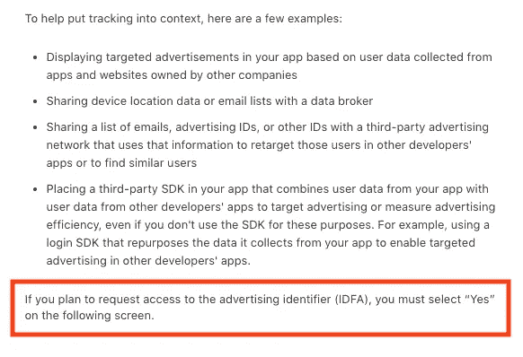

使用 IDFA 是追踪

除非你已经将 AdMob SDK 配置为不提供个性化广告，否则你必须对第三个问题回答*是*。这为我们提供了以下关于*设置*调查的答案:

**课程位置** :
1。数据用途:第三方广告、分析
2。链接到用户:是
3。跟踪:是

**设备 Id** :
1。数据使用:第三方广告，分析
2。链接到用户:是
3。跟踪:是

**产品交互** :
1。数据使用:第三方广告，分析
2。链接到用户:是
3。跟踪:是

**广告数据** :
1。数据用途:第三方广告，分析
2。链接到用户:是
3。跟踪:是

**崩溃数据** :
1。数据使用:第三方广告、分析
2。链接到用户:否
3。跟踪:是

**性能数据** :
1。数据使用:第三方广告，分析
2。链接到用户:是
3。跟踪:是

您现在提供给用户的所有信息都将出现在 App Store 的产品信息页面上，如下图所示:

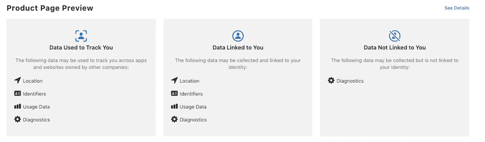

通过点击*更多详细信息*，用户将能够看到更精细的信息，例如关于性能的诊断可能是用户链接的，但是与崩溃日志相关的诊断不是用户链接的。

至此，您已经完成了应用程序隐私部分的数据收集披露要求！一旦你在顶部包含了隐私政策链接，应用隐私将有提交所需的最低限度。

我希望这有助于您了解 App Store Connect 的最新功能！对于那些一直幸福地利用广告收入流，同时试图避免与用户进行“不舒服”的隐私讨论的应用来说，这无疑是一个变化；但这代表着向确保用户真正知情并控制其隐私迈出了积极的一步。

*我绝不是法律或隐私专家，所以请知道，以上纯粹基于我对所有可用信息的最佳解读。*

**资源** 苹果[文档](https://developer.apple.com/app-store/app-privacy-details/#linked-data)关于完成 App 隐私部分
AdMob [文档](https://developers.google.com/admob/ios/data-disclosure)关于数据收集披露
AdMob 通用[文档](https://developers.google.com/admob/ios/ios14)关于准备 iOS 14+隐私变化