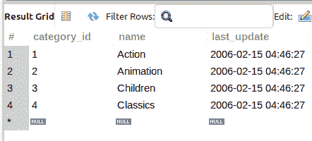
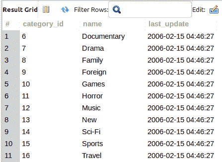
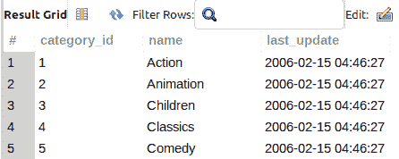
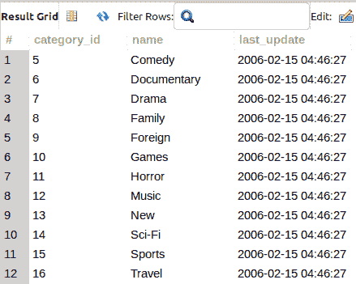

# 使用小于和大于比较筛选 MySQL WHERE 子句中的数据

> 原文：<https://levelup.gitconnected.com/filter-data-in-the-mysql-where-clause-with-less-than-and-greater-than-comparisons-da0adc10b941>

虽然等式和不等式过滤条件很常见，但很多时候您希望根据小于或大于另一个值的值来过滤`FROM`子句表行。MySQL(以及一般的 SQL)支持小于(`<`)和大于(`>`)操作符。继续阅读，并查看每个例子…

当您[订阅 ***OpenLampTech*** 时事通讯](http://openlamptech.substack.com)时，会收到一本我的电子书*《给每个人的 10 个 MySQL 技巧】*。


图片由 [준원 서](https://pixabay.com/users/joshua_seajw92-6153261/?utm_source=link-attribution&utm_medium=referral&utm_campaign=image&utm_content=3999637) 来自 [Pixabay](https://pixabay.com//?utm_source=link-attribution&utm_medium=referral&utm_campaign=image&utm_content=3999637)

你可以考虑这些类型的过滤条件的另一种方式是作为一个基于*范围的*过滤器(在某种意义上)。这就是小于和大于条件过滤器操作符的用武之地。

## 带有数字数据的小于和大于比较运算符

在下面的查询中，我们筛选“category_id”列值小于 5 的任何行:

```
SELECT *
FROM category
WHERE category_id < 5;
```



在查询结果中有 4 行*通过*条件'`category_id < 5`'的条件并被返回。

相反，如果您只想查看“category_id”列值大于 5 的行，请在`WHERE`子句条件过滤器中使用大于比较运算符(>):

```
SELECT *
FROM category
WHERE category_id > 5;
```



通过在 ***OpenLampTech*** 时事通讯中投放价格合理的分类广告，让您的品牌、产品或服务得到应有的关注[。谢谢大家的支持！](https://ko-fi.com/s/7dfe9ce108)

## 小于或等于且大于或等于

您可能已经注意到，在前面的示例查询中，结果不包括条件过滤器的边界。例如，条件过滤器'`category_id < 5`'不包括任何实际' category_id '值为 5 的行。只有那些小于 5 的。

若要包含筛选条件的实际界限，请相应地使用“或等于”比较运算符。

在以下查询中，条件筛选器'`category_id <= 5`'将筛选' category_id '小于 5 的任何行，以及' category_id '等于 5 的那些行(如果有):

```
SELECT *
FROM category
WHERE category_id <= 5;
```



“等于”与“小于”或“等于”示例一样，适用于大于比较:

```
SELECT *
FROM category
WHERE category_id >= 5;
```



请务必访问类似的 MySQL 初学者系列文章:

*   [MySQL SELECT 和 WHERE 子句列存在](https://joshuaotwell.com/mysql-select-and-where-clause-column-existence/)
*   [SELECT 子句查询— MySQL 初学者基础系列。](https://joshuaotwell.com/select-clause-queries-mysql-beginner-basics-series/)
*   [用 WHERE 子句限制行数— MySQL 初学者系列](https://joshuaotwell.com/limit-rows-with-the-where-clause-mysql-beginner-series/)

喜欢你读过的？看到什么不正确的吗？请在下面评论，感谢阅读！！！

# 行动的号召！

感谢你花时间阅读这篇文章。我真心希望你发现了一些有趣和有启发性的东西。请在这里与你认识的其他人分享你的发现，他们也会从中获得同样的价值。

访问[投资组合-项目页面](https://wp.me/P28ctb-3KD)查看我为客户完成的博客帖子/技术写作。

[**咖啡是最好的饮料！**](https://ko-fi.com/joshlovescoffee)

要在最新的博客文章发表时收到来自本博客(“数字猫头鹰散文”)的电子邮件通知(绝不是垃圾邮件)，请点击“点击订阅！”按钮在首页的侧边栏！(如有任何问题，请随时查看 [Digital Owl 的散文隐私政策页面](https://wp.me/P28ctb-3gI):电子邮件更新、选择加入、选择退出、联系方式等……)

请务必访问[“最佳”](https://joshuaotwell.com/where-blog_post-in-digital-owls-prose-best-of/)页面，收集我的最佳博文。

[Josh Otwell](https://joshuaotwell.com/about/) 作为一名 SQL 开发人员和博客作者，他热衷于学习和成长。其他最喜欢的活动是让他埋头于一本好书、一篇文章或 Linux 命令行。其中，他喜欢桌面 RPG 游戏，阅读奇幻小说，并与妻子和两个女儿共度时光。

免责声明:本文中的例子是关于如何实现类似结果的假设。它们不是最好的解决方案。所提供的大多数(如果不是全部)示例都是在个人发展/学习工作站环境中执行的，不应被视为生产质量或就绪。您的特定目标和需求可能会有所不同。使用那些最有利于你的需求和目标的实践。观点是我自己的。

*有何贵干？*

*   *免费 [MySQL 查询语法真言 PDF](https://ko-fi.com/s/3631fc7d00) 备忘单。记住这个咒语的查询语法顺序。*
*   *你想开一个博客吗？我用 WordPress 写博客。让我们都在提供的计划上省钱。*
*   *通过在 ***OpenLampTech*** 时事通讯中投放价格合理的分类广告，让您的品牌、产品或服务获得所需的关注[。](https://ko-fi.com/s/7dfe9ce108)*
*   *需要托管你的下一个网络应用程序或 WordPress 网站吗？我使用并强烈推荐 [Hostinger](https://www.hostg.xyz/aff_c?offer_id=6&aff_id=94641) 。他们有很好的价格和服务。*
*   *[作为一名自学成才的开发人员，我逐渐认识到的 5 个事实](https://ko-fi.com/post/5-Truths-Ive-Come-To-Realize-As-a-Self-taught-Dev-R5R2BL9J6)*
*   *今天就在我的 [Kofi 商店](https://ko-fi.com/joshlovescoffee#)发现优质的 MySQL 学习资料吧！*

****披露*** :本帖中的一些服务和产品链接是附属链接。在没有额外费用给你，你应该通过点击其中一个购买，我会收到佣金。*

***PHP 和 MySQL 开发人员简讯***

*当您[订阅 ***OpenLampTech*** 简讯](http://openlamptech.substack.com)时，收到一本我的电子书，*《给每个人的 10 个 MySQL 技巧》****绝对免费*** 。*

*在 ***OpenLampTech*** 时事通讯中，通过可负担的分类广告投放，让您的品牌、产品或服务获得其所需的关注度[。谢谢大家的支持！](https://ko-fi.com/s/7dfe9ce108)*

**原载于 2022 年 8 月 17 日*[*【https://joshuaotwell.com】*](https://joshuaotwell.com/filter-data-in-the-mysql-where-clause-with-less-than-and-greater-than-comparisons/)*。**