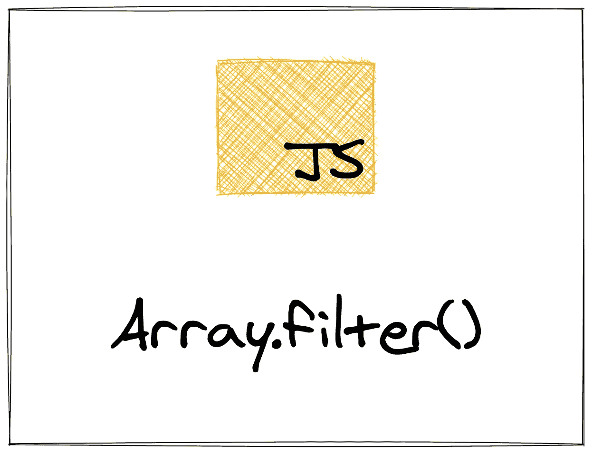
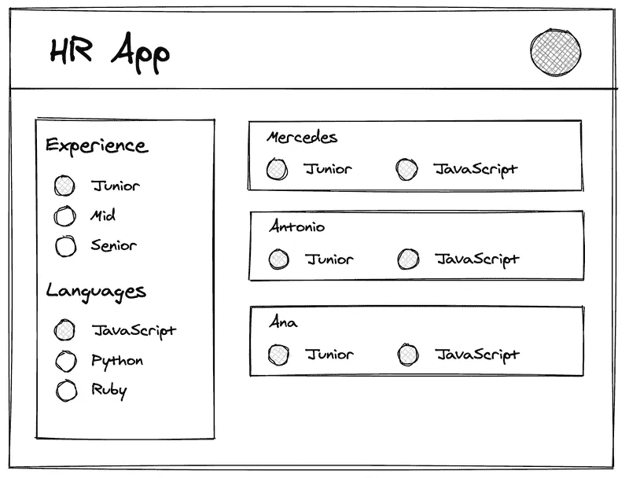

# 过滤器:通过构建来学习 JavaScript 的数组方法

> 原文：<https://levelup.gitconnected.com/filter-learn-javascripts-array-methods-by-building-them-6ed9b1a10033>

在本系列的第四篇文章中，我们将探索 filter 方法，以及如何使用它来获取大型数组的子集。



# 介绍

正如我们在`map`的实现中看到的，创建数组的子集是 JavaScript 中非常常见的任务。使用`map`，我们转换数组中的每一项。使用`filter`，我们可以根据某种条件得到数组的子集。

这是我解释 JavaScript 内置数组方法的系列文章中的第四篇，特别关注它们如何工作以及如何构建自己的数组方法。在我花了 4 年时间教数百人如何编码的过程中，我发现思考这些数组方法是如何工作的，最终会让他们为学习 JavaScript 的人所接受。`filter`是您工具箱中的一个强大方法，所以让我们来探索一下它是如何工作的。

# 它是如何工作的

`filter`方法接受一个回调并对数组中的每一项调用它。然后它测试回调的返回值是否真实。如果是，那么它会将值添加到一个新数组中。如果返回值不真实，则跳过该值。最后，我们剩下的是传递给回调函数时返回 true 的所有值。

举个简单的例子，让我们从一个数组中获取所有的偶数。在 JavaScript 中，我们知道一个数是偶数，即使它除以 2 的余数是 0(使用模运算符):

```
// Even numbers
let num = 6
if (num % 2 === 0) {
	console.log(num + " is even!")
}
```

我们可以在函数中使用它来测试参数是否是偶数:

```
function isEven(num) {
	if (num % 2 === 0) {
		return true
	} else {
		return false
	}
}isEven(6) // true
isEven(7) // false
```

现在我们有了一个测试数字是偶数还是奇数的函数，我们可以用它来测试数组中的每个数字，方法是将它传递给`.filter()`:

```
let nums = [ 1, 2, 3, 4, 5, 6, 7, 8, 9, 10 ]let evens = nums.filter(isEven)console.log(evens) // [ 2, 4, 6, 8, 10 ]
```

`.filter()`方法接受我们的`isEven`函数(作为回调)并在数组中的每一项上调用它。如果`isEven`返回`true`，那么我们将当前项添加到一个新数组中；如果它返回`false`，那么我们跳过当前项。当`filter()`结束对`nums`数组的循环时，它返回一个新的数组，该数组包含所有在传递给`isEven`时返回`true`的项目。

这可能有点难以理解。所以与其多解释，不如实现自己的。看到代码会帮助你理解`filter`做得比其他任何事情都好。

# 实现我们自己的

为了实现我们自己版本的`filter`方法，我们需要定义一个函数来执行以下操作:

*   接受数组和回调函数作为参数
*   创建一个新的空数组，我们将在最后返回
*   循环遍历数组，对每一项调用回调
*   如果回调返回一个真值，那么将当前项添加到新数组中
*   如果回调返回 falsey 值，则跳过将当前项添加到新数组的步骤
*   当循环结束时，返回新数组

我们将一步一步地完成这个过程，首先创建一个名为`filter`的函数，它接受一个数组和一个回调作为参数:

```
function filter(items, cb) {
	// More to come here ...
}
```

我们的第一个参数，`items`，将是传入数组。第二个项目，`cb`，将是回调。(作为旁注，`cb`是 JavaScript 中*回调*的常见简写。)

接下来，我们需要创建一个空数组，我们将在函数结束时返回该数组:

```
function filter(items, cb) {
	let final = [] // More to come here ... return final
}
```

你可以给这个数组起任何你喜欢的名字，只要它是有意义的。调用这个数组`final`，因为它将是这个函数的最终结果，在这种情况下是一个相当常见的名字。

现在我们有了`final`数组，我们需要创建一个循环来遍历`items`数组中的每一项。我们将使用这个外观将`items`数组中的每一项传递到我们的`cb`回调中。

```
function filter(items, cb) {
	let final = [] for (let i = 0; i < items.length; i++) {
		// More to come here ...
	} return final
}
```

在这个循环中，我们希望对循环中的当前项调用回调函数(`cb`):

```
function filter(items, cb) {
	let final = [] for (let i = 0; i < items.length; i++) {
		// Get the current item
		let currentItem = items[i] // Pass it into `cb`
		let res = cb(currentItem) // More to come here ...
	} return final
}
```

我们现在从`items`数组中获取当前项(基于`i`的索引值)并将其传递给回调函数(`cb`)。我们在变量`res`中捕获`cb`的返回值。你也可以把这个变量叫做任何东西，尽管`res`在这里也很常见(它是*结果*的简称)。

我们快完成了。剩下的就是测试返回值(`res`)看它是否真实。如果是，我们将它添加到`final`数组，如果是 falsey，我们将跳过它:

```
function filter(items, cb) {
	let final = [] for (let i = 0; i < items.length; i++) {
		let currentItem = items[i]
		let res = cb(currentItem) if (res) {
			final.push(currentItem)
		}
	} return final
}
```

就是这样！这就是我们需要做的。我们不需要一个`else`，因为如果`res`为假，我们不想做任何事情。我们没有任何东西可以放在一个`else`块中！

我们可以使用上面定义的`isEven`函数来测试我们自己的`filter`方法:

```
let nums = [ 1, 2, 3, 4, 5, 6, 7, 8, 9, 10 ]let evens = filter(nums, isEven)console.log(evens) // [ 2, 4, 6, 8, 10 ]
```

我们得到同样的结果。让我们用一个获取奇数的函数来测试一下:

```
function isOdd(num) {
	if (num % 2 !== 0) {
		return true
	} else {
		return false
	}
}let odds = filter(nums, isOdd)console.log(odds) // [ 1, 3, 5, 7, 9 ]
```

您可以在这里看到它也与我们的`isOdds`函数一起工作。

# `filter`在行动

`filter`方法无疑是获取列表子集的最佳方式，这是 JavaScript 开发中相当常见的任务。我经常使用它的一个地方是获取 API 响应的一部分。

让我们看一个例子。假设我们正在构建一个管理求职者的应用程序。为了做到这一点，我们希望能够在用户界面中为具有一定经验水平和技能的开发人员进行筛选。我们在应用程序中可能会有一个类似这样的页面:



左侧栏有一些过滤器(在这里是经验和编程语言)。当有人点击这些过滤器中的一个时，屏幕主要区域的内容应该只改变为与这些过滤器匹配的内容。我们可以使用`filter`方法。

如果我们从 API 返回的数据如下所示:

```
const developers = [
  {
    name: "Antonio",
    experience: "Junior",
    language: "JavaScript"
  },
  {
    name: "José",
    experience: "Senior",
    language: "JavaScript"
  },
    {
    name: "Carmen",
    experience: "Junior",
    language: "Python"
  },
    {
    name: "Mercedes",
    experience: "Junior",
    language: "JavaScript"
  },
    {
    name: "Ana",
    experience: "Junior",
    language: "JavaScript"
  },
]
```

然后，我们可以像这样筛选所有初级开发人员:

```
function isJunior(developer) {
	if (developer.experience === "Junior") {
		return true
	}

	return false
}
const juniorDevelopers = developers.filter(isJunior)
```

这会给我们安东尼奥，卡门，奔驰和安娜。

我们可以为 JavaScript 开发人员做类似的事情:

```
function knowsJavaScript(developer) {
	if (developer.language === "JavaScript") {
		return true
	} return false
}const javascriptDevelopers = developers.filter(knowsJavaScript)
```

我们的`javascriptDevelopers`数组中现在有安东尼奥、何塞、梅塞德斯和安娜。

如果我们想为初级开发人员和 JavaScript 开发人员提供`filter`，我们也可以这样做:

```
const currentDevelopers = developers.filter(function (developer) {
	if (
		developer.language === "JavaScript" &&
		developer.experience === "Junior
	) {
		return true
	} return false
})
```

现在，在候选人跟踪应用程序中构建我们的页面所要做的就是将这些开发人员呈现在屏幕上！

# 结论

我已经介绍了 JavaScript 的四个内置数组方法。如果您还没有看过，一定要看看本系列的其他文章:

*   `[forEach](https://zkf.io/js-array-methods-foreach/)`
*   `[map](https://zkf.io/js-array-methods-map/)`
*   `[concat](https://zkf.io/js-array-methods-concat/)`

我将解释并实现每一个内置数组方法。如果你正在努力学习它们，或者只是想学习更多关于 JavaScript 的知识，那么一定要注册我的[时事通讯](https://hawthorne.substack.com)并在 [Twitter](https://twitter.com/ZFleischmann) 上关注我。