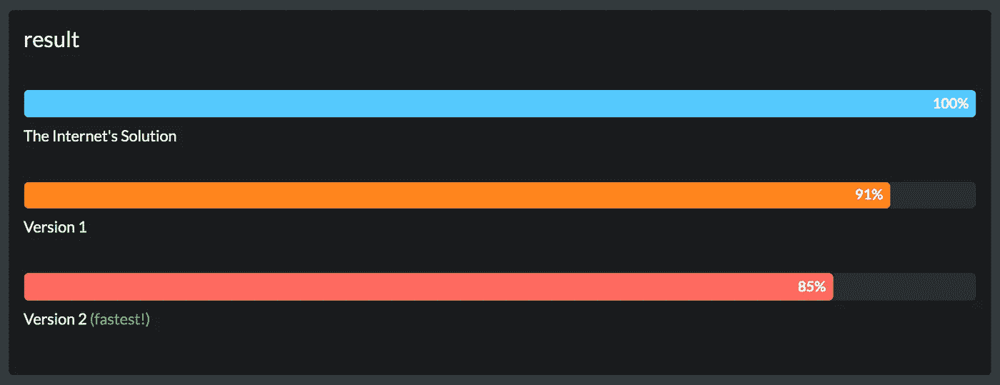

# Javascript 中唯一的过滤器

> 原文：<https://levelup.gitconnected.com/filter-unique-in-javascript-226007247354>


有一段时间我一直在思考一个简单的问题，为什么我们不能在 Javascript 中对 array's 使用`.filter`来获取数组中所有唯一的值。简短的回答是，你可以！但是我沿着 JavaScript 这条路走了一小段路，寻找实现这一点的最佳方式。

# 概观

对我来说，这样过滤感觉很自然。将`.filter`应用于数组的目的是移除不需要的值，即重复值。不使用`.filter`有很多方法可以实现这一点，但是这些方法看起来可读性差，也不优雅。使用`.filter`的一个额外好处是，您还可以灵活地链接其他数组函数(例如，`.map`、`.reduce`和其他`.filter`调用)。

如果你不喜欢使用`.filter`，你可以用 ES6 `Set`类做一个巧妙的技巧。这实质上是将数组转换成一个只存储唯一值的集合[然后再将其转换回数组。干净优雅。](https://developer.mozilla.org/en-US/docs/Web/JavaScript/Reference/Global_Objects/Set)

```
const unique = arr => [...new Set(arr)];unique(myArray)
```

# 版本 1

经过一点修补，我想出的第一个版本是这样的...

```
const unique = (elem, index, array) => {
  for (var i = 0; i < index; i++) {
    if (array[i] === elem) return false;
  }
  return true;
};myArray.filter(unique);
```

在 [runkit](https://runkit.com/nizmox/5cef741585603a001c321ad7) 中试用。

我最初对这种方法相当满意。

*   它适用于字符串和数字(原语)。我并没有试图让这种工作进行深入的平等比较。
*   它只查看当前元素之前的数组元素，因此值的第一个实例将返回`true`，任何后续实例都将返回`false`。它不需要查看整个数组。
*   一旦找到重复项，它就返回 false(它不会一直检查数组的其余部分)。

# 还有比这更好的吗？

过了一段时间，我意识到虽然版本 1 工作得很好，但它可以做得更好。考虑这个例子，一个有 1000 个元素的数组。

`const myArray = [<...998 items that aren't 1>, 1, 1];`

当我们到达最后一个项目时，它将开始查看它前面的项目(999 个项目)以查看相同的元素是否已经存在。它从数组位置`[0]`开始，将一直检查每一项，直到到达数组位置`[998]`的倒数第二个`1`。

但是这感觉没有必要，因为我们已经找到了一个`1`，所以我们知道任何后续的`1`都不可能是唯一的。如果我们能够以某种方式缓存我们找到的每个唯一值，以便不需要重新检查整个数组中的重复值，那就太好了。

然后，我开始考虑创建自己的缓存对象，在缓存中存储值并提供一个函数来检查它们是否已经存在并不难，但这感觉好像我在重新发明轮子，这听起来就像 [Set](https://developer.mozilla.org/en-US/docs/Web/JavaScript/Reference/Global_Objects/Set) 所做的一样。

# 版本 2

这让我再次想到了`Set()`和它的优雅，我开始想我是否能以某种方式将其应用于`.filter`。

编写与`.filter`一起使用的函数的一个挑战是，您受限于过滤器提供的参数。它只为您提供当前元素、索引和初始数组。不幸的是，当你迭代时，它没有为你提供为结果构造的数组(就像你在`.reduce`中访问的“累加器”)。如果是这样的话，这个问题就容易解决了。

经过一些黑客攻击，这是我想出的…

```
const unique = () => {
  let cache;

  return (elem, index, array) => {
    if (!cache) cache = new Set(array);
    return cache.delete(elem);
  };
};myArray.filter(unique());
```

在 [runkit](https://runkit.com/nizmox/5d05fda03a90b1001a3f6188) 上试用。

这个解决方案首先使用`Set`生成整个数组的缓存。然后，在迭代过程中，它使用`.delete`方法对照缓存检查每个值。`.delete`将从缓存中移除元素，如果可以找到则返回`true`，如果不能找到则返回`false`。

这意味着第一次找到一个值时，它将返回`true`(对于成功的删除)，因为每个元素在缓存中都存在一次，因此将它包含在结果中。但是在随后对相同值(即重复值)的检查中，它将返回`false`(删除失败)，因为该值已经被删除，因此将其从结果中排除。

就性能而言，这个解决方案很棒，因为我们预先找到了所有的唯一值，然后每次迭代纯粹是对唯一值列表的一次检查。没有必要重复检查相同的值。

一个警告是，这个解决方案需要生成一个缓存并在每个调用之间共享，因此需要一个闭包`.filter(unique())` 而不是`.filter(unique)`。但是我认为这是一个高性能和干净的解决方案的公平权衡。

# 互联网的解决方案

在我发表这篇文章后，我在互联网上发现了一个非常好的解决方案。这是一条使它更加美丽的线。

```
const unique = (x, i, a) => a.indexOf(x) == i;myArray.filter(unique);
```

所以我开始想也许我浪费了时间？

# 表演

谜题的最后一块是哪个解决方案是最有效的。
你可以在 [JSBench](http://jsben.ch/fgmWs) 上看到自己的结果。



老实说，他们都很亲近。版本 2 比版本 1 更好，版本 1 比“互联网的解决方案”更好。也就是说，它们都非常接近，可能需要非常大的数据集才能使我的解决方案(版本 2)有价值。所以如果这不是你需要的东西，我可能会选择一条线。

# 包裹

差不多就是这样了。您可以在 runkit 上试用我的解决方案，或者复制并粘贴到您的项目中。我也创建了一个 npm 包，如果你愿意的话，叫做 [youneek](https://www.npmjs.com/package/youneek) 。如果你喜欢这篇文章/解决方案，你能给我的最好的感谢就是在 [github](https://github.com/s-taylor/youneek) 上打一颗星。

# 附录

如果我确实想使用深度相等来过滤对象呢？这超出了我试图实现的范围，但是您可以使用第一个解决方案(版本 1)和类似于[快速深度相等](https://www.npmjs.com/package/fast-deep-equal)的东西来做比较。

```
const isEqual = require('fast-deep-equal');const deepUnique = (elem, index, array) => {
  for (var i = 0; i < index; i++) {
    if (isEqual(array[i], elem)) return false;
  }
  return true;
};myArray.filter(deepUnique);
```

[](https://gitconnected.com/learn/javascript) [## 学习 JavaScript -最佳 JavaScript 教程(2019) | gitconnected

### 67 大 JavaScript 教程-免费学习 JavaScript。课程由开发人员提交并投票，从而实现…

gitconnected.com](https://gitconnected.com/learn/javascript)