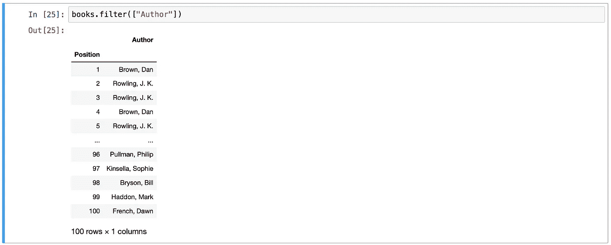
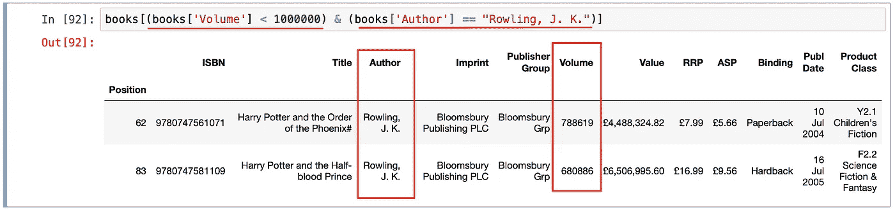

# 过滤熊猫中的数据

> 原文：<https://levelup.gitconnected.com/filtering-data-in-pandas-c7b60d1e1301>

有多种方法可以过滤数据帧中的数据:

*   使用*滤镜()* 功能
*   使用布尔索引
*   使用*查询()*功能
*   使用 *str.contains()* 函数
*   使用 *isin()* 函数
*   使用 *apply()* 函数(*但我们将把它留到另一篇文章*)

# 使用 *filter()* 功能

这个函数的名字经常引起混淆。与您预期的相反，过滤函数**不能**过滤数据帧内的**值**。它只能过滤**行列标签**。

为了说明我的意思，我们将使用一个名为 *books* 的数据框架，其中包含 1990 年至 2010 年前 100 本书的数据:

使用 filter()函数，我可以过滤我想要查看的列——例如，如果我想知道哪些作者进入了列表，我可以过滤出 *Author* 列:

然而，如果我想知道某个作者是否在列表中，我不能使用 *filter()* 函数来遍历所有作者并找到我要找的东西。如上所述，该函数只能过滤**行和列标签，**不能过滤这些行和列中的值。

# 使用布尔索引

为了完成我想要的，我可以改为执行布尔索引。真的很简单。例如，如果我想知道*罗琳，J. K.* 的任何一本书是否在列表中，我只需将她的名字与*作者*列进行比较:

在*作者*列中的所有值都根据它们是否匹配 J. K .罗琳的*进行评估..*我得到的回报是一个**系列的布尔数据**(一个*真*或*假*数据的数组)。

如果我将这个系列传递给选择器， *books[]* ，我得到的是一个 Dataframe，其中只包含来自 *Rowling，J. K.* 的所有书籍。

我也可以用**多重条件**过滤数据帧。比如我只对看*罗琳的书感兴趣，J. K* 。那已经不到*一百万张*了:

# 使用 query()函数

布尔索引是伟大的，但是它有时会觉得罗嗦。这就是 *query()* 函数的用武之地。它消除了键入选择器 *books[]* 的需要。尽管注意，我们将需要在引号内键入布尔表达式。

*查询*罗琳*和 J. K* 写的书的数据框架。产生与执行**布尔索引**相同的 **结果**:

*查询*罗琳*和 J. K* 写的书的数据框架。少于*一百万份*的拷贝产生**与执行**布尔索引**相同的结果**:

# 使用 isin()函数

使用 *query()* 函数过滤数据非常棒。它使代码更加简单明了，不那么罗嗦。然而，有没有一种方法仍然可以缩短它？你看，当从一个列中过滤单个值时，查询函数是有意义的，比如从 *Authors* 列中过滤由 *Rowling，J. K* 写的书。但是如果有多个作者我们想要过滤呢？如果我想过滤不仅仅是罗琳和 J. K .写的书怎么办？而且还是由*布朗、丹*和*梅耶、林美贞*组成的？这就是 *isin()* 函数的用武之地。

为罗琳写的书过滤。，*布朗，丹*和*迈耶，林美贞*使用*查询()*函数。

为罗琳*和 J. K* 写的书过滤。，*布朗，丹*和*迈耶，林美贞*使用 *isin()* 函数。

如果要从一列中过滤多个值，那么 *isin()* 函数比 *query()* 函数更简单。

# 使用 str.contains()函数

最后，我们来看看我个人最喜欢的数据过滤方式，即 *str.contains()* 函数。我发现这非常有用，因为有时我们不知道要过滤的数据的完整拼写。例如，我应该如何过滤 J. K .罗琳写的书？如果我不知道她名字的首字母？到目前为止，我们已经讨论过的所有过滤方法都要求我们知道想要查找的数据的确切拼写或值。现实中并不总是如此。

这就是 *str.contains()* 函数的用武之地。当您要查找的数据是一个字符串时，这个函数很方便。它将检查字符串中的每个字符，并查看是否有与您正在寻找的内容相匹配的内容。比如我还能过滤出*罗琳，J. K* 写的书。即使我只记得她名字的前四个字母。

*鳍*

如果你喜欢这个，你可能会喜欢:

*   [在熊猫中选择数据](https://medium.com/swlh/selecting-data-in-pandas-ff9fe1370785?source=friends_link&sk=e5015c119372425ba0b4132513ad6683)
*   [对熊猫中的数据进行分组和汇总](https://medium.com/swlh/grouping-and-aggregating-data-in-pandas-7cae8c5023ce?source=friends_link&sk=ffc3e4da0327ad184ae0ed7fbe022ab5)
*   [结合熊猫的数据](https://medium.com/@chutzpah/combining-data-in-pandas-31c984afceb7?source=friends_link&sk=66ec7e566c0786fbda731fe529ab57cc)