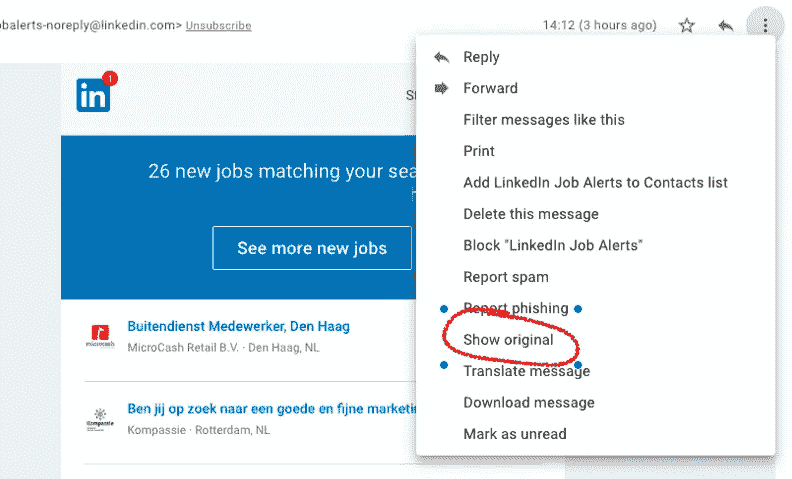
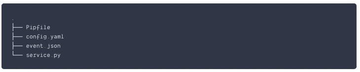
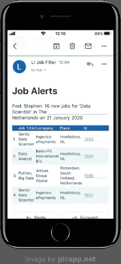
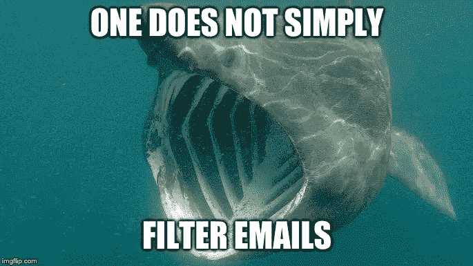

# 使用无服务器 Python 过滤 LinkedIn 工作警报。

> 原文：<https://levelup.gitconnected.com/filtering-linkedin-job-alerts-with-serverless-python-62bdd07cb81d>

我目前住在荷兰，正在找工作。可悲的是，我不会说荷兰语。(我应该说“我还不会说荷兰语”——希望总是存在的，对吗？)但我没有被吓倒，我在 LinkedIn 上为本地工作设置了电子邮件提醒。大约三分之一的招聘信息是用英语描述的工作，其余的是荷兰语。我的工作假设是，如果工作描述是英文的，那么他们有可能在办公室说英语，这是值得了解的。

一个问题是，我无法立即找到一种方法，通过工作描述的语言来过滤我收到的工作。通常职位是英文的，但描述是荷兰语的。我想这对大多数荷兰人来说不成问题，因为他们的英语非常好。但是，对我来说，点击所有电子邮件链接的过程可能会令人沮丧。我将能够根据描述的语言过滤工作警报。现在，如果我能把邮件转发到某个地方，然后把一个经过过滤的列表发送回来，那就足够好了。

这篇文章描述了我在一个周末沿着这些思路拼凑的一个解决方案。这样，我学会了如何使用亚马逊的 [SES](https://aws.amazon.com/ses/) 和 [Lambda](https://aws.amazon.com/lambda/) 服务。我还发现了几个以前没听说过的有用的 Python 包。在这个过程中有一些错误的步骤，我希望通过写下它们，你将能够避免它们(以长期缠绕为代价)。

我将任务分成 4 个任务:

1.  研究如何从 LinkedIn 发送的工作提醒电子邮件中提取工作描述 URL。
2.  获得完整的职位描述，并决定用什么语言。
3.  创建一封包含(过滤后的)工作列表的电子邮件。
4.  了解如何接收电子邮件，处理邮件内容，然后发回。

我从处理最熟悉的任务开始。您可能对将 AWS 服务链接在一起的部分最感兴趣。在这种情况下，请跳到任务 4。

## 任务 1:研究如何解析电子邮件，提取每个工作的 URL，并获取工作描述。

事实上，我对电子邮件知之甚少，除了有时候你可以用纯文本的方式请求它们。我从 LinkedIn 收到的电子邮件看起来像 HTML。当然，事实证明，电子邮件有一种古老的标准格式。

使用 GMail 中的“显示原件”选项，您可以查看或下载这种格式的“原始”电子邮件。



使用 GMail 的“显示原件”命令查看收到的实际邮件。

来自 LinkedIn 的邮件是一个由两部分组成的多部分信息。每个部分都包含一个作业列表，首先是纯文本格式，然后是 HTML 格式。每个列表都包含 LinkedIn 上完整职位描述的 URL。我想用 Python 从电子邮件中提取这些 URL。我很快发现 Python 标准库有一个包叫做`[email](https://docs.python.org/2/library/email.html#module-email)`。用这个包加载一个示例电子邮件给了我两个内容类型为`['text/plain', 'text/html']`的`Message`对象:

```
import emailwith open('sample_email.eml','r') as f:
    e = email.message_from_file(f).get_payload()print([ms.get_content_type() for ms in e])
```

起初我认为用像 [lxml](https://lxml.de/) 这样的库来解析 HTML 部分会更健壮。但那是多么混乱啊！为了让他们的电子邮件成为 p̵r̵e̵t̵t̵y̵ /品牌，电子邮件营销人员必须内嵌所有的 CSS。这似乎不利于语义。

相反，我编写了一个代码片段来从纯文本中提取 URL 和其他细节:

这看起来很好，因为 LinkedIn 永远不会改变你的工作提醒邮件格式，不是吗？；-)

**近期更新:**事实上这一点也不健壮，并不是因为 LinkedIn 改变了消息格式。它在我从 GMail 下载的示例邮件中运行良好。但是当我把所有的东西都连接在一起并测试后，我根本没有收到任何工作！事实证明，当你转发一封电子邮件时，GMail 发送的不是你“显示原件”时看到的那个原件版本。相反，它发送一个预处理版本，这不会保留纯文本部分的格式。

我使用[正则表达式](https://docs.python.org/2/library/re.html)重新做了解析器来查找作业 URL。这可能是一个更好的方法:

```
import reLI_BASE_URL='https://www.linkedin.com/comm/jobs/view/'# extract matching urls from the plain text of email message
urls = re.findall(LI_BASE_URL+r”\d+”, plain_text_body)# extract the id numbers from the found urls
job_ids = set([x.split(‘/’)[-1] for x in urls])
```

## 任务 2。获取完整的职位描述，并决定用什么语言。

**获取职位描述。有了工作 id 列表，我可以获取每个工作 id 的工作描述，并确定它是否是英文的。我用了两个包来做这个:来自标准库的`requests`、`langdetect,`和`html`。**

[请求](https://requests.readthedocs.io/en/master/user/quickstart/)让我们从 LinkedIn 获取职位描述:

```
import requests# assume job_id is from above e.g. 1691926414
BASE_URL = 'https://www.linkedin.com/comm/jobs/view/'r = requests.get(f'{BASE_URL}{job_id}')
```

因为我想减少第三方库的数量，所以我使用 Python 标准库 [html.parser](https://docs.python.org/3/library/html.parser.html) 编写了一个定制的 HTML 解析器。这将在职位描述页面上运行，并提取描述和其他元数据，如职位、公司和位置。

用于提取作业信息的自定义 parser.HTML 解析器

对 HTML 响应调用解析器，如下所示:

```
# create instance of parser
dp=DescriptionParser()# feed it the HMTL from the email
dp.feed(r.text)# access captured data from the parser instance
# e.g.
title = dp.data.get('title','No Title Found')place = title.split(' in ')[1].split(' | ')[0]
job_title = title.split(' hiring ')[1].split(' in ')[0]
company = title.split(' hiring')[0]
```

**检测描述的语言。**

我正要去打电话给 0800-Google Translate-API，这时我发现了一个很棒的 python 包`[langdetect](https://github.com/Mimino666/langdetect)`。它显然支持 55 种现成的语言。我们可以简单地将工作描述的文本输入到`detect`函数，它将返回检测到的语言。

```
from langdetect import detectlanguage = detect(dp.data['description'])
```

我收到的工作描述是荷兰语和英语的混合。我通过传递一些示例描述，对`langdetect`的性能进行了一次不科学的测试。它似乎一直都是对的。因为这里没有人的生命受到威胁，这对我来说已经足够了。

所以现在我需要做的就是将最后 3 部分打包成一个循环，创建一个只有英语描述的工作列表。我希望这段代码不言自明:

## 任务三。创建一个过滤后的工作的电子邮件发送给我自己。

现在我有了过滤后的工作列表，我需要创建一封电子邮件发送给自己。让我们用明文和 HTML 来实现 MIME 多部分消息，就像我从 LinkedIn 收到的那样。这项任务有两个部分:构建明文和 HTML 消息部分，然后将它们包装成标准格式的电子邮件。

明文部分非常简单。我将每个作业的元数据和 URL 连接成一个字符串。

为了制作 HTML 部分，我发现有用的[占据了](https://github.com/Knio/dominate)包。经过几次迭代后，我决定将作业列表放在一个<表>元素中。我也觉得我通过包含一些内嵌 css 回馈了电子邮件营销社区。；-)

这个要点展示了一个构建回复的这些部分的函数:

为电子邮件传递构建明文和 HTML 消息的功能

我第一次尝试将这些消息打包成一封电子邮件，使用了标准库中的 [email](https://docs.python.org/3/library/email.examples.html) 包。遵循[文档](https://docs.python.org/3/library/email.examples.html)中的例子非常简单。但是我最终去掉了那些代码，转而使用`boto3` API 来创建和发送电子邮件。我们接下来看这部分。

## 任务 4:找出如何接收电子邮件，处理邮件内容，然后发送回邮件。

在这篇文章的开始，我描述了我的总体计划。这是为了将工作提醒电子邮件转发给某个 python 进程进行过滤。为了制定这个计划，我需要能够接收电子邮件，并将电子邮件的内容输入过滤代码。

我知道人们运行他们自己的电子邮件服务器，我假设有一些 python 包可以做到这一点。但当我只是偶尔收到工作邮件时，运行服务器似乎是一种浪费。相反，这听起来像是无服务器方法的一个很好的用例。我希望有一个“唤醒”功能，过滤电子邮件，然后再次关机。

AWS 的 Lambda 似乎是一个合理的起点。但是我仍然需要一种在收到邮件时触发 Lambda 函数的方法。当然，AWS 有这方面的服务。它被称为简单电子邮件服务(SES)。

> 当您使用 Amazon SES 接收消息时，您可以配置 Amazon SES 在消息到达时调用您的 Lambda 函数— AWS 文档

完美！我开始阅读关于创建 Lambda 函数和使用 SES 的内容，遵循[接收电子邮件入门指南](https://docs.aws.amazon.com/ses/latest/DeveloperGuide/receiving-email-getting-started.html)。SES 的管理步骤很少。首先，你必须[确认你拥有你想要发送邮件的域名](https://docs.aws.amazon.com/ses/latest/DeveloperGuide/receiving-email-getting-started-verify.html)。此外，所有新的 SES 帐户都是从[沙盒](https://docs.aws.amazon.com/ses/latest/DeveloperGuide/request-production-access.html)中开始的。这意味着您只能向您已经[验证过的](https://docs.aws.amazon.com/ses/latest/DeveloperGuide/verify-email-addresses.html)地址发送电子邮件。对于这个项目，这些限制无关紧要。我只想从一个电子邮件地址发送和接收，这是我自己的。

SES 的主要概念之一是*接收规则集*。接收规则指定 Amazon SES 应该如何处理收到的邮件。为了让 SES 在收到电子邮件时调用 Lambda，我开始遵循官方文档。我曾设想电子邮件的内容会传递给 Lambda。我很快发现 [*传入邮件的正文被省略了。*](https://docs.aws.amazon.com/ses/latest/DeveloperGuide/receiving-email-action-lambda-event.html)

要在 Lambda 函数中获取电子邮件的内容，我们必须配置 SES 将电子邮件的副本放入 S3 桶中。Lambda 然后可以使用 SES 提供的信息从 S3 获取电子邮件。我担心事情变得复杂了。

后来，我欣慰地看到了这个由 [丁切尔·卡夫拉尔](https://gist.github.com/dkavraal)创作的[例子，它成了我的解决方案的支柱。关于设置角色的部分对我来说很重要，我花了一点时间来熟悉它。如果你自己小心地一步一步来，它应该可以工作。因此，我能够设置 SES 和 Lambda 来接收电子邮件和回复。](https://gist.github.com/dkavraal/356dc60f8f6beb8b5070e891adadab96)

**把过滤代码硬塞进 Lambda。**

因此，我们有一个接收和发送电子邮件的有效工具。现在我需要把我的邮件过滤代码放到这个框架中。到目前为止，我一直在 Lambda 控制台中直接编辑(或者更准确地说，复制/粘贴)代码。它工作得很好，但我知道我的过滤代码依赖于一些额外的 python 包。我会想办法把它们捆起来，推到 Lambda 上。起初，我对此有点不知所措。

在这里，我发现了另一个很大的帮助，那就是`python-lambda` 包。我按照[这些指南](https://hackersandslackers.com/improve-your-aws-lambda-workflow-with-python-lambda/)来安装它并建立一个新的本地文件夹。然后从一个新的`pipenv` shell 中，我调用`lambda init`来创建以下文件:



[python-lamda](https://hackersandslackers.com/improve-your-aws-lambda-workflow-with-python-lambda/) 创建的目录结构

在`service.py`内部是最重要的`handler()`函数，每当[λ被调用](https://docs.aws.amazon.com/lambda/latest/dg/python-programming-model.html)时，这个函数就会被调用。

因此，首先我将 Karvaal 的示例代码复制到处理函数中。然后我可以移植我自己的邮件过滤脚本的一部分。

对我的代码的主要修改是在管道上:

*   使用从 S3 获取的内容，而不是从文件中阅读电子邮件
*   使用`boto3` API 打包并发送电子邮件，而不是标准的 python `email`包。

完整代码可在 [Github](https://github.com/wooduk/lifilter) 上获得。

`python-lambda`的美妙之处在于，设置好`config.yaml`文件后，我可以简单地将这些代码部署到 AWS。要么直接(`lambda deploy)`，通过 S3 ( `lambda deploy-s3`)或创建一个手动上传的 zip 文件(`lambda build`)。选择其中一个选项后,`python-lambda`将所有的源代码和包打包成一个 zip 文件。`build`选项使这变得更加透明，因为它创建了一个名为`dist/`的目录并将 zip 文件放在那里。我惊喜地发现这变得如此简单。

## 任务 5。转发一些提醒邮件给系统工程师。

因此，随着代码的捆绑和部署，我准备好将电子邮件转发到我的新服务。多刺激啊！但是…真令人失望！起初，我没有收到工作提醒。机器的主要部分似乎在运转。我转发的电子邮件已收到，并已回复。它只是没有任何工作机会。

这就是我之前描述的问题，Gmail 不转发我们最初看到的原始邮件，而是发送一个预处理版本。我使用正则表达式调整了电子邮件解析器，并再次尝试。这一次它成功了，看起来很令人满意。



按我的收件箱中描述的语言过滤的工作通知。

## 任务 6。沉浸在荣耀中。



可能有更简单的方法！

利用其他人的例子，我能够在相对较短的时间内将这些整合在一起。鉴于我之前没有使用过 SES 或 Lambda，我很惊讶它看起来如此简单。我不得不承认，这并不是完全没有头痛。我发现为 AWS 服务配置相互通信的权限变得有点棘手。有时 AWS 文档会让你觉得在兜圈子。感谢[丁切尔·卡夫拉尔](https://gist.github.com/dkavraal)和[托德·伯查德](https://hackersandslackers.com/improve-your-aws-lambda-workflow-with-python-lambda/)的例子，是他们让我走上了这条路。

这里创建的接收、触发过滤、发送的基本框架已经在另一个项目中派上了用场。

## 笔记

[1]是的，我正在等待它被指出按语言过滤是多么明显，但我想要一个辅助项目。

[2]我不是在鼓吹 AWS 胜过谷歌云或微软 Azure，我只是先在那里看了看，找到了我想要的。