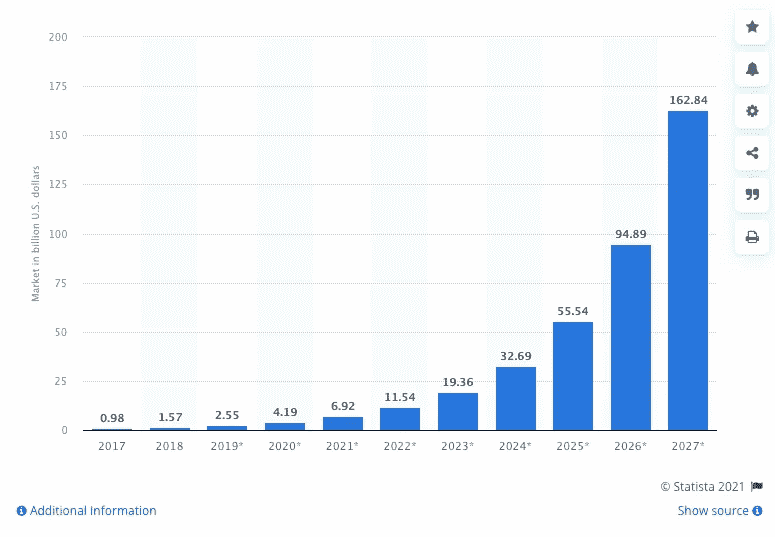

# 金融包容性:区块链如何实现交易

> 原文：<https://levelup.gitconnected.com/financial-inclusivity-how-blockchain-is-enabling-transactions-6c52852e1615>

使金融业现代化，以适应科技领域正在发生的变化，这将确保越来越多的人能够使用银行功能。在金融界，加密货币和投资组合的发展是人们被动收入的最前沿，并且逐年增长。

# 什么是区块链？

[区块链](https://www.ibm.com/topics/what-is-blockchain)是一种特定类型的数据库，按照时间顺序将数据块存储在一起(链接在一起)。这是一种复杂的数据存储方法，但是，从概念上来说，它非常简单。数据库本质上是以电子方式存储的信息的集合。传统的数据库和存储方法通常是表格格式，这使得搜索和标记功能更加容易。

与传统类型的数据库相比，是块中的结构，它创建了数据的时间线，因为当每个数据块被添加到链中时，它被赋予一个时间戳(确切的时间戳)。

(图片来源: [Investopedia](https://www.investopedia.com/terms/b/blockchain.asp) )

# 区块链和银行业

谈到货币，[加密货币](https://www.investopedia.com/terms/c/cryptocurrency.asp)仍然是货币未来的辩论主题。区块链最初是与加密货币一起应用的。区块链的使用将确保加密货币的速度和安全性得到保护。这种类型的数据存储无法篡改，这使它成为与加密货币并行的完美选择，但近年来，区块链的品质也已经转移到银行业的其他部分。信息技术的质量确保了它在银行业的许多方面得到应用，包括支持交易和直接支付。

# 使用区块链进行直接支付和交易

直接支付是通过支票和信用卡进行的，反过来，涉及来自商家和顾客的风险。风险可能包括欺诈交易、潜在的盗窃和商户纠纷，但随着区块链的[实施，这些类型的直接支付基本上没有风险。这是一个非常重要的优势，尤其是对于高价值的采购。使用区块链系统不仅可以核实所购买的产品，还能以高效平稳的方式核实付款。尽管这种应用尚未商业化，但它为银行业提供了安全性和先进性。](/blockchain-101-2effaa346196)

# 转移金钱和资金

在资金转账方面，使用区块链技术的优势最为突出。随着商业和银行业的全球化，人们比以往任何时候都更加依赖资金转账。疫情在这方面起到了更大的推动作用。转移[法定货币](https://www.ig.com/uk/glossary-trading-terms/fiat-currency-definition)意味着利用区块链进行这种类型的货币转移将简化这一过程。主要的好处是减少了银行和金融机构的时间和成本。

# 交易详细信息

如上所述，区块链确保了新数据加入链时的时间戳，这确保了以这种方式组织的数据比以往任何时候都更加安全。事实上，转账本身的效率只是区块链技术和银行联盟的好处之一，交易的细节也将由此服务。保存顾客、客户和供应商的安全记录，确保任何细节都不会被伪造和错误输入。使用[智能合约](https://www.globant.com/studio/blockchain?utm_source=google&utm_medium=cpc&utm_campaign=mkt_gl_all_cpc_lgn_cpc_17092021_ao1343_blockchain&gclid=Cj0KCQjw5JSLBhCxARIsAHgO2SdzSlo9xmC0a0KKcBiNax4ZQhddsUz79bQOzDdtNzu7_puAY-jjOUkaAoUpEALw_wcB)是监控和记录交易细节的有利方法，但使用区块链技术为记录交易细节提供了更多选择。

# 增强和高级安全性

(图片来源: [Statista](https://www.statista.com/statistics/1015362/worldwide-blockchain-technology-market-size/) ) —显示区块链科技市场规模的图表。

选择[区块链技术](/how-is-blockchain-technology-going-to-change-the-world-a61e4f64d069)的一个无可争议的好处当然是安全性，这是这种数据存储的一部分。这不仅适用于银行业，也适用于存储身份记录或任何合同细节的任何类型的[业务](https://daglar-cizmeci.com/8-things-entrepreneurs-must-assume-when-starting-a-business/)。所承诺的更高的安全性，将与您对涉及您公司详细信息的数据的安心密切相关。当涉及到银行业时，金融环境的细节泄露可能会导致巨大的损失，从长远来看，使用这种技术只会有好处。

在过去三十年的大部分时间里，数据泄露和存储一直在发展，银行业是目前实施[区块链技术](https://www2.deloitte.com/ch/en/pages/strategy-operations/articles/blockchain-explained.html)的最大行业之一。数据存储的组织基础的变化意味着数据受到保护，并强调它将在[加密货币](/road-to-recovery-could-bitcoin-still-top-100-000-in-2021-7a84c4b10f8b)之外有应用范围。随着世界变得更加数字化，金融机构的详细信息及其客户的数据将保持安全，并继续维护这种安全。