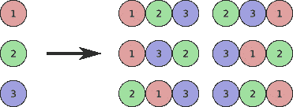
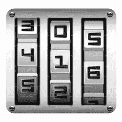
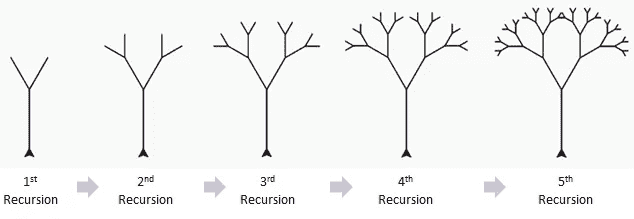
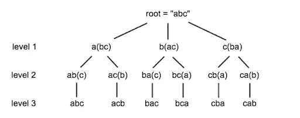
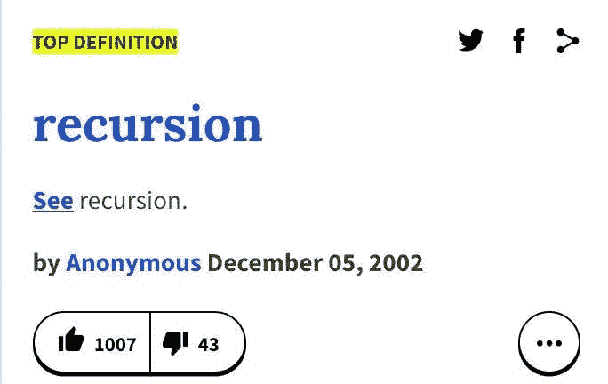

# 在 Javascript 中查找字符串的所有排列

> 原文：<https://levelup.gitconnected.com/find-all-permutations-of-a-string-in-javascript-af41bfe072d2>


## [GitHub repo，包含完整的解决方案代码和测试套件。](https://github.com/noamsauerutley/string-permutations)

> 给定一个字符串，返回该字符串的所有排列。

当我坐下来解决这个问题时，我发现这是一个巨大的算法挑战。为什么？虽然操作字符串的任务表面上看起来似乎很熟悉，但实际上找到一个完整的解决方案需要我们处理一些意想不到的复杂性，这提供了利用[递归树](https://en.wikipedia.org/wiki/Recursive_tree)并熟悉[主定理](https://en.wikipedia.org/wiki/Master_theorem_(analysis_of_algorithms))的机会。

***注意*** *:解决这个问题的方法不止一种。我在这里探索的解决方案模型利用了我发现对解决* [*算法挑战*](https://www.encyclopediaofmath.org/index.php/Algorithmic_problem) *有广泛价值的工具和概念，以及我发现对 Javascript 中的字符串操作很直观的方法。*

先说正事:什么是[**排列**](https://en.wikipedia.org/wiki/Permutation) ？

## 每亩地

> */ˌpərmyo͝oˈtāSH(ə)n/*
> 
> [学会发音](https://www.google.com/search?rlz=1C5CHFA_enUS709US712&sxsrf=ACYBGNTPndNyReUeZnT9AMXjhP4lKoxabw:1581528989144&q=how+to+pronounce+permutation&stick=H4sIAAAAAAAAAOMIfcRoyy3w8sc9YSmTSWtOXmPU4-INKMrPK81LzkwsyczPExLnYglJLcoV4pfi5eIuALJKS8ASVixKTKl5PItYZTLyyxVK8hUKgNrygfpSFZBUAQAUxHbOYQAAAA&pron_lang=en&pron_country=us&sa=X&ved=2ahUKEwj73uXMxsznAhVBmlkKHbHDBSkQ3eEDMAB6BAgFEAg)
> 
> **名词**
> 
> 一种方式，尤指几种可能的变化中的一种，在这种方式中一组或若干事物可以被排序或安排。

所以每一个字符串都有许多排列，其中的字符可以重新排列。字符串排列类似于[变位词](https://en.wikipedia.org/wiki/Anagram)。然而，它不必是现有的单词，而可以简单地是字符的重新排列。

除了字符串之外的其他内容的排列示例如下:



对于仅仅三种颜色，我们可以有六种不同的排列，或者这些颜色的有序组合。

排列的另一个例子是密码锁:



啊哦。密码锁的全部意义在于，相对少量的数字就可以创造出足够多的有序组合，以防止随意打开。

突然之间，整个字符串操作问题似乎变得更加令人生畏。

所以我们已经弄清楚了什么是排列，并且确定(取决于字符串的长度)我们可能在寻找很多排列。从哪里开始？

当我看到这样的挑战时，我的第一反应是做两件事:

1:制作一个空的[数组](https://en.wikipedia.org/wiki/Array_data_structure)。如果我的最终解决方案可能返回不止一个“正确”的元素(在本例中，是排列)，在我返回完整的解决方案之前，我需要一个地方来存储它们。

2: [迭代](https://en.wikipedia.org/wiki/Iteration)！如果我需要找到一个字符串中所有字符的有序组合，创建一个循环来遍历一个字符串中的所有字符似乎是一个不错的起点。

在我们直接进入迭代之前，让我们先做一些事情。

如果用户输入一个空字符串，或者一个整数，或者试图在不输入任何内容的情况下运行该函数，该怎么办？如果没有字符串，我们就不能得到字符串的所有排列。

如果输入到函数中的参数是[false](https://j11y.io/javascript/truthy-falsey/)，或者不是字符串，新代码行将返回一条错误消息。

好的，太好了！

但是如果字符串真的很短呢？比如只有一个字符的短？这也是一个场景，我们真的不需要弄乱整个迭代，并把东西推到一个数组位。例如，如果我们的字符串只是“a”，那么它只有一个排列——“a”。我们可以只返回 a。

好了，现在已经解决了这个问题，我们可以回到我们的迭代循环了。

我们的函数在当前状态下的结构，现在看起来有点类似于所谓的主定理。

## 主定理

什么是[主定理](https://medium.com/@malaynandasana/master-theorem-b544fa8829f7)？

它是将潜在的复杂挑战分解成一系列较小问题的一系列步骤。许多问题或技术挑战都属于[分治算法](https://en.wikipedia.org/wiki/Divide-and-conquer_algorithm)的范畴，它要求未来的求解者将一段数据分成更小的片段，直到这些片段足够简单，可以直接求解。

用伪代码写出来，看起来是这样的:

```
**procedure** p( input *x* of size *n* ):
   **if** *n* < some constant *k*:
     Solve *x* directly without recursion
   **else**:
     Create *a* subproblems of *x*, each having size *n*/*b*
     Call procedure p recursively on each subproblem
     Combine the results from the subproblems
```

这里发生了一些重要的事情:

1:条件检查输入的大小是否小于常数。

2:如果输入大于所述常数，输入被分解成更小的部分，直到它们都小到足以直接运行**程序**

3:当这一步完成后，后处理过程的所有部分的结果可以合并，并作为一个大的数据位返回。

这种分解问题的方法通常被视为一棵树(特别是因为这通常有助于确定问题的[时间复杂度](https://www.geeksforgeeks.org/understanding-time-complexity-simple-examples/))。你可以在这里阅读更多关于时间复杂性和大师方法[。](https://medium.com/@aman.jain/demystifying-master-theorem-e0436b2aff1f)



想了解更多关于递归树和主定理的知识吗？我喜欢康奈尔大学的这个大纲。

请注意，这种结构与下图中我们寻找字符串所有排列的特定挑战是多么相似:



虽然我们当前的函数与我们主定理的抽象伪代码并不完全相同，但是我们已经建立了一个逻辑路径，如果我们的输入小于一个常数(在我们的例子中，如果 **string.length** 小于 **2** )，则返回一个解，如果不是，则创建一个要解决的子问题列表。

如果您以前展平过嵌套数组，这种方法可能会很熟悉。对于各种各样的挑战，这可能是一个很好的起点——它不会是解决所有问题的相关方法，但提供了一个很好的起点。

*注意:这种方法确实利用了* [***递归***](https://en.wikipedia.org/wiki/Recursion) *。*



你可以在这里阅读更多关于**递归**[这里](https://medium.com/code-zen/recursion-demystified-24867f045c62)(代码示例在[JavaScript](https://en.wikipedia.org/wiki/JavaScript))[这里](https://medium.com/@daniel.oliver.king/getting-started-with-recursion-f89f57c5b60e)(代码示例在[JavaScript](https://en.wikipedia.org/wiki/JavaScript))[这里](https://medium.com/better-programming/understanding-recursion-recursively-181f5f4dc528)(代码示例在[ruby](https://en.wikipedia.org/wiki/Ruby_(programming_language)))[这里](https://medium.com/@isaac_70614/recursion-a-step-by-step-introduction-ed25c957559c)(代码示例在 [python](https://en.wikipedia.org/wiki/Python_(programming_language)) )。

好吧，回到我们的代码。

现在，如果我们想利用主定理方法，我们可以更新我们的计划，使之比`// do something`更清晰一些。

为了简单起见，我想把我们正在迭代的当前元素赋给变量 **char** 。

所以我们应该做的第一件事是把我们的**字符串**分解成子问题。

首先，我们有我们当前的角色，又名**string【I】**，又名 **char** 。为了开始分解剩余的**字符串**，我们需要收集剩余的字符。

正如我们将当前字符分配给变量 **char** 一样，让我们将剩余字符分配给变量 **remainingChars** 。

***注*** *:收集* **剩余查尔** *的方法有很多种。这只是一种方法。*

为了收集这些字符，我们可以使用字符串方法 [slice](https://www.w3schools.com/jsref/jsref_slice_string.asp) 。 [Substring](https://www.w3schools.com/jsref/jsref_substring.asp) 是一个类似的方法，所以如果你更熟悉它，你可以用它来代替。Slice 是[非破坏性的](https://medium.com/@coadams9/javascript-a-few-methods-and-destructive-vs-non-destructive-c20197534ad1)，所以我们不需要担心改变我们的原始字符串——我们通过对我们的字符串进行切片得到的结果将是它自己的新字符串。

所以我们将从索引 **0** (字符串中的第一个字符)到索引 **i** (我们当前的字符， **char** )分割字符。然后，我们将从索引 **i + 1** (在 **char** 之后的下一个字符)到索引 **string.length** (在**字符串**中的最后一个字符)的字符连接起来。

所以现在我们有两个更小的字符串——char 和 remainingChars 。

现在怎么办？

好吧，让我们参考主定理:

```
Call procedure p recursively on each subproblem
```

所以我们将在剩余的字符串上调用我们的函数。

然后呢？

```
Combine the results from the subproblems
```

我知道我们需要那个空数组。

好的，那么这在 JavaScript 中是什么样子的呢？

所以我们在这里做了一些事情。

我们递归地调用了**上的**find permutations**remaining chars**。对于该函数的每个结果，我将其分配给一个名为 **permutation** 的变量，我们可以将一个由 **char** 和 **permutation** 组合而成的字符串推入到我们的**permutation array**中。

所以让我们看看当我们返回 **permutationsArray** 时会得到什么。

好的，太好了！当给定输入**“ABC”**时，我们的 **findPermutations** 函数返回所有六个排列！

让我再尝试一件事。

这可不好。如果字符串中的一个字符重复出现，我们将得到两次排列。许多字符串都有重复的字符。

有很多不同的方法来删除多余的元素，但我选择使用 Javascript 的 [indexOf](https://www.w3schools.com/jsref/jsref_indexof.asp) 方法来识别当前字符是否已经通过我们的 **findPermutations** 方法运行过。indexOf 返回一个字符的**第一个**索引，所以如果我们已经为一个“a”运行了 **findPermutations** ，index of(“a”)将不同于 **char** (当前的，后来的“a”)的索引。

如果这是真的，我们可以 [**继续**](https://www.w3schools.com/js/js_break.asp) ，这实质上将跳过当前的迭代循环，并继续下一个。

让我们用这个加法来运行 **findPermutation** 。

完美！🌟基于主定理的方法使我们能够快速地将这个问题分解成小块，并开始返回正确的结果，只需要在这里和那里做一些调整，就可以按照预期的格式交付我们的解决方案。

## 回顾:

那么我们基于主定理的方法是什么来着？

1:建立一个基础案例——如果我们的输入大小小于某个常数，直接解决它，不要递归。

2:如果输入大于所述常数，将其分解成更小的块。

3:在碎片上递归调用函数，直到它们小到可以直接求解。

4:组合各个部分的结果，并返回完整的解决方案。

我发现这个模型是一个非常方便的工具，它为我解决算法挑战提供了一个可靠的起点。虽然不是特别适用于每一个算法问题，也不总是性能最好或最优雅的解决方案，但它是一个可靠的工作模型，可以很好地为您服务！

包含解决方案代码的 [GitHub repo 还附带了一个测试套件，因此如果您愿意，您可以练习或尝试寻找这个问题的替代解决方案。](https://github.com/noamsauerutley/string-permutations)

如果您想进一步探索，您可以尝试使用上面利用的解决方案模型来查找密码锁的所有组合。有用吗？你需要做任何改变吗？

## [有兴趣解决 Javascript 中另一个流行的算法？点击这里。](/solving-the-two-sum-problem-in-javascript-three-ways-4d43067fcfc7)