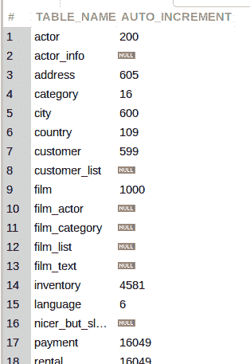

# 查找所有表格的当前 AUTO_INCREMENT 值

> 原文：<https://levelup.gitconnected.com/find-all-tables-current-auto-increment-value-ca4057f9d305>

我最近想检查数据库转储结构的所有表的当前`AUTO_INCREMENT`值(如果有的话)。我不确定表的数据定义语言语句是否包含当前的值。所以在我加载了转储文件之后，我学会了使用一个查询来找出…

当您[订阅 ***OpenLampTech*** 时事通讯](http://openlamptech.substack.com)时，会收到一本我的电子书*《给每个人的 10 个 MySQL 技巧】*。


来自 [Pixabay](https://pixabay.com/?utm_source=link-attribution&utm_medium=referral&utm_campaign=image&utm_content=297282) 的[Clker-Free-Vector-Images](https://pixabay.com/users/clker-free-vector-images-3736/?utm_source=link-attribution&utm_medium=referral&utm_campaign=image&utm_content=297282)的图像

## 信息模式数据库

我们可以使用有价值的`INFORMATION_SCHEMA`数据库并查询`TABLES`表中的任何`AUTO_INCREMENT`列值。

下面是一个查询示例，其中我将众所周知的实践 Sakila 数据库作为目标:

```
SELECT TABLE_NAME, AUTO_INCREMENT
FROM TABLES
WHERE TABLE_SCHEMA = 'sakila';
```



通过在 ***OpenLampTech*** 时事通讯中投放负担得起的分类广告，让你的品牌、产品或服务得到它所需要的关注。谢谢大家的支持！

我希望这篇文章对你有价值。您可能永远不需要(或不关心)知道表格的`AUTO_INCREMENT`值。不过如果有，可以参考这篇文章。我知道我会的。

## 推荐阅读

*   [MySQL 的 AUTO_INCREMENT 属性](https://joshuaotwell.com/mysqls-auto_increment-attribute/)
*   [PHP PDO lastInsertId()方法与 MySQL 中的例子](https://joshuaotwell.com/php-pdo-lastinsertid-method-with-examples-in-mysql/)
*   [如何在 CodeIgniter 4 中检索 MySQL 最后插入 ID](https://joshuaotwell.com/how-to-retrieve-mysql-last-insert-id-in-codeigniter-4/)

[向其他订阅者推荐 OpenLampTech 简讯](https://subshark.io/refer/x6_vwsf7)并获得奖励和津贴。

喜欢你读过的？看到什么不正确的吗？请在下面评论，感谢阅读！！！

# 行动的号召！

感谢你花时间阅读这篇文章。我真心希望你发现了一些有趣和有启发性的东西。请在这里与你认识的其他人分享你的发现，他们也会从中获得同样的价值。

访问 [Portfolio-Projects 页面](https://wp.me/P28ctb-3KD)查看我为客户完成的博客帖子/技术写作。

[**咖啡是我最喜欢的饮料。**](https://ko-fi.com/joshlovescoffee)

要在最新的博客文章发表时收到来自本博客(“数字猫头鹰散文”)的电子邮件通知(绝不是垃圾邮件)，请点击“点击订阅！”按钮在首页的侧边栏！(如有任何问题，请随时查看 [Digital Owl 的散文隐私政策页面](https://wp.me/P28ctb-3gI):电子邮件更新、选择加入、选择退出、联系表格等……)

请务必访问[“最佳”](https://joshuaotwell.com/where-blog_post-in-digital-owls-prose-best-of/)页面，收集我的最佳博客文章。

[Josh Otwell](https://joshuaotwell.com/about/) 作为一名 SQL 开发人员和博客作者，他热衷于学习和成长。其他最喜欢的活动是让他埋头于一本好书、一篇文章或 Linux 命令行。其中，他喜欢桌面 RPG 游戏，阅读奇幻小说，并与妻子和两个女儿共度时光。

免责声明:本文中的例子是关于如何实现类似结果的假设。它们不是最好的解决方案。所提供的大多数(如果不是全部)示例都是在个人发展/学习工作站环境中执行的，不应被视为生产质量或就绪。您的特定目标和需求可能会有所不同。使用那些最有利于你的需求和目标的实践。观点是我自己的。

***有什么可以帮你的*** ？

*   免费 [MySQL 查询语法口头禅 PDF](https://ko-fi.com/s/3631fc7d00) 备忘单。记住这个咒语的查询语法顺序。
*   你想开一个博客吗？我用 WordPress 写博客。让我们都在提供的计划上省钱。
*   通过在 ***OpenLampTech*** 时事通讯中投放价格合理的分类广告，让您的品牌、产品或服务获得所需的关注[。](https://ko-fi.com/s/7dfe9ce108)
*   需要托管你的下一个网络应用程序或 WordPress 网站吗？我使用并强烈推荐 [Hostinger](https://www.hostg.xyz/aff_c?offer_id=6&aff_id=94641) 。他们有很好的价格和服务。
*   作为一名自学成才的开发人员，我逐渐认识到的 5 个事实
*   今天就在我的 [Kofi 商店](https://ko-fi.com/joshlovescoffee#)发现优质的 MySQL 学习资料吧！

***披露*** :本帖部分服务和产品链接为附属链接。在没有额外费用给你，你应该通过点击其中一个购买，我会收到佣金。

订阅 ***OpenLampTech*** 简讯就能收到一本我的电子书*【给大家的 10 个 MySQL 小技巧】****绝对免费*** [。](http://openlamptech.substack.com)

在 ***OpenLampTech*** 时事通讯中投放可负担得起的分类广告，让您的品牌、产品或服务获得其所需的关注度[。谢谢大家的支持！](https://ko-fi.com/s/7dfe9ce108)

*原载于 2022 年 6 月 22 日 https://joshuaotwell.com*[](https://joshuaotwell.com/find-all-tables-current-auto_increment-value/)**。**