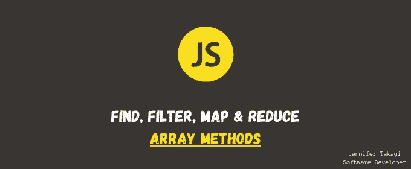
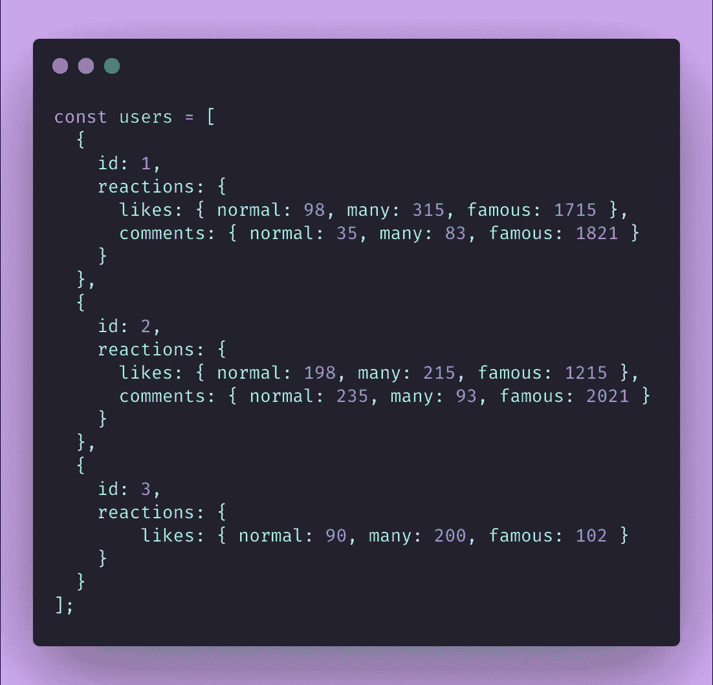
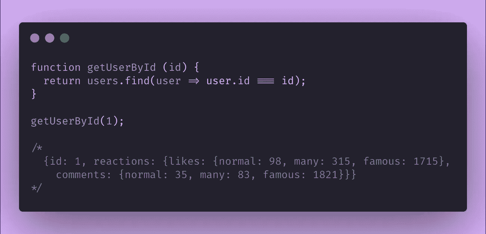
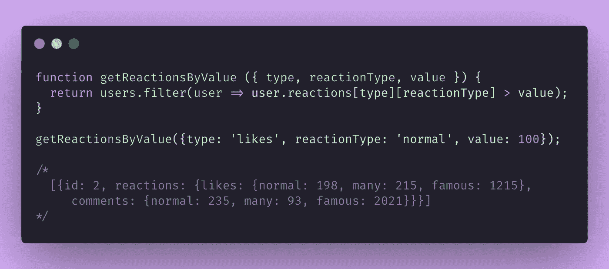
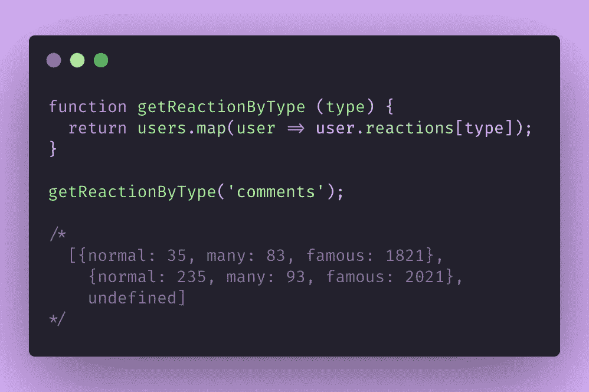
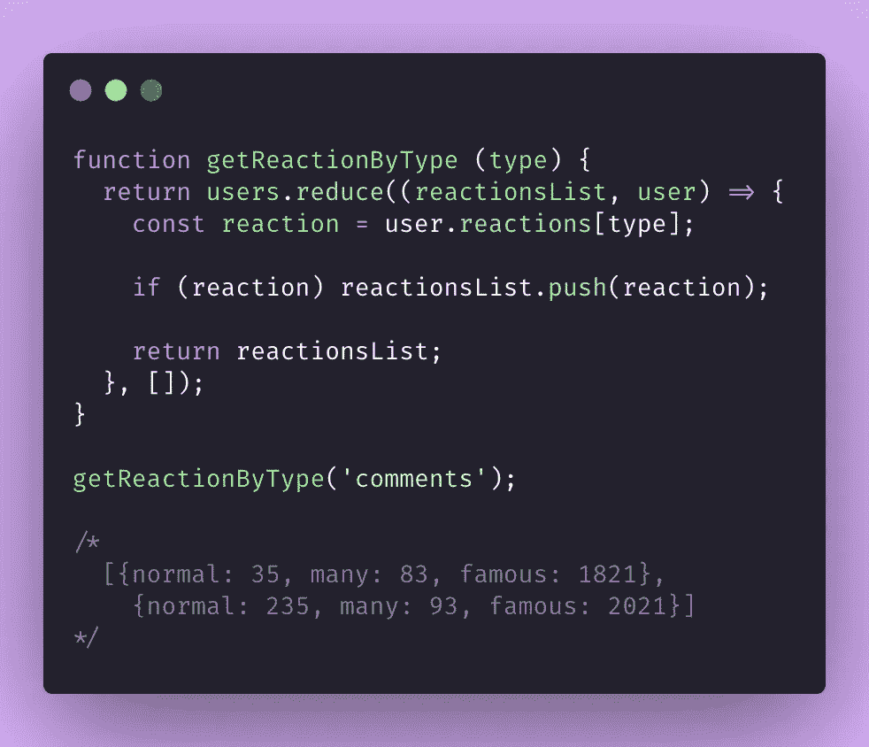

# 查找、过滤、映射和减少付诸行动

> 原文：<https://levelup.gitconnected.com/find-filter-map-and-reduce-put-to-action-e4f1a38e5607>

*找*，*滤镜*，*贴图*和*减少*都是很神奇的*数组* *方法*来自 *JavaScript* ，但是有时候我觉得大部分人还是有点搞不清楚它们🧐.所以在这篇短文中，我想用一些简单的代码片段展示这四个高阶函数*在实践中做了什么。*



> 我们称高阶函数为接受其他函数作为参数的函数，例如:find、filter、map 和 reduce。

让我们想象一下，我们正在与一个社交媒体 API 合作，我们正在获取用户的活动。我们收到的响应类似于下面的代码—请注意，对于所有用户，响应的模式并不相同:



响应 API

# 发现

第一个场景是:**我们希望通过用户的 id 来查找用户。**我们可以很容易地使用*查找* *方法*，传递搜索*参数* : *user.id === id* 。



函数通过 id 获取用户，使用 find 方法

*   这个*方法*返回找到的项目本身(本例中是一个对象)。
*   即使有多个条目与语句**匹配，也只会返回第一个匹配的条目。**
*   如果没有*值*匹配，将返回*未定义*。

```
The *Find method* signature is:
***array.find(callback(element,[, index[, array]]))*** ** index and array are optional*
```

# 过滤器

*Filter* *方法*与 *find* 非常相似，但在这种情况下，**我们感兴趣的是过滤列表，并最终根据我们定义的定界获得多个项目**:*user . reaction[type]【反应类型】>值。*



函数来获得反应，使用过滤方法。

*   这个*方法*总是返回一个项目的*数组*。
*   重点:*****滤镜* *方法*返回完整项。**我们无法选择返回，例如，只有来自用户的 id，在这种情况下，我们必须使用另一种*方法*来获得这个。**

```
The *Filter method* signature is:
***array.filter(callback(currentValue[, index[, array]])*** ** index and array are optional*
```

# **地图**

***贴图* *方法*常用于*反应 JS、*但是原因就不那么清楚了。当**我们想要迭代一个*数组*并获得一个新的*数组*** 时，我们使用这个*方法*——可能具有独占属性，就像我在关于*过滤器*的主题中举例说明的情况。在下面的例子中，我们想通过某种类型得到用户的反应，所以我们使用 *map* 迭代，只得到具体的反应类型。**

****

**函数通过类型获得反应，使用 map 方法。**

*   ***映射* **返回一个*数组*，该数组总是与原始数组**具有相同的长度，这可能很棘手！在本例中，id 为 3 的用户没有属性 *reactions.comments* ，因此它将在最终数组中作为 *undefined* 返回——在这种情况下，您可能会考虑使用*过滤器*链，但我们将在前面看到更好的解决方案。**
*   **这个*方法*已经 ***推送*每个*循环*** 返回的*值*，所以我们可以省略*推送*关键字。**
*   **如果我们只想改变数组上的某个东西，那么 ***forEach* *方法*就足够了——这个*方法*没有返回。****
*   **在 *React JS* 中，我们总是使用*映射*来遍历列表，并返回列表中的所有项目，以呈现在屏幕上，**所以我们使用*映射*，因为我们需要*数组的*返回。****

```
The *Map method* signature is:
***array.map(callback(currentValue[, index[, array]])*** ** index and array are optional*
```

# **减少**

**最后但并非最不重要的是，*方法* *减少*造成了很多恐惧和困惑🥺，但一旦你明白如何使用它，你就会爱上它！**这个*方法*用于将一个*数组*还原为一个新值(可能是一个*字符串*，一个*数字*，另一个*数组*，一个*对象*)。****

***Reduce* 能够解决我们在 *map* 用法上遇到的问题:我们想通过类型获得用户的反应，但是用户的对象没有相同的模式，所以我们需要验证类型是否存在。**

****

**函数使用 reduce 方法按类型获取反应。**

*   **这个*方法*返回*累加器*，它的类型根据我们在初始*值参数*上的设置而变化，这里是:【】(一个*数组*)。如果没有初始*值*，来自*数组*的第一个*值*将是*累加器*。**
*   **不要忘记返回*方法*内部的东西，否则会返回*未定义的*。一个常见的错误是这样写:*return reactions list . push(reaction)。*但是在这种情况下问题是 *push* *方法*返回*数组*的 *length* 表示我们正在推送一些东西，这会弄乱你的代码！所以总是返回*累加器*值本身。**

> **黄金提示:如果你用的是贴图+滤镜，闻起来像是缩小版！*🤯***

```
The magical formula is basically this:
***array.reduce(callback(accumulator, currentValue, [, index[, array]] )[, initialValue])*** ** index, array and initialValue are optional*
```

**我希望我能让你明白我们使用这些强有力的方法的区别和原因，如果你喜欢这篇文章，再见，鼓掌 50 次！🍄**