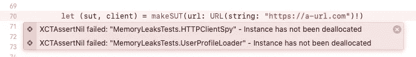

# 通过自动化测试发现潜在的内存泄漏

> 原文：<https://levelup.gitconnected.com/find-potential-memory-leaks-with-automated-tests-7b8d78a5274f>

## 内存处理和引用类型


豪尔赫·拉米雷斯在 [Unsplash](https://unsplash.com/s/photos/ram-memory?utm_source=unsplash&utm_medium=referral&utm_content=creditCopyText) 上拍摄的照片

就内存处理而言，在我们的 iOS 应用中工作可能非常具有挑战性，这意味着我们需要非常小心分配在内存中的`object instances`,并保证它们的正确释放。

正如你可能知道的，实例是通过 **ARC** 或**自动引用计数**从内存中释放的，在 iOS 上有两种类型的引用:强引用和弱引用。

强引用是默认的引用类型，让我们看一个简单的对象声明。假设我们有一个名为`Person`的类，我们如下声明一个对象:

```
**var** person = Person()
```

在前面的声明中，我们创建了一个对`Person`对象的强引用。每次我们创建一个强引用，我们就把*对象保留计数*加 1。那是什么意思？这为什么有用？这很有用，因为 ARC 不会从内存中删除一个对象，直到它的保留计数等于 0。

另一方面，弱引用不会增加对象保留计数。让我们看一个例子:

```
**var** person = Person()
**weak** **var** anotherPerson: Person? = person
```

在前面的例子中，我们创建了一个对同一个人对象的弱引用，现在我们有了强引用和弱引用。这意味着，即使我们对同一个 person 对象有两个引用，它的保留计数仍然是 1，因为其中一个是弱引用。弱引用的另一个重要方面是它们是可选的，因为我们可能在它们已经从内存中释放的时候访问它们。

# 通过测试找到保留周期和内存泄漏

当两个对象彼此具有强引用时，就会发生保留循环。结果是两个对象都将自己保留在内存中，因为它们的保留计数永远不会为 0。作为开发人员，我们需要打破这种循环，以便 ARC 能够释放那些对象占用的内存空间。

假设我们有两个对象，其中一个类型为`HTTPClient`，是`UserProfileLoader`对象的合作者。

```
**class** UserProfileLoader { **private** **let** client: HTTPClient
   **private** **let** url: URL **init**(url: URL, client: HTTPClient) {
      **self**.url = url
      **self**.client = client
   } **enum** Error: Swift.Error {
      **case** invalidProfileData
      **case** connectivity
   } **enum** Result: Equatable {
      **case** success(UserProfile)
      **case** failure(Error)
   } **func** loadProfile(completion: **@escaping** (Result) -> Void) {
      client.get(from: url) { data **in
         let** result = **self**.map(data: data)
         completion(result)
      }
   } **func** map(data: HTTPClientResult) -> Result {
      **return** .success(UserProfile(id: "an-user-id"))
   }}
```

```
**enum** HTTPClientResult {
   **case** success(Data)
   **case** failure(Error)
}**protocol** HTTPClient { **func** get(from url: URL, 
            completion: **@escaping** (HTTPClientResult) -> Void)}**class** HTTPClientSpy: HTTPClient { **var** completion: ((HTTPClientResult) -> Void)? = **nil** **func** get(from url: URL, 
            completion: **@escaping** (HTTPClientResult) -> Void) {

       **self**.completion = completion
   }}
```

```
**struct** UserProfile: Equatable {
   **var** id: String
}
```

在前面的例子中，我们的`UserProfileLoader`有一个名为`loadProfile`的方法，它调用类型为`HTTPClient`的组合`client`中的`get`方法。正如你所看到的，我们的`HTTPClientSpy`中的`get`的实现在一个名为`completion`的属性中存储了一个闭包，这使得我们的闭包可以从测试中访问。

上面的实现肯定包含了保留周期，但是为什么呢，在哪里呢？乍一看并不明显，不是吗？，我们再来看看。`UserProfileLoader`对`HTTPClient`对象有强引用，在哪里？另一方面，在`client`属性上，`HTTPClient`实现也强烈引用了`UserProfileLoader`，在哪里？你可能会说我们的`HTTPClientSpy`中没有存储任何`UserProfileLoader`，但肯定有一个。让我们再看看我们的`get`方法，这个方法将接收到的闭包存储在`completion` 属性中，这个闭包对我们的`UserProfileLoader`对象有一个强引用，在哪里？在`map`方法调用中。如你所见，我们通过明确使用`self`添加了一个强引用。

这种错误通常会在很多代码库中发现，有时它们并不明显，我们也不能避免陷入其中。我们可以通过使用自动化测试来减少这种可能性，但是怎么做呢？我们必须确保被测系统及其合作者 **SUT** 或**被适当地解除分配。**

让我们从写出第一个测试开始，这个测试将覆盖成功的路径。在这个例子中，我们的 SUT 将是我们的`UserProfileLoader`实例。

```
**func** test_load_withSuccesfulClientResponseDeliversSuccesLoadingResult() { **let** url = URL(string: "https://a-url.com")!
   **let** client = HTTPClientSpy() **let** sut = UserProfileLoader(url: url, client: client)}
```

我们已经有了给定的结果，现在我们必须将加载结果存储在某个地方，以做出一些断言，正如你所记得的那样，`loadProfile`方法将使用类型为 **(Result) - > Void** 的闭包来完成。让我们将结果存储在测试中。

```
**func** test_load_withSuccesfulClientResponseDeliversSuccesLoadingResult() { **let** url = URL(string: "https://a-url.com")!
   **let** client = HTTPClientSpy() **let** sut = UserProfileLoader(url: url, client: client) **var** capturedResults = [UserProfileLoader.Result]()
   sut.loadProfile { capturedResults.append($0) }}
```

在我们之前的测试中，负载闭包永远不会被执行，为什么？因为我们的`loadProfile`在调用`get`的实现，你还记得`get`的实现是做什么的吗？在我们的`HTTPClientSpy`实例中，`get`方法将接收到的闭包存储在一个属性中。我们必须在测试中调用存储的完成块来获得结果。

```
**func** test_load_withSuccesfulClientResponseDeliversSuccesLoadingResult() { **let** url = URL(string: "https://a-url.com")!
   **let** client = HTTPClientSpy() **let** sut = UserProfileLoader(url: url, client: client) **var** capturedResults = [UserProfileLoader.Result]()
   sut.loadProfile { capturedResults.append($0) } client.completion?(.success(Data()))}
```

现在我们可以开始用`capturedResults`数组做一些断言了。我们的`loadProfile`方法将总是以包含`UserProfile`实例的成功结果完成。这就是我们在测试中所期待的。

```
**class** MemoryLeaksTests: XCTestCase { **func** test_load_withSuccesfulCallDeliversSuccesLoadingResult() { **let** url = URL(string: "https://a-url.com")!
      **let** client = HTTPClientSpy() **let** sut = UserProfileLoader(url: url, client: client) **let** expectedResult: UserProfileLoader.Result =
          .success(UserProfile(id: "an-user-id")) **var** capturedResults = [UserProfileLoader.Result]()
      sut.loadProfile { capturedResults.append($0) }
      client.completion?(.success(Data())) XCTAssertEqual(capturedResults, [expectedResult]) }}
```

太好了！我们有一个通过测试！这个测试能确保我们的 SUT 和它的合作者的正确释放吗？还没有。让我们添加一些断言来确保我们的测试是从内存中释放的。

我们的`MemoryLeaksTests`类从`XCTestCase`类扩展而来，`XCTestCase`类为我们提供了一个名为`[addTearDownBlock](https://developer.apple.com/documentation/xctest/xctestcase/2887226-addteardownblock)`的方法，这个方法接收一个类型为 **() - > Void** 的块，每次测试函数结束时都会执行这个块。我们可以添加一个拆除块后，我们的 SUT 和它的合作者创造的权利。

```
**class** MemoryLeaksTests: XCTestCase { **func** test_load_withSuccesfulCallDeliversSuccesLoadingResult() { **let** url = URL(string: "https://a-url.com")!
      **let** client = HTTPClientSpy() **let** sut = UserProfileLoader(url: url, client: client) addTeardownBlock { [**weak** sut, **weak** client] **in** XCTAssertNil(client, "Instance has not been deallocated")
         XCTAssertNil(sut, "Instance has not been deallocated")
      } **let** expectedResult: UserProfileLoader.Result =
          .success(UserProfile(id: "an-user-id")) **var** capturedResults = [UserProfileLoader.Result]()
      sut.loadProfile { capturedResults.append($0) }
      client.completion?(.success(Data())) XCTAssertEqual(capturedResults, [expectedResult]) }}
```

现在我们已经有了我们的积木。请注意，在我们的块中，我们添加了对`sut`和`client`实例的弱引用，以避免进一步增加它们的保留计数。现在我们的绿色测试不再是绿色的了，因为拆卸块断言失败了。

为了去除保留循环，我们可以避免在我们的`loadProfile`方法中显式使用`self`。我们有一些选择:

1.  在我们的闭包中使用一个**弱**引用，并添加 guard let 块来解开结果；
2.  把我们的`map`方法变成静态方法；或者
3.  将`map`方法移动到映射器类静态方法

在本例中，我将使用第二个选项来打破保留循环并通过测试。

```
**func** loadProfile(completion: **@escaping** (Result) -> Void) {
   client.get(from: url) { data **in** completion(UserProfileLoader.map(data: data))
   }
}**static** **func** map(data: HTTPClientResult) -> Result {
   **return** .success(UserProfile(id: "an-user-id"))
}
```

现在我们的测试通过了，但是…它看起来有点乱，所以让我们重构我们的测试来清理一下。假设我们想要添加更多的测试功能(相信我，我们会想要的🙂)，我们将创建我们的 SUT 和它的合作者，并为他们每个人添加拆除块，这意味着我们将重复自己。

为了重构这个测试，我们将创建一些工厂方法。第一个将是我们的`makeSUT`方法，这个方法将返回 SUT 及其合作者。

```
**class** MemoryLeaksTests: XCTestCase { **func** test_load_withSuccesfulCallDeliversSuccesLoadingResult() { **let** (sut, client) = 
          makeSUT(url: URL(string: "https://a-url.com")!)
      **let** expectedResult: UserProfileLoader.Result =
          .success(UserProfile(id: "an-user-id")) **var** capturedResults = [UserProfileLoader.Result]()
      sut.loadProfile { capturedResults.append($0) }
      client.completion?(.success(Data())) XCTAssertEqual(capturedResults, [expectedResult])
   } // MARK: **- Helpers** **func** makeSUT(url: URL,
                file: StaticString = **#filePath**,
                line: UInt = **#line**) -> (sut: UserProfileLoader, client: HTTPClientSpy) { **let** client = HTTPClientSpy()
      **let** sut = UserProfileLoader(url: url, client: client)
      addTeardownBlock { [**weak** sut, **weak** client] **in** XCTAssertNil(client, 
                      "Instance has not been deallocated", 
                      file: file, 
                      line: line)
         XCTAssertNil(sut, 
                      "Instance has not been deallocated", 
                      file: file, 
                      line: line)
      } **return** (sut, client) }}
```

现在我们有一个更干净的测试！我们的测试可读性更强，我们还有一个很大的优势！除了清洁剂测试还有哪个？你可能会说，如果你看一看`makeSUT`工厂方法，这个方法添加了我们的分解块，这意味着一旦测试完成，使用这个方法创建 SUT 的每个测试将自动验证 SUT 及其合作者是否被正确地从内存中释放。如果 SUT 及其合作者没有从内存中释放，测试将在`makeSUT`调用中显示错误，因为我们正在将`file`和`line`参数传递给`XCTAssertNil`。



遵循这种方法将给予我们重构的信心，并验证我们正在进行正确的内存管理。