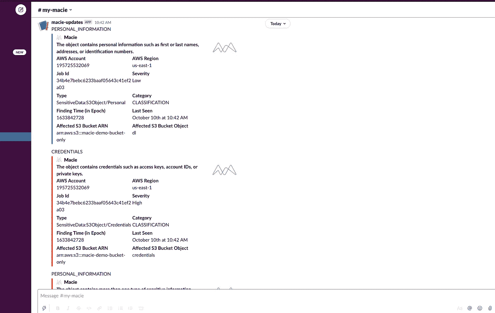

# 使用 AWS Macie 查找 AWS S3 中的敏感数据，并通知 Slack 用户

> 原文：<https://levelup.gitconnected.com/find-sensitive-data-in-aws-s3-using-aws-macie-notify-slack-users-1fbcab8ad19d>

**AWS Macie** 是来自 AWS 的**托管服务，它使用 **ML(机器学习)**从存储在 **AWS S3 桶**中的对象中识别敏感数据，如 **PII(个人身份信息)**。**


AWS Macie

根据 **NIST FIPS-199 标准**，以下是每个安全目标(机密性、完整性和可用性)的潜在影响定义:


*更多详情请参考链接—*

[*https://nvlpubs.nist.gov/nistpubs/fips/nist.fips.199.pdf*](https://nvlpubs.nist.gov/nistpubs/fips/nist.fips.199.pdf)

[*https://cdt.ca.gov/wp-content/uploads/2017/03/NIST.FIPS _ . 199 . PD-10 . pdf*](https://cdt.ca.gov/wp-content/uploads/2017/03/NIST.FIPS_.199.pd-10.pdf)

在这篇博客中，我们将看到如何使用 AWS Macie 和 AWS Lambda 来发现 AWS S3 对象中潜在的敏感数据，并通知我们的 Slack channel。

# 我的架构:


AWS Macie 与其他 AWS 服务相结合，可在出现任何合规性问题时自动发出通知

**步骤 1:创建一个松弛的网钩**

作为先决条件，准备好一个 Slack Webhook，它有一个特定的通道，用于向它发送通知。如果没有，请点击链接([https://api.slack.com/apps](https://api.slack.com/apps))，按照 Slack 文档在 Slack 上创建一个应用程序，然后添加一个新的 Webhook。

完成后，您应该会看到您的应用程序列在 Slack 应用程序部分:


**第二步:编写 AWS Lambda 函数**

我已经使用了 **AWS SAM(无服务器应用程序模型)**来创建和部署 **AWS Lambda** ，但是您可以使用任何其他无服务器框架或使用内置 IDE(即 AWS 控制台上的 Cloud9)直接编写/上传您的 Lambda。

**我的 Lambda 项目结构(使用 Node 14.x 运行时):**


**AWS SAM 无服务器 YAML 文件:**

```
AWSTemplateFormatVersion: '2010-09-09'
Transform: AWS::Serverless-2016-10-31
Description: >
  mymacieSAM Template for mymacie

Globals:
  Function:
    Timeout: 3Resources:
  MacieFunction:
    Type: AWS::Serverless::Function
    Properties:
      CodeUri: macie/
      Handler: app.lambdaHandler
      Runtime: nodejs14.x
      Architectures:
        - x86_64
      Events:
        Macie:
          Type: Api 
          Properties:
            Path: /macie
            Method: getOutputs:
  MacieApi:
    Description: "API Gateway endpoint URL for Prod stage for Hello World function"
    Value: !Sub
  MacieFunction:
    Description: "Macie Lambda Function ARN"
    Value: !GetAtt MacieFunction.Arn
  MacieFunctionIamRole:
    Description: "Implicit IAM Role created for Macie function"
    Value: !GetAtt MacieFunctionRole.Arn
```

**app.js 文件**

```
const {
    IncomingWebhook
} = require('[@slack/webhook](http://twitter.com/slack/webhook)');
const url = process.env.SLACK_WEBHOOK_URL;
const webhook = new IncomingWebhook(url);let response;exports.lambdaHandler = async (event, context) => {
    try {
        console.log(event.detail.resourcesAffected);
        const finding = event.detail.classificationDetails.result.sensitiveData[0].category;
        const findingDescription = event.detail.description;
        const findingTime = event.detail.updatedAt;
        const findingTimeEpoch = Math.floor(new Date(findingTime) / 1000);
        const account = event.detail.accountId;
        const region = event.detail.region;
        const type = event.detail.type;
        const jobId = event.detail.classificationDetails.jobId;
        const lastSeen = `<!date^${findingTimeEpoch}^{date} at {time} | ${findingTime}>`;
        const severity = event.detail.severity.description;
        const category = event.detail.category;
        const color = (`${severity}` === 'High') ? '#FF0000' : (`${severity}` === 'Medium') ? 'FFA500' : '#2091fa';
        const s3BucketArn = event.detail.resourcesAffected.s3Bucket.arn;
        const s3BucketObject = event.detail.resourcesAffected.s3Object.key;await webhook.send({
            channel: 'my-macie',
            pretext: `AWS Macie in the AWS Region ${region} for AWS Account id as ${account}`,
            text: `${finding}`,
            attachments: [{
                color: `${color}`,
                title: `${findingDescription}`,
                author_name: "Macie",
                author_link: "[http://flickr.com/bobby/](http://flickr.com/bobby/)",
                author_icon: '[https://k8s-nest.s3.amazonaws.com/download.png'](https://k8s-nest.s3.amazonaws.com/download.png'),
                thumb_url: '[https://k8s-nest.s3.amazonaws.com/download.png'](https://k8s-nest.s3.amazonaws.com/download.png'),
                fields: [{
                        title: 'AWS Account',
                        value: `${account}`,
                        short: true
                    },
                    {
                        title: 'AWS Region',
                        value: `${region}`,
                        short: true
                    },
                    {
                        title: 'Job Id',
                        value: `${jobId}`,
                        short: true
                    },
                    {
                        title: 'Severity',
                        value: `${severity}`,
                        short: true
                    },
                    {
                        title: 'Type',
                        value: `${type}`,
                        short: true
                    },
                    {
                        title: 'Category',
                        value: `${category}`,
                        short: true
                    },
                    {
                        title: 'Finding Time (in Epoch)',
                        value: `${findingTimeEpoch}`,
                        short: true
                    },
                    {
                        title: 'Last Seen',
                        value: `${lastSeen}`,
                        short: true
                    },
                    {
                        title: 'Affected S3 Bucket ARN',
                        value: `${s3BucketArn}`,
                        short: true
                    },
                    {
                        title: 'Affected S3 Bucket Object',
                        value: `${s3BucketObject}`,
                        short: true
                    }
                ]}]
        });// const ret = await axios(url);
        response = {
            'statusCode': 200,
            'body': JSON.stringify({
                message: 'hello macie',
                // location: ret.data.trim()
            })
        }
    } catch (err) {
        console.log(err);
        return err;
    }return response
};
```

*注意:在这里，我将环境变量作为 SLACK_WEBHOOK_URL 传递给这个 Lambda 函数，其中包含在上面步骤 1 中创建的实际 Slack Webhook 的值。确保此环境变量是使用 Lambda 函数资源中的无服务器/云信息 YAML 模板传递的，或者是手动创建的。*

**步骤 3:为 Macie 服务创建一个 AWS EventBridge(以前称为 AWS CloudWatch 事件)规则来触发这个 Lambda**

我已经为 EventBridge 创建了规则，目标是这个 Lambda(在上面的步骤 2 中创建的):


目标为 Lambda 的 Macie 的 AWS EventBridge 规则

**步骤 4:启用 Macie 并创建作业**

**AWS Macie 是一项地区性服务**，这意味着每当您希望在特定地区运行 S3 桶扫描时，必须首先启用该服务。

在我的情况下，我的 S3 水桶和梅西服务都在 us-east-1(北弗吉尼亚州)。

启用它，然后为 Macie 创建一个作业(预定的或一次性的)来执行扫描。


启用 AWS Macie

下面的屏幕截图显示了您希望如何运行此作业来发现敏感数据。对于这个演示，我将使用**一次性工作**。


这些是被管理的数据标识符。如果您想排除任何特定的预定义模式或标识符，如**AUSTRALIA _ DRIVERS _ LICENSE**，那么您可以选择“ **Exclude** ”选项，然后选择该标识符。在这个演示中，我没有排除任何东西，所以我将选择' **All** '选项。


如果您想为敏感信息(如 **Aadhaar** )添加任何带有您自己的正则表达式模式的自定义标识符，那么您可以在这里创建一个。


最后，给 Job 命名，等待 Macie 运行并完成结果。

完成后，您将在 Macie service plus 上看到摘要，并会收到一条发送到 Slack 频道的通知


AWS Macie —摘要

瞧吧！开始:-) 我们收到了包含以下信息的松弛通知:AWS 帐户、区域、S3 时段、对象名称、严重级别(在 S3 对象中发现的 PII 的高、中或低级别:



AWS Macie 报告的时差通知

注意，我已经定制了 Slack 消息，如果严重性为**低**，则以蓝色显示消息，如果严重性为**高**，则以红色显示消息。

希望你喜欢这篇文章:)

# **概要:**

在这篇博客中，我们看到了如何使用内置机器学习技术的 AWS Macie 来识别和报告各种潜在的敏感数据。不仅如此，我们还可以在标准规则的基础上提供自定义模式来识别敏感数据。在这里，我们还看到了如何将 AWS Macie 与其他 AWS 服务和 Slack 结合使用，以构建一个自动化的完全流水线系统来报告此类事件，以便您的合规团队对数据采取进一步的行动。

像往常一样，您可以在 GitHub 存储库中找到代码:

[](https://github.com/vinod827/mymacie) [## GitHub - vinod827/mymacie

### 该项目包含无服务器应用程序的源代码和支持文件，您可以使用

github.com](https://github.com/vinod827/mymacie)