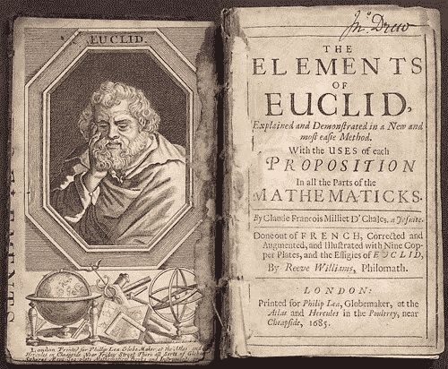
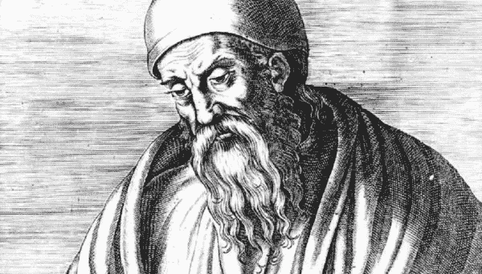
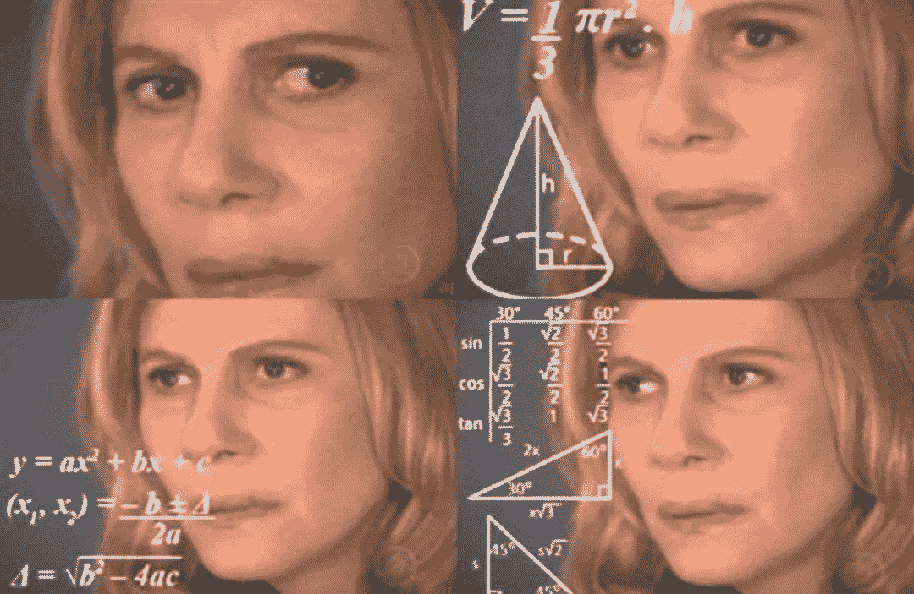
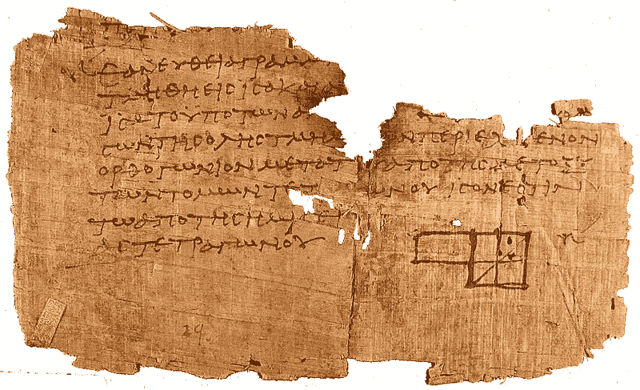
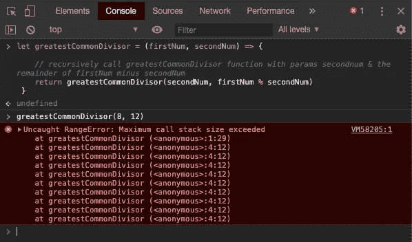

# 在 Javascript 中找到最大公约数

> 原文：<https://levelup.gitconnected.com/find-the-greatest-common-divisor-in-javascript-8e1f405d2a22>

## [带有完整解决方案代码的 Github repo&测试套件](https://github.com/noamsauerutley/greatest-common-divisor)

> 给定两个不都是零的整数，找出能被每个整数整除的最大正整数。

我们每天使用的大多数数字工具都依赖于加密。在他们架构的某个地方，有时很多次或很多地方，web 应用程序使用 [RSA 加密](https://en.wikipedia.org/wiki/RSA_(cryptosystem))来控制授权&认证，保护存储的数据，等等。

然而，这些加密过程经常使用最古老的常用算法之一的版本——T4 欧几里德算法。

算法可以追溯到很久以前。

虽然我们通常在数学或计算机编程的背景下谈论算法，但它们并不局限于这些背景。

毕竟，算法可以广义地定义为:

> [解决问题或完成某些目标的一步一步的过程](https://www.merriam-webster.com/dictionary/algorithm?src=search-dict-hed)

根据这个定义，我们大多数最古老的算法实际上是[配方](https://www.atlasobscura.com/articles/putting-ancient-recipes-plate-classical-recipes-cooking)。

显然，我们的时间线只能追溯到幸存的书面记录，因此不幸地忽略了所有只在口头传统中保留到后来的算法。

我们最古老的算法书面记录大多是食谱(用于[啤酒](https://www.realmofhistory.com/2017/09/22/oldest-beer-recipe-mesopotamia-ninkasi/)、[炖菜](https://www.historyofinformation.com/detail.php?id=2212)和[更多](https://www.realmofhistory.com/2018/04/04/9-oldest-food-recipes-history/))，主要来自美索不达米亚，很大程度上是因为他们使用相对耐用的粘土片来书写。

现存最早的数学(非食物)算法的书面记录是[埃及文，详细描述了从公元前 1700 年到公元前 2000 年数字相乘的过程。接下来，大约在公元前 1600 年，](https://en.wikipedia.org/wiki/Ancient_Egyptian_multiplication)[巴比伦人记录了因式分解和求平方根的算法。](https://en.wikipedia.org/wiki/Methods_of_computing_square_roots#Babylonian_method)

时间轴上的下一个？有记载的最古老的[整数关系算法](https://en.wikipedia.org/wiki/Integer_relation_algorithm)，约公元前 300 年由欧几里德提供。

欧几里得至今仍是一个模糊的人物。当然，有很多关于他的故事，但其中许多故事都是流传的流行传说，与许多不同的著名古人有关。我们不知道他出生在哪里。我们不知道他何时出生，也不知道他何时去世。他实际上没有被命名为欧几里得——εὐκλείδης是一个描述符，大致翻译为“伟大的”。

当你听到“欧几里得”时，跃入脑海的脑海图像可能是一串模糊的几何图形。

那是因为他最为人所知的是他的《元素》*(*στοιχεῖα*)的作者身份，这是一篇权威论文，它给了我们……嗯，几乎所有我们所知道的关于抽象数学理论早期探索的东西。这篇文章是使用数学探索形状的开创性工作，以至于我们仍然引用欧几里得几何。*

*基本上，他因发明几何学而出名。*

*人们不相信欧几里德实际上在他的书中提出了所有开创性的工作——他引用了早期思想家的各种现已失传的文本，并经常归功于他人的想法。然而，这一文本是我们所拥有的最古老的这些思想的集合，欧几里得做了令人难以置信的大量工作来组织，扩展，并以他自己的思想为基础。他创造了记录，编纂了他所知道的世界的数学创新，他的书非常受欢迎，在他的时代广泛发行，从未停止被复制和使用。*

**

*含有一部分元素的尖喙纸莎草的碎片*

*然而，他不仅仅研究几何图形。还记得今天仍在使用的最古老的算法吗？是啊。他写的。他自己发明的吗？很可能不是。但他探索并记录了它，使它成为数学史的一部分，并最终为我们今天所用。*

*那么欧几里德算法到底是什么呢？*

*同样，它解决的挑战是找到两个数的最大公约数。[除数](https://en.wikipedia.org/wiki/Divisor)是一个可以被任意一个数整除的数，例如，没有[余数](https://en.wikipedia.org/wiki/Remainder)(小数或分数)。*

*因此，举例来说，1，2 和 4 是 4 的约数。*

*1、2、3 和 6 都是 6 的约数，但 4 除以 3 等于 1.333333(不能均匀地除以 3，余数为 0.333333)，4 和 6 也不能均匀地除以彼此，因此 4 和 6 之间唯一的共享约数是 1 和 2。因此，4 和 6 的最大公约数是 2。*

*现在，我们刚刚完成的逻辑是一个基本的“强力”解决方案，用于解决寻找最大公约数的挑战，我们为两个数字中的每一个制作了一个所有约数的列表，比较这些列表，直到我们找到所有共享的约数，然后找到列表中的最大数字。*

*我想，这对于非常小的数字(比如 4 & 6)是可行的，但是想象一下，尝试使用这种方法来寻找两个非常大的数字的最大公约数？这将是灾难性的费力。*

*因此，我们可以应用欧几里得记录下来并传给我们的算法。*

*这取决于数学原理，即两个数的最大公约数与较小数的最大公约数以及较大和较小数的差(例如，较大的数减去较小的数)相同。*

*比如 252 和 105 的最大公约数是 21。*

*   *252 = 21 × 12*
*   *105 = 21 × 5*

*我们来测试一下这个逻辑:252 减 105 等于 147。*

*   *147 = 21 × 7*
*   *105 = 21 × 5*

*21 可以被 147 整除，并且没有比 105 更大的除数。到目前为止，这个数学原理似乎是正确的。*

*然而，这有什么价值呢？如何更高效的应用于求两个数的最大公约数？*

*用两个数字的差来代替较大的数字，可以得到一个较小的数字。如果我们递归地应用这个过程，我们可以获得连续更小的数字对，直到两个数字最终相等。当我们的一对数字匹配时，我们就找到了最大公约数。*

*好的，那么这在代码中是什么样子的呢？*

*首先，我们将运行一个函数——我将其命名为 greatestCommonDivisor，并传入两个参数:firstNum 和 secondNum。*

*为了开始缩小我们的数字，我要递归调用函数。*

> *如果你是递归的新手，可以看看[我写的关于寻找一个字符串的所有排列的文章](/find-all-permutations-of-a-string-in-javascript-af41bfe072d2)，以便获得更多关于递归的内容&有用的链接！*

*我们可以再次调用我们的函数，但是这次将 firstNum 减去 secondNum 的余数(使用[模操作符](https://en.wikipedia.org/wiki/Modulo_operation))赋给变量 secondNum。这将允许我们有效地开始“缩小”我们的数字，正如欧几里德的逻辑所指示的，直到两个数字变得相等，提醒我们已经找到了我们的最大公约数。*

*然而，如果你以前使用过递归，你可能会注意到我们遗漏了一些东西——一个[基础案例](https://en.wikipedia.org/wiki/Recursion#base_case)。*

*基本情况告诉我们收缩模式何时停止——没有它，函数将不断递归调用自己，直到出错。*

*如果我们把这段代码直接扔进我们的控制台，我们会得到一个堆栈溢出错误:*

**

*没有广场*

*因此，让我们添加一个基本案例:*

*之前，我们说过我们希望找到越来越小的数字对，直到两个数字(firstNum 和 secondNum)相等，对吗？*

*对于我们的基本情况，如果两个数的余数为零，我们可以停止递归。*

*到目前为止，我们已经编写了代码，当我们递归调用函数时，我们将余数的值赋给 secondNum。所以我们可以在函数中弹出一个条件，如果 secondNum 为零(即一个 [falsy](https://developer.mozilla.org/en-US/docs/Glossary/Falsy) 值)，就停止并返回 firstNum。*

*当我们把这个扔进我们的控制台时会发生什么？*

*🌟太好了！我们的函数返回 4，这实际上是 8 和 12 的最大公约数。*

*然而，我们还可以做更多的事情来使这个函数具有适应性和实用性。*

*如果用户输入负数会发生什么？毕竟，即使我们放入-8 和-12，4 仍然会被这两者平分，并且是最大公约数。如果我们在函数中输入负数会发生什么？*

*没有。这是不对的。*

*让我们添加一个条件来检查负数。如果我们的输入是负的，我们可以简单地将它们转换成正数，然后继续我们的方法——最大公约数不会改变一个数是正还是负。*

*我们可以检查我们的参数是否小于零。如果是，我们可以将该变量重新赋值给一个与之前值相反的值。由于两个负数变成了正数，这将使我们的输入数字变成正数。*

*好的，让我们把它扔进控制台，看看我们是否得到正确的值 4:*

*🌟太好了！我喜欢这种算法能够容纳负数，因为许多算法只有在提供正整数时才能工作。*

*除此之外，我们不是还跳过了一开始的挑战吗？*

> *给定两个不都是零的整数，找出能被每个整数整除的最大正整数。*

*我说的是**“不都零”**部分。我们没有任何条件检查。*

*因此，让我们添加一个，和一个好的错误消息，使我们的功能对用户更直观。*

*这将测试以确保 firstNum 和 secondNum 不都为零。一个是零没关系，但不可能两个都是。让我们看看控制台中会返回什么:*

*🌟太好了！最后，在用户友好性的最后一步，让我们给条件增加一个额外的要求，这样，如果用户试图输入任何非整数的内容，就会得到同样的错误消息。*

*就是这样！🌟*

*现在，如果我们的函数收到的参数不是整数或者都是零，它将返回错误消息。否则，它将进入我们的递归循环，寻找最大公约数。*

**