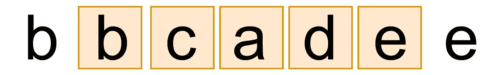

# 查找没有重复字符的最长子字符串的长度— Leetcode

> 原文：<https://levelup.gitconnected.com/find-the-length-of-the-longest-substring-without-repeating-characters-leetcode-93cde18310bf>



推拉窗

# 问题

给定一个字符串，找出没有重复字符的**最长子串**的长度。

## 例子

**例一:**

```
**Input:** s = "abcabcbb"
**Output:** 3
**Explanation:** The answer is "abc", with the length of 3.
```

**例二:**

```
**Input:** s = "bbbbb"
**Output:** 1
**Explanation:** The answer is "b", with the length of 1.
```

**例 3:**

```
**Input:** s = "pwwkew"
**Output:** 3
**Explanation:** The answer is "wke", with the length of 3.
Notice that the answer must be a substring, "pwke" is a subsequence and not a substring.
```

**例 4:**

```
**Input:** "abcade"
**Output:** 5
**Explanation:** The answer is "bcade", with the length of 5.
```

# 解决方案 01

```
def lengthOfLongestSubstring(s):
    if len(s) == 0:
        return 0

    max_len = 0

    for i in range(len(s)):
        _map = {}
        _map[s[i]] = 1

        for j in range(i+1, len(s)):
            temp = j
            if s[j] not in _map:
                _map[s[j]] = 1
            else:
                break

        max_len = max(max_len, len(_map))

    return max_len
```

## 时间和空间复杂性

*   **时间复杂度** : O(N*N-1)
*   **空间复杂度** : O(D)

# 解决方案 02

```
def lengthOfLongestSubstring(s):
    if len(s) == 0:
        return 0

    max_len = 0 # map of last index of every character
    last_idx = {}
    # starting index of current window to calculate max_len
    start_idx = 0

    for i in range(0, len(s)):
        if s[i] in last_idx:
            start_idx = max(start_idx, last_idx[s[i]] + 1) # Update result if we get a larger window
        max_len = max(max_len, i-start_idx + 1) # Update last index of current char.
        last_idx[s[i]] = i return max_len
```

## 说明

```
Latest:  {}
Index:  0  Current char:  a
i:  0  start_idx:  0
max_len:  1
Latest:  {'a': 0}
====================Index:  1  Current char:  b
i:  1  start_idx:  0
max_len:  2
Latest:  {'a': 0, 'b': 1}
====================Index:  2  Current char:  c
i:  2  start_idx:  0
max_len:  3
Latest:  {'a': 0, 'b': 1, 'c': 2}
====================Index:  3  Current char:  a
i:  3  start_idx:  1
max_len:  3
Latest:  {'a': 3, 'b': 1, 'c': 2}
====================Index:  4  Current char:  b
i:  4  start_idx:  2
max_len:  3
Latest:  {'a': 3, 'b': 4, 'c': 2}
====================Index:  5  Current char:  c
i:  5  start_idx:  3
max_len:  3
Latest:  {'a': 3, 'b': 4, 'c': 5}
====================Index:  6  Current char:  b
i:  6  start_idx:  5
max_len:  3
Latest:  {'a': 3, 'b': 6, 'c': 5}
====================Index:  7  Current char:  b
i:  7  start_idx:  7
max_len:  3
Latest:  {'a': 3, 'b': 7, 'c': 5}
====================
```

## 时间和空间复杂性

*   **时间复杂度** : O(N+D)。给定 N 是字符串中的字符数，D 是输入字符串字母表中的字符数。
*   **空间复杂度** : O(D)

# 外卖食品

感谢您阅读这个简短的解题问题。如果有人知道更好或更快的时间复杂度来解决这个问题，请随意评论和反馈。和平！✌️