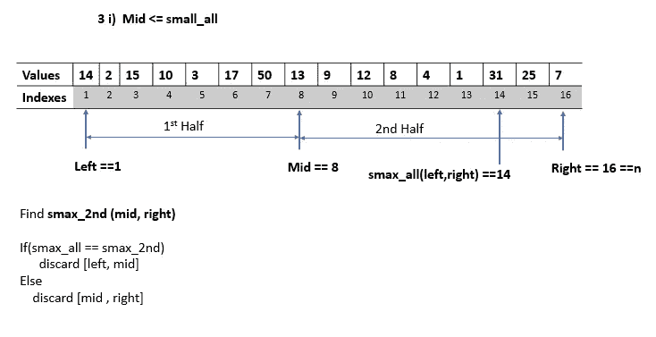
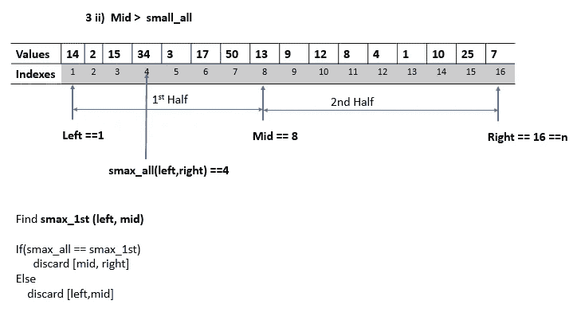
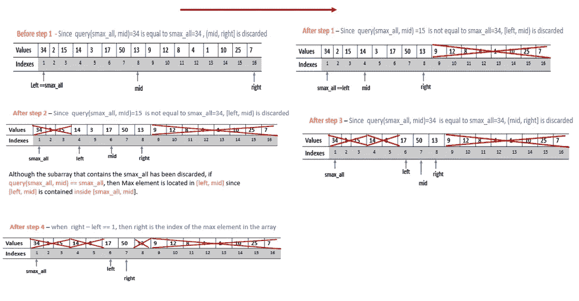
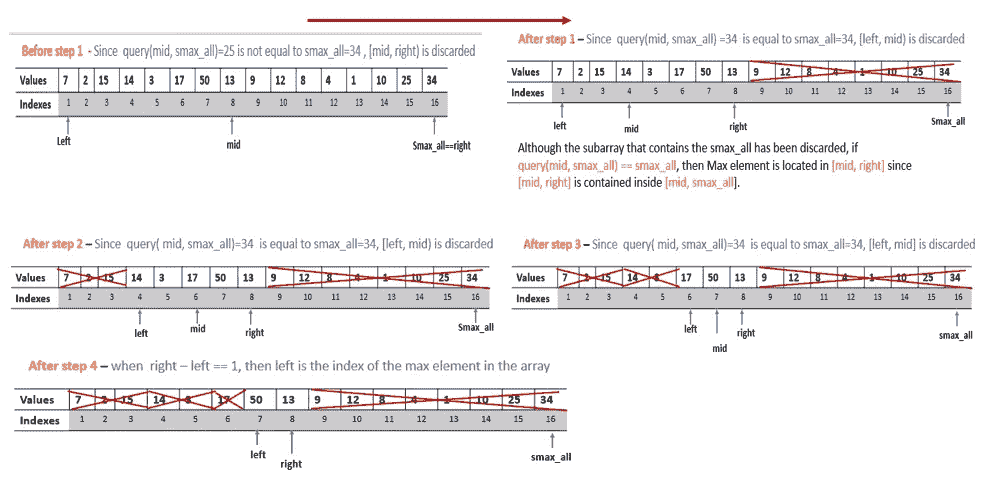

# 使用二分搜索法查找未排序数组中 Max 元素的位置

> 原文：<https://levelup.gitconnected.com/find-the-location-of-the-max-element-in-an-unsorted-array-using-binary-search-96b6d2c9a547>

在这篇文章中，我将解释我最近遇到的一个最有趣的算法问题的解决方案。与此同时，消除对二分搜索法的普遍误解(BS)。

**问题陈述**
有一个大小为 **n** ( 2 ≤ **n** ≤ 10⁵).的**未排序**数组该数组包含不同的整数值。给你一个数组 **n** 的大小，你的任务是找到数组中最大元素的**索引** ( 1 ≤ **索引** ≤n)。您还可以访问一个**对象**，从中您可以使用方法格式、 **object.query(left，right)、**(**1≤left<right≤n**)查询原始数组的任意子数组【T17【left，right】中第二个最大元素的位置。您最多只能进行 **20** 次查询。你的任务是完成下面的功能。

**问题陈述说明
1。你的任务是写一个函数，找到数组中最大值的位置或索引，并返回( **1 ≤ index ≤ n** )。请注意，该数组没有排序。还要注意，这个问题不是问最大元素，而是问它在数组中的位置(不是从零开始的索引)。
2。数组是固定的，单个测试用例的所有查询结果都来自同一个数组，因此 max 元素在数组中的位置是固定的。
3。您可以查询原始数组的特定子数组中第二个最大元素的**索引**最多 **20** 次。对于对象查询方法的参数，**右**和**左**参数之差必须大于或等于 1。**

> 这个问题最近出现在一次编程大赛上。这个问题引起了我的兴趣，所以我决定分享解决方案，并澄清一些关于 BS 的误解。我修改了这个问题，以适应这篇文章的目的，因为它是一个互动的问题。

如果你读到这里，我相信你会思考这个问题以及如何用 BS 来解决它。我一直相信 BS 只能应用在一个排序的数组上。不过最近了解到，BS 应用并不依赖于搜索到的数组(或空间)是否排序。**它实际上取决于被搜索数组的已知属性/特征**。
更正式的说法是，二分搜索法，顾名思义，*是一种通过不断将搜索空间一分为二，在对数时间内高效找到目标元素的搜索技术*。为了使 BS 工作，**在被搜索的数组**之内或之外必须存在某种知识/信息，这使得在单次移动之后精确地将搜索的空间减少几乎一半成为可能。**知道**一个数组被排序就足够**信息**来应用 BS，因为我们知道，在一个排序的数组中，每个`i < j`、`ai <= aj`或`ai ≥ aj`。但是，可能存在对数组的不同了解(在排序之外),这使得在单次移动之后将搜索的数组减少一半成为可能。其他几个问题也在未排序的数组上使用 BS。关于 BS 说得够多了，让我们回到最初的问题，看看如何用 BS 来解决它。

**解决方案:方法 1** (超过的查询数)
让我们考虑可用于在我们的“神秘”数组中找到最大元素的信息。我用了“神秘”这个词，因为我们实际上对数组值一无所知。如果是，我们如何找到最大元素的位置？
原来，通过最多询问 2 次关于数组中第 2 个最大值元素或其子数组(对我们可用)的位置，我们就可以知道最大值元素位于数组的哪一侧。这样，我们就能够在进行一些查询后将数组分成两半，并最终到达最大元素的位置。

**步骤**
**1** 。设`left`和`right`为当前搜索空间的第一个和最后一个索引。找到数组的中间索引，即`mid = (left+right)/2`。现在，`mid`已经将当前搜索空间分成了两半:`[left,mid]`和`[mid,right]`。

**2** 。找到第二个最大元素在`left`和`right`索引之间的位置(即当前搜索空间中的第二个最大元素)，即
`smax_all = object.query(left,right)`，其中`object`是要求我们完成的函数中给出的查询对象。

**3 i** 。如果整个当前搜索空间中的第二个最大值元素位于数组的后半部分(即`mid <= smax_all`)，则查找后半部分的第二个最大值元素(即`smax_2nd = object.query(mid, right)`)。如果整个数组中的第二个 max 元素和数组后半部分中的第二个 max 元素相等(即`smax_all == smax_2nd`，那么数组中的最大元素必须在后半部分，因此用`mid`指针替换`left`指针。然而，如果`smax_all != smax_2nd`，那么最大元素不在后半部分，因此用`mid`指针替换`right`指针。

3i)当 **mid ≤ smax_all** 时

**三世。**如果当前搜索空间的第二个最大值元素位于数组的前半部分(即`mid > smax_all`)，则查找前半部分的第二个最大值元素(即`smax_1st = object.query(left, mid)`)。如果整个数组中的第二个 max 元素和数组前半部分中的第二个 max 元素相等(即`smax_all == smax_1st`，那么数组中的最大元素必须在前半部分，因此通过用`mid`指针替换`right`索引来丢弃后半部分。然而，如果`smax_all != smax_1st`，那么最大元素不在前半部分，因此通过用`mid`指针替换`left`指针来丢弃前半部分。

3ii)当**中期> smax_all** 时

至此，搜索到的数组减少了一半。递归/迭代地应用上述步骤，直到`left`和`right`指针之间的差变为 1，然后返回最近没有更新的指针。下面是上述步骤的代码实现。

第一种方法的代码实现(Java)

**方法 1 的分析**
显然，由于我们使用了 BS，所以上述方法的时间复杂度为`O(logn)`。然而，我们的解决方案是根据我们的查询次数来评估的。由于使用了 BS，如果数组大小是输入上限 10⁵，则需要 17 次分裂(即 lo `g(10^5) = 17 ,` log 以 2 为基数)才能找到最大元素。然而，每次我们将搜索空间分成两个部分时，我们使用了两个查询。基于方法 1，在最坏的情况下，将需要总共 34 次(即 2 * 17)查询来找到大小为 10⁵的数组中的 max 元素。这显然违反了问题陈述中给出的约束(即最多 20 个查询)。我们能做得比这更好吗？我们能做到每一步都没有 2 个查询吗？

**方法 2** —查询数量少于允许的最大查询数量
在第一种方法中，我们在每一步使用 2 个查询来分割搜索空间。我们真的需要两次查询来决定在每一步中丢弃数组的哪一半吗？
让我们理解为什么我们在每一步都需要两个查询。第一个查询(`smax_all`)用于识别当前搜索空间中第二个最大元素的索引，而第二个查询(`smax_1st`或`smax_2nd`)用于验证基于第一个查询的结果丢弃当前搜索空间的哪一半。这意味着第二个查询依赖于第一个查询的结果。然而，只有第二个查询的结果实际上有助于当前搜索空间的分裂。我们可以不在每一步都进行第一次查询吗？是啊！我们可以。

如果我们知道每一步中第二个 max 元素的位置，就不需要第一个查询。注意，在每一步之后，搜索空间中的第二个最大值元素或者改变(即减小)或者保持不变。例如，考虑数组`[1,2,8,4,9,3,40,21]`。在 BS 的第一步之后，搜索的数组减少到`[9,3,40,21]`，并且第二最大元素(即`21`)不变，因为最大元素和第二最大元素都在数组的相同一半上。然而，在该阵列`[1,40,3,4,9,5,20,10]`中，第二个最大元素在 BS 的第一步之后改变(即`[1,40,3,4] — second max changed from 20 to 4`)。我们如何防止第二个最大值元素在每一步都发生变化，我们如何从中受益？让我们考虑两种情况；

**第一种情况** —当原始数组中的第二个最大元素是包含最大元素的子数组中的第一个元素时(即`[smax_all,right])`)。在应用 BS 之前，`left`指针等于`smax_all`。我们如何利用这种安排？
由于我们已经知道第二个最大元素的位置，所以只需要一次查询，即`object.query(smax_all, mid)`，就可以将搜索空间缩小一半。任何时候查询结果等于`smax_all`，那么 max 元素必须位于子数组`[left, mid]`中，我们可以丢弃另一半`[mid, right]`。如果查询的结果不等于`smax_all`，那么 max 元素必须位于子数组`[mid, right]`中，我们可以从搜索空间中排除`[left, mid]`。我们在搜索的空间`[left, right]`上重复应用 BS，找到`mid`并总是查询`[smax_all, mid]`上的第二个 max 元素，因为它也包含左半部分(即`[left, mid]`)。当`right`和`left`指针之差变为 1 时，我们返回`right`，因为它将指向 max 元素。

当 smax 是包含 max 元素的子阵列中的第一个元素时

**第二种情况**
当原数组中的**第二个 max** 元素是包含最大元素的子数组中的**最后一个**元素时(即`[left,smax_all]`)。在应用 BS 之前，`right`指针等于`smax_all`。
这种安排与第一种情况类似，但方向相反。我们只需要一个查询就可以在每一步将搜索空间减半。
如果`object.query(mid , smax_all) == smax_all`，那么 max 元素必须位于`[mid, right]`中，我们丢弃`[left , mid]`，否则我们丢弃`(mid, right]`。当`right`指针和`left`指针之差变为 1 时，我们返回`left`指针。

当 smax 是包含 max 元素的子阵列中的最后一个元素时

如果你读到这里，恭喜你！顺便问一下，你注意到第二种方法的问题了吗？回想一下，第一种方法使用了比所需更多的查询(最多 34 个查询，而不是 20 个)。因此，第二种方法应该可以解决查询过多的问题。我们已经讨论了可以应用第二种方法的两个场景，但是您可能已经注意到，任何输入数组都不太可能在第一个或最后一个位置放置第二个 max 元素。在这种情况下，如果数组中的第二个 max 元素既不在第一个位置也不在最后一个位置，那么我们如何应用第二种方法呢？
事实证明，我们只用两个查询就可以解决这个问题。怎么会？下面的伪代码解释了；

**对第二种方法的分析**
我们已经成功地在 BS 的每个步骤中消除了 2 个查询的使用。
然而，我们还引入了额外的 2 个查询来确定采用哪种场景。总的来说，当数组大小为输入上限的 10^5 时，最多需要 **2 + Log(10^5) = 2 + 17 = 19** 次查询。下面是第二种方法的 Java 代码实现。

第二种方法的 Java 代码实现

**结论** 我还想补充一点，如果数组中的 max 元素不是唯一的(也就是说，如果数组包含非唯一值)，上述方法仍然会返回 max 元素之一的索引。如果您有兴趣尝试这个问题，我已经创建了大量随机生成的输入测试案例来测试您的解决方案。还包括用 Java 实现 SecondMaximum 蓝图。

这真的是一篇很长(也许很难)的帖子，我相信，到目前为止，你已经喜欢它了，并且可能学到了一些关于二分搜索法的新东西。在您的下一次搜索旅程中，我建议您通过研究被搜索数组的属性或其他可用信息(即使您的数组没有排序)来检查使用 BS 解决问题的方法。在我接下来的文章中，我将会写一些其他的算法问题，这些问题可以很容易地用 BS 来解决，即使还不清楚是否可以使用 BS。感谢你花时间阅读这篇文章。我希望你学到了或重新学到了一些东西。

威尔逊·丘克斯:-)