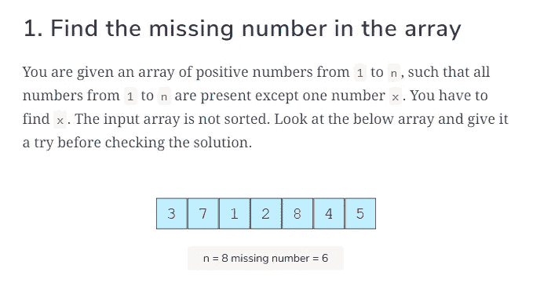
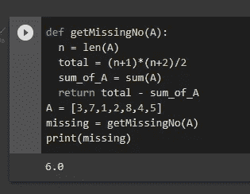

# 找出数组中缺少的数字

> 原文：<https://levelup.gitconnected.com/find-the-missing-number-in-the-array-541bbff287e>


来源:卡拉·埃尔南德斯经由[unsplash.com](https://unsplash.com/photos/LrlyZzX6Sws)

这又是一个经典的面试问题，深受科技巨头们的喜爱。它是这样的:

# 问题陈述



从上图中，我们得到了一个未排序数字的数组，数组的大小是 8，缺失的数字是 6。够简单了吧？如果数组由一百万个元素组成，那么缺少的数字就不容易被发现。

然后我们需要写一个程序来简化事情。我们将使用两种方法，即求和法和异或法。

# 方法 1:使用 Sum

首先我们将对所有自然数求和，然后是数组中的数字。

我们将称为自然数之和(Sn)；

Sn = n(n+1)/2

我们知道，我们的 n 是 8，所以我们将替换 8，无论我们在哪里看到 n。

Sn = 8(8+1)/2

然后将括号内的 8+1 相加

Sn = 8(9)/2

然后乘以 8*9 再除以，我们的结果在这里。

Sn = 72/2

Sn = 36

所以我们所有自然元素的总和是 36。

继续添加数组中的所有项目。我们称数组的和为 Sa。

Sa =3+7+1+2+8+4+5

Sa = 30

现在我们有了数组的和以及自然数的和，我们可以确定我们的缺失。

missing = Sn — Sa

缺失= 36–30

缺失= 6

## 让我们把它写成代码

```
def find_missing(A):
    n = len(A)
    total = (n+1)*(n+2)/2
    Sa = sum(A)
    return total - Sa
A = [3,7,1,2,8,4,5]
missing = find_missing
print(missing)
```



# 方法 2:使用 XOR

XOR 函数的工作方式如下:

异或相同的元素得到 0，异或不同的元素得到 1。

示例:

异或 A 会得到 0。

异或 B 会得到 1。

让我们把这个应用到我们的数组问题中。

我们有整数数组。

3，7，1，2，8，4，5 我们有自然数 3，7，1，2，8，4，5，6

因此，我们将对数组中的所有元素和自然数中的所有元素进行异或运算。

3^ 7^ 1^ 2^ 8^ 4^ 5 和 3^ 7^ 1^ 2^ 8^ 4^ 5^ 6

然后我们将这两项进行异或运算

3^ 3 , 7^ 7, 1^ 1, 2^ 2, 8^ 8, 4^ 4, 5^ 5

那么 6 就是孤独的狼，因此这就是我们丢失的数字。

# 附加阅读:

[](https://www.educative.io/blog/crack-amazon-coding-interview-questions) [## 破解顶级亚马逊编码面试问题

### 破解亚马逊编码面试是任何开发者的梦想。今天，我将带你了解亚马逊的来龙去脉…

www.educative.io](https://www.educative.io/blog/crack-amazon-coding-interview-questions)