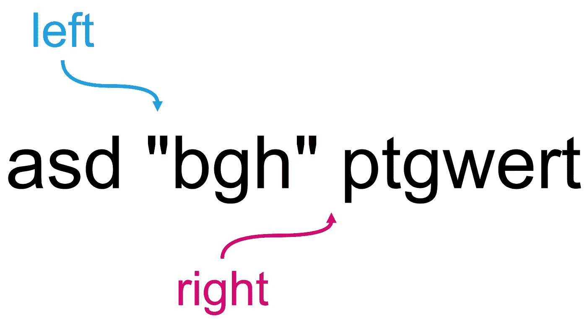

# 在字符串中查找标记化单词

> 原文：<https://levelup.gitconnected.com/find-tokenized-words-in-a-string-98257b5e8390>

在字符串中查找标记化单词

# 问题

在给定的字符串中查找标记化的单词。

## 什么是标记词？

1.  没有空格的单词。例如，abc、def、a、b、c
2.  带空格或不带空格的引用单词。比如“qwerty asd zxcv”、“abc”、“a”

## 示例 01

*   输入:ASD def qwe " qwerty ASD zxcv " ASF " tyu IP dfh gdj fgh "
*   输出:['asd '，' def '，' qwe '，' " qwerty asd zxcv " '，' asf '，' " tyuip dfhgdj fgh"']

## 示例 02

*   输入:“qwerty asd zxcv”
*   输出:['"qwerty asd zxcv"']

## 示例 03

*   输入:asd 定义 qwe
*   输出:['asd '，' def '，' qwe']

# 解决办法

为我解决这个问题的方法干杯。整个解决方案的灵感来自双指针技术。

## 形象化

查找不带引号的单词

整个想法是确保你的右指针落在一个空格上。这很好地表明，它满足作为一个有效的标记化单词。

用引号查找单词

与引用的标记化单词相同，确保您的左指针停留在引号上，确保这是开始引号，并将您的右指针停留在另一个引号上。这是一个很好的指示，它满足了一个有效的引用标记词。

## 时间和空间复杂性

这个解决方案的时间复杂度是 O(N*N-1)，其中 N 是字符串中的字符数。

如果我们在返回数组时包括，这个解决方案的空间复杂度将是 O(M ),其中 M 是有效标记化单词的数量。如果我们不将它包含在返回的数组中，那么空间复杂度将是 O(1 ),因为我们不使用额外的辅助内存空间。

# 外卖食品

我希望这篇博文能对那些正在努力寻找解决方案的人有所帮助。

老实说，我花了一段时间才找到这个解决方案。如果有人有更好的解决方案，请给我一些反馈，这样我也会知道。谢谢大家！和平！✌️