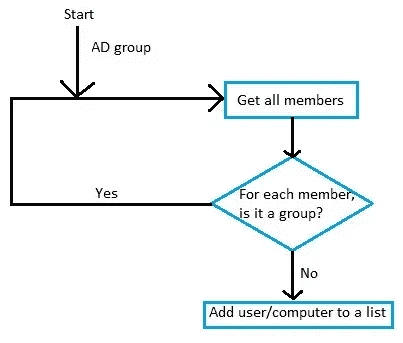
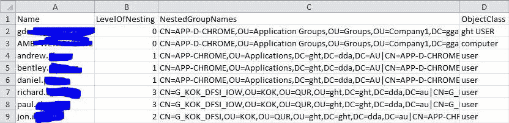

# 在嵌套广告组中查找用户

> 原文：<https://levelup.gitconnected.com/find-users-in-nested-ad-groups-95f738078b18>

Elena Mozhvilo 在 [Unsplash](https://unsplash.com/) 上拍摄的照片

# 递归查找广告组和所有嵌套组中的用户

在工作中，我们要处理很多关于网络上的用户和计算机的报告信息，我最近被分配的一项任务就是递归地报告哪些用户是一个组的一部分，以及所有嵌套的组。

我一直在与递归作斗争，主要是因为我真的不需要使用它，所以当需要解决这个问题时，我发现画一些流程图真的很有帮助:

# 该过程

这个过程非常简单，给定一个广告组名，找到它的所有成员。对于它的每个成员，如果是一个组，再次调用这个方法，否则将成员添加到一个列表中。

# 跨域问题

## 婴儿猝死综合症

不幸的是，当你有不同广告领域的成员时，事情就有点棘手了。

位于不同域中的成员的`name`属性将是安全标识符(SID ),而不是实际名称。要获得名称，您需要使用这段代码:

## 该组的成员属性

当一个组超过 1500 个成员时，`member`属性的计数为 0，取而代之的是一个名为`member;range:0–1499`的属性。

该属性包含前 1500 个成员，为了获取所有成员，您需要在 for 循环中继续加载下一个属性(例如`member;range:1500–2999`):

while 循环的第一部分生成属性名并获取成员。

while 循环的最后一部分检查 members 属性是否为空，如果是，那么我们知道我们已经到了循环的末尾，为了得到最后几个成员，我们使用一个`*`符号来表示结束索引。

一旦理解了跨域和成员属性问题，剩下的就很容易了。

下面是一个输出示例:

# 代码

# 带重音的编码

您可能已经注意到，我在 Powershell 中编写代码时带有 C#口音。例如，使用`[System.IO.File]::ReadAllLines()`而不是`Get-Content`。我这样做有几个原因:

*   如果需要的话，以后转换成 C#会更容易。
*   对于来自 Java/C#背景的开发人员来说，它仍然是可读的。
*   Commandlets 不会让您看到幕后使用的是什么类。如果你知道这个类，你可以在 MSDN 上查找，看看这个类的所有其他方法。