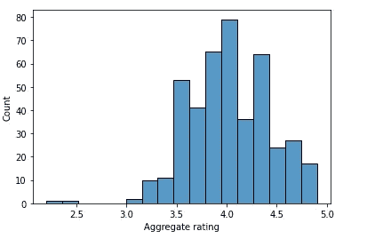
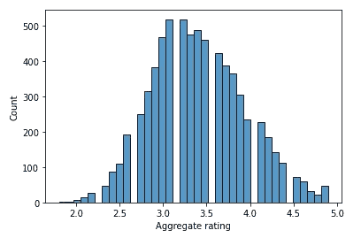
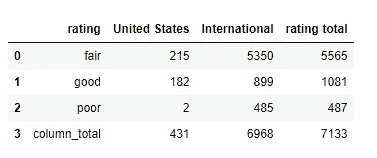
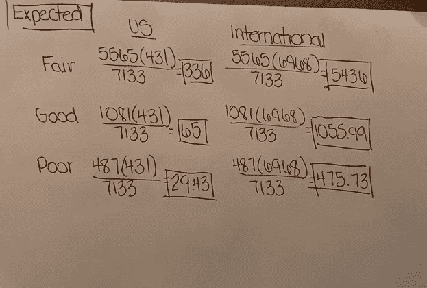
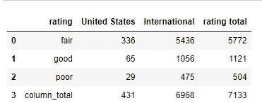
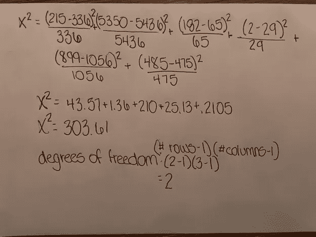
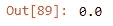
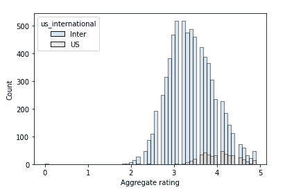

# 通过统计确定性发现某个条件是否会影响结果

> 原文：<https://levelup.gitconnected.com/find-whether-a-condition-impacts-the-outcome-with-statistical-certainty-aba3f35da2c3>

## 卡方检验的失败

上周，我展示了一个虚构的场景，我是一名分析师，与一名数据科学家一起工作。我公司的股东想知道在哪里开一家新餐馆最好。

对于大多数利益相关者来说，通常一个统计问题会引发他们思考另一个问题。让我们来看看我的虚构场景，当我与数据科学家一起构建预测模型，寻找开设餐馆的最佳地点时，一位利益相关者发送了这封电子邮件:

在美国以外的地方开一家餐馆花费要高得多。根据我们的谈话，以及您目前在数据中看到的内容，我们有充分的理由将工作重点放在美国以外的地方吗？


[奥斯曼·拉纳](https://unsplash.com/@osmanrana?utm_source=medium&utm_medium=referral)在 [Unsplash](https://unsplash.com?utm_source=medium&utm_medium=referral) 上的照片

让我们打开这个。你参与的谈话中，利益相关者认为特定餐厅的评级是餐厅成功的关键。使用评级作为我们的成功因素，我们希望衡量是否有足够的统计证据表明位于美国的餐厅条件比任何国际公司都更好。**输入:卡方检验。**

**什么是卡方检验？**

卡方检验是一种统计检验，在给定特定条件的情况下，在所述条件存在的情况下，预期结果是否会变化到具有统计显著性的水平。该测试根据基本概率将实际结果与预期结果进行比较。在这个测试的例子中，我们希望测量:

*H0:位于美国的餐馆与餐馆是否被好评无关*

*哈:位于美国的餐厅取决于一家餐厅是否得到好评*

该测试的第一步是拆分数据集。我使用的是 Z [omato](https://github.com/Adesh2021/EDA-Zomato/blob/main/Zomato%20EDA) 数据集，在看到综合评分中有许多缺失值后，我删除了这些值以使数据集正常化。我按照国家代码分割数据集，并绘制出每个国家代码的直方图，以确定正常情况。

```
import pandas as pd 
import numpy as np
import seaborn as sns
df=pd.read_csv('zomato.csv')us=df[(df['Country Code]==216)]
us_histogram=sns.histplot(x='Aggregate rating', data=us)
```



美国综合评分直方图

```
international=df.drop(df.index[df['Country Code'].isin([216])])
international_histogram=sns.histplot(x='Aggregate rating', data=international)
```



国际综合评级直方图

在删除扭曲数据的缺失值后，我们将数据分为两个数据框架，一个仅包含美国评级，另一个包含除美国评级之外的所有评级。从这些直方图中，我们可以观察数据如何排列的自然箱或分组。我们采用这些分组，并在两个数据框架内创建一个新系列，将每个评级组分为三个类别。

```
conditions=[
    (us['Aggregate rating']<2.7),
    (us['Aggregate rating']>4.0),
    (us['Aggregate rating']<4)]
values=['poor', 'fair', 'good']
us['rating bin']=np.select(conditions, values)conditions=[
    (international['Aggregate rating']<2.7),
    (international['Aggregate rating']>4.0),
    (international['Aggregate rating']<4)]
values=['poor', 'fair', 'good']
international['rating bin']=np.select(conditions, values) 
```

在我们现在由宁滨评级公司创建的这三个类别中，我们希望创建一个计数，统计我们在美国内外拥有多少家评级为“差”、“一般”和“好”的餐厅:

```
international_rating_count=(international['rating bin'].value_counts())

us_rating_count=(us['rating bin'].value_counts())
```

这两项统计显示，美国的一般、良好和较差评级分别为 215、182 和 2。此外，国际评级的价值统计显示，我得到了 899 个良好评级、5350 个良好评级和 485 个较差评级。我创建了一个表格，将这些结果显示为实际结果。

```
arrays_ACTUAL=pd.DataFrame({'rating':['fair', 'good', 'poor'],
                   'United States':[215,182,2] ,
                     'International':[5350,899,485]})     
arrays_ACTUAL.set_index(['rating'])
arrays_ACTUAL['rating total']=arrays_ACTUAL['United States']+arrays_ACTUAL['International']
arrays_ACTUAL.loc[len(arrays_ACTUAL.index)]=['column_total', 431,6968, 7133]
arrays_ACTUAL
```



国际和美国评级的实际综合评级

在上表中，我使用了我在九年级时用过的 TI-83 计算器来计算列和行的总数，因为这些值对于卡方检验是必不可少的。同样在这个测试中，我们希望为每个场景创建概率。概率构成了预期部分。

下一步是计算预期的表。在创建这个的时候，我们使用了一些可以追溯到我大一代数课之前的材料。Python 不包括预期的结果包，有时基础是最好的。对于实际结果中的每个图块，我们需要计算每个场景的单独概率。



每个预期结果的手算概率

作为一个例子，计算一个评级是公平的概率**和** US=

((美国和公平评级总数)*(公平评级总数))/评级总数。

在这种情况下，两个数据集中的 431 个美国公平评级乘以 5565 个公平评级。这个相乘后的数字除以评级总数，即 7133。这给我们带来了 336.26 的预期评分。根据这些计算，我们可以构建以下预期评级表:

```
arrays_EXPECTED=pd.DataFrame({'rating':['fair', 'good', 'poor'],
                   'United States':[336,65,29] ,
                     'International':[5436,1056,475]})     
arrays_EXPECTED.set_index(['rating'])
arrays_EXPECTED['rating total']=arrays_EXPECTED['United States']+arrays_EXPECTED['International']
arrays_EXPECTED.loc[len(arrays_EXPECTED.index)]=['column_total', 431,6968, 7133]
```



国际和美国的预期综合评分

要找到卡方，我们必须对每个场景求和:

***X =∑(实际-预期)/预期***

和自由度，它们是

***自由度=(CountofRows-1)(CountofColumns-1)***

我们的计算如下所示:



卡方检验/ X 计算:美国和国际餐馆综合评分的预期值和实际值

我们有一个 303 的卡氏检验值和两个自由度。这个检验的 p 值决定了我们对两组值之间的差异的置信度。最后一步，我们再次使用 python 来导出 p 值。

```
from scipy import stats
1-stats.chi2.cdf(303,2)
```



我个人不喜欢用 python 来计算 p 值，事实上，我最初是用宾州州立大学 Stat 500 教材附录部分的表格来计算 p 值的。作为参考，我使用的表格与该表格中的值[对齐。](https://fourpillarfreedom.com/wp-content/uploads/2019/06/chiTable1.jpg)

在商业统计学中，使用一种你能为之辩护的方法和正确解释你的结论一样重要。不到 3 年前，我从宾夕法尼亚州立大学毕业。我在统计 501、502 和 503 中学到的很多东西都是手工计算的。*这让我真正理解了我用我理解的统计数据所做的决定。*

但是回到我的整个虚构故事，为什么这个问题首先被提出。以下是我回复邮件的方式。

*你问了一个很好的问题。根据交谈，我将评级作为一家餐厅在美国是否比在国际上更受欢迎的决定因素。当我画出国际评级相对于美国的分布图时，你可以看到:*



*在这里，我们可以看到大多数美国综合评级总体上高于国际综合评级。这一信息给了我进行统计测试的理由。我想了解一家美国餐馆的评分是否更高，是否有统计学意义。我做了卡方检验。该测试使用基本概率来比较两组结果。从这个测试中，我发现毫无疑问，美国的餐馆总体上比他们的国际同行更受欢迎。*

*基于这些发现，我建议我们将搜索重点放在美国的地点。*

**参考:**

[8.1 —独立性卡方检验| STAT 500(psu.edu)](https://online.stat.psu.edu/stat500/lesson/8/8.1)

[EDA-zom ATO/zom ATO EDA at main adesh 2021/EDA-zom ATO(github.com)](https://github.com/Adesh2021/EDA-Zomato/blob/main/Zomato%20EDA)

*应用线性统计模型，*迈克尔·h·考特纳，国际版，2005。麦格劳-希尔出版公司。