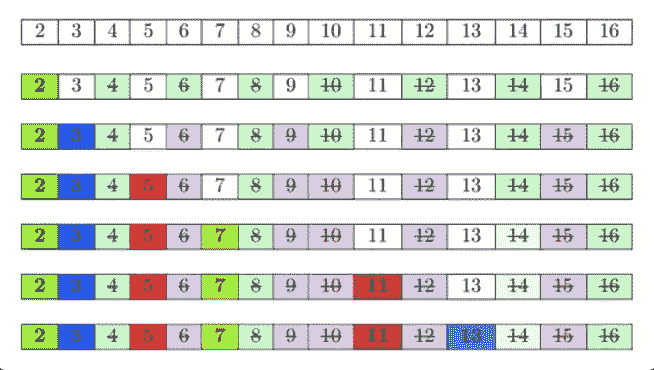
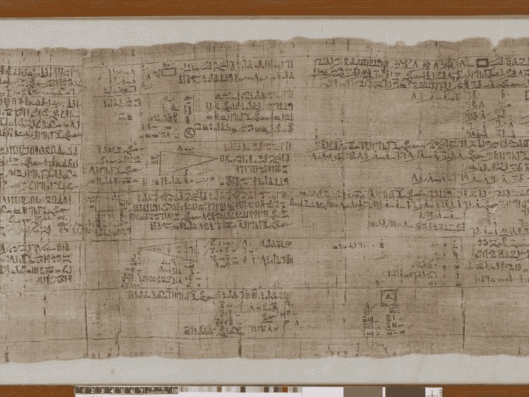
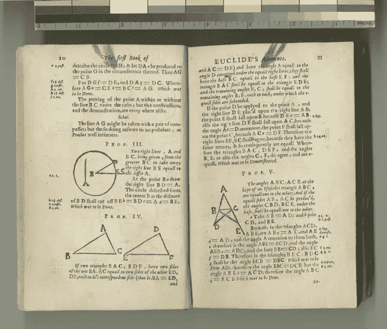
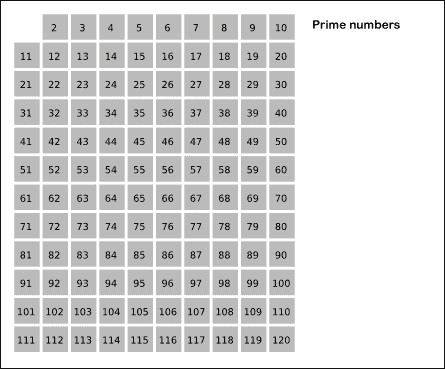
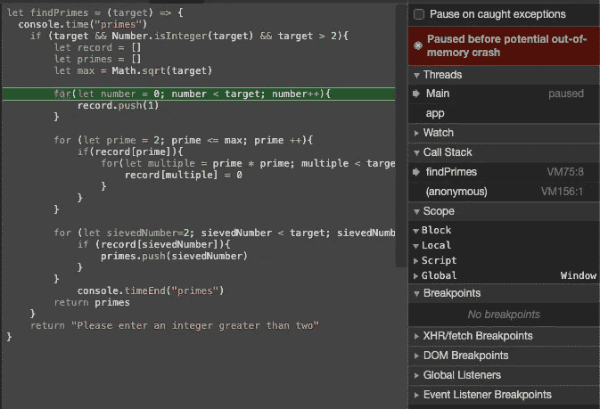

# 在 Javascript 中查找低于给定数字的所有素数

> 原文：<https://levelup.gitconnected.com/finding-all-primes-below-a-given-number-in-javascript-4eb9feaf9a3b>

## [包含完整解决方案代码和测试套件的 GitHub Repo】](https://github.com/noamsauerutley/finding-all-primes)

> 生成一个完整的素数列表，直到一个给定的数字。

我喜欢和质数打交道。

为什么？

抽象数学的许多早期进展探索了素数。

[Rhind 数学纸莎草纸](https://en.wikipedia.org/wiki/Rhind_Mathematical_Papyrus)(如上图)包括对[分数](https://en.wikipedia.org/wiki/Egyptian_fraction)的处理，它承认所涉及数字的质数和[合数](https://www.mathsisfun.com/definitions/composite-number.html)(即非质数)性质。

[欧几里得](https://en.wikipedia.org/wiki/Euclid)的 [*元素*](https://en.wikipedia.org/wiki/Euclid%27s_Elements) 致力于素数的分析，使其成为现存最早的素数和合数的明确记录*。*

素数是我们最早探索抽象数学和数论的核心，所以与素数打交道让我感觉与过去联系在一起，就像烤面包或看这些跳鼠的中国彩陶雕像一样。

原来我们对可爱动物的痴迷并不新鲜

欧几里德确立了素数有无限个——没有分界点，没有足够大的数来排除更大的素数的存在。

所以，我们永远不可能列出所有的素数。然而，根据定义，质数是正数。所以有一个下限——素数可以增加到无穷大，但不能无限减小。

这就为一个难题创造了条件:如果我们设定自己的上限，我们如何在这个区间内找到所有的素数？我们能不能列出在固有下限和我们选择的上限之间的所有素数，而不是简单地检查和测试每一个数的素数？

进入厄拉多塞:

厄拉多塞是利比亚诗人、数学家，也是个全能的聪明人，他第一个计算出地球的周长(非常精确！)，基本上发明了现代地理学，包括使距离计算成为可能的经度和纬度系统，绘制了他的整个已知世界(包括精确的气候带！)，计算了日地距离、地球黄道距离和闰年的存在，建立了科学年表的基础，还在担任图书馆馆长期间，抽出时间写了大量的书，并大规模扩充了亚历山大图书馆的藏书。

快速提示:尽管如此，他还是摆脱不了“贝塔”的绰号，因为每个人都开玩笑说他在所有事情上都是“第二好的”。

说真的。

不知何故，他还找到时间来解决我们当前的挑战，即找到所有小于给定数字的素数，并编写了一个算法来解决这个问题，直到今天，这个算法在效率、性能和准确性方面仍然具有竞争力。

## 厄拉多塞的筛子

在我们深入研究之前，让我们先定义几个术语。

*   **质数**:大于 1 的**的**整数**，大于 1 的**整数**不能由**乘以除数字本身& 1 之外的另外两个正整数**生成**。

素数只会被它们自己和 1 整除。

*   **合成**:质数的反义词。大于 1 的**整数**，即**可以通过**乘以除数字本身和 1 之外的另外两个正整数**而产生。**

> **例如**:
> 
> **2 * 2 = 4** ，使 **4** 成为**能被 **1、2、**或 **4** 整除的**合数**(产生 **4、2、** & **1** )。**
> 
> **2 * 3 = 6** ，也是**能被 **1、2、3、**或 **6** 整除的**合数**(产生 **6、3、2、** & **1** )。**
> 
> 在 **4** & **6** 之间是数 **5** ，其中**不能由 5** & **1** 之外的任意正整数**产生，只能由**被 **5** 或 **1** 整除(产生 **1** & **5** )。这使得 **5** 成为**质数**而不是**合数**。****

酷吗？酷毙了。筛时间。

筛子是悬挂在框架(手柄可选)上的圆形筛网，允许特定尺寸的颗粒通过筛网上的孔落下，而较大的颗粒包含在筛网碗中。

基本上:一个过滤器。

如果你曾经使用过一个古老的食谱，它可能会要求在混合前筛面粉。这些类型的工具在过去使用得更频繁，因为老派的面粉加工通常会留下更多的东西(石头、虫子、树叶、垃圾、没有磨得足够细的粗磨谷物的硬颗粒)混合在面粉中。筛选是确保面粉安全和可食用的重要步骤，并且在烘焙前没有任何粗糙或危险的东西。我们可能不再经常使用这些工具，但它们会是历史上常见的厨房设备，是说明抽象算法功能的完美参考。

那么，为什么厄拉多塞的算法被称为筛子呢？算法做了什么使它成为筛子？

## 该算法

厄拉多塞的算法不能识别所有的质数，而是识别合数，并排除它们。就像精细的面粉颗粒穿过筛子的金属线，只留下破碎的颗粒、鹅卵石或偶尔出现的虫子一样，厄拉多塞的算法筛出了合数，留下了奇怪的质数。

这种方法很聪明，因为寻找一个合数比通过检查和排除一长串潜在的约数来证明一个质数需要的计算要少得多。

它是如何工作的？

我们从第一个质数开始，数字 2。我们可以留两个。

然后，我们可以识别所有 2 的倍数，直到我们的上限数。这可以在线性时间内有效地完成，只增加 2 和我们的上限之间的数字量。

因为这些数除了能被 1 和它们自己整除，还能被 2 整除，所以我们可以排除它们是素数。它们是合成物，我们可以把它们从我们的号码池中移除。

然后，我们可以移动到下一个数字 3，并执行相同的过程来识别和删除它的所有倍数，直到达到我们的数字池的上限。

接下来是四个。或者下一个会是 4，如果我们没有把它和所有其他的 2 的倍数一起消除的话。因此，我们直接移动到下一个素数 5，并重复我们的过程，让它的倍数穿过我们算法的屏幕，就像细颗粒穿过筛子一样。

每次消除多次波的运行都变得更有效率，因为许多潜在的多次波已经被消除了。筛子的每一次摇动处理的数量都比以前少。例如，五的倍数已经减少了一半，所有那些以零结尾的数字都已经被剔除了所有能被二整除的数字。

现在，我们只需要写一个 javascript 函数来完成这个任务。

## 代码

首先，如果我们想找出所有小于目标数的素数，我们需要从大于 2 的整数开始。

因为想让使用这个函数的人知道为什么有些东西可能不像预期的那样工作，所以我将从设置一个快速筛选条件和错误消息开始。

对于我们的函数 ***findPrimes*** ，我调用在 ***target*** 中传递的参数，因为它应该是我们想要查找所有小于的素数的目标整数。

因此，如果有人试图在不输入真参数的情况下运行函数，传入一个非整数的东西，或者试图传入一个不大于 2 的整数(因为 2 是最小的素数，不能有任何小于它的素数列表)，我们的函数可以立即返回一个错误语句，该语句提供了向函数传入什么信息的指令。

太好了！既然我们已经确定我们将有一个可行的整数来处理，我们可以开始寻找那些素数。

我将从定义几个变量开始，我们将使用这些变量作为前进的工具。

*   ***记录*** :该数组将用于存储每个数字的真/假值，表示它是否是素数。
*   ***素数*** :这个数组将用于存储并最终返回我们确认的素数。
*   ***max*** :我们可以利用 Javascript 内置的平方根函数( *Math.sqrt())* 来得到我们的目标数的平方根。当我们开始筛选出每个素数的倍数时，我们会用到这个。

酷！现在怎么办？

下一步是用一个占位符值填充我们的 ***记录*** 数组，我们将测试每个数字的质数，就像用面粉填充筛子一样。

> **注意**:这里你唯一需要记录的是真/假，所以你可以使用布尔值，但是为了稍微提升一下性能，我将只使用 0 & 1 来表示我的假/真值。

为了给我们的数组加质数，我们将从每个数字的真值(true 或 1)的缺省值开始——当我们稍后识别它们时，我们可以通过将它们的值改为 falsey 来“筛选”出非质数。

所以，现在我们有了一个大数组，里面充满了小于目标数的每个可能素数的真值(1)。接下来呢？

我们从 2 开始，我们的第一个素数。我们将从 2 一直迭代到 ***max*** ， ***target*** 的平方根。我把这个循环的变量叫做 ***prime* 。**对于我们迭代的每个元素，我们将检查数组 ***记录*** 中索引为 ***素数*** 的元素是真还是假。如果这是真的，那么继续另一个迭代循环，这个循环使用一个叫做 ***的变量乘以*** 。

***倍数*** 从 ***质数*** 的平方开始，并通过我们先前建立的值 ***最大值*** 向上迭代(因为迭代超过该值会导致我们浪费时间来筛选大于 ***目标值*** 的值)，每次迭代递增当前的 ***质数*** 。

索引为*的 ***记录*** 中的每个值都将被赋予一个假值(0)，这意味着它不会被 ***素数*** 的下一次迭代捕获，并从迭代中移除，即被筛选掉。*

***注意** —这部分有点数学！如果感觉难以理解，我建议在循环中放一个调试器或控制台日志，这样你就可以实时观察每个素数&及其倍数的迭代过程。这对我有很大的影响！如果不知道从哪里开始，可以尝试下面的代码:*

*此时，我们有一个空的 ***质数*** 数组，以及一个记录数组(长度为我们的数字池的长度),存储与 2 到 ***目标*** 范围内的每个数字相关的真/假值。*

*所以现在，我们只需要再迭代一次。*

*我们可以遍历 ***记录*** ，将真值指数推入 ***素数*** ，然后返回 ***素数*** 以筛选出一个仅包含 2 和 ***目标*** 之间素数的列表。*

*让我们把它扔进控制台，看看它会返回什么:*

*🌟太好了！这正是我们想要的结果。*

*多亏了厄拉多塞，我们找到了所有小于给定数目的素数。*

*如果你愿意，你可以在这里停下来！这是一个完全合理的解决方案，成功地实现了目标。*

*然而…*

**

*当然，从 2015 年开始，我在 11 英寸的 MacBook Air 上用 Chrome 浏览器处理的 Javascript 数据会有不可避免的限制。我可以接受这个现实！*

*但是，仍然有一种方法可以让这个函数的性能更高一点！*

## *findPrimes 2: findPrimesFaster*

**

*让我们看看我们能做什么。*

*我们将从与之前相同的初始函数结构和条件+错误消息组合开始。*

*只是这一次，当我们定义初始数组和变量时，我们将把 ***素数*** 定义为包含第一个素数(2)的数组，而不是空数组。任何素数列表都必须包含两个，因此这可以节省我们一轮迭代。*

*我们仍然需要在 ***记录*** 中填充***【2】***和 ***目标*** 之间的每个数字的一组完整的真值，就像以前一样。*

*我们的筛子循环看起来有点不同，因为我们已经添加了 ***2*** 到 ***素数*** 。*

*不是从 2 开始，我们可以从 3 开始循环，然后按 2 递增，而不是按每个数字递增。这去掉了许多微小的计算！我们对倍数做同样的处理——递增*质数* 2* 而不是一个质数一个质数。*

*这样不会把 2 的倍数都筛出来，不过没关系！我们可以有选择地把什么推进 ***质数*** 。*

*我们开始循环，将找到的素数从 3 推入 ***素数*** 数组，因为我们定义 ***素数*** 最初包含 2。然后，不是递增 ***记录*** 的每个单独的索引，我们可以递增 2，只取奇数。由于 2 是唯一的偶数质数，这是一个非常快速&的有效方法，无需额外的迭代循环就可以丢弃我们池中的所有偶数。*

*所以，让我们看看这是否真的有效——毕竟，性能提升只有在不破坏底层功能的情况下才有价值！*

*🌟太好了！该功能仍然有效。所以，是时候揭晓真相了:*

*没有内存不足崩溃！我们所做的调整增加了我们的函数在不使浏览器崩溃的情况下可以运行的人数上限。*

**

*我们的功能现在正式更快，更激烈。*

*当我使用 [console.time()](https://developer.mozilla.org/en-US/docs/Web/API/Console/time) 和 [console.timeEnd()](https://developer.mozilla.org/en-US/docs/Web/API/Console/timeEnd) 来跟踪在 1000 万和 2500 万输入下运行这两个函数的计算时间时，差异非常明显:*

*一旦我们达到 5000 万， ***findPrimes*** 崩溃，只有***findPrimesFaster***能够继续为我们提供素数。*

**

*我能够运行***findPrimesFaster***直到 **1 亿个**，尽管它最终也在计算所有高达 2 亿个素数的挑战下崩溃了。*

*同样，我们最初直接实现的厄拉多塞筛是一个非常好的解决方案。然而，有趣的是，当一个函数为了性能而被调整，然后被大量数字挑战时，它还能走多远！*

*如果你有兴趣在这段代码中加入你自己的想法，让它更有性能，请随意复制这个挑战的 [GitHub repo](https://github.com/noamsauerutley/finding-all-primes) 解决方案代码——它带有完整的测试套件，这样你就可以随心所欲地调整代码，同时保持自信，你没有破坏任何底层功能。*

*如果你喜欢这个，请随时查看我的其他算法解决方案！如果你喜欢寻找一个初始解决方案的过程，然后创造一些更有性能的东西，你可能会特别喜欢我的[二和问题的三个解决方案](/solving-the-two-sum-problem-in-javascript-three-ways-4d43067fcfc7)。*