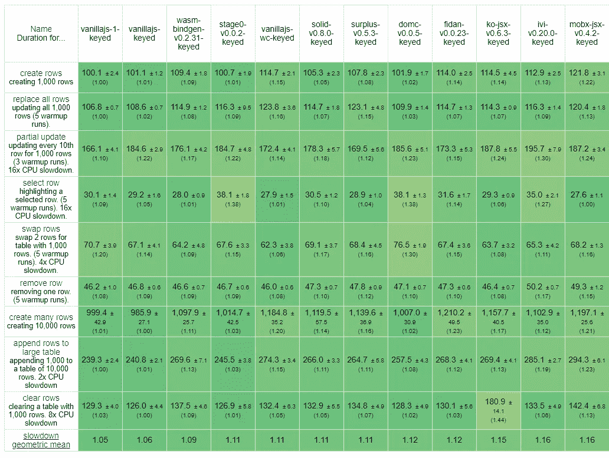

# 寻找细粒度的反应式编程

> 原文：<https://levelup.gitconnected.com/finding-fine-grained-reactive-programming-89741994ddee>

## 抓住 2019 年的前端流行，迅速被 React、Vue 和 Svelte 采用


来自 Pexels.com 的沙漠沙丘焦点

在过去的一年中，前端世界中发生的一些事情让许多开发人员感到困惑。就在 ES6 课程变得无处不在的时候，流行的图书馆正在快速抛弃它们。就在事情开始感觉要稳定下来的时候，这个曲线球似乎不知从哪里冒出来了。

我说的是这些功能组件，它们被称为钩子和计算机。我说的是最近这个 [Vue RFC](https://github.com/vuejs/rfcs/blob/function-apis/active-rfcs/0000-function-api.md) 。像可观察数据和显式依赖声明这样的东西。关于 _____ 和使用 _____ 的大量报道肯定会在未来几年里覆盖你的屏幕。

事实是，这不是凭空出现的。虽然这个为什么现在突然爆炸，对我来说和下一个人一样是个谜。我们谈论的是一种编程范式，在 React 出现之前，它在前端获得了动力，但在过去的 5 年里基本上处于休眠状态。然而，我是那些继续使用这种咒骂的可怜人之一，这种咒骂是开发前端 UI 对于开发者体验和性能都是优越的模式。那么谁更适合把你介绍给你的新领主呢？

# 为什么？

你哭着把你的笔记本电脑扔出桌子。我们在前端的技术选择上投入了很多。我们骑着战车，挥舞着旗帜。“虚拟人生”或“HOCs 'R US”。但是对于任何事物，只要有进步，就很少会有倒退。旧的又变成了新的。

简而言之，这突然成为人们感兴趣的话题的原因是，在多年来试图通过创建更多的组件来解决组件问题之后，某个地方出现了其他可以应用的可组合模式。类和混合从来没有干净地解决问题，有时组件太多了——它们的重量对于它们的粒度来说太重了。我怀疑 React 团队一直以来的几个问题又回到了这些问题上。但是，一旦 React 站出来，同样的部落在第一时间谴责这种模式，就像面纱被揭开。每个人都在想，“我一直在等什么？”

这里的关键是这种方法允许声明性数据。现在不仅你的视图是声明性的，你的状态和状态派生也是声明性的。不要把你的代码分割成我喜欢称之为悲伤的 5 个阶段(或者艺术家以前称之为生命周期函数)和它们在你的组件中传播的有趣的状态条件链，而是把它颠倒过来，按照每个数据原子的旅程来分组你的代码。令人惊奇的是，现在你的数据在一起了，它是可抽象的。您可以创建行为，并将其应用于您希望的任何组件。

具有讽刺意味的是，React 钩子并不是一个真正的细粒度反应性系统，这就是为什么有“钩子规则”和这么多关于闭包和引用的警告，而这些对于一般的方法来说是不必要的。但是我将把它们和其他各种库中的例子一起使用，以帮助您了解基础知识。

# 基础:可观察的和可计算的

不管是什么库:MobX，Vue，Ember，KnockoutJS，React，Solid，Svelte 等等..所有细粒度的反应式系统都基于 2 个原语。它们在不同的图书馆有不同的名字，但总有两个:a̶̶m̶a̶s̶t̶e̶r̶̶a̶n̶d̶̶a̶n̶̶a̶p̶p̶r̶e̶n̶t̶i̶c̶e̶，p̶e̶a̶n̶u̶t̶̶b̶u̶t̶t̶e̶r̶̶a̶n̶d̶̶j̶e̶l̶l̶y̶….可观测量和计算机！

> **注:**你可能在 RxJS、CycleJS、Bacon 之类的函数式反应式编程(FRP)中听说过可观察这个术语，它指的是流。我所说的细粒度反应式编程与同步反应式编程(SRP)相关(尽管不一定相同)。这些可观测量可以被视为稳定到静止状态的离散信号，很像数字电路。

## 看得见的

使用细粒度的反应式编程进行编码很像使用电子表格。有些单元格包含数据，有些单元格的值是根据这些数据单元格计算的。可观测量是那些数据单元。从机械上讲，它们是一个简单的原语，包含一个 getter 和一个 setter。它们需要检测它们的值何时被访问以及何时被设置。它们可能看起来像:

```
**// KnockoutJS**
const x1 = observable(5);
console.log(x1()); // get value
x1(8); //set value**// Vue RFC**
const x2 = value(5);
console.log(x2.value);
x2.value = 8;**// Solid**
const [x3, setX3] = createSignal(5);
console.log(x3());
setX3(8);**// MobX**
const x4 = observable({data: 5});
console.log(x4.data);
x4.data = 8;**// React (no actual getter but for comparison purposes)**
const [x5, setX5] = useState(5);
console.log(x5);
setX5(8);
```

他们可以使用带有可变参数的单个函数，使用单独的函数，甚至使用对象 getter/setter 或 ES6 代理。关键的部分是理解任何改变都需要被设置器捕获，并且所有的访问都在 getter 执行时被跟踪。对于这种方法来说，何时访问一个值是非常重要的，我将在下一节解释。

## 计算机

如果观察值是电子表格中的数据单元，那么计算值就是计算单元。它们知道它们的依赖关系，并且可以在它们的值改变时重新执行。一般来说，在图书馆里你会发现两种类型的计算:用于获得值的纯计算和产生副作用的有效计算。

> **注意:**副作用是在调用过程范围之外修改值。因为它不是函数中的独立部分，所以这些方法的结果不能保证用相同的输入产生相同的输出。因此，他们被称为不纯。

以下是一些纯计算机的例子:

```
**// KnockoutJS**
const c1 = pureComputed(() => x1() * 2);
console.log(c1()); // get value**// Vue RFC**
const c2 = computed(() => x2.value * 2);
console.log(c2.value);**// Solid**
const c3 = createMemo(() => x3() * 2);
console.log(c3());**// MobX**
const c4 = computed(() => x4.data * 2);
console.log(c4.get());**// React (no actual getter but for comparison purposes)**
const c5 = useMemo(() => x5 * 2, [x5]);
console.log(c5);
```

这里有一些有效(不纯)计算的例子:

```
**// KnockoutJS**
computed(() => console.log(x1() / 10));**// Vue RFC**
watch(() => console.log(x2.value / 10));**// Solid**
createEffect(() => console.log(x3() / 10));**// MobX**
autorun(() => console.log(x4.data / 10));**// React**
useEffect(() => console.log(x5 / 10), [x5]);
```

注意纯计算如何返回访问器本身，而有效计算只是运行函数中的代码。事实上，没有什么能阻止你在纯粹的计算机中产生副作用。但重要的是要理解这两者通常有不同的用途。

正如你所看到的，所有的库基本上都遵循相同的模式。一些像 MobX 这样的库有一个更大的 API 面，允许开箱即用的更复杂的反应。另一方面，Svelte 使用`$:`标签将计算结果隐藏在编译器后面。但是不管怎样，所有的库都使用相同的原语。我们最终偶然发现了前端的统一理论吗？


# 它是如何工作的

好吧，有些人声称这在过去是魔法，我们应该警惕那些携带魔杖和穿着大斗篷的人，但我认为 JavaScript 社区已经超越了在火刑柱上烧死女巫的阶段。我们可以开诚布公地讨论这个问题，而不用担心我们不理解的东西。感谢 React、Vue、Svelte 和 frontend 在过去几年里的发展，我想气候已经有所改变。好了，准备好了:

*自动依赖性检测*

我说了。我们还在这里。

如今它并不那么神奇。我们有称为代理和编译器的东西，它们将把我们的 JSX、组件代码和 ES6 变成完全不同的东西。那么什么是自动依赖检测呢？

还记得所有的观察对象在获取它们的值时都有一个 getter 或 accessor 吗？每个计算在执行时在全局范围内注册自己，当一个可观察对象被访问时，它将自己添加到依赖列表中。一个过于简单的实现可能如下所示:

```
let currentContext;function observable(value) {
  const subscribers = [];
  return function() {
    // setter
    if (arguments.length) { /* update value & notify subs */ }
    // getter    
    else {
      if (currentContext) subscribers.push(currentContext);
      return value;
    }
  }
}function computed(fn) {
  let value;
  function execute() {
    /* do some initialization/cleanup of previous run */
    const outerContext = currentContext;
    currentContext = execute;
    value = fn();
    currentContext = outerContext;
  }

  //initial run
  execute(); return /* getter of value */
}
```

这里需要提前注意一些事情。首先，计算一开始只执行一次。这对于建立依赖关系是必要的，以便每当可观测量更新时，计算机再次执行。当 computed 执行传入的函数时，它将调用可观察对象上的 getters 来创建订阅。当可观察到更新时，它将通知其订户，并且计算将再次执行。

其次，上下文包装了每次执行，因此您可以在计算中嵌套计算。这赋予了反应图分层的能力。每个上下文将基于其自身的依赖关系重新运行。当一个父进程重新运行时，所有子进程都被重新创建。但是，当子元素或兄弟元素重新求值时，上下文将不会求值。

这里真正的力量是在重新评估时，所有的依赖关系在每次执行时都被清理和重建。这意味着依赖关系是动态的。如果计算中的条件提前返回，来自另一个分支的依赖项将不会被注册。只有当条件改变时，才会重新计算。这允许动态依赖性，并减少了不必要的重新评估的需要。

# 基本示例

考虑这样一种情况，根据 UI 中的模式，您以不同的方式显示用户名。要么显示他们的用户名，要么显示他们的全名。我将使用 Solid 的语法，因为它清楚地显示了读取和写入(并且与 React 挂钩最相似):

```
const [showFullName, setShowFullName] = createSignal(true);
const [getUserName, setUserName] = createSignal('JSmith');
const [getFullName, setFullName] = createSignal('John Smith');const getDisplayName = createMemo(() =>
  showFullName() ? getFullName() : getUserName()
);
createEffect(() => console.log(getDisplayName()));// console: John Smith
```

这不是一个特别昂贵的操作，但是它将帮助我们理解更新是如何传播的。可以预见的是，在解析该代码时`John Smith`将被输出到控制台。现在，让我们切换显示模式:

```
setShowFullName(false);// console: JSmith
```

依次发生的是:

1.  `ShowFullName`可观测值更新为`true`。
2.  它通知它的订阅计算导致重新评估。在这种情况下，`DisplayName`计算清除了所有的依赖关系。然后，当遇到新的依赖项时，它会重新执行跟踪。
3.  `showFullName`和`getUserName`在执行期间被访问，计算订阅它们中的每一个。
4.  新值被解析并在`DisplayName`上设置，这通知它的订阅计算(`createEffect`)清除所有依赖关系。
5.  效果函数执行访问`getDisplayName`，再次订阅效果，将 JSmith 写入控制台。

够直接了。但是，如果我们更新`FullName`以添加中间的首字母，现在会发生什么呢:

```
setFullName('John R. Smith');
```

`FullName`可观察值更新。它通知了它的订阅者，但是自从它的订阅在最后一次执行`DisplayName`(现在显示`UserName`)时被清除以来，没有任何订阅者。不执行任何其他代码。反应图足够智能，知道此时不需要进行进一步的更新。

如果您将`ShowFullName`切换回`true`，您将会看到新的更新名称，或者如果名称在设置为`true`时被更新，您将会立即看到更改，但就目前情况而言，此更改会被记录，但不会传播。这就是细粒度变化检测的强大之处，因为它只在依赖值实际发生变化时才工作(包括分支路径评估)。

# 性能呢？

现在可能是处理那些困扰你的问题的好时机。像任何事情一样，有成本和权衡。积极的一面是，更新速度非常快。比简单的差分机制快得多。每个节点都有记忆值，以便快速评估。对于那些熟悉 React 和虚拟 DOM 的人来说，这就像你的`componentShouldUpdate`已经为你写好了一样。这意味着开箱即用，你不应该做不必要的更新。

现在你们中的一些人可能还记得 React 第一次出现的时候，他们展示了这种反应式系统的缺点。这些库的早期版本中的大多数问题是，虽然细粒度可以带来令人难以置信的性能，但如果每件事情都需要单独重新评估，可能需要多次，也会产生更多的开销。使用 React，您可以知道何时安排更新，它将作为单次执行发生，代表该时间点的稳定状态。几乎所有流行的反应系统都解决了这个问题。从延迟执行下一个微任务(KnockoutJS)到创建事务(MobX)，甚至到使用 SRP 时钟周期(S.js，Solid)，我们早就过了那些日子。Svelte 甚至找到了一种方法，通过使用编译器以正确的执行顺序对依赖语句进行排序。

值得注意的是，在设置反应图时会有额外的开销，这会影响初始渲染。最近几年出现了各种各样的技术来解决这个问题，比如预编译，但这是需要记住的。

# 精细渲染和生命周期

我认为细粒度渲染是入门教程中经常被忽略的一个主题。通常假设您会将这些技术与您在当前框架中已经使用的传统 DOM 呈现技术一起使用。这绝对是一种做事方式，为存储技术保留细粒度的反应能力。但是这种方法也开启了调度和管理渲染的完全不同的方式。这就是事情变得有趣的地方。

一般来说，有两种不同的方法来呈现细粒度库。要么将它们放入现有的组件系统中，在该系统中，渲染函数基本上被包装在计算中，要么将它们直接绑定到 DOM 绑定系统中。下一节将更详细地解释这些是如何工作的。

## 成分

这是目前比较常见的方法。细粒度的反应是触发组件系统现有更新周期的一种方式。这意味着底层系统仍然是一个基于自顶向下的区分和每次更新时修补 DOM 树的系统。这通常通过使用虚拟 DOM 来实现。这里细粒度的好处是变更管理是自动化的和优化的，不需要`shouldComponentUpdate`。

MobX 和 React，Vue，modern Ember，甚至 Svelte 基本上都使用了这个的变体。除了商店技术(MobX、Vuex 等..)，这些系统是局部优化的，并且往往具有非常浅的图形。Svelte 甚至可以在编译器后面隐藏开发人员发现的可观测量和计算结果，因为他们不需要担心组件生命周期之外的范围。这些系统可以做得非常轻，因为它们的处理逻辑可以依赖于组件的寿命。然而，它们的组件边界往往要重得多，因为它们倾向于解析值并重新包装成可观察值。您通常不会将 observable 作为 props 向下传递，而是绑定它们的值，然后在子组件中将它们重新包装到新的局部作用域 observable 中。

这些系统不需要很多生命周期方法。通常，在初始设置之外，他们需要 onMounted 和 onDestroy 钩子。虽然它们可以在更新挂钩之前/之后使用，但通常采用更通用的计算机调度机制。这种没有明确绑定到单个组件生命周期的原语的使用增加了可组合性。通过计算、预定超时和微任务，您可以模拟任何传统的更新周期。

这种方法仍然需要一点时间来适应，因为它指导您在更精细的尺度上考虑变化。即使整个 render/template 方法重新运行并有所不同，所有的东西都缓存在这些计算机中，所以这是一个简单的等式检查来决定更新。你可以把它看做仅仅是更新被改变的东西，因为记忆化使你不必担心是否应该更新。

## 无组件

这是一种较老的方法，尽管它仍然存在于几个边缘库中，如 Knockout、Solid 和 Surplus。这是细粒度的更纯粹的观点。视图中的每个表达式或表达式组合都有自己的计算结果。虽然它们可能有类似组件的组成，但组件本质上只是一个运行一次的函数，生成它的图，然后就不再需要考虑了。这里的好处是这些库没有与任意边界相关的成本，因为可观察性超越了组件。它们也足够细粒度，不需要像虚拟 DOM 库中那样的区分或修补例程。这带来了显著的性能优势。



JS 框架基准测试中的顶级库

> **注意:**上面的结果是 [JS 框架基准测试](https://github.com/krausest/js-framework-benchmark)的前 12 个实现的快照，该基准测试在一系列测试中让 100 多个前端库相互竞争。在您了解了前 5 个条目之后，它们只是进行直接 DOM 操作的普通参考实现。除了 domc 和 ivi，每个库都使用这种无组件的细粒度方法。

取代生命周期功能，他们将上述功能向前推进了一步。他们通常有办法用一种`onCleanup`方法来安排一般的处置。从表面上看，这看起来很像`onDestroy`,但是它与组件的生命周期无关，而是与当前计算的上下文有关。同样，为了处理`onMounted`或任何更新后的场景，通常您会使用通用的 JavaScript 调度机制，如`setTimeout`。这也需要一点时间来适应，但是它可以在钩子后面抽象出来，给人一种与上面的组件相同的 API 的错觉。这种方法更通用，因为它可以应用于任何计算上下文，而不仅仅是那些有 DOM 渲染副作用的上下文。

## 通过示例进行比较

让我们来看一个简单的计时器，每种方法都有一个时间间隔。React 类的第一个经典生命周期:

```
import React from 'react';export default class Counter extends React.Component {
  state = {
    count: 0,
    delay: 1000,
  };

  componentDidMount() {
    this.interval = setInterval(this.tick, this.state.delay);
  }
  componentDidUpdate(prevProps, prevState) {
    if (prevState.delay !== this.state.delay) {
      clearInterval(this.interval);
      this.interval = setInterval(this.tick, this.state.delay);
    }
  }
  componentWillUnmount() {
    clearInterval(this.interval);
  }
  tick = () => {
    this.setState({
      count: this.state.count + 1
    });
  }
  handleDelayChange = (e) => {
    this.setState({ delay: Number(e.target.value) });
  }

  render() {
    return (
      <div>
        <h1>{this.state.count}</h1>
        <input
          *value*={this.state.delay}
          *onInput*={this.handleDelayChange}
        />
      </div>
    );
  }
}
```

接下来使用 Vue 的新 RFC 来实现细粒度组件:

```
<template>
  <div>
    <h1>{{count}}</h1>
    <input v-model="delay">
  </div>
</template>

<script>
import { value, watch } from 'vue'

export default {
  setup(props) {
    const count = value(0);
    const delay = value(1000);

    watch(() => delay.value, (delay, prevDelay, onCleanup) => {
      const interval = setInterval(() =>
        count.value++
      , delay);
      onCleanup(() => clearInterval(interval));
    });

    return { count, delay }
  }
}
</script>
```

最后，一个使用 Solid 与纯细粒度绑定的例子:

```
import {createState, createEffect, onCleanup} from 'solid-js';export default function Counter(props) {
  const [state, setState] = createState({
    count: 0, delay: 1000
  }); createEffect(() => {
    const interval = setInterval(() =>
      setState('count', c => c + 1)
    , state.delay);
    onCleanup(() => clearInterval(interval));
  }); return (<div>
    <h1>{state.count}</h1>
    <input
      *value*={state.delay}
      *onInput*={({ target }) => setState('delay', target.value)}
    />
  </div>);
}
```

正如你所看到的，除了框架怪癖之外，细粒度的 API 通常是相同的，尽管渲染引擎的工作方式完全不同。越挖越深，差异越多。很清楚每个计算或可观察的数据原子如何通过这种方法用可抽象的声明来管理自己，而不是分散在马拉松式的生命周期方法或分割配置选项中。

# 结论

希望你现在对细粒度的反应式编程如何在 2019 年改变前端开发的格局有了更好的理解。我们已经讲了基础知识，但还有很多要学的。查看本文末尾的链接，了解这里提到的一些库。

更重要的是，也许你现在已经看到了事情的发展方向。我认为像最近 Vue RFC 发布的函数 API 让很多人措手不及。如果你理解 Vue 的内部结构以及它为图书馆解决了什么问题，这几乎是一件容易的事情。但是一个建立在不作出反应的惯性基础上的社区将很难接受一个类似反应的 API，即使 Vue 对这种细粒度的遗产有更好的要求。

老实说，这可能只是一长串趋势中的最新一个。或者也许我们终于赶上了 KnockoutJS 的创始人史蒂夫·桑德森在 2010 年所知道的。也许这对你来说看起来很可怕，就像我第一次看到 React 生命周期函数时，我可怕地回想起 web 和 ASP.NET web forms 的黑暗时代。但有一件事是肯定的:它正在发生，而且从来没有 JavaScript 库看起来如此相似。

[](https://github.com/knockout/knockout) [## 击倒/击倒

### Knockout 使得用 JavaScript - knockout/knockout 创建丰富的、响应性强的 ui 变得更加容易

github.com](https://github.com/knockout/knockout) [](https://github.com/mobxjs/mobx) [## mobxjs/mobx

### 简单、可扩展的状态管理。在 GitHub 上创建一个帐户，为 mobxjs/mobx 开发做贡献。

github.com](https://github.com/mobxjs/mobx) [](https://github.com/ryansolid/solid) [## 瑞安固体/固体

### 一个用于构建用户界面的声明式、高效且灵活的 JavaScript 库。-瑞安固体/固体

github.com](https://github.com/ryansolid/solid) [](https://github.com/sveltejs/svelte) [## 苗条/苗条

### 控制论增强的网络应用。在 GitHub 上创建一个帐户，为 sveltejs/svelte 开发做贡献。

github.com](https://github.com/sveltejs/svelte) [](https://github.com/vuejs/vue) [## vuejs/vue

### 🖖 Vue.js 是一个渐进的、可增量采用的 JavaScript 框架，用于在 web 上构建 UI。- vuejs/vue

github.com](https://github.com/vuejs/vue)