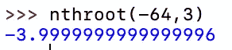

# 用 python 寻找负数的奇根

> 原文：<https://levelup.gitconnected.com/finding-odd-roots-of-negative-numbers-with-python-2c8abdf6e818>

如果你曾经试图求一个负数的奇数根，比如:

用卡西欧 fx-991EX 这样的通用计算器，你会发现负 64 的 3 次方根是负 4。然而，如果您将相同的等式插入 python shell，您将看到以下内容:

乍一看，这似乎令人困惑，但它是一个 a+b *j* 形式的复数，其中 a=2，b=3.46410。根据代数基本定理的定义，我们知道每个实数都有 n 个根。你可以在这里阅读代数基本定理。如果你把我们的方程输入在线计算器，比如 [Wolfram Alpha](https://www.wolframalpha.com/input/?i=%28-64%29%5E%281%2F3%29) ，你会看到我们问题的三个解如下:

如果您将这些解决方案与 Python 输出的解决方案进行比较，您会发现 Python 为我们提供了根，Wolfram 称之为“主根”。主根是形式 a+b *i* 的根，其中 a，b 都是非负的(在这种情况下 a=2，b=3.4631)。

> 当取任意数的任意根时，Python 总是返回主根

# 我们的解决方案:

如果我们还记得中学代数，我们知道 x 的 n 次方根只是一个数乘以自身 n 次给我们 x。

当 x 小于零时，我们可以将问题改写如下:

由于 n 是奇数，我们可以将负号从根号下面移出:

因为在 python 中，取一个正数的 n 次方根总是给我们一个实数。我们已经有效地推导出一个等式，它将找到负数的奇根的实数解:

我们可以把我们的想法变成一个 python 函数。我们想从检查我们试图寻找的根是否是负的开始，如果不是，我们可以只返回正常方式找到的根，否则我们想使用我们上面创建的等式:

现在要找到负 64 的 3 次方根，我们可以调用我们的函数:

只要存在一个真实的解，这个函数就能找到任意数的任意根。如果一个真实的解不存在，函数将返回完全错误的数字。

> 如果你试图求一个负数的偶数根，即 n%2=0 且 f<0，那么一个真正的解将永远不存在