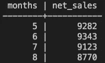

# 在销售数据中寻找季节性

> 原文：<https://levelup.gitconnected.com/finding-seasonality-in-sales-data-9e959d17c01d>

## SQL 与宇宙的中间话题


图片来源:美国宇航局

“火星就在那里，等着被到达。”—巴兹·奥尔德林

上次在[SQL 数据的滞后功能](/lag-functionality-on-sql-data-d58027631d8a?source=friends_link&sk=808cf4b0d6867262c63ba03e5e9eaefb)中，我们想象去火星旅行，参观(众多山脉中的一座)奥林匹斯山[的山基](https://en.wikipedia.org/wiki/Olympus_Mons)，那里有一个食品摊在卖宇航员的冰淇淋。在帖子中的例子中，我用虚拟数据展示了带有`sales` SQL 数据表的`LAG`窗口函数。

这篇文章将使用`LAG`和`LEAD`窗口函数来解决我在 [LeetCode](https://leetcode.com/) 上遇到的一个算法问题。我将引入`LEAD`功能，并解决这个问题:显示`sales`表中三个或更多连续销售值等于或大于给定数字的记录。让我们开始吧。

# 更新数据

回想一下我们上次用的数据有五条`net_sales`的记录；食品摊开放的一个月内的净销售额。这张名为`sales`的桌子看起来像这样:


出于这个博客的目的，我将添加更多的数据——具体来说，十多条记录。这代表了食品摊的`net_sales`被记录的另外十个月。为此，我使用了`INSERT`:

```
INSERT INTO sales
VALUES (6, 9343),
  (7, 9123),
  (8, 8770),
  (9, 6780),
  (10, 4002),
  (11, 4999),
  (12, 5673),
  (13, 6002),
  (14, 7109),
  (15, 7994);
```

快速查看该表(带有`SELECT`)显示了 15 条记录，每条记录代表一个月，值为`net_sales`:


完美。现在我们有更多的记录要查询。

# 铅窗函数

`LEAD`窗口功能类似于`LAG`功能。回想一下，使用`LAG`功能，我们可以访问当前行 之前 ***处的特定偏移量的行。让我们回顾一个例子:***

> 假设我想查看上个月的净销售额，同时查看当前月份。如果当前行是第 4 个`month`并且`net_sales`值是 7319，那么使用偏移量`1`，我期望在第 4 行的下一列中看到 5618。

类似地，使用`LEAD`窗口函数，我们可以在当前行的 之后的 ***处访问一行。与前面的示例类似:***

> 假设我想查看下个月的净销售额，同时查看当前月份。如果当前行是第 4 个`*month*`并且`*net_sales*`值是 7319，那么使用`*1*`的偏移量，我期望在第 4 行的下一列中看到 9282。

将此应用于`sales`的前五行:


# 问题是

现在，我们配备了一些方便的技巧来解决这样一个问题，即小吃摊的老板想要了解一些关于她销售的季节性的信息。具体来说，她想知道是否有连续三个月或更多个月的销售额等于或大于 7500。

有很多方法可以解决这个问题，但这里有一个使用`LAG`和`LEAD`窗口函数的解决方案:

```
SELECT
  s.months
  , s.net_sales
FROM
 (SELECT months
  , net_sales
  , LAG(net_sales, 2) OVER(ORDER BY months) before_month
  , LAG(net_sales, 1) OVER(ORDER BY months) last_month
  -- current month sales is net_sales
  , LEAD(net_sales, 1) OVER(ORDER BY months) second_month
  , LEAD(net_sales, 2) OVER(ORDER BY months) third_month
 FROM sales) s
WHERE (s.net_sales>=7500 AND s.second_month>=7500 AND s.third_month>=7500)
  OR (s.before_month>=7500 AND s.last_month>=7500 AND s.net_sales>=7500)
  OR (s.last_month>=7500 AND s.net_sales>=7500 AND s.second_month>=7500)
```

哇——这是一个复杂的查询。让我们来分解一下。

首先，请注意子查询:

```
(SELECT months
  , net_sales
  , LAG(net_sales, 2) OVER(ORDER BY months) before_month
  , LAG(net_sales, 1) OVER(ORDER BY months) last_month
  -- current month sales is net_sales
  , LEAD(net_sales, 1) OVER(ORDER BY months) second_month
  , LEAD(net_sales, 2) OVER(ORDER BY months) third_month
 FROM sales) s
```

*   在其中，我们创建了一个新的视图，它有由`LAG`和`LEAD`定义的新列。
*   这个临时表的前五行是:


其次，注意`WHERE`条款:

```
WHERE (s.net_sales>=7500 AND s.second_month>=7500 AND s.third_month>=7500)
  OR (s.before_month>=7500 AND s.last_month>=7500 AND s.net_sales>=7500)
  OR (s.last_month>=7500 AND s.net_sales>=7500 AND s.second_month>=7500)
```

*   这表明有三种情况可能会出现“连续三个月”
*   第一种情况:`net_sales`的当前记录是第一个月，接着是两个月的高销售额。
*   第二种情况:`net_sales`的当前记录是第三个月，在此之前有两个月的高销售额。
*   第三种也是最后一种情况:`net_sales`的当前记录是第二个月，在此之前出现了一个月的高销售额，在此之后出现了另一个月的高销售额。

综上所述，我们正在查询由子查询`s`创建的表，并寻找三个或更多连续的行，其中有三个值大于 7500。

结果:



因此，从第 5 个月到第 8 个月(包括第 5 个月和第 8 个月)似乎是销售高峰期。

各位，这些假数据到此为止！SQL 工具箱的又一个新成员。

作为参考，我有一系列 SQL 教程，涵盖了基本查询和中间查询。看一看！

*   [黑洞、行星和 SQL](/black-holes-planets-and-sql-5667e74b272a?source=friends_link&sk=82cfce28709cee06c56254ede9cfc2bb)
*   [用 SQL 漫游太阳系](https://medium.com/swlh/touring-the-solar-system-with-sql-b2a9d167b829?source=friends_link&sk=b77b267ffa08a803232c06afd85816b8)
*   [用 SQL 搜索卫星](https://medium.com/swlh/searching-for-moons-with-sql-4d803738347c?source=friends_link&sk=8e9af00e337fc5551e3ffe28cd7a2a46)
*   [用 SQL 对黑洞进行分类](https://medium.com/swlh/classifying-black-holes-with-sql-88bd07b54e64?source=friends_link&sk=5b4594dcf3d82881f1d316a90d118f3e)
*   [用 SQL 连接星座图](https://medium.com/@kwarmbein/joining-constellations-with-sql-af40f1255562?source=friends_link&sk=0c5a75976efa60006cb3b2889120e1f2)
*   [用 SQL 进行太阳系分类](https://medium.com/swlh/solar-system-classifications-with-sql-f1a3a5e4730a?source=friends_link&sk=6a9eafa2c412523f5243f708a4f8e279)
*   [星星之间的多(对多)关系](https://medium.com/swlh/many-to-many-relations-among-the-stars-1728ba18a2d0?source=friends_link&sk=520341a6b29b886a2f71e13925559bf5)
*   [在 SQL 中创建表格](https://medium.com/swlh/creating-tables-in-sql-a3c5995da5f7?source=friends_link&sk=46f6eed6a011ef5c1959bb7e1d7c48bb)
*   [通往太阳系的窗口](https://medium.com/swlh/a-window-to-the-solar-system-d4e882031964?source=friends_link&sk=f421d2e0c4758d29efb1a13a53b0799d)

*喜欢这些 SQL 帖子？有问题吗？大家在评论里聊聊吧！*