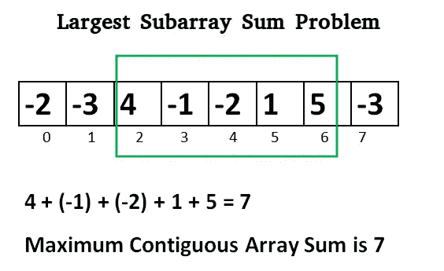
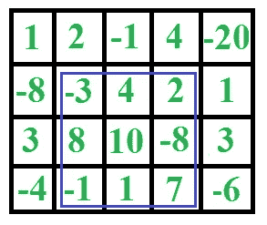

# 在 Javascript 中寻找最大的子数组和

> 原文：<https://levelup.gitconnected.com/finding-the-largest-subarray-sum-in-javascript-a243093c8840>

## [GitHub Repo，包含完整的解决方案代码和测试套件](https://github.com/noamsauerutley/largest-subarray-sum)

> 给定一个数字数组，找出其中累加和最大的连续子数组。

W 蚂蚁要分析一些 DNA 吗？测序一个基因组？分析图像数据？做一些数据挖掘？或者可能只是在准备技术面试时温习算法？然后，您可能需要在一个数字数组中找到加起来最大的和的子数组。

这个挑战是我最喜欢的说明使用正确的工具解决问题的价值的例子之一。作为 web 开发人员，我们经常反复使用许多相同的设计模式来解决问题。这太好了！学习有效的模板可以让我们更快更有效地解决我们遇到的许多问题。解决问题的本能遵循一些固定的惯例是有原因的，通常以[迭代循环](https://developer.mozilla.org/en-US/docs/Web/JavaScript/Guide/Loops_and_iteration)为中心。

然而，这种熟悉会让我们呆在自己的舒适区，导致思维僵化，阻碍我们探索更具创造性的解决方案，这些方案可能更有效、更简单，或者只是解决不寻常或复杂问题的必要手段。

> [“我想，如果你唯一的工具是一把锤子，那么把一切都当成钉子是很有诱惑力的”](https://en.wikipedia.org/wiki/Law_of_the_instrument)

我们习惯于将循环视为我们做任何事情的首选工具。需要再加一个任务？只需嵌套一个循环！我们得到了我们需要的结果。我们继续前进。很多时候？挺好的。

但是，我们难免会遇到不精的情况。巨大的阵列。错综复杂的数据。将我们的“锤子”(即嵌套迭代循环和类似的直接解决问题的方法)应用于这些挑战可能会对时间和计算能力产生灾难性的要求。这些[蛮力](https://en.wikipedia.org/wiki/Brute-force_search)解决方案在技术上可能能够返回我们想要的结果。然而，给定足够大或复杂的数据集，所需的时间和计算能力可能使它们基本上无用。

只有通过算法才能有效解决的问题有助于我们打破常规，教会我们考虑不同类型解决方案的时间和空间成本，并在我们的编程问题解决工具箱中添加除了可靠的锤子之外的其他工具。

好了，锤子说够了。寻找一个数组的最大子数组和怎么样？

当然，从技术上讲，使用蛮力来解决这个挑战是可能的。然而，这正是我们的锤子显然是错误的工具的情况之一。

强力解决方案将使用嵌套循环来查找给定数组的所有子数组(即数组的一部分)，然后比较它们，看哪个相加起来最大。如果一个数组非常大，这个操作的[时间复杂度](https://www.hackerearth.com/practice/basic-programming/complexity-analysis/time-and-space-complexity/tutorial/)可能是灾难性的。

当我们考虑到这一挑战的许多应用需要找到二维阵列的整个[矩阵的最大子阵列和时，这种解决方案的工具有多差就变得更加明显了，这将这一解决方案已经对数的时间复杂性推到了荒谬的境界。](https://www.geeksforgeeks.org/maximum-sum-rectangle-in-a-2d-matrix-dp-27/)

呀。

幸运的是，[杰伊·卡丹](https://en.wikipedia.org/wiki/Joseph_Born_Kadane)开发了一个可爱的[算法](https://en.wikipedia.org/wiki/Maximum_subarray_problem#Kadane's_algorithm)来尽快解决这个特殊的问题。它以[线性时间](https://en.wikipedia.org/wiki/Time_complexity#Linear_time)运行！这正是我们想要的那种东西。这是一个优雅的寻找解决方案的工具，也是一个很好的提醒，有时，使用一个方便的锤子会导致比它解决的问题更多的问题。

让我们勾勒出我们的框架:

首先，我们将把我们的数字数组传递给一个我称之为***largestsubaraysum***的函数，然后定义两个重要变量——***currentSum***和 ***largestSum*** 。

Kadane 的算法要求我们在数组中迭代一次。我们在最初的函数搭建中已经走了这么远，但是在我们准备的循环中我们到底要做什么呢？

算法的逻辑要求我们给准备好的 currentSum 变量赋一个新值。对于我们数组中的每个*，我们可以将***currentSum****重新分配给**或者是**的值**零** **或者是**currentSum 和 ***数*****的新总和，以较大者为准。****

**这确保了 ***currentSum*** 永远不会成为负数。**

**这个循环思想中有更多的逻辑。我们还没完呢。**

**在移动到数组中的下一个元素之前，我们需要比较 ***【当前总数】*** 和 ***最大总数*****

**如果*当前总和大于 ***最大总和*** ，那么我们需要用新的最大总和，即 ***当前总和*** 替换旧的 ***最大总和*。*****

**那么，这在 Javascript 中是什么样子的呢？**

**遍历这段代码，它就像我们计划的那样运行。**

**从头到尾一行一行地写，我们可以看到我们正在给我们的 ***currentSum*** 变量赋值。该值将是我们传递给 Javascript 的 [Math.max()](https://www.geeksforgeeks.org/math-max-javascript/) 函数所返回的任何值。在我们的例子中，我们告诉 Javascript 返回两者中较大的一个:零，或者是 ***currentSum*** 和 ***number*** (当前数组元素)之和。**

**然后，我们给 ***largestSum*** 赋一个新值——无论是 ***largestSum*** 还是 ***currentSum*** 都被确定为较大的数，并由 Math.max()返回。**

**这两个评估将针对数组中的每个新元素进行，这意味着 ***largestSum*** 将是从最终产生最大和的子数组中保存的数字——保存到 ***currentSum*** 的任何后续子数组和不会替换 ***largestSum*** ，因为它们不是 Math.max()返回的整数。**

**现在，如果我们正在寻找一个高性能的解决方案，你可能会质疑 Javascript 的 [Math.max()](https://www.geeksforgeeks.org/math-max-javascript/) 函数的使用。毕竟，当传递到 Math.max()中进行比较的数字太多时，它会变得笨拙。然而，我们从来不需要一次比较两个以上的数字，这使得它成为一个高效的计算工具。**

**这一切都很好，但我们需要确保这实际上，你知道，工作。**

**我已经准备好了一些数字数组和它们各自的最大子数组和，所以我们可以将我们的函数直接放入控制台，看看它是否正确地找到了最大和:**

**太好了！🌟我们的功能似乎是为各种具有不同特征的数字数组找到正确的子数组和。**

**如果你想知道更多关于上面使用的每个阵列测试什么，你可以阅读这个挑战的 [GitHub repo 的解决方案代码](https://github.com/noamsauerutley/largest-subarray-sum)中包含的[测试套件](https://github.com/noamsauerutley/largest-subarray-sum/blob/master/test/largestSubarraySum.spec.js)！**

**对我来说，这种方法比创建一大堆子阵列并比较它们要有趣得多。我认为很容易假设算法或其他开箱即用的解决方案自动比暴力解决方案更复杂或更难处理，但我认为 Kadane 的算法是一个很好的例证，说明情况并不总是如此。它也不太可能由于过度的时间/空间复杂性而使我们陷入运行时错误！**

**希望你的工具箱里有 Kadane 的算法能让你比这个家伙更成功地找到最大的子阵列和:**

****