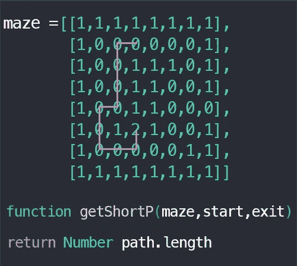
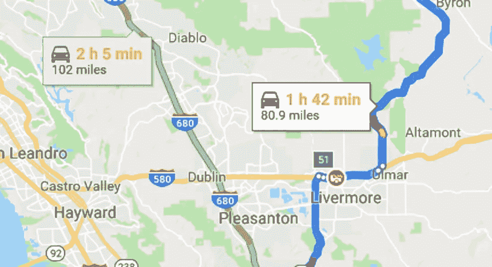
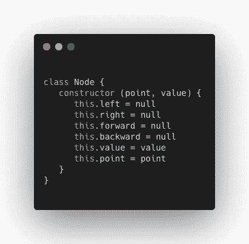
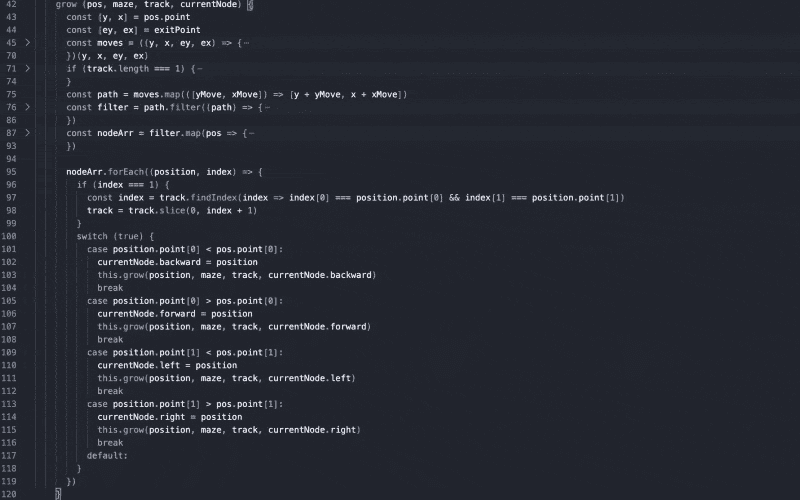
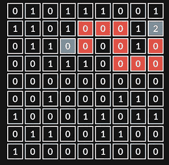
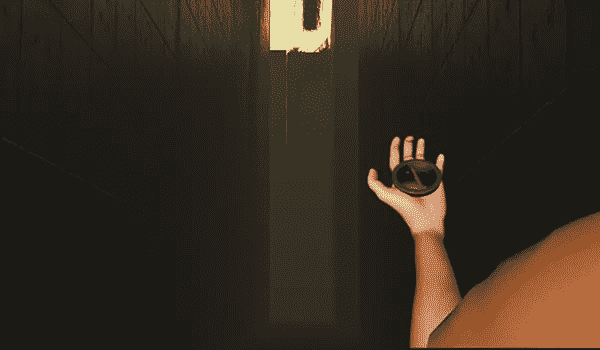
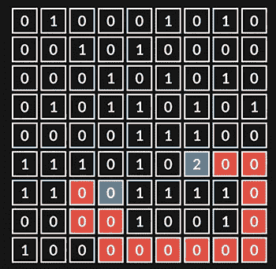
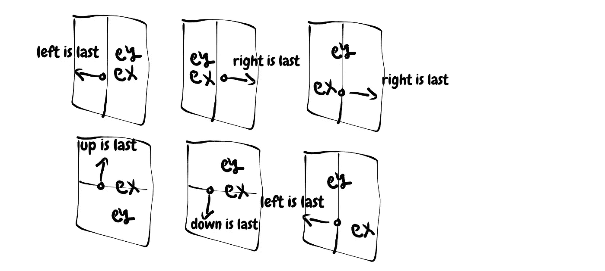
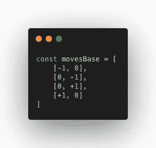
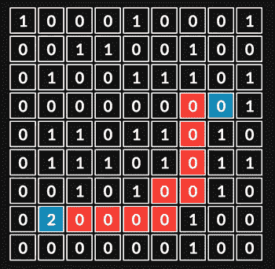

# 在 JavaScript 中寻找真正的最短路径:深度优先搜索

> 原文：<https://levelup.gitconnected.com/finding-the-real-shortest-path-in-javascript-depth-first-search-93a3ce514250>

在一次大公司的面试中通过了所有的问题后，我再次被迷宫解决者的问题所困扰。但这一次，我不得不找到通往出口的最短路径。

这是董事会上提出的问题:

“你需要写一个得到三个参数的函数:2D 数组、起点和出口点。这个函数返回一些到出口的最短路径，如果它存在的话”。

*2D 数组中的数字表示如下:0 是有效路径，1 是墙，2 是出口*。



最短路径的演示，如这里看到的路径是 10

*如果你有兴趣知道如何在不考虑最短路径的情况下解决问题，我在那个* [*这个*](https://talkwondo.github.io/the-maze-gunner/) *环节上做了一个巨型项目。*

于是回家想出解决最短路径的最佳算法，遇到了[诺姆·绍尔-乌特利](https://medium.com/u/4a3c4c41313c?source=post_page-----93a3ce514250--------------------------------)的[文章](/finding-the-shortest-path-in-javascript-pt-1-breadth-first-search-67ae4653dbec)。Noam 给出了一个树结构和函数的例子，该函数使用 BFS 返回从一个表示为 10 的节点到另一个表示为 12 的节点的最短路径。

我不打算详细说明这两种不同的算法，你可以阅读诺姆的文章和维基百科——我更喜欢专注于解决方案。

诺姆文章中的例子:

> 我将尝试运行我们的***breadsthfirssearch***函数，使用我们之前创建的 ***树*** 对象、10 的一个 ***根节点*** (实际根节点)，以及“12”的一个 ***搜索值*** 。

```
 10
    /  \
   4    17  
  / \   / \
 1   9 12  18The path -> 10,4,17,1,9,12!
```

你同意我说的最符合逻辑的最短路径是:10，17，12 吗？

此外，如果你在网上搜索或问同事在迷宫或等价模式中寻找最短路径的最佳算法是什么，对于未加权的图，他们会向你推荐 BFS。所以我在这里说**不！**DFS 会给你最短路径的数据，或者可能每个人都定义最短路径(意思是最短时间)来查找节点是否存在？



寻找最短路径的导航

我将很快向您展示完整的解决方案和结论，所以请耐心等待并阅读逻辑方法。

为 DFS 挑选和使用的最佳数据结构是一个[树](https://en.wikipedia.org/wiki/Tree_(data_structure))。

当解决一个复杂的迷宫必须有至少两个方向移动，但最有可能是三到四个，因此我们不能建立一个二叉树。相反，我们需要构建一个[图树](https://en.wikipedia.org/wiki/Tree_(graph_theory))。

以下是该解决方案的里程碑:

1.创建一个节点和一个树类。

2.在树中创建一个递归函数，通过有效的移动来增加“状态”位置。

3.过滤超出阵列、墙和已访问位置的位置。

4.获取最多四个过滤位置的数组来指示交汇点。

5.对于按移动排序的树，检查最后一个状态位置的增量，并执行 switch 语句。

6.分配位置并用当前位置和节点递归调用。

7.用深度优先搜索遍历树，直到找到出口，从根节点开始将位置数组添加到数组。

8.按数组长度排序，返回第一个数组的长度，如果没有，返回 false。

这可能看起来令人困惑，所以我将写下代码中的每一步，这样你就会完全理解。

1。首先，如上所述，让我们用 JavaScript 创建节点和树类:

2。在树类内部，我们将编写递归函数。我们将称之为(讽刺地)“成长”。在那之前，我们在迷宫里走了一系列的棋。

迷宫是 2D 阵列，轴表示为[y，x],正*坐标如下:y↓ x→*

对上面代码的一个详细说明:走法是一个数组，在迷宫数组的 4 个方向上增加一步，迷宫的宽度和高度很简单，只要看看从当前位置开始的走法是如何递增/递减的。

3。我们将使用 JavaScript 方法过滤器来清理墙壁、超出的数组点，最重要的是检查**轨迹**！

什么是**赛道**？如果我们想避免循环移动，我们需要建立某种数据结构来保存路径。这也会给我们以后带来问题。顺便说一下，函数 addTwo()只是在树中加 2，只是为了在树形图中显示出口。

4。现在，我们将为每个过滤后的移动制作一个节点，并将它们添加到轨迹中。

5。为了组织迷宫中每一步移动的树，我们将检查移动的增量，并将它们分配给树。

6。现在，我们将使用迭代的当前位置再次调用递归函数。当函数离开调用堆栈时，我们将返回到其他位置。

如上所述，对于数组中的每个节点，我们将其分配给树。在这一部分中，我们还需要更新节点类中的一些构造函数变量:



更新的节点类

7。我们将使用 DFS(！)并将路径推送到数组。我们可以得到一对夫妇的路径，但最短的是我们感兴趣的，我们将照顾它。

上面的 DFS 是一个递归函数，返回路径数组的数组。

8。我们将按照数组长度对路径进行排序，得到结果。如果没有出口，数组将为空，那么我们将返回 false。

在我们测试代码之前，我想向你解释一下我们的递归函数。正如你可能知道的，递归函数的主要问题是创建一个语句来结束递归，这意味着我们需要创建一个条件来在函数溢出之前停止反复调用调用堆栈中的函数。然而，在我们的函数中没有条件，那么它什么时候结束呢？当循环遍历元素的[nodeArr]到达末尾时。

这个递归真的很混乱…那我们为什么要用它呢？只是因为我们需要记住我们在选择下一条路之前已经遇到的相同的路口，以便我们可以返回并尝试另一条可能更短的路(或通向出口)。如果我们选择使用迭代，我们需要建立一个交叉点的数据结构(可能是某种**散列表**),并在每次进入死胡同时返回。但是递归为我们做到了！当路径到达一个死胡同时，它返回到[nodeArr]循环，并转到连接中的相邻路径，最酷的部分是，在我们选择下一个递归函数之前，所有变量都“及时返回”到它们的值。



这就是递归函数的工作方式

现在让我们做一些测试。



这不是最短的路！

看，那没用。那不是最短的路径…让我们试着找出我们在这里错过了什么…

你可能还记得，我们有跟踪阵列。它会保存之前访问过的所有位置。例如，如果我们选择一条路，并通过一个特定的位置，导致出口，一旦我们从不同的方式返回到相同的位置，我们不能再通过它，因为它已经包括在轨道中，以避免循环。

我们需要考虑如何清理赛道，但我们应该什么时候做呢？

让我们想象一下，我们在一个迷宫里…我们带着一个指南针来指示出口。我们做什么呢我们要怎么移动？

答案是每次向出口走一步，我们会检查指南针的指针来决定下一步的方向。这意味着我们将选择两个坐标来生成一个矢量。我们将随机选择一个方向作为第一个方向。如果我们到达终点，我们会想也许另一条路会更短。



由于我们只能垂直和水平移动，我们将创建一个到出口的向量，并向它走去

让我们试着用代码来实现。

我们将创建一个 switch 语句来检查出口在哪里以及我们当前位置的增量，并相应地创建 move 数组。

通向出口的最重要的路径应该在第一个和第二个移动数组处，它们构成了通向出口的 Y 和 X 向量。如果我们到达了末尾，并且[nodeArr]有多个元素，我们将清除该轨道，并转到第二个选项。让我用代码向您展示更新递归函数调用:

让我们试试另一个测试:



它应该先选下一步再选左一步

哦，我们还有一个问题！但这次我不会详细说明，问题只是移动数组中的第三和第四个元素。在这个特定的迷宫中，如果向下的位置在第三个元素中，我们将获得最短的路径，因此我们可以在第三和第四个元素之间切换，但在这个阶段，我们需要考虑全局解决方案，而不是私人解决方案。起初，我不认为第三和第四有任何不同，我只是武断地把它们放在那里，但现在我看到了逻辑决定。

当然，我们可以在第三和第四个索引中清除轨道，但这将使堆栈溢出！这将是一棵巨大的树。如果我们想避免由于递归而导致的最大调用阻塞，并尝试建立一个迭代方法，这将导致我们花费大量时间来得到答案，所以我们需要有创造性。

我找到了最佳解决方案，实际上移动数组中的第四个位置应该与退出方向完全相反，如果每条路径都失败了，我们仍然会选择它，但是这将解决我们的问题。



这就是如何在 delta 条件下确定 moves 数组的元素

移动数组从开始就保持不变:



按以下顺序移动数组:[上、左、右、下]

最后，最后的考验！



你也可以在我的网站上玩这个游戏[https://talkwondo.github.io/the-maze-gunner/](https://talkwondo.github.io/the-maze-gunner/)

就是这样！那是一个非常具有挑战性的项目。我对我的方法非常肯定，但是如果你看到我的算法不起作用的私人案例，请给我写一个评论，以便我可以继续努力。

来自以色列的和平！