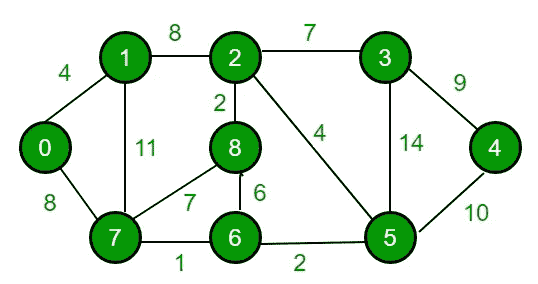
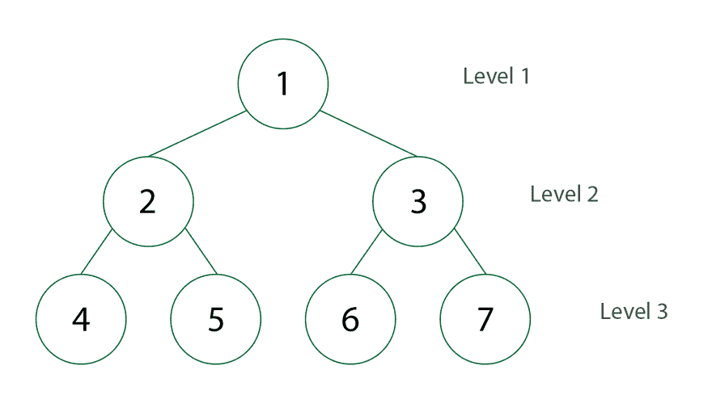
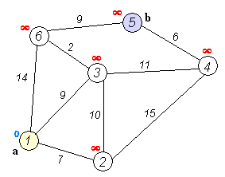
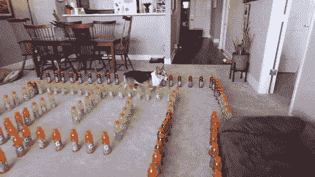

# 在 Javascript 中寻找最短路径:Dijkstra 算法

> 原文：<https://levelup.gitconnected.com/finding-the-shortest-path-in-javascript-dijkstras-algorithm-8d16451eea34>



> 在图中找到两个节点之间的一条**路径**，使得其组成边的权重之和最小。

## [GitHub 回购，已完成解决方案代码](https://github.com/noamsauerutley/shortest-path)

**注:**这是我就这个话题写的第二篇文章。在[之前的文章](/finding-the-shortest-path-in-javascript-pt-1-breadth-first-search-67ae4653dbec)中，我实现了一个[广度优先搜索](https://www.cs.bu.edu/teaching/c/tree/breadth-first/)来从二叉树的一个节点遍历到另一个节点。如果您对基于节点的数据结构不太熟悉，想要快速刷新，或者想要查看大量不必要的黏液霉菌 gif，我建议您在深入了解这个解决方案之前先查看一下！



然而，我在上一篇文章中探索的二叉树深度优先搜索有很多限制。它只适用于非常特殊类型的二叉树结构，这并不使它成为映射点集的最佳工具，比如存储在更复杂的[加权图](http://courses.cs.vt.edu/~cs3114/Fall10/Notes/T22.WeightedGraphs.pdf)中的实际 IRL 数据。

因此，已经开发了几种不同的算法，这些算法修改和扩展了广度优先搜索模式，以便使其能够映射能够有效表示现实生活价值和挑战的图形类型。

所以，我从广度优先二叉树搜索转移到 Edsger W. Dijkstra 设计的算法。


Edsger W. Dijkstra 是系统开发、编程和计算科学的基础领导者，也是开发结构化编程的关键人物。他生于 1930 年，卒于 2002 年，一生中大部分时间都在大学教书。像许多其他重要算法的开发者一样，他是一个博学的人——他的早期教育是化学，然后是理论物理，尽管他考虑过进入法律领域。20 世纪 50 年代初，一个熟人给他提供了一份在阿姆斯特丹数学中心计算部门的工作，他才偶然接触到电子计算机。在那里，他成为了荷兰的第一个程序员，尽管在相当长的一段时间里他一直专注于理论物理。

他努力使编程方法和结构在任何时候都尽可能简单易懂，这在理论性很强的早期编程世界中是不常见的。他深受他的数学家母亲的影响，说“她在处理公式方面有很大的灵活性，在寻找非常优雅的解决方案方面有很好的天赋”。

我想知道他当老师的那些年是否也影响了他对编程代码可理解和可用的重视。不管怎样，作为一个图论新手，他的算法是我最容易理解的。


Dijkstra 谈到算法时说:

> 一般来说，从[鹿特丹](https://en.wikipedia.org/wiki/Rotterdam)到[格罗宁根](https://en.wikipedia.org/wiki/Groningen)的最短旅行方式是什么:从一个城市到另一个城市。[这是最短路径](https://en.wikipedia.org/wiki/Shortest_path_problem)的算法，我花了大约二十分钟设计的。一天早上，我和年轻的未婚妻在[阿姆斯特丹](https://en.wikipedia.org/wiki/Amsterdam)购物，累了，我们坐在咖啡厅露台上喝咖啡，我在想我是否可以这样做，然后我设计了最短路径的算法。正如我所说，这是一个 20 分钟的发明。事实上，它是在三年后的 59 年出版的。该出版物仍然可读，事实上，相当不错。它如此漂亮的原因之一是我没有用铅笔和纸来设计它。我后来才知道，不用铅笔和纸进行设计的一个好处是，你几乎是被迫避免所有可以避免的复杂性。最终，令我大为惊讶的是，这个算法成了我成名的基石之一。

那么，这个算法的步骤是什么呢？

*   从一组节点开始，所有节点都没有被访问过。
*   创建一组未访问的节点，称为由所有节点组成的未访问集。
*   为每个节点指定一个初始距离值。对于起始节点，它将被设置为零，对于所有其他节点，它将被设置为无穷大。
*   将起始节点设置为当前节点。
*   对于每个当前节点，计算到其每个未访问的相邻节点的暂定距离。将从当前节点到邻居节点的距离与从起始节点到邻居节点的距离相加。
*   当当前节点的所有未访问的相邻节点都被映射后，将当前节点标记为已访问，将其从未访问集中移除。将不会再次检查已访问的节点。
*   如果特定目的地节点已经被标记为已访问(当规划两个特定节点之间的路线时)，或者如果从开始节点到未访问集合中的节点的最小暂定距离是无穷大(意味着开始节点和剩余的未访问节点之间没有连接)，则停止。算法已经完成。
*   否则，选择具有最小暂定距离的未访问节点，将其设置为新的“当前节点”，并重复计算到其每个未访问邻居节点的暂定距离的过程。

如果目的节点在所有“未访问的”节点中具有最小的试探性距离(因此可以被选择为下一个“当前的”)，那么算法可以停止。



好的，那么我们从哪里开始把它翻译成 JavaScript 代码呢？

我将从创建一个名为 ***的 [JavaScript 对象](https://www.w3schools.com/js/js_objects.asp)开始，图*** 填充有[键值对](https://searchenterprisedesktop.techtarget.com/definition/key-value-pair)。每个键代表图上的一个节点。每个值对象包含表示节点的直接邻居和节点&邻居(即“边”)之间路径的距离或权重的键-值对。

这给了我一个可以导航的测试图。

首先，我们需要能够识别最近的相邻节点。我们将需要重复这样做，所以我将使这个功能成为它自己单独的帮助器函数，我们可以根据需要调用它。

它将接受两个参数——一个由存储在键值对中的节点及其距离组成的对象，以及一个访问过的节点的数组列表。

我们可以遍历对象的节点键，找到距离值最短的节点。如果距离最短的节点在未访问的集合中，那么这就是我们应该访问的下一个节点。

好了，现在我们已经写好了我们的工作助手方法，我们可以深入到更大的函数中，它将处理完整的图形导航过程。

我们的函数将接受三个参数:我们之前制作的图形对象、期望的开始节点和期望的结束节点。

为了使用 Dijkstra 算法遍历我们的图形对象并找到从开始节点到结束节点的最短路径，我已经伪代码化了我想要采取的步骤。

那可是很多步啊！我们从头开始吧。

首先，我们需要一个 hash 对象来跟踪每个节点到起始节点的距离。按照 Dijkstra 算法的指示，我们首先将暂定距离值“无穷大”赋给结束节点。我们还想将分配给我们的 ***图*** 中任一节点的子节点的键-值对复制到 ***距离*** 中。

因此，我们现在有了一个跟踪散列对象，它有一个键值对，包含 key: ***endNode*** 和值“infinity ”,以及用于 ***startNode*** 的子节点的其他键值对。

太好了！现在我们有了一个 hash 对象，它可以跟踪一个节点到起始节点的距离。我们将在遍历节点时继续跟踪这些数据，并在最终到达结束节点时返回开始节点到结束节点的距离。

好了，现在我们需要另一个 hash 对象来跟踪我们以后需要的数据——我们有一个对象来跟踪我们的距离，我们需要另一个对象来跟踪路径。当我们到达终点时，我们希望不仅能够返回从起点到终点的距离，还能够返回从起点到终点的路径。

我们将通过跟踪父子节点关系来创建这条路径。我在之前的[帖子](/finding-the-shortest-path-in-javascript-pt-1-breadth-first-search-67ae4653dbec)中探讨了这些关系，所以如果你想重温这些结构，请随意阅读。

由于我们目前不知道结束节点的父节点，我们将为它指定一个空的父节点值。但是，我们可以遍历开始节点的所有子节点，并为它们分配一个父值 ***startNode*** 。这就足够开始跟踪父节点了！

接下来，我们需要收集一个已访问节点的列表——为此，我将创建一个名为 ***visited*** 的空数组。

现在我们有了一个 ***距离*** 对象和一个 ***访问过的*** 数组，这是我们需要传递到前面创建的***shortestDistanceNode***助手函数中的两个参数。所以，现在我们可以在包含我们的开始节点的子节点的 ***距离*** 对象中，找出哪一个是离 ***开始节点*** 最近的。

现在，我们将利用一个 [while 循环](https://www.w3schools.com/js/js_loop_while.asp)来开始处理每个节点&的子节点。这个循环将一直运行，直到我们访问完所有的节点。

对于每个节点，我们将通过在 ***图*** 和 ***距离*** 散列对象中查找与当前节点匹配的键所配对的值，从找到当前节点与其子节点的距离开始。

现在我们可以遍历每个子节点。

在对子节点做任何事情之前，我们希望确保它不是开始节点。我们不想绕圈子，所以如果一个子节点是开始节点，我们将跳到下一个子节点。

现在我们将使用几分钟前为当前父节点创建的 ***距离*** 变量。

我们将创建一个名为 ***newDistance*** 的新变量，并将它的值指定为 ***distance*** +子节点的值—它与其父节点的距离。通过将起始节点到父节点的距离加上父节点到子节点的距离，这将给出子节点到起始节点的距离。

(不幸的是，在这一点上，我的代码对于我的[语法高亮代码片段生成器](https://carbon.now.sh/)来说有点太长了😔所以我转而使用普通的旧标记代码片段。我希望这不会对可读性造成太大的影响！)

```
let findShortestPath = (graph, startNode, endNode) => {

 ***// track distances from the start node using a hash object***   let distances = {};
 distances[endNode] = "Infinity";
 distances = Object.assign(distances, graph[startNode]);***// track paths using a hash object* ** let parents = { endNode: null };
 for (let child in graph[startNode]) {
  parents[child] = startNode;
 }

 ***// collect visited nodes***   let visited = [];***// find the nearest node* **   let node = shortestDistanceNode(distances, visited);

 ***// for that node:*** while (node) {
 ***// find its distance from the start node & its child nodes***  let distance = distances[node];
  let children = graph[node]; 

 ***// for each of those child nodes:***      for (let child in children) {

 ***// make sure each child node is not the start node***        if (String(child) === String(startNode)) {
          continue;
       } else {
 ***// save the distance from the start node to the child node***          let newdistance = distance + children[child];***// if there's no recorded distance from the start node to the child node in the distances object
// or if the recorded distance is shorter than the previously stored distance from the start node to the child node

// save the distance to the object

// record the path

// move the current node to the visited set******// move to the nearest neighbor node

// using the stored paths from start node to end node
// record the shortest path******//this is the shortest path******// return the shortest path & the end node's distance from the start node***
};
```

如果我们还没有在距离对象中保存这个子节点，记录它与开始节点的距离，或者，如果先前记录的距离比 ***newDistance*** 值长(意味着我们刚刚找到了一条更短的路径，耶！)然后我们将 ***newDistance*** 值赋给匹配***distance***散列对象中当前子节点的键。

为了保持记录的准确性，我们还在 ***parents*** 对象中记录了当前子节点的父节点。这样，我们就可以一直追踪到起始节点。

```
let findShortestPath = (graph, startNode, endNode) => {

 ***// track distances from the start node using a hash object***   let distances = {};
 distances[endNode] = "Infinity";
 distances = Object.assign(distances, graph[startNode]);***// track paths using a hash object***
 let parents = { endNode: null };
 for (let child in graph[startNode]) {
  parents[child] = startNode;
 }

 ***// collect visited nodes***   let visited = [];***// find the nearest node* **   let node = shortestDistanceNode(distances, visited);

 ***// for that node:*** while (node) {
 ***// find its distance from the start node & its child nodes***  let distance = distances[node];
  let children = graph[node]; 

 ***// for each of those child nodes:***      for (let child in children) {

 ***// make sure each child node is not the start node***        if (String(child) === String(startNode)) {
          continue;
       } else {
 ***// save the distance from the start node to the child node***          let newdistance = distance + children[child];***// if there's no recorded distance from the start node to the child node in the distances object
// or if the recorded distance is shorter than the previously stored distance from the start node to the child node***
          if (!distances[child] || distances[child] > newdistance) {
 ***// save the distance to the object***     distances[child] = newdistance;
 ***// record the path***     parents[child] = node;
           } 
         }
       }  
 ***// move the current node to the visited set*** ***// move to the nearest neighbor node

 // using the stored paths from start node to end node
 // record the shortest path******//this is the shortest path******// return the shortest path & the end node's distance from the start node***
};
```

接下来，我们将当前父节点添加到 ***已访问过的*** 数组中，将其添加到已访问过的集合中，这样当我们遍历未来的节点时就不会重复了。

现在，我们可以重复这个过程，通过使用我们的***shortestDistanceNode***助手函数来查找最近的节点，这将重新开始 while 循环的下一次迭代。我们的 while 循环将继续运行，重复这个过程，直到***shortestDistanceNode***找不到新的未访问节点。

```
let findShortestPath = (graph, startNode, endNode) => {

 ***// track distances from the start node using a hash object***   let distances = {};
 distances[endNode] = "Infinity";
 distances = Object.assign(distances, graph[startNode]);***// track paths using a hash object* ** let parents = { endNode: null };
 for (let child in graph[startNode]) {
  parents[child] = startNode;
 }

 ***// collect visited nodes***
   let visited = [];***// find the nearest node* **   let node = shortestDistanceNode(distances, visited);

 ***// for that node:*** while (node) {
 ***// find its distance from the start node & its child nodes***  let distance = distances[node];
  let children = graph[node]; 

 ***// for each of those child nodes:***      for (let child in children) {

 ***// make sure each child node is not the start node***        if (String(child) === String(startNode)) {
          continue;
       } else {
 ***// save the distance from the start node to the child node***          let newdistance = distance + children[child];***// if there's no recorded distance from the start node to the child node in the distances object
// or if the recorded distance is shorter than the previously stored distance from the start node to the child node* **          if (!distances[child] || distances[child] > newdistance) {
 ***// save the distance to the object***     distances[child] = newdistance;
 ***// record the path***     parents[child] = node;
    } 
         }
       }  
 ***// move the current node to the visited set***      visited.push(node);***// move to the nearest neighbor node* **      node = shortestDistanceNode(distances, visited);
    }

 ***// using the stored paths from start node to end node
 // record the shortest path******//this is the shortest path******// return the shortest path & the end node's distance from the start node***
};
```

好的，我们的 while 循环将一直运行，直到所有的节点都被访问和映射。解决之后我们做什么？

我们可以创建一个名为 ***shortestPath* ，**的数组变量，它最初只包含结束节点。但是，我们可以通过 ***parents*** hash 对象中的键查找结束节点的 parent，并将其推入 ***shortestPath*** 数组。请记住，我们仅在从开始节点找到节点&之间的最短距离后，才记录该对象的父子对，因此从结束节点追溯到我们记录为其父节点的节点将沿着特定路径(最短路径)后退一步。

因为我们存储了我们访问的每个节点的最短距离父节点的记录，所以我们可以开始一个新的 while 循环，并找到每个父节点的父节点，这最终将追踪一条路径回到开始节点。

然而这并不是我们想要的——我们想要从起点到终点的最短路径，而不是从终点到起点的最短路径！

谢天谢地，JavaScript 提供了一个方便的 [array.reverse()](https://www.w3schools.com/jsref/jsref_reverse.asp) [数组方法](https://www.geeksforgeeks.org/javascript-basic-array-methods/)。因此，如果我们反转我们的 ***shortestPath*** 数组，我们将得到一个节点数组，如果遍历该数组，将得到从开始节点到结束节点的最短路径。

```
let findShortestPath = (graph, startNode, endNode) => {

 ***// track distances from the start node using a hash objec***t
    let distances = {};
    distances[endNode] = “Infinity”;
    distances = Object.assign(distances, graph[startNode]); ***// track paths using a hash object***
    let parents = { endNode: null };
    for (let child in graph[startNode]) {
      parents[child] = startNode;
    }

 ***// collect visited nodes***   let visited = []; ***// find the nearest node***
   let node = shortestDistanceNode(distances, visited);

    ***// for that node:***
    while (node) {
       ***// find its distance from the start node & its child nodes***
       let distance = distances[node];
       let children = graph[node]; 

 ***// for each of those child nodes:***
       for (let child in children) {

          ***// make sure each child node is not the start node***
          if (String(child) === String(startNode)) {
             continue;
          } else {
 ***// save the distance from start node to child node***
             let newdistance = distance + children[child]; ***// if there’s no recorded distance from the start node to the child node in the distances object***
             ***// or if the recorded distance is shorter than the previously stored distance from the start node to the child node***
             if (!distances[child] || distances[child] > newdistance) {
                ***// save the distance to the object***
                distances[child] = newdistance;
                ***// record the path***
                parents[child] = node;
            } 
         }
      } 
    ***// move the current node to the visited set***
    visited.push(node); ***// move to the nearest neighbor node***
   node = shortestDistanceNode(distances, visited);
   }

 ***// using the stored paths from start node to end node
   // record the shortest path***
   let shortestPath = [endNode];
   let parent = parents[endNode];
   while (parent) {
      shortestPath.push(parent);
      parent = parents[parent];
   }
   shortestPath.reverse();

 ***//this is the shortest path******// return the shortest path & the end node’s distance from the start node***
};
```

我们做到了！我们找到了最短的路径！

让我们格式化我们收集的信息，以便我们的函数可以很好地返回它。

我们可以创建最后一个 hash 对象，这一次使用 who 键:“distance”和“path”。

“距离”的值将是实际的数字距离值，它是从开始节点到结束节点的总距离，是从沿着最短路径的节点之间的边的所有距离值(即，边权重)的总和。我们可以通过在*散列对象中找到我们保存在与 ***endNode*** 匹配的键下的距离值来找到它。*

*“path”的值将是我们刚刚创建并填充的 ***shortestPath*** 数组，该数组可以提供一个路线图，该路线图可以准确地列出要遍历哪些节点，以便从起始节点到结束节点&覆盖最少的距离。*

```
*let findShortestPath = (graph, startNode, endNode) => {

 ***// track distances from the start node using a hash object***
   let distances = {};
 distances[endNode] = "Infinity";
 distances = Object.assign(distances, graph[startNode]);***// track paths using a hash object***
 let parents = { endNode: null };
 for (let child in graph[startNode]) {
  parents[child] = startNode;
 }

 ***// collect visited nodes***
   let visited = [];***// find the nearest node***
   let node = shortestDistanceNode(distances, visited);

 ***// for that node:***
 while (node) {
 ***// find its distance from the start node & its child nodes***
  let distance = distances[node];
  let children = graph[node]; 

 ***// for each of those child nodes:***
      for (let child in children) {

 ***// make sure each child node is not the start node***        if (String(child) === String(startNode)) {
          continue;
       } else {
 ***// save the distance from the start node to the child node***          let newdistance = distance + children[child];***// if there's no recorded distance from the start node to the child node in the distances object
// or if the recorded distance is shorter than the previously stored distance from the start node to the child node***
          if (!distances[child] || distances[child] > newdistance) {
***// save the distance to the object* **     distances[child] = newdistance;
***// record the path* **     parents[child] = node;
    } 
         }
       }  
 ***// move the current node to the visited set***      visited.push(node);***// move to the nearest neighbor node* **      node = shortestDistanceNode(distances, visited);
    }

 ***// using the stored paths from start node to end node
 // record the shortest path***
 let shortestPath = [endNode];
 let parent = parents[endNode];
 while (parent) {
  shortestPath.push(parent);
  parent = parents[parent];
 }
 shortestPath.reverse();

 ***//this is the shortest path*** let results = {
  distance: distances[endNode],
  path: shortestPath,
 };
 ***// return the shortest path & the end node's distance from the start node***   return results;
};*
```

*让我们在控制台中进行几轮测试，看看会有什么结果:*

*太好了！🌟*

*我们的函数输出从一个给定的起始节点到一个给定的结束节点的最短路径，并且还有益地提供节点之间的加权边的总距离值。*

*在包含完整解决方案代码的 GitHub repo 中，我包含了一个额外的文件，其中包含了在算法执行过程中记录更新消息的替代代码。如果可视化过程很棘手，我建议运行该代码并观察日志进度！*

**

*我希望你在寻找两点间最短路径的尝试中像这只柯基一样成功！*