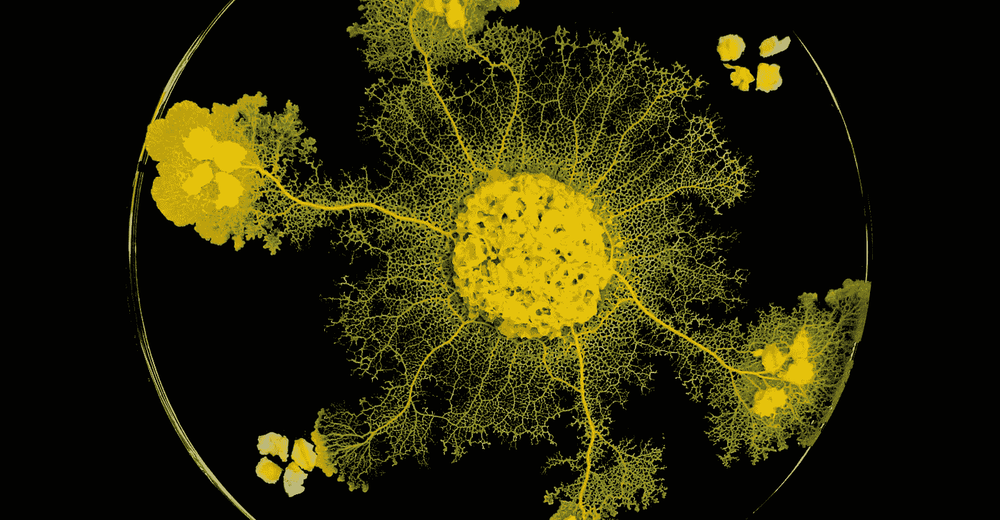
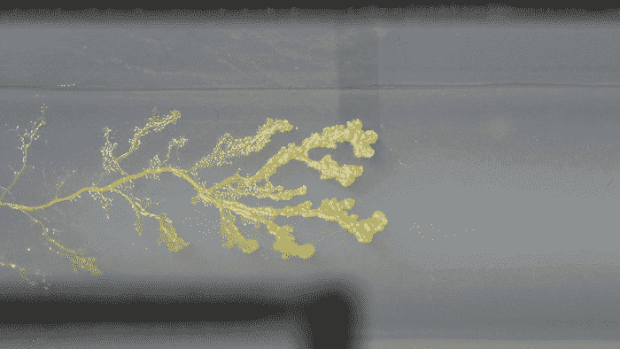
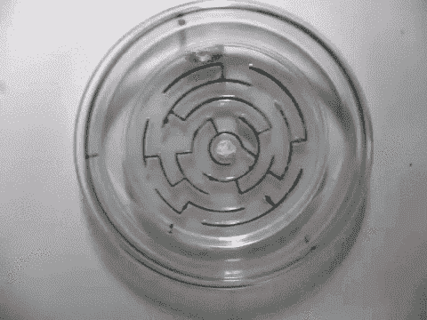
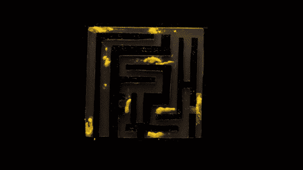
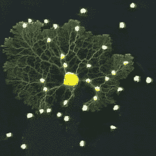
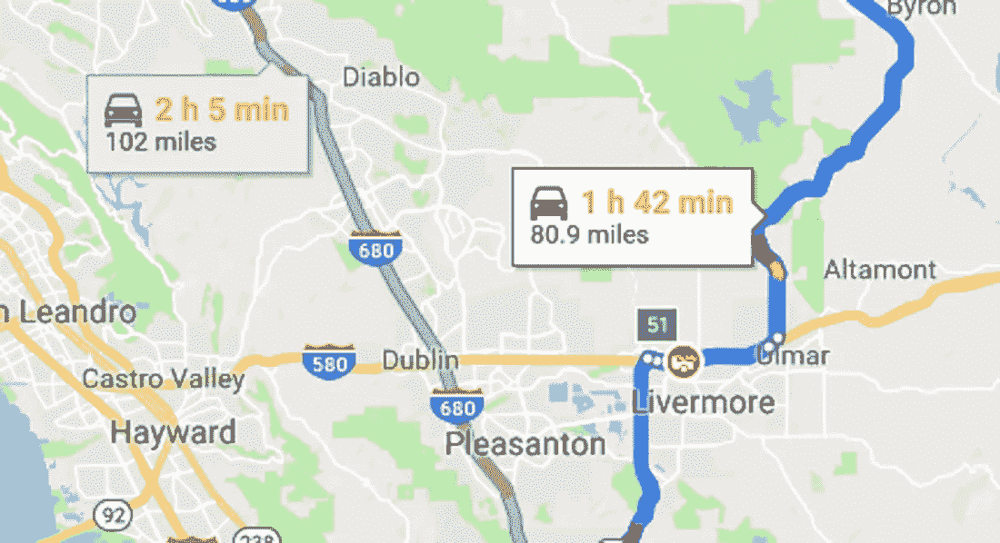
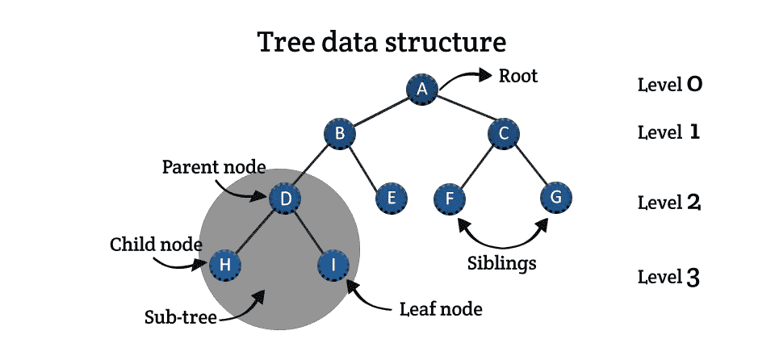
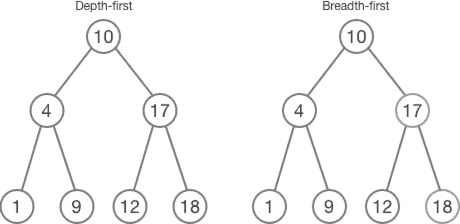
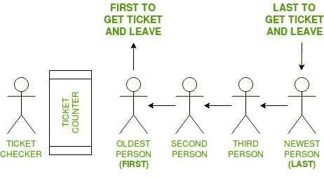

# 在 Javascript 中寻找最短路径:广度优先搜索

> 原文：<https://levelup.gitconnected.com/finding-the-shortest-path-in-javascript-pt-1-breadth-first-search-67ae4653dbec>



> 使用广度优先搜索查找树中两个节点之间的路径

## [具有完整解决方案代码的 GitHub repo】](https://github.com/noamsauerutley/breadth-first-search/)

## CW:这个帖子里会有黏菌的图片/gif。

老实说，我决定解决这个问题，因为我想谈谈黏菌。

黏菌很奇怪。实际上，它们不是霉菌——它们曾经被归类为真菌，但现在不再是了。它们也不是植物、动物或矿物。他们可以移动。它们可以是单细胞生物，或者形成巨大的污泥菌落。

黏菌现在被归类为[原生生物](https://en.wikipedia.org/wiki/Protist)，这在很大程度上是一个方便的分组，因为原生生物没有共同的祖先，没有必然的联系，除了由[真核细胞](https://en.wikipedia.org/wiki/Eukaryote)组成，并且不属于任何其他组之外，没有太多的共同点。

像原生生物一样，黏菌甚至都没有联系或相关。他们只是一群不同类型的生命形式，有着通常相似的行为模式。


看看这些怪人

科学家和其他人仍然对黏菌着迷，因为[它们没有大脑，但显然有通过吸收进行记忆的能力，并且(有争议的)甚至可能学习](https://www.quantamagazine.org/slime-molds-remember-but-do-they-learn-20180709/)。

不过，与我们今天寻求解决的问题更相关的是:它们在寻找营养来源的有效途径方面非常有效。

黏菌通过向外生长来“移动”，似乎是为了寻找它们需要的资源，然后从找不到美味的地方或路径缩回它们身后的分支。



这使得它们吸引了包括迷宫在内的实验:



以及地图:



观看没有大脑的东西解决迷宫很有趣，但真正引起人们注意的是黏菌能够[在期望的点之间建立具有高效路线的有效网络](https://www.wired.com/2010/01/slime-mold-grows-network-just-like-tokyo-rail-system/)。

黏菌的“运动”模式，通过生长分支线性线的扩展网络，然后缩回并只保持有效连接它们和营养物的路径，模仿人类发明的许多算法的行为，以解决在多点之间创建最有效的可能网络的问题。

事实证明，黏菌非常善于找到它们想要的东西的最短路径。

人类也在解决最短路径问题上下了很大功夫。这不仅是图论和抽象数学中的一个有趣的问题，也是航运网络、绘图程序和无数其他实际问题中的一个有趣的问题，这些问题涉及寻找从 A 点到 B 点(然后可能到 C 点、D 点和 E 点)的最佳方法。这是一个与人类实际需求和行为密切相关的问题。



当观察这种黏菌的行为时，首先映入我眼帘的是它的运动和生长的分支结构在视觉上多么像一棵树。



树是一种数据结构，它帮助我们可视化链接点(称为“节点”)之间的连接。作为关系数据结构的核心部分，树允许我们通过连接节点从起点移动到期望的终点。

我在早期的算法挑战赛中使用了递归树:[寻找一个字符串的所有排列](/find-all-permutations-of-a-string-in-javascript-af41bfe072d2)，如果你想看更多关于二叉树结构的探索。

注意:为了进行有效的心理映射，应该将有问题的“树”上下颠倒。第一个节点称为根节点(没有父节点)，位于列表的顶部，子树或分支由连续几代的“父”和“子”节点组成。


具有自己的子节点的子节点成为这些子节点的父节点。没有自己的子节点的子节点称为“叶节点”。连接节点的线称为“边”。边也可以有自己的值——可能代表它们的长度、通行费的价格等。但是这些值不是强制性的——可以假定所有的边都是相等的。具有这种分配的单独分配值(称为“成本”)的边是“加权的”，具有和不具有加权边的图或树分别是“加权的”或“未加权的”。

边只在父节点和子节点之间延伸，而不在“兄弟节点”(共享一个父节点的子节点)之间延伸。这意味着在兄弟节点之间移动需要向上遍历回父节点，然后向下遍历回所需的子节点。

有两种默认的导航树或图结构的方法:一种[深度优先搜索](https://en.wikipedia.org/wiki/Depth-first_search)，或者一种[广度优先搜索](https://en.wikipedia.org/wiki/Breadth-first_search)。

深度优先搜索从父节点移动到子节点，从根节点一直向下移动到单行子树，到达最底层的子节点，即没有自己的子节点的叶节点。当一条垂直父子线不能再被遍历时，该线被回溯，直到到达具有未被遍历的子节点的父节点。此时，将垂直向下遍历这条父子线，直到结束，重复该过程。

广度优先搜索从根节点向下移动到它的第一个子节点，然后立即回溯到根节点并遍历任何其他子节点。一旦映射了根的所有子节点，那么在向下移动到下一层之前，将使用相同的立即回溯模式遍历这些节点的每个子节点。

按照惯例，这两种搜索模式都是从左向右移动的。



想多读点？我喜欢[这种](https://www.cs.bu.edu/teaching/c/tree/breadth-first/)的崩溃。

对于特定的树、图或问题，这两种搜索都是最佳选择。一般来说，给定一个未加权的树或图，广度优先搜索在期望的节点可能更接近根(通过层数)的情况下是优选的。

在导航图或树以寻找从根节点到我们选择的节点的最短路径(即，最少数量的层，假设未加权的树或图)时，广度优先搜索可能是我们的最佳选择，因为我们花费在绘制低于我们的目标点的层的子节点上的任何时间都将被浪费。

因此，广度优先搜索将优先考虑横向扩展，在发出更深入的调查线之前探索起始点周围的直接区域。

这让我想起了黏菌探索的方式——在扩展到更远的地方之前，一次一波地彻底绘制它们周围的地图。


有点像这样

所以我想开始寻找一种有效的方法来寻找两点之间的最短路径，通过广度优先搜索穿越一个平原二叉查找树。一个广度优先搜索本身是否足以在一个更复杂的图中找到点与点之间的最短路径，这与现实世界的映射挑战有关？不。这是开始探索这个问题的好方法吗？我想黏菌会同意的。

首先，我们需要一棵树来遍历。我们的将是一个二叉查找树，所以一些规则适用。

*   像所有二叉树一样，每个节点最多只能有两个子节点。
*   每个节点都有一个不同的数值，没有两个节点有相同的数字。
*   如果一个节点有子节点，在**左边**的子节点必须有一个比它的父节点小的数值。右边**的子节点**必须有一个更大的值。


我再次张贴这张 gif，因为我们将使用它作为参考

如果视觉参考有帮助的话，上面的 gif 示例说明了所有这些规则！

有多种方法可以在 JavaScript 中构建二叉查找树的表示。我选择用表示二叉查找树的键值对来创建一个 JavaScript 对象。为了让我们继续使用我们的视觉参考，让我们使用与上面的 gif 相同的值。

所以，我们可以表示下面的二叉树:

```
 10
    /  \
   4    17
  / \   / \
 1   9 12  18 
```

作为下面的 Javascript 对象:

“value”键保存节点的实际不同数值(以字符串形式，因为对象键必须是字符串，我们希望以后使用这些键来标识我们的节点)。

“left”值保存左侧子节点的值。如果没有左子节点，则该值为 null。

“right”值保存右侧子节点的值。如果没有正确的子节点，则该值为 null。

太好了！现在我们有东西可以利用了。

让我们开始构建我们的搜索功能。

我们将传递几个参数到我们的函数中:我们刚刚创建的 ***树*** 对象，一个 ***根节点*** ，因此我们可以在树上我们喜欢的任何点开始我们的搜索，以及一个 ***搜索值*** —我们正在寻找的节点。

我们将使用队列对节点进行排序。

我在[解决平衡括号](/solving-balanced-brackets-in-javascript-with-stacks-edbc52a57309)中简单提到了队列，因为那个解决方案依赖于它们的栈的伙伴数据结构。

堆栈和队列本质上是数组，对它们包含的哪些元素可以被操作或删除有非常非常严格的限制。

队列的运作就像他们在现实生活中的名字一样:第一个加入队列的人是第一个完成排队并离开的人。



如果你在食品服务行业工作过，先进先出的概念可能对你来说很熟悉。如果没有，这是一个重要的食品安全实践，食品被贴上标签或组织起来，以确保冰箱或储藏室中的第一批食品(即最老的食品)是最先被消费的，确保适当的周转，防止食品腐败或浪费。


如果你想看一些关于这个概念的更抽象的或编程的具体说明，网上有很多图表！

然而，我们的队列数组的功能就像杂货店或组织良好的仓库中的收银台——在任何给定的时间，只有第一个被添加的元素可以被删除。

我们想通过添加我们的 ***根节点*** 来初始化我们的 ***队列*** ，以便它可以在正确的位置开始搜索。

现在，我们要设置一个 [while 循环](https://www.w3schools.com/js/js_loop_while.asp)。我们希望有一个循环，在遍历队列时将新的节点添加到队列中，然后在遍历完队列后删除它们，直到找到我们想要的节点或遍历了整个树。我添加了一条快速消息，如果遍历了整个树却没有找到想要的节点，这条消息会提醒用户

好吧，让我们给 while 循环加点料。

我在 while 循环中创建了一个新变量， ***currentNode* ，**，并给它赋值 queue[0]，或者 first(即数组中“最老的”元素，或者先进先出的第一个)。这是我们将通过&完成工作的元素，所以在一个已命名的变量中而不仅仅是在 queue[0]中会很方便。

我在这里添加了一个快速注释来记录每个被映射的节点——这将记录我们的函数从根节点到我们正在搜索的节点的路径。

现在，如果***current node . value***等于我们的 ***searchValue*** ，我们做到了！我们可以中断该函数，并记录 ***currentNode*** 的成功信息。

现在，如果当前节点实际上不是我们的搜索项，那么我们需要开始将树的下一级添加到搜索队列中。我们可以通过将 ***当前节点*** 的左右子节点添加到队列中来实现。

然而，我们不希望在没有子节点的情况下向数组中添加新元素。

我们将“左”和“右”值分配给我们的 ***树*** 对象中的所有节点，不管它们实际上是否拥有子节点。但是，我们将值“null”赋给了不存在的左侧或右侧子节点。我们可以通过检查 null 来排除不存在的子节点。

最后，既然我们已经检查了我们的 ***currentNode*** 以查看它是否是我们正在搜索的节点，并且将它可能拥有的任何子节点添加到我们的队列中，我们需要清除它。

[Array.shift()](https://developer.mozilla.org/en-US/docs/Web/JavaScript/Reference/Global_Objects/Array/shift) 从数组中移除第一个元素(比如 queue[0]，它是我们已经赋给 ***currentNode*** 的值)。调用 queue.shift()将从队列中移除映射的节点，我们可以继续下一个数组元素，这将是数组中的第一个元素，因此是新的 ***currentNode*** 。

让我们看看这个返回什么。

我会把它和我们现有的二叉树进行对比。

```
 10
    /  \
   4    17          <-- remember this guy?
  / \   / \
 1   9 12  18 
```

我将尝试运行我们的 ***面包屑第一搜索*** 功能，使用我们之前制作的 ***树*** 对象、10 的 ***根节点*** (实际的根节点)和 12 的 ***搜索值*** 。

太好了。🌟我们的函数从根节点开始，然后从左到右遍历二叉树，一次遍历一个级别，直到它找到我们要搜索的节点，并记录我们的搜索路径。

让我们试试其他几个方案:

如果我们搜索不属于树中任何节点的值，则会遍历整个树，然后记录我们的错误消息。

如果我们给我们的函数一个新的根节点，它会在那里开始搜索！

如果您不喜欢这个函数基于日志的功能，而喜欢更具体的东西，您可以将值传递到另一个数组中，然后在节点搜索成功时返回。

这将返回:

太好了。现在，我们可以通过两种方式来跟踪广度优先搜索路径。探索快乐！

