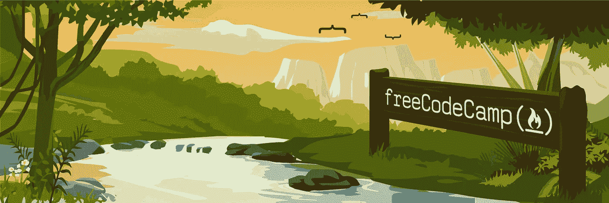

# 完成 freeCodeCamp 的前端 Web 开发课程只花了我三年时间

> 原文：<https://levelup.gitconnected.com/finishing-freecodecamps-front-end-web-development-curriculum-only-took-me-three-years-fba689a10cb5>

我终于完成了 freeCodeCamp 的所有前端 Web 开发课程。我只用了三年时间！

我第一次加入 freeCodeCamp 是在 2015 年 11 月。我的学习有很多空白。自从最初加入 freeCodeCamp 以来，我在 2016 年的 General Assembly 上了一堂 JavaScript 课，在 2017 年参加了 Flatiron School 为期 15 周的沉浸式训练营，并建立了大量的小应用和 janky 网站。我也做过一些不同的工作，做了许多与编码完全无关的事情。然而，我不断回到 freeCodeCamp，我很自豪地说，我刚刚获得了我的[前端 Web 开发认证](https://www.freecodecamp.org/ethanryan/front-end-certification)。

向 HTML 元素问好

我的最后一个项目是重现西蒙游戏，这是一个非常具有挑战性的游戏。这是我制作的第一款比制作难度更高的游戏，这说明了很多，因为它花了我几天时间。但是我坚持下来了，学到了很多东西。毕竟，Javascript 是一种有趣、时髦的语言。

`console.log(‘My final task before submitting this code challenge today was going through my code and commenting out all my console.logs.’)`

如果你想试试，这是个游戏:

西蒙游戏

我的代码需要一些重构，因为它不是很枯燥，但它满足了所有的用户需求，而且它工作正常！我为此感到骄傲。

freeCodeCamp 教会了我很多，提高了我作为开发者的信心，并帮助我[建立了我的投资组合](https://codepen.io/ethanryan/)。我甚至开始从事自由开发工作。这是一个漫长的旅程，我很高兴我花了几年时间才走到今天。学习如何编码不可能一蹴而就。它是在很长一段时间里一点一点发生的。我不是想开一个老套的“小”玩笑，但事实就是如此。我现在不可能删除它。

忍不住在博客上分享我的成就。

感谢阅读，网虫们。

再见