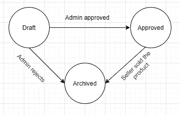
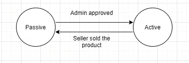
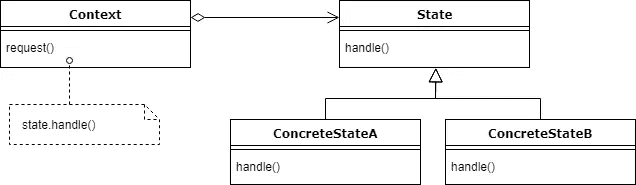
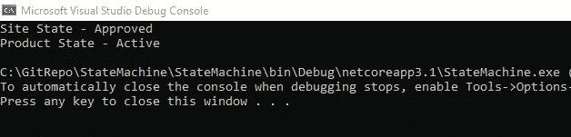
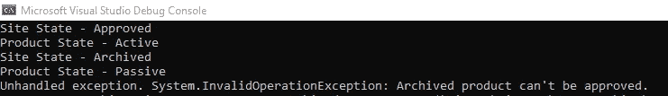

# 有限状态机及其从无到有状态模式的实现

> 原文：<https://levelup.gitconnected.com/finite-state-machine-and-its-implementation-with-state-pattern-from-scratch-9732787a1277>

图片来自[pexels.com](https://www.pexels.com)

让我们从一个示例案例开始:假设您对一个电子商务网站的状态更改有一些业务需求。在这个网站中，有三种类型的用户:卖家、管理员和客户。当卖家将其产品添加到网站上时，应该得到管理员的批准，这样它才能在网站上可见。

图 1:站点状态

在图 1 中，圆圈代表状态，箭头是可以进行状态转换的动作。产品有两种状态:站点状态和产品状态。站点状态可以是草稿、已批准和已存档状态。另一方面，产品状态可以是主动状态，也可以是被动状态。对于产品的可见性，它应该处于“已批准地点”状态和“活动产品”状态。

图 2:产品状态

当卖家将产品添加到网站时，初始条件被设置为草稿站点状态和被动产品状态。如果管理员拒绝(可能是因为产品的照片质量不好？)，站点状态从“草稿”更改为“已存档”状态。如果产品被售出，站点状态将从“已批准”变为“已存档”,产品状态将从“主动”变为“被动”,这样产品就不能再次售出，卖家也可以获得报酬。

已经不知所措了？在一些软件项目中，您可能会遇到比这复杂 10 倍的业务需求。你需要设计一个满足所有需求的系统，代码应该是干净的。您可能已经注意到，您无法用 if/else 或 switch case 来管理这种复杂性(而且随着时间的推移，它会变得更加复杂)。这就是有限状态机发挥作用的地方。

## 有限状态机

> 有限状态机(Automaton)是一种抽象机器，在任何给定时间只能处于有限数量的状态之一。

根据定义，一个对象一次应该处于一种状态。因此，我们的产品应该处于草案或批准状态，而不是两者都是。你可能会想“老兄，你说过一个产品只有在站点状态被批准且产品状态是活动的情况下才是可见的。如果我们只有一个状态，如何满足这些条件？”。是的，我做到了，是的，我们可以通过设计两个独立的状态机来做到:)

让我们看看有限状态机中的一些概念:

*   **上下文:**它是一个维护具体状态的实例作为当前状态的类。
*   **状态:**封装了所有具体状态共有的行为(或动作)的接口。
*   **具体状态:**子类，实现与上下文特定状态相关的行为。

图 3:状态机的样本结构(来源:[状态设计模式](https://howtodoinjava.com/design-patterns/behavioral/state-design-pattern/))

您可能会看到有限状态机或状态模式在某些地方可以互换使用。它们密切相关，但不相同。有限状态机是计算机科学中一个非常古老的概念，状态模式是用面向对象方法实现它的一种非常常见的方式。

## 编码部分

图片来自[pexels.com](https://www.pexels.com/)

让我们定义我们的状态接口:

该接口包含在站点状态下进行转换所需的操作。

现在我们需要根据我们的状态定义具体的类。在“站点”状态中，有“草稿”、“已批准”和“已存档”状态。

在 DraftState.cs 中，我们实现了 ISiteState 接口，并且我们有自己的动作来进行状态转换。如果管理员拒绝处于“草稿站点”状态的产品，它将处于“已存档站点”状态。但是一个产品如果处于草稿站点状态就不能销售，所以我们需要抛出一个异常。

正如您在 ApprovedState.cs 中看到的，一个产品不能被批准多次。其他状态转换如图 1 所示。

当产品处于存档状态时，不允许任何状态转换。

如你所见，我们用具体的类管理了站点状态的所有行为。

在上下文类中，我们定义我们的当前状态并管理所有的状态转换。状态对象可以通过上下文类来操作。

站点状态机是通过实现有限状态机元素(如上下文、状态和具体状态)来完成的。产品状态机也有类似的实现。但是，根据业务需求，产品状态只能在“地点状态”被批准时才有效。因此，产品状态机需要了解站点状态机的情况，以便可以对其进行更改。从技术上来说，不同的状态机可以组合，但这不是一件好事，因为当你这样做时，你会创建一个相互依赖的关系，它会对代码的可维护性产生负面影响。

如代码所示，在我们将产品状态从被动更改为主动之前，我们检查站点状态是否处于批准状态。

让我们修改我们的 program.cs 文件以查看一个成功案例:

结果，我们看到状态转换正确进行:

图 4:成功案例

产品以默认站点状态启动，然后，假设管理员批准了产品，因此它转换到批准的站点状态。由于站点状态已被批准，具有 Approve()操作的产品状态也从被动状态变为主动状态，瞧！现在，客户可以看到产品了！

假设我们有一个被认可的产品，然后我们卖掉它。如果我们想批准一个已经售出的产品，我们必须得到一个例外。

图 5:失败案例

如图 5 所示，我们看到了所有关于批准和售完行为的转换。当一个产品售出后，它不能被再次批准并抛出异常。

感谢阅读！请通过下面的链接查看完整的源代码:

*源代码:*[*【https://github.com/ozturkaslii/StateMachine】*](https://github.com/ozturkaslii/StateMachine)

## 参考

*   [https://en.wikipedia.org/wiki/Finite-state_machine](https://en.wikipedia.org/wiki/Finite-state_machine)
*   [设计模式:可重用面向对象软件的要素](https://www.amazon.com/Design-Patterns-Object-Oriented-Addison-Wesley-Professional-ebook/dp/B000SEIBB8)
*   [头脑优先设计模式:一个对大脑友好的指南](https://www.amazon.com/Head-First-Design-Patterns-Brain-Friendly/dp/0596007124)