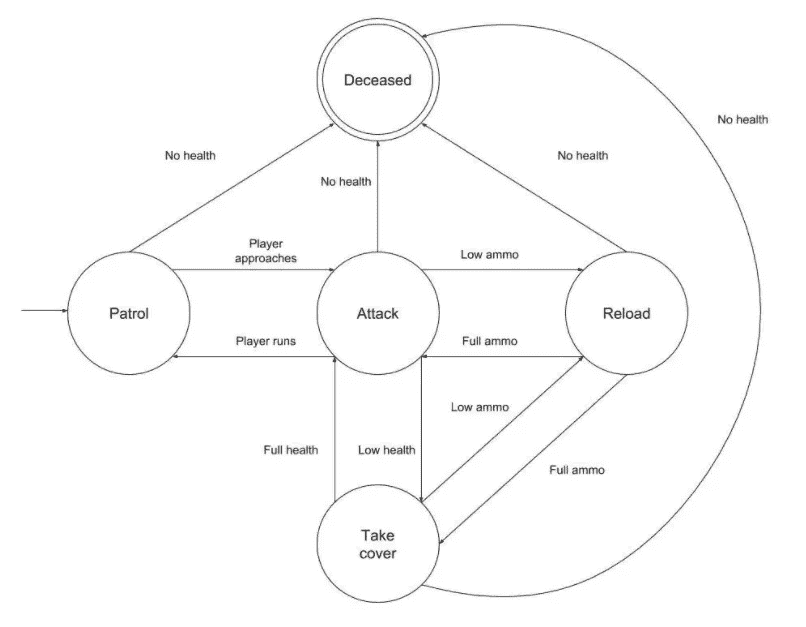

# 围棋中的有限状态机

> 原文：<https://levelup.gitconnected.com/finite-state-machines-in-go-a99adb7f7850>

## 造一个电灯开关甚至一个敌人 AI！


来自[壁纸洞穴](https://wallpapercave.com/future-technology-hd-wallpapers)

有限状态机(FSM)是技术工程中最灵活、最广泛使用的面向对象设计模式之一。FSM 由具有“转换”的给定模型的状态集合组成，该“转换”允许基于预定义的条件从一个状态切换到另一个状态。尽管 FSM 的想法很简单，但它的适应性非常强，可以应用于非常广泛的实现，包括:

*   **自适应 UI 设计** —如果用户的行为可以映射到一个有限状态机上，那么用户超出程序范围并导致错误的风险就会最小化。
*   **马尔可夫链** —假设有一个概率框架和一组有限的状态，有限状态机可以用来模拟马尔可夫链。
*   **测试网络协议** —可以使用 FSM 对 TCP 等网络协议进行建模，以验证流量和通信的流动。在这种情况下，FSM 通常不能用于生产，因为它们在数据存储能力方面存在固有的局限性。
*   **常见应用** —交通灯、自动售货机和电梯本质上是基于状态的，因此非常适合 FSM 的应用。

> *在本文中，我们将探索用 Go 编写的有限状态机的两个不同例子。读完这篇文章后，你应该对什么是 FSM，如何手工实现以及优缺点有一个很好的了解。我们将涉及的例子包括:*

1.  一个模拟电灯开关的简单例子。
2.  一个敌人 AI 使用地图。
3.  关键要点

我们开始吧！

# 一种简单的光开关 FSM

第一个例子只是为了给我们一个什么是状态机和一般结构的概念。电灯开关是第一个很好的应用，因为电灯只有两种状态——开或关。首先，我们的项目需要三个文件。

```
$ mkdir state-machine-go
$ cd state-machine-go
$ touch main.go state.go switch.go
```

## state.go

这个文件将保存我们的状态机中的状态逻辑。我们首先创建一个名为`LightSwitchState`的`interface`，它有两个方法来实现`On()`和`Off()`。这两种方法都需要引用一个`Switch`类型，我们将在下一个文件中定义。

接下来，我们必须为系统中的相关状态定义`struct{}`类型。这些只是我们的开或关状态，它们目前没有内在的逻辑(尽管如果你愿意，你可以添加特定的属性)。然后我们有两个构造函数`NewOnState()`和`NewOffState()`，它们都返回对各自状态的引用。

最后，我们在第 34–50 行有多个`LightSwitchState` `interface`的实现。注意每个方法是如何基于传递给它的状态对象的类型的。如果`On()`或`Off()`方法接收到一个基本状态，那么这意味着灯已经打开

因为我们有两种可能的状态开和关，以及两种可能的转换开和关，所以我们有 2x2=4 个方法实现。

注意:这不是构建你的状态机的理想方式。这导致了高度耦合的代码，其中方法实现的数量等于状态的数量乘以可能的转换的数量，这非常容易扩展。这只是让你了解一个有限状态机。

## 切换。开始

接下来，我们必须定义灯开关本身。首先，我们定义了基础结构`Switch`，它具有前面文件`state.go`中类型`LightSwitchState`的属性`State`。这样，`Switch`结构现在可以访问`On()`和`Off()`方法。这就是我喜欢 FSM 的原因，它让事情变得直观！

继续，我们还有一个构造函数`NewSwitch()`，它返回一个新的`Switch`引用，默认状态为 off，由嵌套的构造函数`NewOffState{}`调用。如果您有基本状态要组成，状态机可以利用一个轻型装饰器模式(如果您需要复习，请查阅我关于装饰器模式的文章)。

最后，我们只有两个方法`On()`和`Off()`，它们使用命令链来实际改变灯开关的状态。这些方法引用`Switch`结构，然后调用链开关- >状态- >开/关。这看起来可能有点奇怪，因为我们引用了 switch 对象，同时还将对象本身传递给了方法调用。

如果你很困惑，可以这样想。调用`sw.State.On()`只是我们用来进行转换的方法，我们还没有做任何影响开关对象的事情。当我们将 switch 对象传递给这个方法调用时，我们实际上改变了 switch 对象的状态。它基本上是在建造自己。

## main.go

最后，主 Go 文件只是编排我们的 FSM。我们创建一个新的灯开关，打开它，然后关闭它两次。这将展示我们的 FSM 如何处理重复事件和转换。

如果我们运行这个程序，我们可以看到我们的有限状态机在工作。请注意默认状态是如何关闭的，然后在状态实际变为“开灯”之前会有一些转换，如“开灯…”。

```
$ go run *.go
Light turned off
Switching light on...
Light turned on
Switching light off...
Light turned off
Light is already off
```

太棒了。现在我们已经有了基础，让我们来看一个更加灵活和优雅的例子。

# 使用有限状态机向人工智能添加行为

在这一节中，我们将创建一个源于本文的人工智能来展示简单有限状态机的强大功能。下面提供的图片来自文章，展示了一个示例 FSM 图。状态用圆圈表示，触发器列在箭头旁边。我们将在 Go 中实现这个逻辑，以获得一个更好的 FSM 功能工作版本。



来自[堆栈的 FSM 图](https://stackabuse.com/theory-of-computation-finite-state-machines/)

我们的项目很小，只需要四个文件:

```
$ mkdir enemyAI
$ cd enemyAI
$ touch main.go trigger.go state.go rules.go
```

## state.go

转到实现，我们需要做的第一件事是定义我们的状态。我们可以通过声明一个`const()`块来实现，同时利用`iota`关键字——它给每个变量一个从 0 开始的递增索引。我们还将这些常量定义为类型`EnemyState`，为了可读性和我们的例子，它只是扩展了`int`类型。

然后我们有一个功能块，它用一个`switch{}`语句简单地将每个状态转换成相应的字符串表示。这样，当我们想要打印我们的任何州时，只需调用`EnemyState.String()`就很容易了。

## 触发.开始

接下来是我们的触发器，同样也只是迷人的`int`对象。就像上面一样，我们有一个函数块来将我们所有的状态转换成字符串格式。此外，我们还有另一种类型`EnemyTriggerResult{}`，它既包含触发器又包含状态。我们将在下一个文件中使用这种类型来组成映射，它将我们的状态与我们的触发器联系起来。

## 规则.开始

这个文件将保存`map`对象，它是我们的 FSM 的主要结构。该映射将一个`EnemyState`作为一个键，并将一个数组`EnemyTriggerResults`作为相应的值。让我们仔细看看。

从第 4 行开始，我们有了第一个`Patrolling`州的`map`条目。当 FSM 处于此`EnemyState`时，它有两个触发选项。第一个可能是触发器`PlayerApproaches`，它导致`EnemyState`变为`Attacking`(这个还没有实现，但是会在下一个文件中实现)。

因此，对于每个`EnemyState`，我们将可能的触发器附加到我们希望在 FSM 中允许的状态对。这个规则集遵循(几乎)与上面 StackAbuse 中列出的图表相同的模式。对我来说，这就是 FSM 模式的美妙之处，因为它可以创建一个直观的、可读性很强的事件转换列表！

## main.go

最后，我们有了主要的 Go 文件。这里有更多的逻辑，所以让我们走一遍。首先，我们将变量`currentState`初始化为我们希望敌人 AI 默认的状态——在本例中为`Patrolling`状态。

然后我们开始一个无限循环，首先更新什么是`currentState`以及可能的触发器选择。我们通过遍历`enemyRules[currentState]`中列出的所有规则，在第 16 行列出了可能的触发器。我们还在第 18 行做了一些数据转换，将 int `i`转换成一个字符串，然后列出`currentState`的触发器。

在第 21 行，我们反复询问用户他们想要转换到什么状态，并将他们的响应存储在字节对象`input`中。之后，我们将字节对象转换成一个`string`，然后转换成一个`int`以在第 22 行得到`i`。

最后我们试图从`elevatorRules[currentState][i]`内部的`i`中得到触发。如果触发器存在，当我们将`currentState`重新分配给`trigger.State`时，状态将适当地转换。

这里有一点层叠调用，所以你可能想看几遍这些文件来了解这个想法。

# 关键要点

我们已经看到了 Go 中 FSM 的两种不同实现。我们在 light switch 中看到的第一个问题是，方法实现的数量随着状态和转换的数量成倍增长。我们在第二个例子中对此进行了改进，加入了一个显示每个状态的所有可能转换的映射，但是我们仍然需要创建一个扩展性很差的综合映射。

因此，虽然我们能够用有限状态机直观地映射灯开关和敌人的 AI，但还是有一些缺点。总之，FSM 的优点和缺点如下:

## 赞成的意见

*   如果我们有一个有组织的映射，添加新状态会变得很容易——我们只需要用相应的转换来更新触发结果映射，以扩展我们的 FSM。
*   FSM 保护我们免于到达未知状态，因为我们为可能发生的事情和时间设定了界限。
*   状态机的概念降低了代码的复杂性，并使通向任何状态的路径变得清晰。
*   强大的系统和用户行为验证。

## 骗局

*   有限状态机会导致较差的数据效率，因此必须进行相应的设计。如果状态空间不是有限的或者太大，就会导致可伸缩性问题。
*   并行运行 FSM 需要复杂的编排来防止数据泄漏和死锁。
*   会导致实现的过度规范。

## 后续步骤

从这些例子中可以继续进行很多工作。首先，实际上有两种正式的 FSM——Mealy 和 Moore 机器。虽然 FSM 是很好的软件应用程序，但它们背后也有大量的形式数学，可以在更亲密的层次上学习它们。创造多个并行工作的 FSM 也可能是下一个巨大的挑战。

对于上面的程序，有大量的错误检查和额外的逻辑可以实现。您还可以基于一个简单的 switch 语句创建一个新的 FSM，其中每种情况都映射到一个无限 for 循环中的不同状态。

我希望你喜欢这篇文章，并且能够理解有限状态机及其在 Go 中的实现。如果你想了解更多的信息，或者你想了解软件工程中的任何新话题，我鼓励你在下面留下评论。感谢阅读！