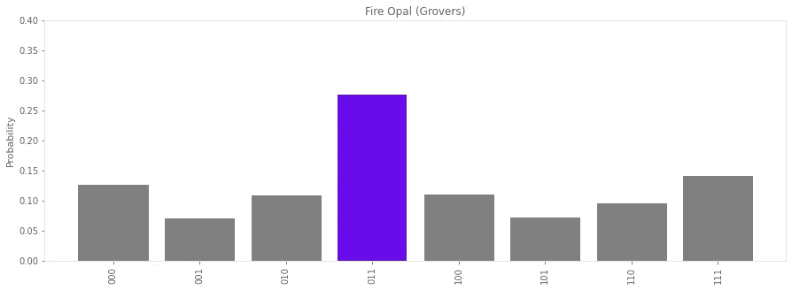

# Q-CTRL 的火猫眼石很牛逼

> 原文：<https://levelup.gitconnected.com/fire-opal-is-awesome-c642347ec89d>

[https://q-ctrl.com/products/](https://q-ctrl.com/products/)

# 量子算法设计师们，欢呼吧！

早在我在网上看到任何关于火蛋白石的东西之前，我就知道了它。而且，虽然我对它了解不多，但我知道它是为量子算法设计者准备的。这已经与面向量子计算新手的大量工具和教程形成了鲜明对比。假设你不是新手，使用这个工具的前景让我很兴奋。

我最初认为 Fire Opal 可能会更容易设计新的算法，类似于 [Classiq 的量子算法设计(QAD)平台](/demo-classiqs-qad-platform-f0bec3608549)。我所看到的事实上在 NISQ 时代更重要。尽管 QAD 的目的是帮助你构建 1000 个量子比特的电路，但如今这样的电路只能产生噪音。见鬼，如今即使是双量子位电路也会产生噪声。但是，Fire Opal 使今天的电路实际上可以在 NISQ 设备上工作。在直方图中看到精确的结果是非常令人兴奋的，这并不是因为使用了模拟器。

## 合作

有人给了我一个火蛋白石的早期演示。我不知道这是因为我为该产品的发布进行了长期的宣传活动，还是仅仅是一个愉快的巧合。但是，在我漫长的等待和高度的期待之后，我很荣幸被允许先睹为快。我提前警告过团队，我有不切实际的高期望。

有一个陷阱。

他们不是仅仅给我看一些教科书上的算法和一些巨大的改进，而是要我的一些算法。毕竟，在我看来，哪个可能更令人印象深刻:改进我有点了解的线路还是改进我非常了解的线路？所以，为什么我不把我非常熟悉的电路发过来，看看火蛋白石能做些什么？

好吧。他们自找的。

为了观察改进，我认为我需要给他们提供有足够改进空间的回路。换句话说:我故意提供具有足够电路深度的非最佳化电路，让它们完全无法在任何现今的量子电脑上执行。火蛋白石到底能不能改善这些噪音制造者？

## 分类

如果你想要胡言乱语的结果，只是增加一些深度到你的电路。如果您想轻松增加电路深度，只需增加几个 Fredkin 门。虽然 Fredkin 看起来像电路图中的一个门，而且很容易在屏幕上查看，但量子计算机需要十几次运算才能实现一个门。用没有直接连接的量子位试试，很快就变差了。

所以，我提供了几乎最简单的分类问题。有两个 2 量子位量子态和一个安西拉量子位来比较它们。我们需要两个 Fredkins 来比较这两个状态，这就是我们将得到一些简单电路深度的地方。我要让火猫眼石队看看！

原始分类电路

关于如何工作的细节，从这篇[量子分类](https://medium.com/swlh/quantum-classification-cecbc7831be)文章和这篇[比较量子态](/comparing-quantum-states-c6445e1e46fd)文章开始。出于本文的目的，您只需要知道这些 Fredkins 增加了很多电路深度。

传输分级电路

这是在马尼拉 ibmq 上运行的。我设计的漂亮、干净、深度为 5 的电路被传输到这个混乱的操作中，因为这是量子计算机实际上可以执行的。弗雷德金门只是一个抽象概念，使电路设计更容易。关于到底发生了什么的更多信息，请阅读这个[什么是“transpilation？”](/what-is-transpilation-4d12d51e2aa4)文章。

模拟结果

为了测试的目的，这两个量子态是完全相同的。交换测试的工作方式，也就是内核方法，也就是内积，也就是距离度量，相同的状态将在 100%的时间内被度量。然而，如果两个状态最大程度地相反，那么它们将以 50/50 的比例测量 0 和 1。因为这些状态完全相同，IBM 量子计算机模拟器正确地显示我们应该测量 100%的时间。同样，你可以在这篇[比较量子态](/comparing-quantum-states-c6445e1e46fd)的文章中读到更多。

马尼拉 ibmq 上的结果

在 ibmq_manila 上，看看那些错误！这些是相同的量子态，但它们看起来几乎像是最大相反的状态，而不是这样测量的。这不仅是错误的，而且是最大的错误。你必须看这个结果，并确定这些绝对不是相同的状态。

使用火蛋白石的结果

现在看火蛋白石结果！0 计数从 55%(与上述不同的运行)上升到 86%。虽然这并不完美，但它明显更接近理想结果，而不是最大误差结果。量子态至少看起来更相似，而不是不同，尽管有大量的退相干。在那个电路中有 52 个容易出错的 CNOT 门，这还是 NISQ 时代。多亏了 Fire Opal，这个电路从一文不值变成了证明量子分类在真实硬件上实际上是可能的。

绝对值得注意的是，Fire Opal 使用 Qiskit 的预设过程管理器的 optimization_level=3 作为基线。Qiskit 将这一级描述为“大重量优化，除了前面的步骤，还在电路中重新合成两个量子位的门块。”因此，Q-Ctrl 不只是试图通过比较 Fire Opal 结果和非优化电路来夸大其结果——讽刺的是，这正是我试图做的——他们正在比较 Fire Opal 和 Qiskit 的最大优化电路，并仍然显示出改变游戏的差异。

顺便说一句，如果你不知道 Qiskit 的 Pass Manager，你并不孤单。事实上，尽管 Qiskit 很受欢迎，但它有许多令人敬畏但鲜为人知的功能。一定要在 Quantum Zeitgeist 上查看“[你可能不知道的 13 个最好的 Qiskit 量子编程特性](https://quantumzeitgeist.com/the-13-best-qiskit-quantum-programming-features-you-probably-dont-know-about/)”。

# 格罗弗算法

我还提供了 Grover 算法的简单实现。出于演示的目的，我知道有七个量子位可用。我在 IBM Quantum Composer 中已经有了这个六量子位电路，我知道 Toffolis 每个都增加了几乎与 Fredkin 一样多的电路深度，所以让我们看看 Fire Opal 可以用其中的五个做什么。这似乎不公平；也许我应该为此事先向火蛋白石团队道歉？

最初的格罗弗电路

实际上，这条赛道并不太奇特。如果你不会“说”量子神谕的语言，这个电路就是在搜索满足问题的输入:((q0 和 q1)和(不是 q2))。

传输 Grover 电路

这看起来比分级电路还要糟糕。我绝对应该道歉。太迟了吗？？？

模拟结果

即使使用模拟器，结果也不完美。但是，如果您解析上面表达的问题，理想的结果是 011。如您所见，理想结果在直方图中突出显示为可能的解决方案。

ibmq_jakarta 上的结果

但是，现在在 ibmq_jakarta 上查看这个。一个六量子位的可满足性问题，它实际上只是一个三量子位的问题，但是它需要三个辅助量子位，产生无价值的结果。这纯粹是噪音，我们甚至无法开始猜测解决方案可能是什么。

ibmq_lagos 上的结果

这是 Q-Ctrl 团队在“启动”Fire Opal 之前在 ibmq_lagos 上的第一次运行(我正在了解他们的品牌)。和我在 ibmq_jakarta 上的成绩一样没价值。同样，这也是 Qiskit 的 Pass Manager 所能做到的最好的了。这和我得到的完全没有优化的结果没有明显的区别。

使用火蛋白石的结果

再一次，看看火蛋白石的结果！这个直方图与模拟器结果的相似程度远远超过了与 ibmq_jakarta 和 ibmq_lagos 结果的相似程度。很容易看出 011 是可能的解决方案。

对于格罗弗算法的解释，顺便看看[格罗弗算法，一个关于量子时代精神的直观展示](https://quantumzeitgeist.com/grovers-algorithm-an-intuitive-look/)。

## 结论

关于 Fire Opal 给我的第一个印象，也是在演示过程中发生的，是这些算法确实有效。Q-Ctrl 主要关注量化他们产生了多大的改进，但是如果一张图片值一千个单词，一个直方图值一千个度量。

如果我在没有 Fire Opal 的情况下运行这些算法，我会得到无用的结果。一个接一个的算法，我不得不依靠模拟器来提供概念证明。我们只是不能用真正的量子位做任何实际的事情。然后我不得不说，在未来，有了完美的量子位，没有价值的结果应该看起来像模拟的结果。

但是，我们怎么知道呢？我们没有完美的量子位，所以我们如何透过噪音看到我们的算法不仅仅是模拟工作，而是实际工作？看到真实的量子位实验性地显示出这些价值数百万美元的派对礼物确实在起作用，这感觉棒极了，令人耳目一新。结果并不完美，但事实上，它们的工作是从均匀分布向前迈出的一大步。

这对于试图出售任何“量子”产品的人来说，显然也是一个巨大的福音。是的，量子计算机仍然有很多错误，但现在看看它们实际上能做什么。我们可以超越理论和数学，通过实验展示一条通向实际解决方案的道路。我很兴奋。

我想到的另一件事，尽管是在视频通话结束后，是想起我曾向 Fire Opal 团队发送过故意制造噪音的电路。这不是你已经尽了最大努力的问题，现在火蛋白石正在挤出一点额外的性能。相反，我发送的电路没有任何优化，电路深度使它们在 NISQ 设备上运行完全不切实际。我给他们发送噪音，并要求他们给我留下深刻印象…我被打动了。

## 附加阅读

对于 Q-Ctrl 对 Fire Opal 测试的描述，其中包括其他人的实验结果，请查看首席执行官 Michael J. Biercuk 博士教授的“[启动量子算法——通过自主误差抑制将性能提升 9000 倍](https://q-ctrl.com/blog/firing-up-quantum-algorithms-boosting-performance-up-to-9000x/)”。

此外，如果你想了解 Q-Ctrl 的“黑蛋白石”产品，这是我推荐的唯一一套量子计算教程，请查看以下文章。

1.  [回顾:Q-Ctrl 的黑蛋白石教程](/review-q-ctrls-black-opal-tutorials-3e888ac76f84)(技能 1-3)
2.  [回顾:Q-Ctrl](/review-black-opal-circuits-by-q-ctrl-beaf01a7b5ce) (技能 4)黑蛋白石电路
3.  [回顾:Q-Ctrl](https://bsiegelwax.medium.com/review-black-opal-entanglement-by-q-ctrl-fb913447535c) (技能 5)黑欧泊“纠缠”
4.  [回顾:通过 Q-Ctrl](https://bsiegelwax.medium.com/review-black-opal-noise-by-q-ctrl-71439dad348b) (技能 6)获得黑色蛋白石“噪音”
5.  [用 Q-Ctrl 的黑欧泊练习](/practicing-with-q-ctrls-black-opal-9d819ea71558)